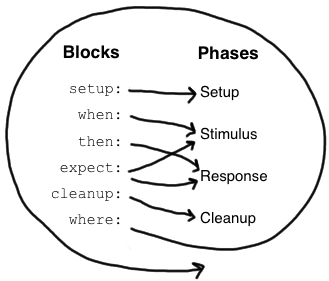
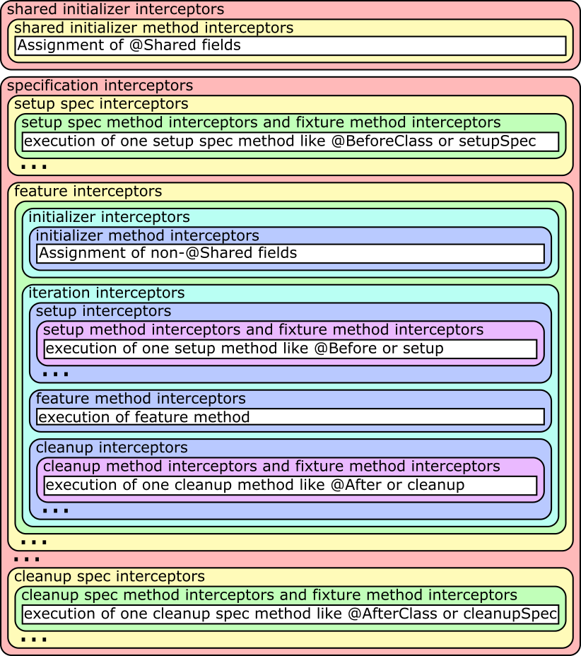

# Spock Framework Reference Documentation

## Introduction

Spock is a testing and specification framework for Java and Groovy applications. What makes it stand out from the crowd
is its beautiful and highly expressive specification language. Thanks to its JUnit runner, Spock is compatible with most
IDEs, build tools, and continuous integration servers. Spock is inspired from [JUnit](http://junit.org/),
[jMock](http://www.jmock.org/), [RSpec](http://rspec.info/), [Groovy](http://groovy-lang.org/), [Scala](http://scala-lang.org/),
[Vulcans](https://en.wikipedia.org/wiki/Vulcan_(Star_Trek)), and other fascinating life forms.


## Getting Started

It’s really easy to get started with Spock. This section shows you how.


### Spock Web Console

[Spock Web Console](http://webconsole.spockframework.org) is a website that allows you to instantly view, edit, run, and
even publish Spock specifications. It is the perfect place to toy around with Spock without making any commitments.
So why not run [Hello, Spock!](http://webconsole.spockframework.org/edit/9001) right away?


### Spock Example Project

To try Spock in your local environment, clone or download/unzip the
[Spock Example Project](https://github.com/spockframework/spock-example). It comes with fully working Ant, Gradle, and
Maven builds that require no further setup. The Gradle build even bootstraps Gradle itself and gets you up and
running in Eclipse or IDEA with a single command. See the README for detailed instructions.


## Spock Primer

This chapter assumes that you have a basic knowledge of Groovy and unit testing. If you are a Java developer but haven’t
heard about Groovy, don’t worry - Groovy will feel very familiar to you! In fact, one of Groovy’s main design goals is to
be *the* scripting language alongside Java. So just follow along and consult the
[Groovy documentation](http://groovy-lang.org/documentation.html) whenever you feel like it.


The goals of this chapter are to teach you enough Spock to write real-world Spock specifications, and to
whet your appetite for more.


To learn more about Groovy, go to http://groovy-lang.org/.


To learn more about unit testing, go to http://en.wikipedia.org/wiki/Unit_testing.


### Terminology

Let’s start with a few definitions: Spock lets you write [*specifications*](https://en.wikipedia.org/wiki/Specification_by_example)
that describe expected *features* (properties, aspects) exhibited by a system of interest. The system of interest could be
anything between a single class and a whole application, and is also called the *system under specification or SUS*.
The description of a feature starts from a specific snapshot of the SUS and its collaborators; this snapshot is called the feature’s *fixture*.


The following sections walk you through all building blocks of which a Spock specification may be composed. A typical
specification uses only a subset of them.


### Imports

```groovy
import spock.lang.*
```


Package `spock.lang` contains the most important types for writing specifications.


### Specification

```groovy
class MyFirstSpecification extends Specification {
  // fields
  // fixture methods
  // feature methods
  // helper methods
}
```


A specification is represented as a Groovy class that extends from `spock.lang.Specification`. The name of a specification
usually relates to the system or system operation described by the specification. For example, `CustomerSpec`,
`H264VideoPlayback`, and `ASpaceshipAttackedFromTwoSides` are all reasonable names for a specification.


Class `Specification` contains a number of useful methods for writing specifications. Furthermore it instructs JUnit to
run specification with `Sputnik`, Spock’s JUnit runner. Thanks to Sputnik, Spock specifications can be run by most modern
Java IDEs and build tools.


### Fields

```groovy
def obj = new ClassUnderSpecification()
def coll = new Collaborator()
```


Instance fields are a good place to store objects belonging to the specification’s fixture. It is good practice to
initialize them right at the point of declaration. (Semantically, this is equivalent to initializing them at the very
beginning of the `setup()` method.) Objects stored into instance fields are *not* shared between feature methods.
Instead, every feature method gets its own object. This helps to isolate feature methods from each other, which is often
a desirable goal.


```groovy
@Shared res = new VeryExpensiveResource()
```


Sometimes you need to share an object between feature methods. For example, the object might be very expensive to create,
or you might want your feature methods to interact with each other. To achieve this, declare a `@Shared` field. Again
it’s best to initialize the field right at the point of declaration. (Semantically, this is equivalent to initializing
the field at the very beginning of the `setupSpec()` method.)


```groovy
static final PI = 3.141592654
```


Static fields should only be used for constants. Otherwise shared fields are preferable, because their semantics with
respect to sharing are more well-defined.


### Fixture Methods

```groovy
def setupSpec() {}    // runs once -  before the first feature method
def setup() {}        // runs before every feature method
def cleanup() {}      // runs after every feature method
def cleanupSpec() {}  // runs once -  after the last feature method
```


Fixture methods are responsible for setting up and cleaning up the environment in which feature methods are run.
Usually it’s a good idea to use a fresh fixture for every feature method, which is what the `setup()` and `cleanup()` methods are for.


All fixture methods are optional.


Occasionally it makes sense for feature methods to share a fixture, which is achieved by using shared
fields together with the `setupSpec()` and `cleanupSpec()` methods.
Note that `setupSpec()` and `cleanupSpec()` *may not* reference instance fields unless they are annotated with `@Shared`.


#### Invocation Order

If fixture methods are overridden in a specification subclass then `setup()` of the superclass will run before `setup()` of the subclass.
`cleanup()` works in reverse order, that is `cleanup()` of the subclass will execute before `cleanup()` of the superclass.
`setupSpec()` and `cleanupSpec()` behave in the same way.
There is no need to explicitly call `super.setup()` or `super.cleanup()` as Spock will automatically find and execute fixture methods at all levels in an inheritance hierarchy.


1. `super.setupSpec`
2. `sub.setupSpec`
3. `super.setup`
4. `sub.setup`
5. feature method
6. `sub.cleanup`
7. `super.cleanup`
8. `sub.cleanupSpec`
9. `super.cleanupSpec`


### Feature Methods

```groovy
def "pushing an element on the stack"() {
  // blocks go here
}
```


Feature methods are the heart of a specification. They describe the features (properties, aspects) that you expect to
find in the system under specification. By convention, feature methods are named with String literals. Try to choose
good names for your feature methods, and feel free to use any characters you like!


Conceptually, a feature method consists of four phases:


1. Set up the feature’s fixture
2. Provide a *stimulus* to the system under specification
3. Describe the *response* expected from the system
4. Clean up the feature’s fixture


Whereas the first and last phases are optional, the stimulus and response phases are always present (except in
interacting feature methods), and may occur more than once.


#### Blocks

Spock has built-in support for implementing each of the conceptual phases of a feature method. To this end, feature
methods are structured into so-called *blocks*. Blocks start with a label, and extend to the beginning of the next block,
or the end of the method. There are six kinds of blocks: `given`, `when`, `then`, `expect`, `cleanup`, and `where` blocks.
Any statements between the beginning of the method and the first explicit block belong to an implicit `given` block.


A feature method must have at least one explicit (i.e. labelled) block - in fact, the presence of an explicit block is
what makes a method a feature method. Blocks divide a method into distinct sections, and cannot be nested.





The picture on the right shows how blocks map to the conceptual phases of a feature method. The `where` block has a
special role, which will be revealed shortly. But first, let’s have a closer look at the other blocks.


##### Given Blocks

```groovy
given:
def stack = new Stack()
def elem = "push me"
```


The `given` block is where you do any setup work for the feature that you are describing. It may not be preceded by
other blocks, and may not be repeated. A `given` block doesn’t have any special semantics. The `given:` label is
optional and may be omitted, resulting in an *implicit* `given` block. Originally, the alias `setup:` was the preferred block name,
but using `given:` often leads to a more readable feature method description (see [Specifications as Documentation](#specifications_as_documentation)).


##### When and Then Blocks

```groovy
when:   // stimulus
then:   // response
```


The `when` and `then` blocks always occur together. They describe a stimulus and the expected response. Whereas `when`
blocks may contain arbitrary code, `then` blocks are restricted to *conditions*, *exception conditions*, *interactions*,
and variable definitions. A feature method may contain multiple pairs of `when-then` blocks.


###### Conditions

Conditions describe an expected state, much like JUnit’s assertions. However, conditions are written as plain boolean
expressions, eliminating the need for an assertion API. (More precisely, a condition may also produce a non-boolean
value, which will then be evaluated according to Groovy truth.) Let’s see some conditions in action:


```groovy
when:
stack.push(elem)

then:
!stack.empty
stack.size() == 1
stack.peek() == elem
```


> [!TIP]
> Try to keep the number of conditions per feature method small. One to five conditions is a good guideline. If you
> have more than that, ask yourself if you are specifying multiple unrelated features at once. If the answer is yes,
> break up the feature method in several smaller ones. If your conditions only differ in their values, consider using
> a [data table](#data-tables).


What kind of feedback does Spock provide if a condition is violated? Let’s try and change the second condition to
`stack.size() == 2`. Here is what we get:


```groovy
Condition not satisfied:

stack.size() == 2
|     |      |
|     1      false
[push me]
```


As you can see, Spock captures all values produced during the evaluation of a condition, and presents them in an easily
digestible form. Nice, isn’t it?


###### Implicit and explicit conditions

Conditions are an essential ingredient of `then` blocks and `expect` blocks. Except for calls to `void` methods and
expressions classified as interactions, all top-level expressions in these blocks are implicitly treated as conditions.
To use conditions in other places, you need to designate them with Groovy’s assert keyword:


```groovy
def setup() {
  stack = new Stack()
  assert stack.empty
}
```


If an explicit condition is violated, it will produce the same nice diagnostic message as an implicit condition.


###### Exception Conditions

Exception conditions are used to describe that a `when` block should throw an exception. They are defined using the
`thrown()` method, passing along the expected exception type. For example, to describe that popping from an empty stack
should throw an `EmptyStackException`, you could write the following:


```groovy
when:
stack.pop()

then:
thrown(EmptyStackException)
stack.empty
```


As you can see, exception conditions may be followed by other conditions (and even other blocks). This is particularly
useful for specifying the expected content of an exception. To access the exception, first bind it to a variable:


```groovy
when:
stack.pop()

then:
def e = thrown(EmptyStackException)
e.cause == null
```


Alternatively, you may use a slight variation of the above syntax:


```groovy
when:
stack.pop()

then:
EmptyStackException e = thrown()
e.cause == null
```


This syntax has two small advantages: First, the exception variable is strongly typed, making it easier for IDEs to
offer code completion. Second, the condition reads a bit more like a sentence ("then an EmptyStackException is thrown").
Note that if no exception type is passed to the `thrown()` method, it is inferred from the variable type on the left-hand
side.


Sometimes we need to convey that an exception should **not** be thrown. For example, let’s try to express that a `HashMap`
should accept a `null` key:


```groovy
def "HashMap accepts null key"() {
  setup:
  def map = new HashMap()
  map.put(null, "elem")
}
```


This works but doesn’t reveal the intention of the code. Did someone just leave the building before he had finished
implementing this method? After all, where are the conditions? Fortunately, we can do better:


```groovy
def "HashMap accepts null key"() {
  given:
  def map = new HashMap()

  when:
  map.put(null, "elem")

  then:
  notThrown(NullPointerException)
}
```


By using `notThrown()`, we make it clear that in particular a `NullPointerException` should not be thrown. (As per the
contract of `Map.put()`, this would be the right thing to do for a map that doesn’t support `null` keys.) However,
the method will also fail if any other exception is thrown.


###### Interactions

Whereas conditions describe an object’s state, interactions describe how objects communicate with each other.
Interactions and Interaction based testing are described in a separate [chapter](), so we only give a quick example here.
Suppose we want to describe the flow of events from a publisher to its subscribers. Here is the code:


```groovy
def "events are published to all subscribers"() {
  given:
  def subscriber1 = Mock(Subscriber)
  def subscriber2 = Mock(Subscriber)
  def publisher = new Publisher()
  publisher.add(subscriber1)
  publisher.add(subscriber2)

  when:
  publisher.fire("event")

  then:
  1 * subscriber1.receive("event")
  1 * subscriber2.receive("event")
}
```


##### Expect Blocks

An `expect` block is more limited than a `then` block in that it may only contain conditions and variable definitions.
It is useful in situations where it is more natural to describe stimulus and expected response in a single expression.
For example, compare the following two attempts to describe the `Math.max()` method:


```groovy
when:
def x = Math.max(1, 2)

then:
x == 2
```


```groovy
expect:
Math.max(1, 2) == 2
```


Although both snippets are semantically equivalent, the second one is clearly preferable. As a guideline, use `when-then`
to describe methods with side effects, and `expect` to describe purely functional methods.


> [!TIP]
> Leverage [Groovy JDK](http://docs.groovy-lang.org/docs/latest/html/groovy-jdk/) methods like `any()` and `every()`
> to create more expressive and succinct conditions.


##### Cleanup Blocks

```groovy
given:
def file = new File("/some/path")
file.createNewFile()

// ...

cleanup:
file.delete()
```


A `cleanup` block may only be followed by a `where` block, and may not be repeated. Like a `cleanup` method, it is used
to free any resources used by a feature method, and is run even if (a previous part of) the feature method has produced
an exception. As a consequence, a `cleanup` block must be coded defensively; in the worst case, it must gracefully
handle the situation where the first statement in a feature method has thrown an exception, and all local variables
still have their default values.


> [!TIP]
> Groovy’s safe dereference operator (`foo?.bar()`) simplifies writing defensive code.


Object-level specifications usually don’t need a `cleanup` method, as the only resource they consume is memory, which
is automatically reclaimed by the garbage collector. More coarse-grained specifications, however, might use a `cleanup`
block to clean up the file system, close a database connection, or shut down a network service.


> [!TIP]
> If a specification is designed in such a way that all its feature methods require the same resources, use a
> `cleanup()` method; otherwise, prefer `cleanup` blocks. The same trade-off applies to `setup()` methods and `given` blocks.


##### Where Blocks

A `where` block always comes last in a method, and may not be repeated. It is used to write data-driven feature methods.
To give you an idea how this is done, have a look at the following example:


```groovy
def "computing the maximum of two numbers"() {
  expect:
  Math.max(a, b) == c

  where:
  a << [5, 3]
  b << [1, 9]
  c << [5, 9]
}
```


This `where` block effectively creates two "versions" of the feature method: One where `a` is 5, `b` is 1, and `c` is 5,
and another one where `a` is 3, `b` is 9, and `c` is 9.


Although it is declared last, the `where` block is evaluated before the feature method containing it runs.


The `where` block is further explained in the [Data Driven Testing]() chapter.


### Helper Methods

Sometimes feature methods grow large and/or contain lots of duplicated code. In such cases it can make sense to introduce
one or more helper methods. Two good candidates for helper methods are setup/cleanup logic and complex conditions.
Factoring out the former is straightforward, so let’s have a look at conditions:


```groovy
def "offered PC matches preferred configuration"() {
  when:
  def pc = shop.buyPc()

  then:
  pc.vendor == "Sunny"
  pc.clockRate >= 2333
  pc.ram >= 4096
  pc.os == "Linux"
}
```


If you happen to be a computer geek, your preferred PC configuration might be very detailed, or you might want to
compare offers from many different shops. Therefore, let’s factor out the conditions:


```groovy
def "offered PC matches preferred configuration"() {
  when:
  def pc = shop.buyPc()

  then:
  matchesPreferredConfiguration(pc)
}

def matchesPreferredConfiguration(pc) {
  pc.vendor == "Sunny"
  && pc.clockRate >= 2333
  && pc.ram >= 4096
  && pc.os == "Linux"
}
```


The new helper method `matchesPreferredConfiguration()` consists of a single boolean expression whose result is returned.
(The `return` keyword is optional in Groovy.) This is fine except for the way that an inadequate offer is now presented:


```groovy
Condition not satisfied:

matchesPreferredConfiguration(pc)
|                             |
false                         ...
```


Not very helpful. Fortunately, we can do better:


```groovy
void matchesPreferredConfiguration(pc) {
  assert pc.vendor == "Sunny"
  assert pc.clockRate >= 2333
  assert pc.ram >= 4096
  assert pc.os == "Linux"
}
```


When factoring out conditions into a helper method, two points need to be considered: First, implicit conditions must
be turned into explicit conditions with the `assert` keyword. Second, the helper method must have return type `void`.
Otherwise, Spock might interpret the return value as a failing condition, which is not what we want.


As expected, the improved helper method tells us exactly what’s wrong:


```groovy
Condition not satisfied:

assert pc.clockRate >= 2333
       |  |         |
       |  1666      false
       ...
```


A final advice: Although code reuse is generally a good thing, don’t take it too far. Be aware that the use of fixture
and helper methods can increase the coupling between feature methods. If you reuse too much or the wrong code, you will
end up with specifications that are fragile and hard to evolve.


### Using `with` for expectations

As an alternative to the above helper methods, you can use a `with(target, closure)` method to interact on the object being verified.
This is especially useful in `then` and `expect` blocks.


```groovy
def "offered PC matches preferred configuration"() {
  when:
  def pc = shop.buyPc()

  then:
  with(pc) {
    vendor == "Sunny"
    clockRate >= 2333
    ram >= 406
    os == "Linux"
  }
}
```


Unlike when you use helper methods, there is no need for explicit assert statements for proper error reporting.


When verifying mocks, a `with` statement can also cut out verbose verification statements.


```groovy
def service = Mock(Service) // has start(), stop(), and doWork() methods
def app = new Application(service) // controls the lifecycle of the service

when:
app.run()

then:
with(service) {
  1 * start()
  1 * doWork()
  1 * stop()
}
```


Sometimes an IDE as trouble to determine the type of the target, in that case you can help out by manually specifying the
target type via `with(target, type, closure)`.


### Using `verifyAll` to assert multiple expectations together

Normal expectations fail the test on the first failed assertions. Sometimes it is helpful to collect these failures before
failing the test to have more information, this behavior is also known as soft assertions.


The `verifyAll` method can be used like `with`,


```groovy
def "offered PC matches preferred configuration"() {
  when:
  def pc = shop.buyPc()

  then:
  verifyAll(pc) {
    vendor == "Sunny"
    clockRate >= 2333
    ram >= 406
    os == "Linux"
  }
}
```


or it can be used without a target.


```groovy
  expect:
  verifyAll {
    2 == 2
    4 == 4
  }
```


Like `with` you can also optionally define a type hint for the IDE.


### Specifications as Documentation

Well-written specifications are a valuable source of information. Especially for higher-level specifications targeting
a wider audience than just developers (architects, domain experts, customers, etc.), it makes sense to provide more
information in natural language than just the names of specifications and features. Therefore, Spock provides a way to
attach textual descriptions to blocks:


```groovy
given: "open a database connection"
// code goes here
```


Use the `and:` label to describe logically different parts of a block:


```groovy
given: "open a database connection"
// code goes here

and: "seed the customer table"
// code goes here

and: "seed the product table"
// code goes here
```


An `and:` label followed by a description can be inserted at any (top-level) position of a feature method, without
altering the method’s semantics.


In Behavior Driven Development, customer-facing features (called *stories*) are described in a given-when-then format.
Spock directly supports this style of specification with the `given:` label:


```groovy
given: "an empty bank account"
// ...

when: "the account is credited $10"
// ...

then: "the account's balance is $10"
// ...
```


Block descriptions are not only present in source code, but are also available to the Spock runtime. Planned usages of
block descriptions are enhanced diagnostic messages, and textual reports that are equally understood by all stakeholders.


### Extensions

As we have seen, Spock offers lots of functionality for writing specifications. However, there always comes a time
when something else is needed. Therefore, Spock provides an interception-based extension mechanism. Extensions are
activated by annotations called *directives*. Currently, Spock ships with the following directives:


**`@Timeout`**
: Sets a timeout for execution of a feature or fixture method.

**`@Ignore`**
: Ignores any feature method carrying this annotation.

**`@IgnoreRest`**
: Any feature method carrying this annotation will be executed, all others will be ignored. Useful for quickly running just a single method.

**`@FailsWith`**
: Expects a feature method to complete abruptly. `@FailsWith` has two use cases: First, to document known bugs that cannot
be resolved immediately. Second, to replace exception conditions in certain corner cases where the latter cannot be
used (like specifying the behavior of exception conditions). In all other cases, exception conditions are preferable.


Go to the [Extensions]() chapter to learn how to implement your own directives and extensions.


### Comparison to JUnit

Although Spock uses a different terminology, many of its concepts and features are inspired by JUnit. Here is a rough comparison:


| Spock | JUnit |
| --- | --- |
| Specification | Test class |
| `setup()` | `@Before` |
| `cleanup()` | `@After` |
| `setupSpec()` | `@BeforeClass` |
| `cleanupSpec()` | `@AfterClass` |
| Feature | Test |
| Feature method | Test method |
| Data-driven feature | Theory |
| Condition | Assertion |
| Exception condition | `@Test(expected=…)` |
| Interaction | Mock expectation (e.g. in Mockito) |


`


## Data Driven Testing

Oftentimes, it is useful to exercise the same test code multiple times, with varying inputs and expected results.
Spock’s data driven testing support makes this a first class feature.


### Introduction

Suppose we want to specify the behavior of the `Math.max` method:


```groovy
class MathSpec extends Specification {
  def "maximum of two numbers"() {
    expect:
    // exercise math method for a few different inputs
    Math.max(1, 3) == 3
    Math.max(7, 4) == 7
    Math.max(0, 0) == 0
  }
}
```


Although this approach is fine in simple cases like this one, it has some potential drawbacks:


- Code and data are mixed and cannot easily be changed independently
- Data cannot easily be auto-generated or fetched from external sources
- In order to exercise the same code multiple times, it either has to be duplicated or extracted into a separate method
- In case of a failure, it may not be immediately clear which inputs caused the failure
- Exercising the same code multiple times does not benefit from the same isolation as executing separate methods does


Spock’s data-driven testing support tries to address these concerns. To get started, let’s refactor above code into a
data-driven feature method. First, we introduce three method parameters (called *data variables*) that replace the
hard-coded integer values:


```groovy
class MathSpec extends Specification {
  def "maximum of two numbers"(int a, int b, int c) {
    expect:
    Math.max(a, b) == c
    ...
  }
}
```


We have finished the test logic, but still need to supply the data values to be used. This is done in a `where:` block,
which always comes at the end of the method. In the simplest (and most common) case, the `where:` block holds a *data table*.


### Data Tables

Data tables are a convenient way to exercise a feature method with a fixed set of data values:


```groovy
class MathSpec extends Specification {
  def "maximum of two numbers"(int a, int b, int c) {
    expect:
    Math.max(a, b) == c

    where:
    a | b | c
    1 | 3 | 3
    7 | 4 | 7
    0 | 0 | 0
  }
}
```


The first line of the table, called the *table header*, declares the data variables. The subsequent lines, called
*table rows*, hold the corresponding values. For each row, the feature method will get executed once; we call this an
*iteration* of the method. If an iteration fails, the remaining iterations will nevertheless be executed. All
failures will be reported.


Data tables must have at least two columns. A single-column table can be written as:


```groovy
where:
a | _
1 | _
7 | _
0 | _
```


### Isolated Execution of Iterations

Iterations are isolated from each other in the same way as separate feature methods. Each iteration gets its own instance
of the specification class, and the `setup` and `cleanup` methods will be called before and after each iteration,
respectively.


### Sharing of Objects between Iterations

In order to share an object between iterations, it has to be kept in a `@Shared` or static field.


> [!NOTE]
> Only `@Shared` and static variables can be accessed from within a `where:` block.


Note that such objects will also be shared with other methods. There is currently no good way to share an object
just between iterations of the same method. If you consider this a problem, consider putting each method into a separate
spec, all of which can be kept in the same file. This achieves better isolation at the cost of some boilerplate code.


### Syntactic Variations

The previous code can be tweaked in a few ways. First, since the `where:` block already declares all data variables, the
method parameters can be omitted. (Note: The idea behind allowing method parameters is to enable better IDE support. However, recent versions of IntelliJ IDEA recognize data variables automatically, and even infer their types from the values contained in the data table.)
Second, inputs and expected outputs can be separated with a double pipe symbol (`||`) to visually set them apart.
With this, the code becomes:


```groovy
class MathSpec extends Specification {
  def "maximum of two numbers"() {
    expect:
    Math.max(a, b) == c

    where:
    a | b || c
    1 | 3 || 3
    7 | 4 || 7
    0 | 0 || 0
  }
}
```


### Reporting of Failures

Let’s assume that our implementation of the `max` method has a flaw, and one of the iterations fails:


```groovy
maximum of two numbers   FAILED

Condition not satisfied:

Math.max(a, b) == c
    |    |  |  |  |
    |    7  4  |  7
    42         false
```


The obvious question is: Which iteration failed, and what are its data values? In our example, it isn’t hard to figure
out that it’s the second iteration that failed. At other times this can be more difficult or even impossible.
 (Note: For example, a feature method could use data variables in its `given:` block, but not in any conditions.)
In any case, it would be nice if Spock made it loud and clear which iteration failed, rather than just reporting the
failure. This is the purpose of the `@Unroll` annotation.


### Method Unrolling

A method annotated with `@Unroll` will have its iterations reported independently:


```groovy
@Unroll
def "maximum of two numbers"() {
...
```


**Why isn&#8217;t `@Unroll` the default?**

One reason why `@Unroll` isn’t the default is that some execution environments (in particular IDEs) expect to be
told the number of test methods in advance, and have certain problems if the actual number varies. Another reason
is that `@Unroll` can drastically change the number of reported tests, which may not always be desirable.


Note that unrolling has no effect on how the method gets executed; it is only an alternation in reporting.
Depending on the execution environment, the output will look something like:


```
maximum of two numbers[0]   PASSED
maximum of two numbers[1]   FAILED

Math.max(a, b) == c
    |    |  |  |  |
    |    7  4  |  7
    42         false

maximum of two numbers[2]   PASSED
```


This tells us that the second iteration (with index 1) failed. With a bit of effort, we can do even better:


```groovy
@Unroll
def "maximum of #a and #b is #c"() {
...
```


This method name uses placeholders, denoted by a leading hash sign (`#`), to refer to data variables `a`, `b`,
and `c`. In the output, the placeholders will be replaced with concrete values:


```
maximum of 3 and 5 is 5   PASSED
maximum of 7 and 4 is 7   FAILED

Math.max(a, b) == c
    |    |  |  |  |
    |    7  4  |  7
    42         false

maximum of 0 and 0 is 0   PASSED
```


Now we can tell at a glance that the `max` method failed for inputs `7` and `4`. See [_more_on_unrolled_method_names](#_more_on_unrolled_method_names)
for further details on this topic.


The `@Unroll` annotation can also be placed on a spec. This has the same effect as placing it on each data-driven
feature method of the spec.


> [!TIP]
> You can set the system property `spock.assertUnrollExpressions` to `true`,
>      to let tests fail that have invalid unroll expressions.
>      This can be used to help catch errors during refactoring.


### Data Pipes

Data tables aren’t the only way to supply values to data variables. In fact, a data table is just syntactic sugar for
one or more *data pipes*:


```groovy
...
where:
a << [1, 7, 0]
b << [3, 4, 0]
c << [3, 7, 0]
```


A data pipe, indicated by the left-shift (`<<`) operator, connects a data variable to a *data provider*. The data
provider holds all values for the variable, one per iteration. Any object that Groovy knows how to iterate over can be
used as a data provider. This includes objects of type `Collection`, `String`, `Iterable`, and objects implementing the
`Iterable` contract. Data providers don’t necessarily have to *be* the data (as in the case of a `Collection`);
they can fetch data from external sources like text files, databases and spreadsheets, or generate data randomly.
Data providers are queried for their next value only when needed (before the next iteration).


### Multi-Variable Data Pipes

If a data provider returns multiple values per iteration (as an object that Groovy knows how to iterate over),
it can be connected to multiple data variables simultaneously. The syntax is somewhat similar to Groovy multi-assignment
but uses brackets instead of parentheses on the left-hand side:


```groovy
@Shared sql = Sql.newInstance("jdbc:h2:mem:", "org.h2.Driver")

def "maximum of two numbers"() {
  expect:
  Math.max(a, b) == c

  where:
  [a, b, c] << sql.rows("select a, b, c from maxdata")
}
```


Data values that aren’t of interest can be ignored with an underscore (`_`):


```groovy
...
where:
[a, b, _, c] << sql.rows("select * from maxdata")
```


### Data Variable Assignment

A data variable can be directly assigned a value:


```groovy
...
where:
a = 3
b = Math.random() * 100
c = a > b ? a : b
```


Assignments are re-evaluated for every iteration. As already shown above, the right-hand side of an assignment may refer
to other data variables:


```groovy
...
where:

where:
row << sql.rows("select * from maxdata")
// pick apart columns
a = row.a
b = row.b
c = row.c
```


### Combining Data Tables, Data Pipes, and Variable Assignments

Data tables, data pipes, and variable assignments can be combined as needed:


```groovy
...
where:
a | _
3 | _
7 | _
0 | _

b << [5, 0, 0]

c = a > b ? a : b
```


### Number of Iterations

The number of iterations depends on how much data is available. Successive executions of the same method can
yield different numbers of iterations. If a data provider runs out of values sooner than its peers, an exception will occur.
Variable assignments don’t affect the number of iterations. A `where:` block that only contains assignments yields
exactly one iteration.


### Closing of Data Providers

After all iterations have completed, the zero-argument `close` method is called on all data providers that have
such a method.


### More on Unrolled Method Names

An unrolled method name is similar to a Groovy `GString`, except for the following differences:


- Expressions are denoted with `#` instead of `$`  (Note: Groovy syntax does not allow dollar signs in method names.),
and there is no equivalent for the `${…}` syntax.
- Expressions only support property access and zero-arg method calls.


Given a class `Person` with properties `name` and `age`, and a data variable `person` of type `Person`, the
following are valid method names:


```groovy
def "#person is #person.age years old"() { // property access
def "#person.name.toUpperCase()"() { // zero-arg method call
```


Non-string values (like `#person` above) are converted to Strings according to Groovy semantics.


The following are invalid method names:


```groovy
def "#person.name.split(' ')[1]" {  // cannot have method arguments
def "#person.age / 2" {  // cannot use operators
```


If necessary, additional data variables can be introduced to hold more complex expression:


```groovy
def "#lastName"() { // zero-arg method call
  ...
  where:
  person << [new Person(age: 14, name: 'Phil Cole')]
  lastName = person.name.split(' ')[1]
}
```


## Interaction Based Testing

Interaction-based testing is a design and testing technique that emerged in the Extreme Programming
(XP) community in the early 2000’s. Focusing on the behavior of objects rather than their state, it explores how
the object(s) under specification interact, by way of method calls, with their collaborators.


For example, suppose we have a `Publisher` that sends messages to its `Subscriber`s:


```groovy
class Publisher {
  List<Subscriber> subscribers = []
  int messageCount = 0
  void send(String message){
    subscribers*.receive(message)
    messageCount++
  }
}

interface Subscriber {
  void receive(String message)
}

class PublisherSpec extends Specification {
  Publisher publisher = new Publisher()
}
```


How are we going to test `Publisher`? With state-based testing, we can verify that the publisher keeps track of its
subscribers. The more interesting question, though, is whether a message sent by the publisher
is received by the subscribers. To answer this question, we need a special implementation of
`Subscriber` that listens in on the conversation between the publisher and its subscribers. Such an
implementation is called a *mock object*.


While we could certainly create a mock implementation of `Subscriber` by hand, writing and maintaining this code
can get unpleasant as the number of methods and complexity of interactions increases. This is where mocking frameworks
come in: They provide a way to describe the expected interactions between an object under specification and its
collaborators, and can generate mock implementations of collaborators that verify these expectations.


**How Are Mock Implementations Generated?**

Like most Java mocking frameworks, Spock uses
[JDK dynamic proxies](http://docs.oracle.com/javase/7/docs/api/java/lang/reflect/Proxy.html) (when mocking interfaces)
and [Byte Buddy](http://bytebuddy.net/) or [CGLIB](https://github.com/cglib/cglib) proxies (when mocking classes) to generate mock implementations at runtime.
Compared to implementations based on Groovy meta-programming, this has the advantage that it also works for testing Java code.


The Java world has no shortage of popular and mature mocking frameworks: [JMock](http://www.jmock.org/),
[EasyMock](http://www.easymock.org), [Mockito](http://mockito.org/), to name just a few.
Although each of these tools can be used together with Spock, we decided to roll our own mocking framework,
tightly integrated with Spock’s specification language. This decision was driven by the desire to leverage all of
Groovy’s capabilities to make interaction-based tests easier to write, more readable, and ultimately more fun.
We hope that by the end of this chapter, you will agree that we have achieved these goals.


Except where indicated, all features of Spock’s mocking framework work both for testing Java and Groovy code.


### Creating Mock Objects

Mock objects are created with the `MockingApi.Mock()` method. (Note: For additional ways to create mock objects, see [OtherKindsOfMockObjects)(#OtherKindsOfMockObjects) and [ALaCarteMocks](#ALaCarteMocks).]
Let’s create two mock subscribers:


```groovy
def subscriber = Mock(Subscriber)
def subscriber2 = Mock(Subscriber)
```


Alternatively, the following Java-like syntax is supported, which may give better IDE support:


```groovy
Subscriber subscriber = Mock()
Subscriber subscriber2 = Mock()
```


Here, the mock’s type is inferred from the variable type on the left-hand side of the assignment.


> [!NOTE]
> If the mock’s type is given on the left-hand side of the assignment, it’s permissible
> (though not required) to omit it on the right-hand side.


Mock objects literally implement (or, in the case of a class, extend) the type they stand in for. In other
words, in our example `subscriber` *is-a* `Subscriber`. Hence it can be passed to statically typed (Java)
code that expects this type.


### Default Behavior of Mock Objects

**Lenient vs. Strict Mocking Frameworks**

Like Mockito, we firmly believe that a mocking framework should be lenient by default. This means that unexpected
method calls on mock objects (or, in other words, interactions that aren’t relevant for the test at hand) are allowed
and answered with a default response. Conversely, mocking frameworks like EasyMock and JMock are strict by default,
and throw an exception for every unexpected method call. While strictness enforces rigor, it can also lead
to over-specification, resulting in brittle tests that fail with every other internal code change. Spock’s mocking
framework makes it easy to describe only what’s relevant about an interaction, avoiding the over-specification trap.


Initially, mock objects have no behavior. Calling methods on them is allowed but has no effect other than returning
the default value for the method’s return type (`false`, `0`, or `null`). An exception are the `Object.equals`,
`Object.hashCode`, and `Object.toString` methods, which have the following default behavior: A mock object is only
equal to itself, has a unique hash code, and a string representation that includes the name of the type it represents.
This default behavior is overridable by stubbing the methods, which we will learn about in the [_stubbing](#_stubbing) section.


### Injecting Mock Objects into Code Under Specification

After creating the publisher and its subscribers, we need to make the latter known to the former:


```groovy
class PublisherSpec extends Specification {
  Publisher publisher = new Publisher()
  Subscriber subscriber = Mock()
  Subscriber subscriber2 = Mock()

  def setup() {
    publisher.subscribers << subscriber // << is a Groovy shorthand for List.add()
    publisher.subscribers << subscriber2
  }
```


We are now ready to describe the expected interactions between the two parties.


### Mocking

Mocking is the act of describing (mandatory) interactions between the object under specification and its collaborators.
Here is an example:


```groovy
def "should send messages to all subscribers"() {
  when:
  publisher.send("hello")

  then:
  1 * subscriber.receive("hello")
  1 * subscriber2.receive("hello")
}
```


Read out aloud: "When the publisher sends a 'hello' message, then both subscribers should receive that message exactly once."


When this feature method gets run, all invocations on mock objects that occur while executing the
`when` block will be matched against the interactions described in the `then:` block. If one of the interactions isn’t
satisfied, a (subclass of) `InteractionNotSatisfiedError` will be thrown. This verification happens automatically
and does not require any additional code.


#### Interactions

**Is an Interaction Just a Regular Method Invocation?**

Not quite. While an interaction looks similar to a regular method invocation, it is simply a way to express which
method invocations are expected to occur. A good way to think of an interaction is as a regular expression
that all incoming invocations on mock objects are matched against. Depending on the circumstances, the interaction
may match zero, one, or multiple invocations.


Let’s take a closer look at the `then:` block. It contains two *interactions*, each of which has four distinct
parts: a *cardinality*, a *target constraint*, a *method constraint*, and an *argument constraint*:


```
1 * subscriber.receive("hello")
|   |          |       |
|   |          |       argument constraint
|   |          method constraint
|   target constraint
cardinality
```


#### Cardinality

The cardinality of an interaction describes how often a method call is expected. It can either be a fixed number or
a range:


```groovy
1 * subscriber.receive("hello")      // exactly one call
0 * subscriber.receive("hello")      // zero calls
(1..3) * subscriber.receive("hello") // between one and three calls (inclusive)
(1.._) * subscriber.receive("hello") // at least one call
(_..3) * subscriber.receive("hello") // at most three calls
_ * subscriber.receive("hello")      // any number of calls, including zero
                                     // (rarely needed; see 'Strict Mocking')
```


#### Target Constraint

The target constraint of an interaction describes which mock object is expected to receive the method call:


```groovy
1 * subscriber.receive("hello") // a call to 'subscriber'
1 * _.receive("hello")          // a call to any mock object
```


#### Method Constraint

The method constraint of an interaction describes which method is expected to be called:


```groovy
1 * subscriber.receive("hello") // a method named 'receive'
1 * subscriber./r.*e/("hello")  // a method whose name matches the given regular expression
                                // (here: method name starts with 'r' and ends in 'e')
```


When expecting a call to a getter method, Groovy property syntax *can* be used instead of method syntax:


```groovy
1 * subscriber.status // same as: 1 * subscriber.getStatus()
```


When expecting a call to a setter method, only method syntax can be used:


```groovy
1 * subscriber.setStatus("ok") // NOT: 1 * subscriber.status = "ok"
```


#### Argument Constraints

The argument constraints of an interaction describe which method arguments are expected:


```groovy
1 * subscriber.receive("hello")        // an argument that is equal to the String "hello"
1 * subscriber.receive(!"hello")       // an argument that is unequal to the String "hello"
1 * subscriber.receive()               // the empty argument list (would never match in our example)
1 * subscriber.receive(_)              // any single argument (including null)
1 * subscriber.receive(*_)             // any argument list (including the empty argument list)
1 * subscriber.receive(!null)          // any non-null argument
1 * subscriber.receive(_ as String)    // any non-null argument that is-a String
1 * subscriber.receive(endsWith("lo")) // any non-null argument that is-a String
1 * subscriber.receive({ it.size() > 3 && it.contains('a') })
// an argument that satisfies the given predicate, meaning that
// code argument constraints need to return true of false
// depending on whether they match or not
// (here: message length is greater than 3 and contains the character a)
```


Argument constraints work as expected for methods with multiple arguments:


```groovy
1 * process.invoke("ls", "-a", _, !null, { ["abcdefghiklmnopqrstuwx1"].contains(it) })
```


When dealing with vararg methods, vararg syntax can also be used in the corresponding interactions:


```groovy
interface VarArgSubscriber {
    void receive(String... messages)
}

...

subscriber.receive("hello", "goodbye")
```


**Spock Deep Dive: Groovy Varargs**

Groovy allows any method whose last parameter has an array type to be called in vararg style.
Consequently, vararg syntax can also be used in interactions matching such methods.


##### Equality Constraint

The equality constraint uses groovy equality to check the argument, i.e, `argument == constraint`. You can use


- any literal `1 * check('string')` / `1 * check(1)` / `1 * check(null)`,
- a variable `1 * check(var)`,
- a list or map literal `1 * check([1])` / `1 * check([foo: 'bar'])`,
- an object `1 * check(new Person('sam'))`,
- or the result of a method call `1 * check(person())`


as an equality constraint.


##### Hamcrest Constraint

A variation of the equality constraint, if the constraint object is a Hamcrest matcher, then it will use that matcher
to check the argument.


##### Wildcard Constraint

The wildcard constraint will match any argument `null` or otherwise. It is the `*`, i.e. `1 * subscriber.receive(*)`.
There is also the spread wildcard constraint `*_` which matches any number of arguments `1 * subscriber.receive(*_)` including none.


##### Code Constraint

The code constraint is the most versatile of all. It is a groovy closure that gets the argument as its parameter.
The closure is treated as an condition block, so it behaves like a `then` block, i.e., every line is treated as an implicit assertion.
It can emulate all but the spread wildcard constraint, however it is suggested to use the simpler constraints where possible.
You can do multiple assertions, call methods for assertions, or use `with`/`verifyAll`.


```groovy
1 * list.add({
  verifyAll(it, Person) {
    firstname == 'William'
    lastname == 'Kirk'
    age == 45
  }
})
```


##### Negating Constraint

The negating constraint `!` is a compound constraint, i.e. it needs to be combined with another constraint to work.
It inverts the result of the nested constraint, e.g, `1 * subscriber.receive(!null)` is the combination of
an equality constraint checking for null and then the negating constraint inverting the result, turning it into not null.


Although it can be combined with any other constraint it does not always make sense, e.g., `1 * subscriber.receive(!_)` will match nothing.
Also keep in mind that the diagnostics for a non matching negating constraint will just be that the inner
constraint did match, without any more information.


##### Type Constraint

The type constraint checks for the type/class of the argument, like the negating constraint it is also a compound constraint.
It usually written as `_ as Type`, which is a combination of the wildcard constraint and the type constraint.
You can combined it with other constraints as well, `1 * subscriber.receive({ it.contains('foo')} as String)` will assert that it is
a `String` before executing the code constraint to check if it contains `foo`.


#### Matching Any Method Call

Sometimes it can be useful to match "anything", in some sense of the word:


```groovy
1 * subscriber._(*_)     // any method on subscriber, with any argument list
1 * subscriber._         // shortcut for and preferred over the above

1 * _._                  // any method call on any mock object
1 * _                    // shortcut for and preferred over the above
```


> [!NOTE]
> Although `(*..*) * *.*(*_) >> _` is a valid interaction declaration,
> it is neither good style nor particularly useful.


#### Strict Mocking

Now, when would matching any method call be useful? A good example is *strict mocking*,
a style of mocking where no interactions other than those explicitly declared are allowed:


```groovy
when:
publisher.publish("hello")

then:
1 * subscriber.receive("hello") // demand one 'receive' call on 'subscriber'
_ * auditing._                  // allow any interaction with 'auditing'
0 * _                           // don't allow any other interaction
```


`0 *` only makes sense as the last interaction of a `then:` block or method. Note the
use of `_ *` (any number of calls), which allows any interaction with the auditing component.


> [!NOTE]
> `_ *` is only meaningful in the context of strict mocking. In particular, it is never necessary
> when [_stubbing](#_stubbing) an invocation. For example, `_ * auditing.record(*) >> "ok"`
> can (and should!) be simplified to `auditing.record(*) >> "ok"`.


#### Where to Declare Interactions

So far, we declared all our interactions in a `then:` block. This often results in a spec that reads naturally.
However, it is also permissible to put interactions anywhere *before* the `when:` block that is supposed to satisfy
them. In particular, this means that interactions can be declared in a `setup` method. Interactions can also be
declared in any "helper" instance method of the same specification class.


When an invocation on a mock object occurs, it is matched against interactions in the interactions' declared order.
If an invocation matches multiple interactions, the earliest declared interaction that hasn’t reached its upper
invocation limit will win. There is one exception to this rule: Interactions declared in a `then:` block are
matched against before any other interactions. This allows to override interactions declared in, say, a `setup`
method with interactions declared in a `then:` block.


**Spock Deep Dive: How Are Interactions Recognized?**

In other words, what makes an expression an interaction declaration, rather than, say, a regular method call?
Spock uses a simple syntactic rule to recognize interactions: If an expression is in statement position
and is either a multiplication (`*`) or a right-shift (`>>`, `>>>`) operation, then it is considered
an interaction and will be parsed accordingly. Such an expression would have little to no value in statement
position, so changing its meaning works out fine. Note how the operations correspond to the syntax for declaring
a cardinality (when mocking) or a response generator (when stubbing). Either of them must always be present;
`foo.bar()` alone will never be considered an interaction.


#### Declaring Interactions at Mock Creation Time

If a mock has a set of "base" interactions that don’t vary, they can be declared right at mock creation time:


```groovy
Subscriber subscriber = Mock {
   1 * receive("hello")
   1 * receive("goodbye")
}
```


This feature is particularly attractive for [_stubbing](#_stubbing) and with dedicated [Stubs](#Stubs). Note that the
interactions don’t (and cannot  (Note: The `subscriber` variable cannot be referenced from the closure because it is being declared as part of the same statement.)) have a target constraint; it’s clear from the context which mock
object they belong to.


Interactions can also be declared when initializing an instance field with a mock:


```groovy
class MySpec extends Specification {
    Subscriber subscriber = Mock {
        1 * receive("hello")
        1 * receive("goodbye")
    }
}
```


#### Grouping Interactions with Same Target

Interactions sharing the same target can be grouped in a `Specification.with` block. Similar to
[Declaring Interactions at Mock Creation Time](#declaring-interactions-at-creation-time), this makes it unnecessary
to repeat the target constraint:


```groovy
with(subscriber) {
    1 * receive("hello")
    1 * receive("goodbye")
}
```


A `with` block can also be used for grouping conditions with the same target.


#### Mixing Interactions and Conditions

A `then:` block may contain both interactions and conditions. Although not strictly required, it is customary
to declare interactions before conditions:


```groovy
when:
publisher.send("hello")

then:
1 * subscriber.receive("hello")
publisher.messageCount == 1
```


Read out aloud: "When the publisher sends a 'hello' message, then the subscriber should receive the message exactly
once, and the publisher’s message count should be one."


#### Explicit Interaction Blocks

Internally, Spock must have full information about expected interactions *before* they take place.
So how is it possible for interactions to be declared in a `then:` block?
The answer is that under the hood, Spock moves interactions declared in a `then:` block to immediately
before the preceding `when:` block. In most cases this works out just fine, but sometimes it can lead to problems:


```groovy
when:
publisher.send("hello")

then:
def message = "hello"
1 * subscriber.receive(message)
```


Here we have introduced a variable for the expected argument. (Likewise, we could have introduced a variable
for the cardinality.) However, Spock isn’t smart enough (huh?) to tell that the interaction is intrinsically
linked to the variable declaration. Hence it will just move the interaction, which will cause a
`MissingPropertyException` at runtime.


One way to solve this problem is to move (at least) the variable declaration to before the `when:`
block. (Fans of [Data Driven Testing]() might move the variable into a `where:` block.)
In our example, this would have the added benefit that we could use the same variable for sending the message.


Another solution is to be explicit about the fact that variable declaration and interaction belong together:


```groovy
when:
publisher.send("hello")

then:
interaction {
  def message = "hello"
  1 * subscriber.receive(message)
}
```


Since an `MockingApi.interaction` block is always moved in its entirety, the code now works as intended.


#### Scope of Interactions

Interactions declared in a `then:` block are scoped to the preceding `when:` block:


```groovy
when:
publisher.send("message1")

then:
1 * subscriber.receive("message1")

when:
publisher.send("message2")

then:
1 * subscriber.receive("message2")
```


This makes sure that `subscriber` receives `"message1"` during execution of the first `when:` block,
and `"message2"` during execution of the second `when:` block.


Interactions declared outside a `then:` block are active from their declaration until the end of the
containing feature method.


Interactions are always scoped to a particular feature method. Hence they cannot be declared in a static method,
`setupSpec` method, or `cleanupSpec` method. Likewise, mock objects should not be stored in static or `@Shared`
fields.


#### Verification of Interactions

There are two main ways in which a mock-based test can fail: An interaction can match more invocations than
allowed, or it can match fewer invocations than required. The former case is detected right when the invocation
happens, and causes a `TooManyInvocationsError`:


```
Too many invocations for:

2 * subscriber.receive(_) (3 invocations)
```


To make it easier to diagnose why too many invocations matched, Spock will show all invocations matching
the interaction in question:


```
Matching invocations (ordered by last occurrence):

2 * subscriber.receive("hello")   <-- this triggered the error
1 * subscriber.receive("goodbye")
```


According to this output, one of the `receive("hello")` calls triggered the `TooManyInvocationsError`.
Note that because indistinguishable calls like the two invocations of `subscriber.receive("hello")` are aggregated
into a single line of output, the first `receive("hello")` may well have occurred before the `receive("goodbye")`.


The second case (fewer invocations than required) can only be detected once execution of the `when` block has completed.
(Until then, further invocations may still occur.) It causes a `TooFewInvocationsError`:


```
Too few invocations for:

1 * subscriber.receive("hello") (0 invocations)
```


Note that it doesn’t matter whether the method was not called at all, the same method was called with different arguments,
the same method was called on a different mock object, or a different method was called "instead" of this one;
in either case, a `TooFewInvocationsError` error will occur.


To make it easier to diagnose what happened "instead" of a missing invocation, Spock will show all
invocations that didn’t match any interaction, ordered by their similarity with the interaction in question.
In particular, invocations that match everything but the interaction’s arguments will be shown first:


```groovy
Unmatched invocations (ordered by similarity):

1 * subscriber.receive("goodbye")
1 * subscriber2.receive("hello")
```


#### Invocation Order

Often, the exact method invocation order isn’t relevant and may change over time. To avoid over-specification,
Spock defaults to allowing any invocation order, provided that the specified interactions are eventually satisfied:


```groovy
then:
2 * subscriber.receive("hello")
1 * subscriber.receive("goodbye")
```


Here, any of the invocation sequences `"hello"` `"hello"` `"goodbye"`, `"hello"` `"goodbye"` `"hello"`, and
`"goodbye"` `"hello"` `"hello"` will satisfy the specified interactions.


In those cases where invocation order matters, you can impose an order by splitting up interactions into
multiple `then:` blocks:


```groovy
then:
2 * subscriber.receive("hello")

then:
1 * subscriber.receive("goodbye")
```


Now Spock will verify that both `"hello"’s are received before the `"goodbye"`.
In other words, invocation order is enforced *between* but not *within* `then:` blocks.


> [!NOTE]
> Splitting up a `then:` block with `and:` does not impose any ordering, as `and:`
> is only meant for documentation purposes and doesn’t carry any semantics.


#### Mocking Classes

Besides interfaces, Spock also supports mocking of classes. Mocking classes works
just like mocking interfaces; the only additional requirement is to put `cglib-nodep-2.2` or higher
and `objenesis-1.2` or higher on the class path. If either of these libraries is missing from
the class path, Spock will gently let you know.


> [!NOTE]
> Java 8 is only supported from CGLIB 3.2.0 onwards.


### Stubbing

Stubbing is the act of making collaborators respond to method calls in a certain way. When stubbing
a method, you don’t care if and how many times the method is going to be called; you just want it to
return some value, or perform some side effect, *whenever* it gets called.


For the sake of the following examples, let’s modify the `Subscriber’s `receive` method
to return a status code that tells if the subscriber was able to process a message:


```groovy
interface Subscriber {
    String receive(String message)
}
```


Now, let’s make the `receive` method return `"ok"` on every invocation:


```groovy
subscriber.receive(_) >> "ok"
```


Read out aloud: "*Whenever* the subscriber receives a message, *make* it respond with 'ok'."


Compared to a mocked interaction, a stubbed interaction has no cardinality on the left end, but adds a
*response generator* on the right end:


```
subscriber.receive(_) >> "ok"
|          |       |     |
|          |       |     response generator
|          |       argument constraint
|          method constraint
target constraint
```


A stubbed interaction can be declared in the usual places: either inside a `then:` block, or anywhere before a
`when:` block. (See [_where_to_declare_interactions](#_where_to_declare_interactions) for the details.) If a mock object is only used for stubbing,
it’s common to declare interactions [at mock creation time](#declaring-interactions-at-creation-time) or in a
`given:` block.


#### Returning Fixed Values

We have already seen the use of the right-shift (`>>`) operator to return a fixed value:


```groovy
subscriber.receive(_) >> "ok"
```


To return different values for different invocations, use multiple interactions:


```groovy
subscriber.receive("message1") >> "ok"
subscriber.receive("message2") >> "fail"
```


This will return `"ok"` whenever `"message1"` is received, and `"fail"` whenever
`"message2"` is received. There is no limit as to which values can be returned, provided they are
compatible with the method’s declared return type.


#### Returning Sequences of Values

To return different values on successive invocations, use the triple-right-shift (`>>>`) operator:


```groovy
subscriber.receive(_) >>> ["ok", "error", "error", "ok"]
```


This will return `"ok"` for the first invocation, `"error"` for the second and third invocation,
and `"ok"` for all remaining invocations. The right-hand side must be a value that Groovy knows how to iterate over;
in this example, we’ve used a plain list.


#### Computing Return Values

To compute a return value based on the method’s argument, use the the right-shift (`>>`) operator together with a closure.
If the closure declares a single untyped parameter, it gets passed the method’s argument list:


```groovy
subscriber.receive(_) >> { args -> args[0].size() > 3 ? "ok" : "fail" }
```


Here `"ok"` gets returned if the message is more than three characters long, and `"fail"` otherwise.


In most cases it would be more convenient to have direct access to the method’s arguments. If the closure declares more
than one parameter or a single *typed* parameter, method arguments will be mapped one-by-one to closure
parameters: (Note: The destructuring semantics for closure arguments come straight from Groovy.)


```groovy
subscriber.receive(_) >> { String message -> message.size() > 3 ? "ok" : "fail" }
```


This response generator behaves the same as the previous one, but is arguably more readable.


If you find yourself in need of more information about a method invocation than its arguments, have a look at
`org.spockframework.mock.IMockInvocation`. All methods declared in this interface are available inside the closure,
without a need to prefix them. (In Groovy terminology, the closure *delegates* to an instance of `IMockInvocation`.)


#### Performing Side Effects

Sometimes you may want to do more than just computing a return value. A typical example is
throwing an exception. Again, closures come to the rescue:


```groovy
subscriber.receive(_) >> { throw new InternalError("ouch") }
```


Of course, the closure can contain more code, for example a `println` statement. It
will get executed every time an incoming invocation matches the interaction.


#### Chaining Method Responses

Method responses can be chained:


```groovy
subscriber.receive(_) >>> ["ok", "fail", "ok"] >> { throw new InternalError() } >> "ok"
```


This will return `"ok", "fail", "ok"` for the first three invocations, throw `InternalError`
for the fourth invocations, and return `ok` for any further invocation.


### Combining Mocking and Stubbing

Mocking and stubbing go hand-in-hand:


```groovy
1 * subscriber.receive("message1") >> "ok"
1 * subscriber.receive("message2") >> "fail"
```


When mocking and stubbing the same method call, they have to happen in the same interaction.
In particular, the following Mockito-style splitting of stubbing and mocking into two separate
statements will *not* work:


```groovy
given:
subscriber.receive("message1") >> "ok"

when:
publisher.send("message1")

then:
1 * subscriber.receive("message1")
```


As explained in [_where_to_declare_interactions](#_where_to_declare_interactions), the `receive` call will first get matched against
the interaction in the `then:` block. Since that interaction doesn’t specify a response, the default
value for the method’s return type (`null` in this case) will be returned. (This is just another
facet of Spock’s lenient approach to mocking.). Hence, the interaction in the `given:` block will never
get a chance to match.


> [!NOTE]
> Mocking and stubbing of the same method call has to happen in the same interaction.


### Other Kinds of Mock Objects

So far, we have created mock objects with the `MockingApi.Mock` method. Aside from
this method, the `MockingApi` class provides a couple of other factory methods for creating
more specialized kinds of mock objects.


#### Stubs

A *stub* is created with the `MockingApi.Stub` factory method:


```groovy
Subscriber subscriber = Stub()
```


Whereas a mock can be used both for stubbing and mocking, a stub can only be used for stubbing.
Limiting a collaborator to a stub communicates its role to the readers of the specification.


> [!NOTE]
> If a stub invocation matches a *mandatory* interaction (like `1 * foo.bar()`), an `InvalidSpecException` is thrown.


Like a mock, a stub allows unexpected invocations. However, the values returned by a stub in such cases are more ambitious:


- For primitive types, the primitive type’s default value is returned.
- For non-primitive numerical values (such as `BigDecimal`), zero is returned.
- For non-numerical values, an "empty" or "dummy" object is returned. This could mean an empty String, an empty collection,
an object constructed from its default constructor, or another stub returning default values.
See class `org.spockframework.mock.EmptyOrDummyResponse` for the details.


> [!NOTE]
> If the response type of the method is a final class or if it requires a class-mocking library and cglib or ByteBuddy
>       are not available, then the "dummy" object creation will fail with a `CannotCreateMockException`.


A stub often has a fixed set of interactions, which makes
[declaring interactions at mock creation time](#declaring-interactions-at-creation-time) particularly attractive:


```groovy
Subscriber subscriber = Stub {
    receive("message1") >> "ok"
    receive("message2") >> "fail"
}
```


#### Spies

(Think twice before using this feature. It might be better to change the design of the code under specification.)


A *spy* is created with the `MockingApi.Spy` factory method:


```groovy
SubscriberImpl subscriber = Spy(constructorArgs: ["Fred"])
```


A spy is always based on a real object. Hence you must provide a class type rather
than an interface type, along with any constructor arguments for the type.
If no constructor arguments are provided, the type’s default constructor will be used.


You may also create a spy from an instantiated object. This may be useful in cases
where you do not have full control over the instatiation of types you are interested
in spying. (For example when testing within a Dependency Injection framework such as
Spring or Guice.)


Method calls on a spy are automatically delegated to the real object. Likewise, values
returned from the real object’s methods are passed back to the caller via the spy.


After creating a spy, you can listen in on the conversation between the caller and the real object underlying the spy:


```groovy
1 * subscriber.receive(_)
```


Apart from making sure that `receive` gets called exactly once,
the conversation between the publisher and the `SubscriberImpl` instance underlying the spy remains unaltered.


When stubbing a method on a spy, the real method no longer gets called:


```groovy
subscriber.receive(_) >> "ok"
```


Instead of calling `SubscriberImpl.receive`, the `receive` method will now simply return `"ok"`.


Sometimes, it is desirable to both execute some code *and* delegate to the real method:


```groovy
subscriber.receive(_) >> { String message -> callRealMethod(); message.size() > 3 ? "ok" : "fail" }
```


Here we use `callRealMethod()` to delegate the method invocation to the real object.
Note that we don’t have to pass the `message` argument along; this is taken care of automatically. `callRealMethod()`
returns the real invocation’s result, but in this example we opted to return our own result instead.
If we had wanted to pass a different message to the real method, we could have used `callRealMethodWithArgs("changed message")`.


#### Partial Mocks

(Think twice before using this feature. It might be better to change the design of the code under specification.)


Spies can also be used as partial mocks:


```groovy
// this is now the object under specification, not a collaborator
MessagePersister persister = Spy {
  // stub a call on the same object
  isPersistable(_) >> true
}

when:
persister.receive("msg")

then:
// demand a call on the same object
1 * persister.persist("msg")
```


### Groovy Mocks

So far, all the mocking features we have seen work the same no matter if the calling code is written in Java or Groovy.
By leveraging Groovy’s dynamic capabilities, Groovy mocks offer some additional features specifically for testing Groovy code.
They are created with the `MockingApi.GroovyMock()`, `MockingApi.GroovyStub()`, and `MockingApi.GroovySpy()` factory methods.


> [!TIP]
> When Should Groovy Mocks be Favored over Regular Mocks?
> Groovy mocks should be used when the code under specification is written in Groovy *and* some of the unique Groovy
> mock features are needed. When called from Java code, Groovy mocks will behave like regular mocks. Note that it
> isn’t necessary to use a Groovy mock merely because the code under specification and/or mocked type is written
> in Groovy. Unless you have a concrete reason to use a Groovy mock, prefer a regular mock.


#### Mocking Dynamic Methods

All Groovy mocks implement the `GroovyObject` interface. They support the mocking and stubbing of
dynamic methods as if they were physically declared methods:


```groovy
Subscriber subscriber = GroovyMock()

1 * subscriber.someDynamicMethod("hello")
```


#### Mocking All Instances of a Type

(Think twice before using this feature. It might be better to change the design of the code under specification.)


Usually, Groovy mocks need to be injected into the code under specification just like regular mocks.
However, when a Groovy mock is created as *global*, it automagically replaces all real instances
of the mocked type for the duration of the feature method: (Note: You may know this behavior from Groovy’s [MockFor)(http://docs.groovy-lang.org/docs/groovy-2.4.1/html/gapi/groovy/mock/interceptor/MockFor.html) and
[StubFor](http://docs.groovy-lang.org/docs/groovy-2.4.1/html/gapi/groovy/mock/interceptor/StubFor.html) facilities.]


```groovy
def publisher = new Publisher()
publisher << new RealSubscriber() << new RealSubscriber()

RealSubscriber anySubscriber = GroovyMock(global: true)

when:
publisher.publish("message")

then:
2 * anySubscriber.receive("message")
```


Here, we set up the publisher with two instances of a real subscriber implementation.
Then we create a global mock of the *same* type. This reroutes all method calls on the
real subscribers to the mock object. The mock object’s instance isn’t ever passed to the publisher;
it is only used to describe the interaction.


> [!NOTE]
> A global mock can only be created for a class type. It effectively replaces
> all instances of that type for the duration of the feature method.


Since global mocks have a somewhat, well, global effect, it’s often convenient
to use them together with `GroovySpy`. This leads to the real code getting
executed *unless* an interaction matches, allowing you to selectively listen
in on objects and change their behavior just where needed.


**How Are Global Groovy Mocks Implemented?**

Global Groovy mocks get their super powers from Groovy meta-programming. To be more precise,
every globally mocked type is assigned a custom meta class for the duration of the feature method.
Since a global Groovy mock is still based on a CGLIB proxy, it will retain its general mocking capabilities
(but not its super powers) when called from Java code.


#### Mocking Constructors

(Think twice before using this feature. It might be better to change the design of the code under specification.)


Global mocks support mocking of constructors:


```groovy
RealSubscriber anySubscriber = GroovySpy(global: true)

1 * new RealSubscriber("Fred")
```


Since we are using a spy, the object returned from the constructor call remains unchanged.
To change which object gets constructed, we can stub the constructor:


```groovy
new RealSubscriber("Fred") >> new RealSubscriber("Barney")
```


Now, whenever some code tries to construct a subscriber named Fred, we’ll construct
a subscriber named Barney instead.


#### Mocking Static Methods

(Think twice before using this feature. It might be better to change the design of the code under specification.)


Global mocks support mocking and stubbing of static methods:


```groovy
RealSubscriber anySubscriber = GroovySpy(global: true)

1 * RealSubscriber.someStaticMethod("hello") >> 42
```


The same works for dynamic static methods.


When a global mock is used solely for mocking constructors and static methods,
the mock’s instance isn’t really needed. In such a case one can just write:


```groovy
GroovySpy(RealSubscriber, global: true)
```


### Advanced Features

Most of the time you shouldn’t need these features. But if you do, you’ll be glad to have them.


#### A la Carte Mocks

At the end of the day, the `Mock()`, `Stub()`, and `Spy()` factory methods are just canned ways to
create mock objects with a certain configuration. If you want more fine-grained control over a mock’s configuration,
have a look at the `org.spockframework.mock.IMockConfiguration` interface. All properties of this interface
 (Note: Because mock configurations are immutable, the interface contains just the properties' getters.)
can be passed as named arguments to the `Mock()` method. For example:


```groovy
def person = Mock(name: "Fred", type: Person, defaultResponse: ZeroOrNullResponse, verified: false)
```


Here, we create a mock whose default return values match those of a `Mock()`, but whose invocations aren’t
verified (as for a `Stub()`). Instead of passing `ZeroOrNullResponse`, we could have supplied our own custom
`org.spockframework.mock.IDefaultResponse` for responding to unexpected method invocations.


#### Detecting Mock Objects

To find out whether a particular object is a Spock mock object, use a `org.spockframework.mock.MockUtil`:


```groovy
MockUtil mockUtil = new MockUtil()
List list1 = []
List list2 = Mock()

expect:
!mockUtil.isMock(list1)
mockUtil.isMock(list2)
```


An util can also be used to get more information about a mock object:


```groovy
IMockObject mock = mockUtil.asMock(list2)

expect:
mock.name == "list2"
mock.type == List
mock.nature == MockNature.MOCK
```


### Further Reading

If you would like to dive deeper into interaction-based testing, we recommend the following resources:


**[Endo-Testing: Unit Testing with Mock Objects](http://www.ccs.neu.edu/research/demeter/related-work/extreme-programming/MockObjectsFinal.PDF)**
: Paper from the XP2000 conference that introduces the concept of mock objects.

**[Mock Roles, not Objects](http://www.jmock.org/oopsla2004.pdf)**
: Paper from the OOPSLA2004 conference that explains how to do mocking *right*.

**[Mocks Aren’t Stubs](http://martinfowler.com/articles/mocksArentStubs.html)**
: Martin Fowler’s take on mocking.

**[Growing Object-Oriented Software Guided by Tests](http://www.growing-object-oriented-software.com)**
: TDD pioneers Steve Freeman and Nat Pryce explain in detail how test-driven development and mocking work in the real world.


## Extensions

Spock comes with a powerful extension mechanism, which allows to hook into a spec’s lifecycle to enrich or alter its
behavior. In this chapter, we will first learn about Spock’s built-in extensions, and then dive into writing custom
extensions.


### Spock Configuration File

Some extensions can be configured with options in a Spock configuration file. The description for each extension will
mention how it can be configured. All those configurations are in a Groovy file that usually is called
`SpockConfig.groovy`. Spock first searches for a custom location given in a system property called `spock.configuration`
which is then used either as classpath location or if not found as file system location if it can be found there,
otherwise the default locations are investigated for a configuration file. Next it searches for the `SpockConfig.groovy`
in the root of the test execution classpath. If there is also no such file, you can at last have a `SpockConfig.groovy`
in your Spock user home. This by default is the directory `.spock` within your home directory, but can be changed using
the system property `spock.user.home` or if not set the environment property `SPOCK_USER_HOME`.


#### Stack Trace Filtering

You can configure Spock whether it should filter stack traces or not by using the configuration file. The default value
is `true`.


**Stack Trace Filtering Configuration**

```groovy
runner {
  filterStackTrace false
}
```


### Built-In Extensions

Most of Spock’s built-in extensions are *annotation-driven*. In other words, they are triggered by annotating a
spec class or method with a certain annotation. You can tell such an annotation by its `@ExtensionAnnotation`
meta-annotation.


#### Ignore

To temporarily prevent a feature method from getting executed, annotate it with `spock.lang.Ignore`:


```groovy
@Ignore
def "my feature"() { ... }
```


For documentation purposes, a reason can be provided:


```groovy
@Ignore("TODO")
def "my feature"() { ... }
```


To ignore a whole specification, annotate its class:


```groovy
@Ignore
class MySpec extends Specification { ... }
```


In most execution environments, ignored feature methods and specs will be reported as "skipped".


Care should be taken when ignoring feature methods in a spec class annotated with `spock.lang.Stepwise` since
later feature methods may depend on earlier feature methods having executed.


#### IgnoreRest

To ignore all but a (typically) small subset of methods, annotate the latter with `spock.lang.IgnoreRest`:


```groovy
def "I'll be ignored"() { ... }

@IgnoreRest
def "I'll run"() { ... }

def "I'll also be ignored"() { ... }
```


`@IgnoreRest` is especially handy in execution environments that don’t provide an (easy) way to run a subset of methods.


Care should be taken when ignoring feature methods in a spec class annotated with `spock.lang.Stepwise` since
later feature methods may depend on earlier feature methods having executed.


#### IgnoreIf

To ignore a feature method under certain conditions, annotate it with `spock.lang.IgnoreIf`,
followed by a predicate:


```groovy
@IgnoreIf({ System.getProperty("os.name").contains("windows") })
def "I'll run everywhere but on Windows"() { ... }
```


To make predicates easier to read and write, the following properties are available inside the closure:


- `sys` A map of all system properties
- `env` A map of all environment variables
- `os` Information about the operating system (see `spock.util.environment.OperatingSystem`)
- `jvm` Information about the JVM (see `spock.util.environment.Jvm`)


Using the `os` property, the previous example can be rewritten as:


```groovy
@IgnoreIf({ os.windows })
def "I'll run everywhere but on Windows"() { ... }
```


Care should be taken when ignoring feature methods in a spec class annotated with `spock.lang.Stepwise` since
later feature methods may depend on earlier feature methods having executed.


#### Requires

To execute a feature method under certain conditions, annotate it with `spock.lang.Requires`,
followed by a predicate:


```groovy
@Requires({ os.windows })
def "I'll only run on Windows"() { ... }
```


`Requires` works exactly like `IgnoreIf`, except that the predicate is inverted. In general, it is preferable
to state the conditions under which a method gets executed, rather than the conditions under which it gets ignored.


#### PendingFeature

To indicate that the feature is not fully implemented yet and should not be reported as error, annotate it with `spock.lang.PendingFeature`.


The use case is to annotate tests that can not yet run but should already be committed.
The main difference to `Ignore` is that the test are executed, but test failures are ignored.
If the test passes without an error, then it will be reported as failure since the `PendingFeature` annotation should be removed.
This way the tests will become part of the normal tests instead of being ignored forever.


Groovy has the `groovy.transform.NotYetImplemented` annotation which is similar but behaves a differently.


- it will mark failing tests as passed
- if at least one iteration of a data-driven test passes it will be reported as error


`PendingFeature`:


- it will mark failing tests as skipped
- if at least one iteration of a data-driven test fails it will be reported as skipped
- if every iteration of a data-driven test passes it will be reported as error


```groovy
@PendingFeature
def "not implemented yet"() { ... }
```


#### Stepwise

To execute features in the order that they are declared, annotate a spec class with `spock.lang.Stepwise`:


```groovy
@Stepwise
class RunInOrderSpec extends Specification {
  def "I run first"()  { ... }
  def "I run second"() { ... }
}
```


`Stepwise` only affects the class carrying the annotation; not sub or super classes.  Features after the first
failure are skipped.


`Stepwise` does not override the behaviour of annotations such as `Ignore`, `IgnoreRest`, and `IgnoreIf`, so care
should be taken when ignoring feature methods in spec classes annotated with `Stepwise`.


#### Timeout

To fail a feature method, fixture, or class that exceeds a given execution duration, use `spock.lang.Timeout`,
followed by a duration, and optionally a time unit. The default time unit is seconds.


When applied to a feature method, the timeout is per execution of one iteration, excluding time spent in fixture methods:


```groovy
@Timeout(5)
def "I fail if I run for more than five seconds"() { ... }

@Timeout(value = 100, unit = TimeUnit.MILLISECONDS)
def "I better be quick" { ... }
```


Applying `Timeout` to a spec class has the same effect as applying it to each feature that is not already annotated
with `Timeout`, excluding time spent in fixtures:


```groovy
@Timeout(10)
class TimedSpec extends Specification {
  def "I fail after ten seconds"() { ... }
  def "Me too"() { ... }

  @Timeout(value = 250, unit = MILLISECONDS)
  def "I fail much faster"() { ... }
}
```


When applied to a fixture method, the timeout is per execution of the fixture method.


When a timeout is reported to the user, the stack trace shown reflects the execution stack of the test framework when
the timeout was exceeded.


#### Retry

The `@Retry` extensions can be used for flaky integration tests, where remote systems can fail sometimes.
By default it retries an iteration `3` times with `0` delay if either an `Exception` or `AssertionError` has been thrown, all this is configurable.
In addition, an optional `condition` closure can be used to determine if a feature should be retried.
It also provides special support for data driven features, offering to either retry all iterations or just the failing ones.


```groovy
class FlakyIntegrationSpec extends Specification {
  @Retry
  def retry3Times() { ... }

  @Retry(count = 5)
  def retry5Times() { ... }

  @Retry(exceptions=[IOException])
  def onlyRetryIOException() { ... }

  @Retry(condition = { failure.message.contains('foo') })
  def onlyRetryIfConditionOnFailureHolds() { ... }

  @Retry(condition = { instance.field != null })
  def onlyRetryIfConditionOnInstanceHolds() { ... }

  @Retry
  def retryFailingIterations() {
    ...
    where:
    data << sql.select()
  }

  @Retry(mode = Retry.Mode.FEATURE)
  def retryWholeFeature() {
    ...
    where:
    data << sql.select()
  }

  @Retry(delay = 1000)
  def retryAfter1000MsDelay() { ... }
}
```


Retries can also be applied to spec classes which has the same effect as applying it to each feature method that isn’t
already annotated with {@code Retry}.


```groovy
@Retry
class FlakyIntegrationSpec extends Specification {
  def "will be retried with config from class"() {
    ...
  }
  @Retry(count = 5)
  def "will be retried using its own config"() {
    ...
  }
}
```


A {@code @Retry} annotation that is declared on a spec class is applied to all features in all subclasses as well,
unless a subclass declares its own annotation. If so, the retries defined in the subclass are applied to all feature
methods declared in the subclass as well as inherited ones.


Given the following example, running `FooIntegrationSpec` will execute both `inherited` and `foo` with one retry.
Running `BarIntegrationSpec` will execute `inherited` and `bar` with two retries.


```groovy
@Retry(count = 1)
abstract class AbstractIntegrationSpec extends Specification {
  def inherited() {
    ...
  }
}

class FooIntegrationSpec extends AbstractIntegrationSpec {
  def foo() {
    ...
  }
}

@Retry(count = 2)
class BarIntegrationSpec extends AbstractIntegrationSpec {
  def bar() {
    ...
  }
}
```


Check [RetryFeatureExtensionSpec](https://github.com/spockframework/spock/blob/master/spock-specs/src/test/groovy/org/spockframework/smoke/extension/RetryFeatureExtensionSpec.groovy) for more examples.


#### Use

To activate one or more Groovy categories within the scope of a feature method or spec, use `spock.util.mop.Use`:


```groovy
class ListExtensions {
  static avg(List list) { list.sum() / list.size() }
}

class MySpec extends Specification {
  @Use(listExtensions)
  def "can use avg() method"() {
    expect:
    [1, 2, 3].avg() == 2
  }
}
```


This can be useful for stubbing of dynamic methods, which are usually provided by the runtime environment (e.g. Grails).
It has no effect when applied to a helper method. However, when applied to a spec class, it will also affect its helper
methods.


#### ConfineMetaClassChanges

To confine meta class changes to the scope of a feature method or spec class, use `spock.util.mop.ConfineMetaClassChanges`:


```groovy
@Stepwise
class FooSpec extends Specification {
  @ConfineMetaClassChanges([String])
  def "I run first"() {
    when:
    String.metaClass.someMethod = { delegate }

    then:
    String.metaClass.hasMetaMethod('someMethod')
  }

  def "I run second"() {
    when:
    "Foo".someMethod()

    then:
    thrown(MissingMethodException)
  }
}
```


When applied to a spec class, the meta classes are restored to the state that they were in before `setupSpec` was executed,
after `cleanupSpec` is executed.


When applied to a feature method, the meta classes are restored to as they were after `setup` was executed,
before `cleanup` is executed.


> [!CAUTION]
> Temporarily changing the meta classes is only safe when specs are
> run in a single thread per JVM. Even though many execution environments do limit themselves to one thread
> per JVM, keep in mind that Spock cannot enforce this.


#### RestoreSystemProperties

Saves system properties before the annotated feature method (including any setup and cleanup methods) gets run,
and restores them afterwards.


Applying this annotation to a spec class has the same effect as applying it to all its feature methods.


```groovy
@RestoreSystemProperties
def "determines family based on os.name system property"() {
  given:
  System.setProperty('os.name', 'Windows 7')

  expect:
  OperatingSystem.current.family == OperatingSystem.Family.WINDOWS
}
```


> [!CAUTION]
> Temporarily changing the values of system properties is only safe when specs are
> run in a single thread per JVM. Even though many execution environments do limit themselves to one thread
> per JVM, keep in mind that Spock cannot enforce this.


#### AutoAttach

Automatically attaches a detached mock to the current `Specification`. Use this if there is no direct framework
support available. Spring and Guice dependency injection is automatically handled by the
[Spring Module](#_spring_module) and [Guice Module](#_guice_module) respectively.


#### AutoCleanup

Automatically clean up a field or property at the end of its lifetime by using `spock.lang.AutoCleanup`.


By default, an object is cleaned up by invoking its parameterless `close()` method. If some other
method should be called instead, override the annotation’s `value` attribute:


```groovy
// invoke foo.dispose()
@AutoCleanup("dispose")
def foo
```


If multiple fields or properties are annotated with `AutoCleanup`, their objects are cleaned up sequentially, in reverse
field/property declaration order, starting from the most derived class class and walking up the inheritance chain.


If a cleanup operation fails with an exception, the exception is reported by default, and cleanup proceeds with the next
annotated object. To prevent cleanup exceptions from being reported, override the annotation’s `quiet` attribute:


```groovy
@AutoCleanup(quiet = true)
def ignoreMyExceptions
```


#### Title and Narrative

To attach a natural-language name to a spec, use `spock.lang.Title`:


```groovy
@Title("This is easy to read")
class ThisIsHarderToReadSpec extends Specification {
  ...
}
```


Similarly, to attach a natural-language description to a spec, use `spock.lang.Narrative`:


```groovy
@Narrative("""
As a user
I want foo
So that bar
""")
class GiveTheUserFooSpec() { ... }
```


#### See

To link to one or more references to external information related to a specification or feature, use `spock.lang.See`:


```groovy
@See("http://spockframework.org/spec")
class MoreInformationAvailableSpec extends Specification {
  @See(["http://en.wikipedia.org/wiki/Levenshtein_distance", "http://www.levenshtein.net/"])
  def "Even more information is available on the feature"() { ... }
}
```


#### Issue

To indicate that a feature or spec relates to one or more issues in an external tracking system, use `spock.lang.Issue`:


```groovy
@Issue("http://my.issues.org/FOO-1")
class MySpec {
  @Issue("http://my.issues.org/FOO-2")
  def "Foo should do bar"() { ... }

  @Issue(["http://my.issues.org/FOO-3", "http://my.issues.org/FOO-4"])
  def "I have two related issues"() { ... }
}
```


If you have a common prefix URL for all issues in a project, you can use the [_spock_configuration_file](#_spock_configuration_file) to set it up
for all at once. If it is set, it is prepended to the value of the `@Issue` annotation when building the URL.


If the `issueNamePrefix` is set, it is prepended to the value of the `@Issue` annotation when building the name for the
issue.


**Issue Configuration**

```groovy
report {
    issueNamePrefix 'Bug '
    issueUrlPrefix 'http://my.issues.org/'
}
```


#### Subject

To indicate one or more subjects of a spec, use `spock.lang.Subject`:


```groovy
@Subject([Foo, Bar]) { ... }
```


Additionally, `Subject` can be applied to fields and local variables:


```groovy
@Subject
Foo myFoo
```


`Subject` currently has only informational purposes.


#### Rule

Spock understands `@org.junit.Rule` annotations on non-`@Shared` instance fields. The according rules are run at the
iteration interception point in the Spock lifecycle. This means that the rules before-actions are done before the
execution of `setup` methods and the after-actions are done after the execution of `cleanup` methods.


#### ClassRule

Spock understands `@org.junit.ClassRule` annotations on `@Shared` fields. The according rules are run at the
specification interception point in the Spock lifecycle. This means that the rules before-actions are done before the
execution of `setupSpec` methods and the after-actions are done after the execution of `cleanupSpec` methods.


#### Include and Exclude

Spock is capable of including and excluding specifications according to their classes, super-classes and interfaces and
according to annotations that are applied to the specification. Spock is also capable of including and excluding
individual features according to annotations that are applied to the feature method. The configuration for what to
include or exclude is done according to the [_spock_configuration_file](#_spock_configuration_file) section.


**Include / Exclude Configuration**

```groovy
import some.pkg.Fast
import some.pkg.IntegrationSpec

runner {
  include Fast // could be either an annotation or a (base) class
  exclude {
    annotation some.pkg.Slow
    baseClass IntegrationSpec
  }
}
```


#### Optimize Run Order

Spock can remember which features last failed and how often successively and also how long a feature needed to be
tested. For successive runs Spock will then first run features that failed at last run and first features that failed
more often successively. Within the previously failed or non-failed features Spock will run the fastest tests first.
This behaviour can be enabled according to the [_spock_configuration_file](#_spock_configuration_file) section. The default value is `false`.


**Optimize Run Order Configuration**

```groovy
runner {
  optimizeRunOrder true
}
```


#### Report Log

Spock can create a report log of the executed tests in JSON format. This report contains also things like
[`@Title`](#_title_and_narrative), [`@Narrative`](#_title_and_narrative), [`@See`](#_see) and [`@Issue`](#_issue) values or
[block descriptors](#_blocks).
This report can be enabled according to the [_spock_configuration_file](#_spock_configuration_file) section. The default is to not generate this
report.


For the report to be generated, you have to enable it and set at least the `logFileDir` and `logFileName`. `enabled` can
also be set via the system property `spock.logEnabled`, `logFileDir` can also be set via the system property
`spock.logFileDir` and `logFileName` can also be set via the system property `spock.logFileName`.


If a `logFileSuffix` is set (or the system property `spock.logFileSuffix`), it is appended to the base filename,
separated by a dash. If the suffix contains the string `#timestamp`, this is replaced by the current date and time in
`UTC` automatically. If you instead want to have your local date and time, you can use the setting from the example
below.


**Report Log Configuration**

```groovy
report {
    enabled true
    logFileDir '.'
    logFileName 'spock-report.json'
    logFileSuffix new Date().format('yyyy-MM-dd_HH_mm_ss')
}
```


### Third-Party Extensions

You can find a list of third-party extensions in the [Spock Wiki](https://github.com/spockframework/spock/wiki/Third-Party-Extensions).


### Writing Custom Extensions

There are two types of extensions that can be created for usage with Spock. These are global extensions and annotation
driven local extensions. For both extension types you implement a specific interface which defines some callback
methods. In your implementation of those methods you can set up the magic of your extension, for example by adding
interceptors to various interception points that are described below.


Which type of annotation you create depends on your use case. If you want to do something once during the Spock run - at
the start or end - or want to apply something to all executed specifications without the user of the extension having to
do anything besides including your extension in the classpath, then you should opt for a global extension. If you
instead want to apply your magic only by choice of the user, then you should implement an annotation driven local
extension.


#### Global Extensions

To create a global extension you need to create a class that implements the interface `IGlobalExtension` and put its
fully-qualified class name in a file `META-INF/services/org.spockframework.runtime.extension.IGlobalExtension` in the
class path. As soon as these two conditions are satisfied, the extension is automatically loaded and used when Spock is
running. For convenience there is also the class `AbstractGlobalExtension`, which provides empty implementations for all
methods in the interface, so that only the needed ones need to be overridden.


`IGlobalExtension` has the following three methods:


**`start()`**
: This is called once at the very start of the Spock execution.

**`visitSpec(SpecInfo spec)`**
: This is called once for each specification. In this method you can prepare a specification with your extension magic,
like attaching interceptors to various interception points as described in the chapter [_interceptors](#_interceptors).

**`stop()`**
: This is called once at the very end of the Spock execution.


#### Annotation Driven Local Extensions

To create an annotation driven local extension you need to create a class that implements the interface
`IAnnotationDrivenExtension`. As type argument to the interface you need to supply an annotation class that has
`@Retention` set to `RUNTIME`, `@Target` set to one or more of `FIELD`, `METHOD` and `TYPE` - depending on where you
want your annotation to be applicable - and `@ExtensionAnnotation` applied, with the `IAnnotationDrivenExtension` class
as argument. Of course the annotation class can have some attributes with which the user can further configure the
behaviour of the extension for each annotation application. For convenience there is also the class
`AbstractAnnotationDrivenExtension`, which provides empty implementations for all methods in the interface, so that only
the needed ones need to be overridden.


Your annotation can be applied to a specification, a feature method, a fixture method or a field. On all other places
like helper methods or other places if the `@Target` is set accordingly, the annotation will be ignored and has no
effect other than being visible in the source code.


`IAnnotationDrivenExtension` has the following five methods, where in each you can prepare a specification with your
extension magic, like attaching interceptors to various interception points as described in the chapter
[_interceptors](#_interceptors):


**`visitSpecAnnotation(T annotation, SpecInfo spec)`**
: This is called once for each specification where the annotation is applied with the annotation instance as first
parameter and the specification info object as second parameter.

**`visitFeatureAnnotation(T annotation, FeatureInfo feature)`**
: This is called once for each feature method where the annotation is applied with the annotation instance as first
parameter and the feature info object as second parameter.

**`visitFixtureAnnotation(T annotation, MethodInfo fixtureMethod)`**
: This is called once for each fixture method where the annotation is applied with the annotation instance as first
parameter and the fixture method info object as second parameter.

**`visitFieldAnnotation(T annotation, FieldInfo field)`**
: This is called once for each field where the annotation is applied with the annotation instance as first parameter and
the field info object as second parameter.

**`visitSpec(SpecInfo spec)`**
: This is called once for each specification within which the annotation is applied to at least one of the supported
places like defined above. It gets the specification info object as sole parameter. This method is called after all
other methods of this interface for each applied annotation are processed.


#### Configuration Objects

You can add own sections in the [_spock_configuration_file](#_spock_configuration_file) for your extension by creating POJOs or POGOs that are
annotated with `@ConfigurationObject` and have a default constructor (either implicitly or explicitly). The argument to
the annotation is the name of the top-level section that is added to the Spock configuration file syntax. The default
values for the configuration options are defined in the class by initializing the fields at declaration time or in the
constructor. In the Spock configuration file those values can then be edited by the user of your extension.


> [!NOTE]
> It is an error to have multiple configuration objects with the same name, so choose wisely if you pick one and
> probably prefix it with some package-like name to minimize the risk for name clashes with other extensions or the core
> Spock code.


To use the values of the configuration object in your extension, just define an uninitialized instance field of that
type. Spock will then automatically create exactly one instance of the configuration object per Spock run, apply the
settings from the configuration file to it (before the `start()` methods of global extensions are called) and inject
that instance into the extension class instances.


A configuration object cannot be used exclusively in an annotation driven local extension, but it has to be used in at
least one global extension to properly get initialized and populated with the settings from the configuration file. But
if the configuration object is used in a global extension, you can also use it just fine in an annotation driven local
extension. If the configuration object is only used in an annotation driven local extension, you will get an exception
when then configuration object is to be injected into the extension and you will also get an error when the
configuration file is evaluated and it contains the section, as the configuration object is not properly registered yet.


#### Interceptors

For applying the magic of your extension, there are various interception points, where you can attach interceptors from
the extension methods described above to hook into the Spock lifecycle. For each interception point there can of course
be multiple interceptors added by arbitrary Spock extensions (shipped or 3rd party). Their order is currently depending
on the order they are added, but there should not be made any order assumptions within one interception point.


**Spock Interceptors**




An ellipsis in the figure means that the block before it can be repeated an arbitrary amount of times.


The `… method interceptors` are of course only run if there are actual methods of this type to be executed (the white
boxes) and those can [inject parameters](#_injecting_method_parameters) to be given to the method that will be run.


The difference between shared initializer interceptor and shared initializer method interceptor and between initializer
interceptor and initializer method interceptor - as there can be at most one of those methods each - is, that there are
only the two methods if there are `@Shared`, respectively non-`@Shared`, fields that get values assigned at declaration
time. The compiler will put those initializations in a generated method and call it at the proper place in the
lifecycle. So if there are no such initializations, no method is generated and thus the method interceptor is never
called. The non-method interceptors are always called at the proper place in the lifecycle to do work that has to be
done at that time.


To create an interceptor to be attached to an interception point, you need to create a class that implements the
interface `IMethodInterceptor`. This interface has the sole method `intercept(IMethodInvocation invocation)`. The
`invocation` parameter can be used to get and modify the current state of execution. Each interceptor **must** call the
method `invocation.proceed()`, which will go on in the lifecycle, except you really want to prevent further execution of
the nested elements like shown in the figure above. But this should be a very rare use case.


If you write an interceptor that can be used at different interception points and should do different work at different
interception points, there is also the convenience class `AbstractMethodInterceptor`, which you can extend and which
provides various methods for overriding that are called for the various interception points. Most of these methods have
a double meaning, like `interceptSetupMethod` which is called for the `setup interceptor` and the `setup method
interceptor`. If you attach your interceptor to both of them and need a differentiation, you can check for
`invocation.method.reflection`, which will be set in the method interceptor case and `null` otherwise. Alternatively you
can of course build two different interceptors or add a parameter to your interceptor and create two instances, telling
each at addition time whether it is attached to the method interceptor or the other one.


**Add All Interceptors**

```groovy
class I extends AbstractMethodInterceptor { I(def s) {} }

specInfo.addSharedInitializerInterceptor new I('shared initializer')
specInfo.sharedInitializerMethod?.addInterceptor new I('shared initializer method')
specInfo.addInterceptor new I('specification')
specInfo.addSetupSpecInterceptor new I('setup spec')
specInfo.setupSpecMethods*.addInterceptor new I('setup spec method')
specInfo.allFeatures*.addInterceptor new I('feature')
specInfo.addInitializerInterceptor new I('initializer')
specInfo.initializerMethod?.addInterceptor new I('initializer method')
specInfo.allFeatures*.addIterationInterceptor new I('iteration')
specInfo.addSetupInterceptor new I('setup')
specInfo.setupMethods*.addInterceptor new I('setup method')
specInfo.allFeatures*.featureMethod*.addInterceptor new I('feature method')
specInfo.addCleanupInterceptor new I('cleanup')
specInfo.cleanupMethods*.addInterceptor new I('cleanup method')
specInfo.addCleanupSpecInterceptor new I('cleanup spec')
specInfo.cleanupSpecMethods*.addInterceptor new I('cleanup spec method')
specInfo.allFixtureMethods*.addInterceptor new I('fixture method')
```


##### Injecting Method Parameters

If your interceptor should support custom method parameters for wrapped methods, this can be done by modifying
`invocation.arguments`. Two use cases for this would be a mocking framework that can inject method parameters that are
annotated with a special annotation or some test helper that injects objects of a specific type that are created and
prepared for usage automatically.


`invocation.arguments` may be an empty array or an array of arbitrary length, depending on what interceptors were run
before that maybe also have manipulated this array for parameter injection. So if you for example investigated the
method parameters with `invocation.method.reflection.parameters` and found that you want to inject the fifth parameter,
you should first check whether the `arguments` array is at least five elements long. If not, you should assign it a new
array that is at least five elements long and copy the contents of the old array into the new one. Then you can assign
your objects to be injected.


**Inject Method Parameters**

```groovy
// create a map of all MyInjectable parameters with their parameter index
Map<Parameter, Integer> parameters = [:]
invocation.method.reflection.parameters.eachWithIndex { parameter, i ->
  parameters << [(parameter): i]
}
parameters = parameters.findAll { MyInjectable.equals it.key.type }

// enlarge arguments array if necessary
def lastMyInjectableParameterIndex = parameters*.value.max()
lastMyInjectableParameterIndex = lastMyInjectableParameterIndex == null ?
                                 0 :
                                 lastMyInjectableParameterIndex + 1
if(invocation.arguments.length < lastMyInjectableParameterIndex) {
  def newArguments = new Object[lastMyInjectableParameterIndex]
  System.arraycopy invocation.arguments, 0, newArguments, 0, invocation.arguments.length
  invocation.arguments = newArguments
}

parameters.each { parameter, i ->
  invocation.arguments[i] = new MyInjectable(parameter)
}
```


> [!NOTE]
> When using data driven features (methods with a `where:` block), the user of your extension has to follow some
> restrictions, if parameters should be injected by your extension:
> 
> 
> - all data variables and all to-be-injected parameters have to be defined as method parameters
> - all method parameters have to be assigned a value in the `where:` block
> - the order of the method parameters has to be identical to the order of the data variables in the `where:` block
> - the to-be-injected parameters have to be set to any value in the `where:` block, for example `null`
>   of course you can also make your extension only inject a value if none is set already, as the `where:` block
>   assignments happen before the method interceptor is called
>   
>   
>   for this simply check whether `invocation.arguments[i]` is `null` or not
>   
>   
> 
> 
> **Data Driven Feature with Injected Parameter**
> 
> ```groovy
> def 'test parameter injection'(a, b, MyInjectable myInjectable) {
>   expect: myInjectable
> 
>   where:
>   a    | b
>   'a1' | 'b1'
>   'a2' | 'b2'
> 
>   and:
>   myInjectable = null
> }
> ```
> 
> 


## Modules

### Guice Module

Integration with the [Guice](http://code.google.com/p/google-guice/) IoC container. For examples see the specs in the
[codebase](https://github.com/spockframework/spock/tree/master/spock-guice/src/test/groovy/org/spockframework/guice).


With Spock 1.2 detached mocks are automatically attached to the `Specification` if they are injected via `@Inject`.


### Spring Module

The Spring module enables integration with [Spring TestContext Framework](http://docs.spring.io/spring/docs/4.1.5.RELEASE/spring-framework-reference/html/testing.html#testcontext-framework).
It supports the following spring annotations `@ContextConfiguration` and `@ContextHierarchy`. Furthermore, it supports the meta-annotation `@BootstrapWith` and so any annotation that is annotated with `@BootstrapWith` will also work, such as `@SpringBootTest`, `@WebMvcTest`.


#### Mocks

Spock 1.1 introduced the `DetachedMockFactory` and the `SpockMockFactoryBean` which allow the creation of Spock mocks outside of a specification.


> [!NOTE]
> Although the mocks can be created outside of a specification, they only work properly inside the scope of a specification.
>       All interactions with them until they are attached to one, are handled by the default behavior and not recorded.
>      
> 
>       Furthermore, mocks can only be attached to one `Specification` instance at a time so keep that in mind when using multi-threaded executions


##### Java Config

```groovy
class DetachedJavaConfig {
  def mockFactory = new DetachedMockFactory()

  @Bean
  GreeterService serviceMock() {
    return mockFactory.Mock(GreeterService)
  }

  @Bean
  GreeterService serviceStub() {
    return mockFactory.Stub(GreeterService)
  }

  @Bean
  GreeterService serviceSpy() {
    return mockFactory.Spy(GreeterServiceImpl)
  }

  @Bean
  FactoryBean<GreeterService> alternativeMock() {
    return new SpockMockFactoryBean(GreeterService)
  }
}
```


##### XML

Spock has spring namespace support, so if you declare the spock namespace with `xmlns:spock="http://www.spockframework.org/spring"` you get access to the convenience functions for creating mocks.


```xml
<?xml version="1.0" encoding="UTF-8"?>
<beans xmlns="http://www.springframework.org/schema/beans"
       xmlns:xsi="http://www.w3.org/2001/XMLSchema-instance"
       xmlns:spock="http://www.spockframework.org/spring"
       xsi:schemaLocation="http://www.springframework.org/schema/beans
           http://www.springframework.org/schema/beans/spring-beans.xsd
           http://www.spockframework.org/spring http://www.spockframework.org/spring/spock.xsd">

  <spock:mock id="serviceMock" class="org.spockframework.spring.docs.GreeterService"/>   <!--1-->
  <spock:stub id="serviceStub" class="org.spockframework.spring.docs.GreeterService"/>   <!--2-->
  <spock:spy id="serviceSpy" class="org.spockframework.spring.docs.GreeterServiceImpl"/> <!--3-->
  
  <bean id="someExistingBean" class="java.util.ArrayList"/>                              <!--4-->
  <spock:wrapWithSpy ref="someExistingBean"/>                                            <!--4-->

  <bean id="alternativeMock" class="org.spockframework.spring.xml.SpockMockFactoryBean"> <!--5-->
    <constructor-arg value="org.spockframework.spring.docs.GreeterService"/>
    <property name="mockNature" value="MOCK"/>                                           <!--6-->
  </bean>


</beans>
```


1. Creates a `Mock`
2. Creates a `Stub`
3. Creates a `Spy`
4. Wraps an existing bean with a `Spy`. Fails fast if referenced bean is not found.
5. If you don’t want to use the special namespace support you can create the beans via the `SpockMockFactoryBean`
6. The `mockNature` can be `MOCK`, `STUB`, or `SPY` and defaults to `MOCK` if not declared.


##### Usage

To use the mocks just inject them like any other bean and configure them as usual.


```groovy
@Autowired @Named('serviceMock')
GreeterService serviceMock

@Autowired @Named('serviceStub')
GreeterService serviceStub

@Autowired @Named('serviceSpy')
GreeterService serviceSpy

@Autowired @Named('alternativeMock')
GreeterService alternativeMock

def "mock service"() {
  when:
  def result = serviceMock.greeting

  then:
  result == 'mock me'
  1 * serviceMock.getGreeting() >> 'mock me'
}

def "sub service"() {
  given:
  serviceStub.getGreeting() >> 'stub me'

  expect:
  serviceStub.greeting == 'stub me'
}

def "spy service"() {
  when:
  def result = serviceSpy.greeting

  then:
  result == 'Hello World'
  1 * serviceSpy.getGreeting()
}

def "alternatice mock service"() {
  when:
  def result = alternativeMock.greeting

  then:
  result == 'mock me'
  1 * alternativeMock.getGreeting() >> 'mock me'
}
```


##### Annotation driven

Spock 1.2 adds support for exporting mocks from a `Specification` into an `ApplicationContext`. This was inspired by
Spring Boot’s `@MockBean`(realised via Mockito) but adapted to fit into Spock style. It does not require any Spring Boot dependencies,
however it requires Spring Framework 4.3.5 or greater to work.


###### Using `@SpringBean`

Registers mock/stub/spy as a spring bean in the test context.


To use `@SpringBean` you have to use a strongly typed field `def` or `Object` won’t work. You also need to directly assign the
`Mock`/`Stub`/`Spy` to the field using the standard Spock syntax. You can even use the initializer blocks to define common behavior,
however they are only picked up once they are attached to the `Specification`.


`@SpringBean` definitions can replace existing Beans in your `ApplicationContext`.


> [!NOTE]
> Spock’s `@SpringBean` actually creates a proxy in the `ApplicationContext` which forwards everything to the current
>       mock instance. The type of the proxy is determined by the type of the annotated field.
>      
> 
>       The proxy attaches itself to the current mock in the setup phase, that is why the mock must be created when the field is initialized.


```groovy
@SpringBean
Service1 service1 = Mock()

@SpringBean
Service2 service2 = Stub() {
  generateQuickBrownFox() >> "blubb"
}

def "injection with stubbing works"() {
  expect:
  service2.generateQuickBrownFox() == "blubb"
}

def "mocking works was well"() {
  when:
  def result = service1.generateString()

  then:
  result == "Foo"
  1 * service1.generateString() >> "Foo"
}
```


> [!CAUTION]
> As with Spring’s own `@MockBean` this will modify your `ApplicationContext`, and will create an unique context for your
>          `Specification` preventing it from being reused by Spring’s
>          [Context Caching](https://docs.spring.io/spring/docs/current/spring-framework-reference/testing.html#testcontext-ctx-management-caching)
>          outside of the current `Specification`.
>         
> 
>          If you are using a small context this won’t matter much, but if it is a heavy context you might want to use
>          the other approaches, e.g., using the `DetachedMockFactory`.


###### Using `@SpringSpy`

If you want to spy on an existing bean, you can use the `@SpringSpy` annotation to wrap the bean in a spy.
As with `@SpringBean` the field must be of the type you want to spy on, however you cannot use an initializer.


```groovy
@SpringSpy
Service2 service2

@Autowired
Service1 service1

def "default implementation is used"() {
  expect:
  service1.generateString() == "The quick brown fox jumps over the lazy dog."
}

def "mocking works was well"() {
  when:
  def result = service1.generateString()

  then:
  result == "Foo"
  1 * service2.generateQuickBrownFox() >> "Foo"
}
```


###### Using `@StubBeans`

`@StubBeans` registers plain `Stub` instances in an `ApplicationContext`.
Use this if you just need to satisfy some dependencies without actually doing anything with these stubs.
If you need to control the stubs, e.g., configure return values then use `@SpringBean` instead.
Like `@SpringBean` `@StubBeans` also replaced existing BeanDefinitions,so you can use it to remove real beans from an ApplicationContext.
`@StubBeans` can be replaced by `@SpringBean`, this can be useful if you need to replace some `@StubBeans` defined in a parent class.


```groovy
@StubBeans(Service2)
@ContextConfiguration(classes = DemoMockContext)
class StubBeansExamples extends Specification {
```


##### Spring Boot

The recommended way to use Spock mocks in `@WebMvcTest` or other `@SpringBootTest`-style tests,
is to use the `@SpringBean` and `@SpringSpy` annotations as shown above.


Alternatively you can use an embedded config annotated with `@TestConfiguration` and to create the mocks using the `DetachedMockFactory`.


```groovy
@WebMvcTest
class WebMvcTestIntegrationSpec extends Specification {

  @Autowired
  MockMvc mvc

  @Autowired
  HelloWorldService helloWorldService

  def "spring context loads for web mvc slice"() {
    given:
    helloWorldService.getHelloMessage() >> 'hello world'

    expect: "controller is available"
    mvc.perform(MockMvcRequestBuilders.get("/"))
      .andExpect(status().isOk())
      .andExpect(content().string("hello world"))
  }

  @TestConfiguration
  static class MockConfig {
    def detachedMockFactory = new DetachedMockFactory()

    @Bean
    HelloWorldService helloWorldService() {
      return detachedMockFactory.Stub(HelloWorldService)
    }
  }
}
```


For more examples see the specs in the [codebase](https://github.com/spockframework/spock/tree/master/spock-spring/src/test/groovy/org/spockframework/spring) and [boot examples](https://github.com/spockframework/spock/tree/master/spock-spring/boot-test/src/test/groovy/org/spockframework/boot).


#### Scopes

Spock ignores bean that is not a `singleton` (in the `singleton` scope) by default. To enable mocks to work for scoped beans
you need to add `@ScanScopedBeans` to the spec and make sure that the scope allows access to the bean during the setup phase.


> [!NOTE]
> The `request` and `session` scope will throw exceptions by default, if there is no active request/session.


You can limit the scanning to certain scopes by using the `value` property of `@ScanScopedBeans`.


### Tapestry Module

Integration with the [Tapestry5](http://tapestry.apache.org/tapestry5/) IoC container. For examples see the specs in the
[codebase](https://github.com/spockframework/spock/tree/master/spock-tapestry/src/test/groovy/org/spockframework/tapestry).


### Unitils Module

Integration with the [Unitils](http://www.unitils.org/) library. For examples see the specs in the
[codebase](https://github.com/spockframework/spock/tree/master/spock-unitils/src/test/groovy/org/spockframework/unitils).


### Grails Module

The Grails plugin has moved to its own [GitHub project](https://github.com/spockframework/spock-grails).


> [!NOTE]
> Grails 2.3 and higher have built-in Spock support and do not require a plugin.


## Release Notes

### 1.3 (2019-03-05)

No functional changes


### 1.3-RC1 (2019-01-22)

The theme for this release is to increase the information that is provided when an assertion failed.


#### Potential breaking changes

##### code argument constraints are treated as implicit assertions

Before this release the code argument constrains worked by returning a boolean result.
This was fine if you just wanted to do a simple comparison, but it breaks down if you
need to do 5 comparisons. Users also often assumed that it worked like the assertions in
`then` blocks and didn’t add `&&` to chain multiple assertions together, so their constraint
ignored all before the next line.


```groovy
1 * mock.foo( { it.size() > 1
                it[0].length == 2 })
```


This would only use the length comparison, to make it work you had to add `&&`.
Another problem arises by having more than one comparison inside the constraints,
you don’t know which of the 5 comparisons failed. If you just expected one method
call you could use an explicit `assert` as a workaround, but since it immediately
breaks, you can’t use it if you want to have multiple different calls to the same
mock.


With 1.3 the above code will actually work as intended, and even more important it
will give actual feedback what didn’t match.


So what can break?


If you used the code argument constraint as a way of capturing
the argument value, then this will most likely not work anymore, since assignments
to already declared variables are forbidden in implicit assertion block.
If you still need access to the argument, you can use the response generator closure
instead.


```groovy
def extern = null

1 * mock.foo( { extern = it; it.size() > 0 })  // old
1 * mock.foo( { it.size() > 0 }) >> { extern = it[0] } // new
```


The added benefit of this changes is, that it clearly differentiates the condition from
the capture.


Another consequence of the change is, that the empty `{}` assertion block will now pass
instead of fail, since no assertion error is being treated as passing, while it required
a `true` result beforehand.


It is advised, that if you have multiple conditions joined by `&&`, that you remove
it to get individual assertions reports instead of a large joined block.


##### assertions with explicit messages now include power assertions output.

**Given**

```groovy
def a = 1
def b = 2
assert a == b : "Additional message"
```


**Before**

```
a == b

Additional message
```


**Now**

```
a == b
| |  |
1 |  2
  false

Additional message
```


If you relied on this behavior to hide some output, or to prevent a stack overflow due to a self referenceing
data structure, then you need to move the condition into a separate method that just returns the boolean result.


#### What’s New In This release

- Add implicit assertions for CodeArgument constraints (#956)
- Add power assertion output to asserts with explicit message (#928)
- Add support for mixed named and positional arguments in mocks (#919)
- Add NamedParam support for groovy-2.5 with backport to 2.4 (#921)
- Add special rendering for Set comparisons (#925)
- Add identity hash code to type hints in comparison failures if they are identical
- Fix erroneous regex where an optional colon was defined instead of a non-capturing group (#931)
- Improve CodeArgumentConstraint by supporting assertions (#918)
- Improve IDE type inference in MockingApi (#920)
- Improve reporting of TooFewInvocationsError (#912)
- Improve render class loader for classes in comparison failures (#932)
- Improve record class literal values to display FQCN in comparison failures (#935)
- Improve filter Java 9+ reflection stack frames
- Improve show stacktrace of throwables in comparison failure result
- Improve use canonical class name in comparison failure results if present
- Improve render otherwise irrelevant expressions if they get a type hint in comparison failure (#936)
- Fix do not convert implicit "this" expression like when calling the constructor of a non-static inner class (#930)
- Fix class expression recording when there are comments with dots in the same line (#937)


Thanks to all the contributors to this release: Björn Kautler, Marc Philipp, Marcin Zajączkowski, Martin Vseticka, Michael Kutz, Kacper Bublik


### 1.2 (2018-09-23)

Breaking Changes: Spock 1.2 drops support for Java 6, Groovy 2.0 and Groovy 2.3


#### What’s New In This release

- Add support for Java 11+ ([#895](https://github.com/spockframework/spock/issues/895), [#902](https://github.com/spockframework/spock/issues/902), [#903](https://github.com/spockframework/spock/issues/903))
- Add Groovy 2.5.0 Variant for better Java 10+ Support
- Add `@SpringBean` and `@SpringSpy` inspired by `@MockBean`, Also add `@StubBeans` ([Docs](#_annotation_driven))
- Add `@UnwrapAopProxy` to make automatically unwrap SpringAopProxie
- Add `@AutoAttach` extension  ([Docs](#_autoattach))
- Add `@Retry` extension ([Docs](#_retry))
- Add flag to UnrollNameProvider to assert unroll expressions (set the system property `spock.assertUnrollExpressions` to `true`) ([#767](https://github.com/spockframework/spock/issues/767))
- Add automatic module name descriptors for Java 9
- Add configurable `condition` to `@Retry` extension to allow for customizing when retries should be attempted ([Docs](#_retry))
- Improve `@PendingFeature` to now have an optional `reason` attribute ([#907](https://github.com/spockframework/spock/issues/907))
- Improve `@Retry` to be declarable on a spec class which will apply it to all feature methods in that class and subclasses ([Docs](#_retry))
- Improve StepwiseExtension mark only subsequent features as skipped in case of failure ([#893](https://github.com/spockframework/spock/issues/893))
- Improve in assertions Spock now uses `DefaultGroovyMethods.dump` instead of `toString` if a class doesn’t override the default `Object.toString`.
- Improve `verifyAll` can now also have a target same as `with`
- Improve static type hints for `verifyAll` and `with`
- Improve reporting of exceptions during cleanup, they are now properly reported as suppressed exceptions instead of hiding the real exception
- Improve default responses for stubs, Java 8 types like `Optional` and `Streams` now return empty, `CompleteableFuture` completes with `null` result
- Improve support for builder pattern, stubs now return themselves if the return type matches the type of the stub
- Improve tapestry support with by supporting `@ImportModule`
- Improve `constructorArgs` for spies can now accept a map directly without the need to wrap it in a list
- Improve [Guice Module](#_guice_module) now automatically attaches detached mocks
- Improve unmatched mock messages by using `dump` instead of `inspect` for classes which don’t provide a custom `toString`
- Improve spying on concrete instances to enable partial mocking
- Fix use String renderer for Class instances ([#909](https://github.com/spockframework/spock/issues/909))
- Fix mark new Spring extensions as @Beta ([#890](https://github.com/spockframework/spock/issues/890))
- Fix exclude groovy-groovysh from compile dependencies ([#882](https://github.com/spockframework/spock/issues/882))
- Fix `Retry.Mode.FEATURE` and `Retry.Mode.SETUP_FEATURE_CLEANUP` to make a test pass if a retry was successful.
- Fix issue with `@SpringBean` mocks throwing `InvocationTargetException` instead of actual declared exceptions ([#878](https://github.com/spockframework/spock/issues/878), [#887](https://github.com/spockframework/spock/issues/887))
- Fix void methods with implicit targets failing in `with` and `verifyAll` ([#886](https://github.com/spockframework/spock/issues/886))
- Fix SpockAssertionErrors and its subclasses now are properly `Serializeable`
- Fix Spring injection of JUnit Rules, due to the changes in 1.1 the rules where initialized before Spring could inject them,
this has been fixed by performing the injection earlier in the process
- Fix SpringMockTestExecutionListener initializes lazy beans
- Fix OSGi Import-Package header
- Fix re-declare recorder variables ([#783](https://github.com/spockframework/spock/issues/783)), this caused annotations such as `@Slf4j` to break Specifications
- Fix MissingFieldException in DiffedObjectAsBeanRenderer
- Fix problems with nested `with` and `verifyAll` method calls
- Fix assertion of mock invocation order with nested invocations ([#475](https://github.com/spockframework/spock/issues/475))
- Fix ignore inferred type for Spies on existing instance
- General dependency update


Thanks to all the contributors to this release: Marc Philipp, Rob Elliot, jochenberger, Jan Papenbrock, Paul King, Marcin Zajączkowski, mrb-twx,
Alexander Kazakov, Serban Iordache, Xavier Fournet, timothy-long, John Osberg, AlexElin, Benjamin Muschko, Andreas Neumann, geoand,
Burk Hufnagel, signalw, Martin Vseticka, Tilman Ginzel


### 1.2-RC3 (2018-09-16)

#### What’s New In This release

- Add support for Java 11+ (#895, #902, #903)
- Improve `@PendingFeature` to now have an optional `reason` attribute (#907)
- Fix use String renderer for Class instances (#909)
- Fix mark new Spring extensions as @Beta (#890)
- Fix exclude groovy-groovysh from compile dependencies (#882)


Thanks to all the contributors to this release: Marc Philipp, Marcin Zajączkowski, signalw


### 1.2-RC2 (2018-09-04)

#### What’s New In This release

- Add configurable `condition` to `@Retry` extension to allow for customizing when retries should be attempted ([Docs](#_retry))
- Fix `Retry.Mode.FEATURE` and `Retry.Mode.SETUP_FEATURE_CLEANUP` to make a test pass if a retry was successful.
- Improve `@Retry` to be declarable on a spec class which will apply it to all feature methods in that class and subclasses ([Docs](#_retry))
- Improve StepwiseExtension mark only subsequent features as skipped in case of failure (#893)
- Fix issue with `@SpringBean` mocks throwing `InvocationTargetException` instead of actual declared exceptions (#878, #887)
- Fix void methods with implicit targets failing in `with` and `verifyAll` (#886)


Thanks to all the contributors to this release: Marc Philipp, Tilman Ginzel, Marcin Zajączkowski, Martin Vseticka


### 1.2-RC1 (2018-08-14)

Breaking Changes: Spock 1.2 drops support for Java 6, Groovy 2.0 and Groovy 2.3


#### What’s New In This release

- Add Groovy 2.5.0 Variant for better Java 10 Support
- Add @SpringBean and @SpringSpy inspired by @MockBean, Also add @StubBeans
- Add @UnwrapAopProxy to make automatically unwrap SpringAopProxie
- Add flag to UnrollNameProvider to assert unroll expressions (set the system property `spock.assertUnrollExpressions` to `true`) [#767](https://github.com/spockframework/spock/issues/767)
- Add automatic module name descriptors for Java 9
- Add `@AutoAttach` extension ([Docs](#_autoattach))
- Add `@Retry` extension ([Docs](#_retry))
- Fix SpockAssertionErrors and its subclasses now are properly `Serializeable`
- Fix Spring injection of JUnit Rules, due to the changes in 1.1 the rules where initialized before Spring could inject them,
this has been fixed by performing the injection earlier in the process
- Fix SpringMockTestExecutionListener initializes lazy beans
- Fix OSGi Import-Package header
- Fix re-declare recorder variables (#783), this caused annotations such as `@Slf4j` to break Specifications
- Fix MissingFieldException in DiffedObjectAsBeanRenderer
- Fix problems with nested `with` and `verifyAll` method calls
- Fix assertion of mock invocation order with nested invocations (#475)
- Fix ignore inferred type for Spies on existing instance
- Improve in assertions Spock now uses `DefaultGroovyMethods.dump` instead of `toString` if a class doesn’t override the default `Object.toString`.
- Improve `verifyAll` can now also have a target same as `with`
- Improve static type hints for `verifyAll` and `with`
- Improve reporting of exceptions during cleanup, they are now properly reported as suppressed exceptions instead of hiding the real exception
- Improve default responses for stubs, Java 8 types like `Optional` and `Streams` now return empty, `CompleteableFuture` completes with `null` result
- Improve support for builder pattern, stubs now return themselves if the return type matches the type of the stub
- Improve tapestry support with by supporting `@ImportModule`
- Improve `constructorArgs` for spies can now accept a map directly without the need to wrap it in a list
- Improve [Guice Module](#_guice_module) now automatically attaches detached mocks
- Improve unmatched mock messages by using `dump` instead of `inspect` for classes which don’t provide a custom `toString`
- Improve spying on concrete instances to enable partial mocking
- General dependency update


Thanks to all the contributors to this release: Rob Elliot, jochenberger, Jan Papenbrock, Paul King, Marcin Zajączkowski, mrb-twx,
Alexander Kazakov, Serban Iordache, Xavier Fournet, timothy-long, John Osberg, AlexElin, Benjamin Muschko, Andreas Neumann, geoand,
Burk Hufnagel


#### Known Issues

- Groovy 2.4.10 introduced a bug that interfered with the way `verifyAll` works, it has been fixed in 2.4.12


### 1.1 (2017-05-01)

#### What’s New In This release

- Update docs to include info/examples for Spying instantiated objects
- Fix integer overflow that could occur when the OutOfMemoryError protection while comparing huge strings kicked in
- Improve rendering for OutOfMemoryError protection


### 1.1-rc-4 (2017-03-28)

This should be the last rc for 1.1


#### What’s New In This release

- 15 merged pull requests
- Spies can now be created with an already existing target
- Fix for scoped Spring Beans
- Fix incompatibility with Spring 2/3 that was introduced in 1.1-rc-1
- Fix groovy compatibility
- Fix ByteBuddy compatibility
- Fix OutOfMemoryError when comparing huge strings
- Improve default response for `java.util.Optional<T>`, will now return empty optional
- Improve detection of Spring Boot tests
- Improve documentation for global extensions


Thanks to all the contributors to this release: Taylor Wicksell, Rafael Winterhalter, Marcin Zajączkowski, Eduardo Grajeda, Paul King, Andrii, Björn Kautler, Libor Rysavy


Known issues with groovy 2.4.10 which breaks a smoke test, but should have little impact on normal use (#709).


### 1.1-rc-3 (released 2016-10-17)

Adds compatibility with ByteBuddy as an alternative to cglib for generating mocks and stubs for classes.


### 1.1-rc-2 (released 2016-08-22)

1.1 should be here soon but in the meantime there’s a new release candidate.


#### What’s New In This release

- Support for the new test annotations in Spring Boot 1.4.
- Fixed the integration of JUnit method rules which now correctly happen "outside" the `setup` / `cleanup` methods.


Thanks to all the contributors to this release: Jochen Berger, Leonard Brünings, Mariusz Gilewicz, Tomasz Juchniewicz, Gamal Mateo, Tobias Schulte, Florian Wilhelm, Kevin Wittek


### 1.1-rc-1 (released 2016-06-30)

A number of excellent pull requests have been integrated into the 1.1 stream.
Currently some features are incubating.
We encourage users to try out these new features and provide feedback so we can finalize the content for a 1.1 release.


#### What’s New In This release

- 44 merged pull requests
- The `verifyAll` method can be used to assert multiple boolean expressions *without* short-circuiting those after a failure.
For example:


```
then:
verifyAll {
  a == b
  b == c
}
```


- Detached mocks via the `DetachedMockFactory` and `SpockMockFactoryBean` classes see the [Spring Module Docs](#_spring_module).
- Cells in a data table can refer to the current value for a column to the left.
- `Spy` can be used to create partial mocks for Java 8 interfaces with `default` methods just as it can for abstract classes.
- Improved power assert output when an exception occurs evaluating an assertion.
- A new `@PendingFeature` annotation to distinguish incomplete functionality from features with `@Ignore`.


Special thanks to all the contributors to this release: Dmitry Andreychuk, Aseem Bansal, Daniel Bechler, Fedor Bobin, Leonard Brünings, Leonard Daume, Marcin Erdmann, Jarl Friis, Søren Berg Glasius, Serban Iordache, Michal Kordas, Pap Lőrinc, Vlad Muresan, Etienne Neveu, Glyn Normington, David Norton, Magnus Palmér, Gus Power, Oliver Reissig, Kevin Wittek and Marcin Zajączkowski


### 1.0 (released 2015-03-02)

1.0 has arrived! Finally (and some years late) the version number communicates what
[Spock users](https://code.google.com/p/spock/wiki/WhoIsUsingSpock) have known for ages - that Spock isn’t only useful
and fun, but also reliable, mature, and here to stay. So please, go out and tell everyone who hasn’t been assimilated
that now is the time to join the party!


A special thanks goes to all our tireless speakers and supporters, only a few of which are listed here: Andres Almiray,
Cédric Champeau, David Dawson, Rob Fletcher, Sean Gilligan, Ken Kousen, Guillaume Laforge,
[NFJS Tour](http://www.nofluffjuststuff.com/home/main), Graeme Rocher, Baruch Sadogursky, Odin Hole Standal,
Howard M. Lewis Ship, Ken Sipe, Venkat Subramaniam, Russel Winder.


#### What’s New In This Release

- [17 contributors](#_contributors), [21 resolved issues](#_resolved_issues), [18 merged pull requests](#_merged_pull_requests),
[some ongoing work](#_ongoing_work). No ground-breaking new features, but significant improvements and fixes across the board.
- Minimum runtime requirements raised to JRE 1.6 and Groovy 2.0.
- Improved and restyled reference documentation at http://docs.spockframework.org. Generated with
[Asciidoctor](http://asciidoctor.org/) (what else?).
- Maven plugin removed. Just let Maven Surefire run your Spock specs like your JUnit tests
(see [spock-example](http://examples.spockframework.org) project).
- Official support for Java 1.8, Groovy 2.3 and Groovy 2.4. Make sure to pick the `groovy-2.0` binaries for Groovy
2.0/2.1/2.2, `groovy-2.3` binaries for Groovy 2.3, and `groovy-2.4` binaries for Groovy 2.4 and higher.
- Improved infrastructure to allow for easier community involvement: Switch to
[GitHub issue tracker](http://issues.spockframework.org), [Windows](http://winbuilds.spockframework.org) and
[Linux](http://builds.spockframework.org) CI builds, pull requests automatically tested, all development on `master`
branch (bye-bye `groovy-x.y` branches!).


#### Other News

- Follow our new [Twitter account](http://twitter.spockframework.org)
- Try these [new third-party extensions](#_new_third_party_extensions)
- Check out the upcoming [Java Testing with Spock](http://manning.com/kapelonis/) book from Manning


#### What’s Up Next?

With a revamped build/release process and a reforming core team, we hope to release much more frequently from now on.
Another big focus will be to better involve the community and their valuable contributions. Last but not least, we are
finally shooting for a professional logo and website. Stay tuned for announcements!


Test Long And Prosper,


The Spock Team


---


#### Contributors

17 awesome people contributed to this release:


- [Jordan Black](https://github.com/jblack10101)
- [Fedor Bobin](https://github.com/Fuud)
- [Leonard Brünings](https://github.com/leonard84)
- [cetnar](https://github.com/cetnar)
- [Luke Daley](https://github.com/ldaley)
- [David Dawson](https://github.com/daviddawson)
- [Scott G](https://github.com/selenium34)
- [Sean Gilligan](https://github.com/msgilligan)
- [Taha Hafeez](https://github.com/tawus)
- [Lari Hotari](https://github.com/lhotari)
- [Nicklas Lindgren](https://github.com/niligulmohar)
- [David W Millar](https://github.com/david-w-millar)
- [Peter Niederwieser](https://github.com/pniederw)
- [Jean-Baptiste Nallet](https://github.com/palmplam)
- [Opalo](https://github.com/Opalo)
- [Magda Stożek](https://github.com/magdzikk)
- [Ramazan VARLIKLI](https://github.com/rvarlikli)


#### Resolved Issues

21 burning issues were fixed:


- [Create a example which uses ConfineMetaClassChanges](https://code.google.com/p/spock/issues/detail?id=221)
- [Mistakes in PollingConditions sphinx docs](https://code.google.com/p/spock/issues/detail?id=273)
- [Closure used as data value in where-block can’t be called with method syntax](https://code.google.com/p/spock/issues/detail?id=274)
- [old() expression blows up when part of failing condition](https://code.google.com/p/spock/issues/detail?id=276)
- [Reflect subsequent filtering/sorting in a spec’s JUnit description](https://code.google.com/p/spock/issues/detail?id=278)
- [After/AfterClass/Before/BeforeClass methods from superclass should not be called if they have been overrided in the derived class](https://code.google.com/p/spock/issues/detail?id=282)
- [Data values in where-block are not resolved in nested closures](https://code.google.com/p/spock/issues/detail?id=286)
- [spock-maven:0.7-groovy-2.0 has an invalid descriptor (and a workaround for this)](https://code.google.com/p/spock/issues/detail?id=290)
- [PollingConditions doesn’t report failed assertion](https://code.google.com/p/spock/issues/detail?id=291)
- [Provide a Specification.with() overload that states the expected target type](https://code.google.com/p/spock/issues/detail?id=292)
- [Problem with array arguments to mock methods](https://code.google.com/p/spock/issues/detail?id=294)
- [spock-tapestry should support @javax.inject.Inject and @InjectService](https://code.google.com/p/spock/issues/detail?id=296)
- [Compilation error when using multi assignment](https://code.google.com/p/spock/issues/detail?id=297)
- [Groovy mocks should allow to mock final classes/methods](https://code.google.com/p/spock/issues/detail?id=302)
- [Better generics support for mocks and stubs](https://code.google.com/p/spock/issues/detail?id=307)
- [GC calls to finalize() on mocks cause strict interaction specifications (0 * _) to fail intermittently](https://code.google.com/p/spock/issues/detail?id=338)
- [Multiple Assignment in when: and anything in cleanup:](https://code.google.com/p/spock/issues/detail?id=371)
- [Move OptimizeRunOrderSuite from spock-core to spock-maven to solve a problem with Android’s test runner](https://code.google.com/p/spock/issues/detail?id=385)
- [Support running on JDK 8](https://code.google.com/p/spock/issues/detail?id=391)
- [Release binary variants for Groovy 2.3 and Groovy 2.4](https://code.google.com/p/spock/issues/detail?id=392)
- [Port reference documentation to Asciidoc](https://code.google.com/p/spock/issues/detail?id=393)


#### Merged Pull Requests

18 hand-crafted pull requests were merged or cherry-picked:


- [Update extensions.rst](https://github.com/spockframework/spock/pull/51)
- [allow one column data-table to be passed as parameter](https://github.com/spockframework/spock/pull/48)
- [Use https:// link to Maven Central](https://github.com/spockframework/spock/pull/45)
- [Change Snapshot Repository to use https:// URL](https://github.com/spockframework/spock/pull/44)
- [Fix incorrect code listing in docs](https://github.com/spockframework/spock/pull/43)
- [Minor documentation corrections: spelling, code examples. README.md corr…](https://github.com/spockframework/spock/pull/41)
- [added manifest to core.gradle to allow spock core to work in OSGi land](https://github.com/spockframework/spock/pull/40)
- [Allow Build on Windows](https://github.com/spockframework/spock/pull/38)
- [Small typo fixed](https://github.com/spockframework/spock/pull/33)
- [Update interaction_based_testing.rst](https://github.com/spockframework/spock/pull/32)
- [Closure used as data value in where-block can’t be called with method syntax](https://github.com/spockframework/spock/pull/31)
- [Added docs for Stepwise, Timeout, Use, ConfineMetaClassChanges, AutoClea…](https://github.com/spockframework/spock/pull/30)
- [Spring @ContextHierarchy support](https://github.com/spockframework/spock/pull/16)
- [Add groovy console support for the specs project, to ease debugging of the AST.](https://github.com/spockframework/spock/pull/14)
- [Update spock-report/src/test/groovy/org/spockframework/report/sample/Fig…](https://github.com/spockframework/spock/pull/13)
- [spock-tapestry: added support for @InjectService, @javax.inject.Inject](https://github.com/spockframework/spock/pull/12)
- [missing code](https://github.com/spockframework/spock/pull/11)
- [Support overriding Junit After*/Before* methods in the derived class](https://github.com/spockframework/spock/pull/10)(


#### New Third Party Extensions

These awesome extensions have been published or updated:


- [Spock Subjects-Collaborators Extension](https://github.com/marcingrzejszczak/spock-subjects-collaborators-extension)
- [Spock Reports Extension](https://github.com/renatoathaydes/spock-reports)


#### Ongoing Work

These great features didn’t make it into this release (but hopefully the next!):


- [Spock reports](http://spockframework.github.io/spock/sampleReports/Ninja%20Commander.html)
- [Render exceptions in conditions as condition failure](https://github.com/spockframework/spock/pull/49)
- [Soft asserts: check all then throw all failures](https://github.com/spockframework/spock/pull/50)
- [Detached mocks](https://github.com/spockframework/spock/pull/17)


### 0.7 (released 2012-10-08)

#### Snapshot Repository Moved

Spock snapshots are now available from https://oss.sonatype.org/content/repositories/snapshots/org/spockframework/.


#### New Reference Documentation

The new Spock reference documentation is available at http://docs.spockframework.org.
It will gradually replace the documentation at http://wiki.spockframework.org.
Each Spock version is documented separately (e.g. http://docs.spockframework.org/en/spock-0.7-groovy-1.8).
Documentation for the latest Spock snapshot is at http://docs.spockframework.org/en/latest.
As of Spock 0.7, the chapters on [Data Driven Testing]() and
[Interaction Based Testing]() are complete.


#### Improved Mocking Failure Message for `TooManyInvocationsError`

The diagnostic message accompanying a `TooManyInvocationsError` has been greatly improved.
Here is an example:


```
Too many invocations for:

3 * person.sing(_)   (4 invocations)

Matching invocations (ordered by last occurrence):

2 * person.sing("do")   <-- this triggered the error
1 * person.sing("re")
1 * person.sing("mi")
```


[Reference Documentation](#_verification_of_interactions)


#### Improved Mocking Failure Message for `TooFewInvocationsError`

The diagnostic message accompanying a `TooFewInvocationsError` has been greatly improved.
Here is an example:


```
Too few invocations for:

1 * person.sing("fa")   (0 invocations)

Unmatched invocations (ordered by similarity):

1 * person.sing("re")
1 * person.say("fa")
1 * person2.shout("mi")
```


[Reference Documentation](#_verification_of_interactions)


#### Stubs

Besides mocks, Spock now has explicit support for stubs:


```groovy
def person = Stub(Person)
```


A stub is a restricted form of mock object that responds to invocations without ever demanding them.
Other than not having a cardinality, a stub’s interactions look just like a mock’s interactions.
Using a stub over a mock is an effective way to communicate its role to readers of the specification.


[Reference Documentation](#Stubs)


#### Spies

Besides mocks, Spock now has support for spies:


```groovy
def person = Spy(Person, constructorArgs: ["Fred"])
```


A spy sits atop a real object, in this example an instance of class `Person`. All invocations on the spy
that don’t match an interaction are delegated to that object. This allows to listen in on and selectively
change the behavior of the real object. Furthermore, spies can be used as partial mocks.


[Reference Documentation](#Spies)


#### Declaring Interactions at Mock Creation Time

Interactions can now be declared at mock creation time:


```groovy
def person = Mock(Person) {
    sing() >> "tra-la-la"
    3 * eat()
}
```


This feature is particularly attractive for [Stubs](#Stubs).


[Reference Documentation](#Stubs)


#### Groovy Mocks

Spock now offers specialized mock objects for spec’ing Groovy code:


```groovy
def mock = GroovyMock(Person)
def stub = GroovyStub(Person)
def spy = GroovySpy(Person)
```


A Groovy mock automatically implements `groovy.lang.GroovyObject`. It allows stubbing and mocking
of dynamic methods just like for statically declared methods. When a Groovy mock is called from Java
rather than Groovy code, it behaves like a regular mock.


[Reference Documentation](#GroovyMocks)


#### Global Mocks

A Groovy mock can be made *global*:


```groovy
GroovySpy(Person, global: true)
```


A global mock can only be created for a class type. It effectively replaces all instances of that type and makes them
amenable to stubbing and mocking. (You may know this behavior from Groovy’s `MockFor` and `StubFor` facilities.)
Furthermore, a global mock allows mocking of the type’s constructors and static methods.


[Reference Documentation](#MockingAllInstancesOfAType)


#### Grouping Conditions with Same Target Object

Inspired from Groovy’s `Object.with` method, the `Specification.with` method allows to group conditions
involving the same target object:


```groovy
def person = new Person(name: "Fred", age: 33, sex: "male")

expect:
with(person) {
    name == "Fred"
    age == 33
    sex == "male"
}
```


#### Grouping Interactions with Same Target Object

The `with` method can also be used for grouping interactions:


```groovy
def service = Mock(Service)
app.service = service

when:
app.run()

then:
with(service) {
    1 * start()
    1 * act()
    1 * stop()
}
```


[Reference Documentation](#_grouping_interactions_with_same_target)


#### Polling Conditions

`spock.util.concurrent.PollingConditions` joins `AsyncConditions` and `BlockingVariable(s)` as another utility for
testing asynchronous code:


```groovy
def person = new Person(name: "Fred", age: 22)
def conditions = new PollingConditions(timeout: 10)

when:
Thread.start {
    sleep(1000)
    person.age = 42
    sleep(5000)
    person.name = "Barney"
}

then:
conditions.within(2) {
    assert person.age == 42
}

conditions.eventually {
    assert person.name == "Barney"
}
```


#### Experimental DSL Support for Eclipse

Spock now ships with a DSL descriptor that lets Groovy Eclipse better
understand certain parts of Spock’s DSL. The descriptor is automatically
detected and activated by the IDE. Here is an example:


```groovy
// currently need to type variable for the following to work
Person person = new Person(name: "Fred", age: 42)

expect:
with(person) {
    name == "Fred" // editor understands and auto-completes 'name'
    age == 42      // editor understands and auto-completes 'age'
}
```


Another example:


```groovy
def person = Stub(Person) {
    getName() >> "Fred" // editor understands and auto-completes 'getName()'
    getAge() >> 42      // editor understands and auto-completes 'getAge()'
}
```


DSL support is activated for Groovy Eclipse 2.7.1 and higher. If necessary,
it can be deactivated in the Groovy Eclipse preferences.


#### Experimental DSL Support for IntelliJ IDEA

Spock now ships with a DSL descriptor that lets Intellij IDEA better
understand certain parts of Spock’s DSL. The descriptor is automatically
detected and activated by the IDE. Here is an example:


```groovy
def person = new Person(name: "Fred", age: 42)

expect:
with(person) {
    name == "Fred" // editor understands and auto-completes 'name'
    age == 42      // editor understands and auto-completes 'age'
}
```


Another example:


```groovy
def person = Stub(Person) {
    getName() >> "Fred" // editor understands and auto-completes 'getName()'
    getAge() >> 42      // editor understands and auto-completes 'getAge()'
}
```


DSL support is activated for IntelliJ IDEA 11.1 and higher.


#### Splitting up Class Specification

Parts of class `spock.lang.Specification` were pulled up into two new super classes: `spock.lang.MockingApi`
now contains all mocking-related methods, and `org.spockframework.lang.SpecInternals` contains internal methods
which aren’t meant to be used directly.


#### Improved Failure Messages for `notThrown` and `noExceptionThrown`

Instead of just passing through exceptions, `Specification.notThrown` and `Specification.noExceptionThrown`
now fail with messages like:


```
Expected no exception to be thrown, but got 'java.io.FileNotFoundException'

Caused by: java.io.FileNotFoundException: ...
```


#### `HamcrestSupport.expect`

Class `spock.util.matcher.HamcrestSupport` has a new `expect` method that makes
[Hamcrest](http://code.google.com/p/hamcrest/) assertions read better in then-blocks:


```groovy
when:
def x = computeValue()

then:
expect x, closeTo(42, 0.01)
```


#### @Beta

Recently introduced classes and methods may be annotated with `@Beta`, as a sign that they may still undergo incompatible
changes. This gives us a chance to incorporate valuable feedback from our users. (Yes, we need your feedback!) Typically,
a `@Beta` annotation is removed within one or two releases.


#### Fixed Issues

See the [issue tracker](https://code.google.com/p/spock/issues/list?can=1&q=label%3AMilestone-0.7) for a list of fixed issues.


### 0.6 (released 2012-05-02)

#### Mocking Improvements

The mocking framework now provides better diagnostic messages in some cases.


Multiple result declarations can be chained. The following causes method bar to throw an `IOException` when first called,
return the numbers one, two, and three on the next calls, and throw a `RuntimeException` for all subsequent calls:


```groovy
foo.bar() >> { throw new IOException() } >>> [1, 2, 3] >> { throw new RuntimeException() }
```


It’s now possible to match any argument list (including the empty list) with `foo.bar(*_)`.


Method arguments can now be constrained with [Hamcrest](http://code.google.com/p/hamcrest/) matchers:


```groovy
import static spock.util.matcher.HamcrestMatchers.closeTo

...

1 * foo.bar(closeTo(42, 0.001))
```


#### Extended JUnit Rules Support

In addition to rules implementing `org.junit.rules.MethodRule` (which has been deprecated in JUnit 4.9), Spock now also
supports rules implementing the new `org.junit.rules.TestRule` interface. Also supported is the new `@ClassRule`
annotation. Rule declarations are now verified and can leave off the initialization part. I that case Spock will
automatically initialize the rule by calling the default constructor. The `@TestName` rule, and rules in general, now
honor the `@Unroll` annotation and any defined naming pattern.


See [Issue 240](https://code.google.com/p/spock/issues/detail?id=240) for a known limitation with Spock’s TestRule support.


#### Condition Rendering Improvements

When two objects are compared with the `==` operator, they are unequal, but their string representations are the same,
Spock will now print the objects' types:


```
enteredNumber == 42
|             |
|             false
42 (java.lang.String)
```


#### JUnit Fixture Annotations

Fixture methods can now be declared with JUnit’s `@Before`, `@After`, `@BeforeClass`, and `@AfterClass` annotations,
as an addition or alternative to Spock’s own fixture methods. This was particularly needed for Grails 2.0 support.


#### Tapestry 5.3 Support

Thanks to a contribution from [Howard Lewis Ship](http://howardlewisship.com/), the Tapestry module is now compatible
with Tapestry 5.3. Older 5.x versions are still supported.


#### IBM JDK Support

Spock now runs fine on IBM JDKs, working around a bug in the IBM JDK’s verifier.


#### Improved JUnit Compatibility

`org.junit.internal.AssumptionViolatedException` is now recognized and handled as known from JUnit. `@Unrolled` methods
no longer cause "yellow" nodes in IDEs.


#### Improved `@Unroll`

The `@Unroll` naming pattern can now be provided in the method name, instead of as an argument to the annotation:


```groovy
@Unroll
def "maximum of #a and #b is #c"() {
    expect:
    Math.max(a, b) == c

    where:
    a | b | c
    1 | 2 | 2
}
```


The naming pattern now supports property access and zero-arg method calls:


```groovy
@Unroll
def "#person.name.toUpperCase() is #person.age years old"() { ... }
```


The `@Unroll` annotation can now be applied to a spec class. In this case, all data-driven feature methods in the class
will be unrolled.


#### Improved `@Timeout`

The `@Timeout` annotation can now be applied to a spec class. In this case, the timeout applies to all feature methods
(individually) that aren’t already annotated with `@Timeout`. Timed methods are now executed on the regular test
framework thread. This can be important for tests that rely on thread-local state (like Grails integration tests).
Also the interruption behavior has been improved, to increase the chance that a timeout can be enforced.


The failure exception that is thrown when a timeout occurs now contains the stacktrace of test execution, allowing you
to see where the test was “stuck” or how far it got in the allocated time.


#### Improved Data Table Syntax

Table cells can now be separated with double pipes. This can be used to visually set apart expected outputs from
provided inputs:


```groovy
...
where:
a | b || sum
1 | 2 || 3
3 | 1 || 4
```


#### Groovy 1.8/2.0 Support

Spock 0.6 ships in three variants for Groovy 1.7, 1.8, and 2.0. Make sure to pick the right version - for example,
for Groovy 1.8 you need to use spock-core-0.6-groovy-1.8 (likewise for all other modules). The Groovy 2.0 variant
is based on Groovy 2.0-beta-3-SNAPSHOT and only available from http://m2repo.spockframework.org. The Groovy 1.7 and
1.8 variants are also available from Maven Central. The next version of Spock will no longer support Groovy 1.7.


#### Grails 2.0 Support

Spock’s Grails plugin was split off into a separate project and now lives at http://github.spockframework.org/spock-grails.
The plugin supports both Grails 1.3 and 2.0.


The Spock Grails plugin supports all of the new Grails 2.0 test mixins, effectively deprecating the existing unit
testing classes (e.g. UnitSpec). For integration testing, IntegrationSpec must still be used.


#### IntelliJ IDEA Integration

The folks from [JetBrains](http://www.jetbrains.com) have added a few handy features around data tables. Data tables
will now be layed out automatically when reformatting code. Data variables are no longer shown as "unknown" and have
their types inferred from the values in the table (!).


#### GitHub Repository

All source code has moved to http://github.spockframework.org/. The [Grails Spock plugin](http://github.spockframework.org/spock-grails),
[Spock Example](http://github.spockframework.org/spock-example) project, and
[Spock Web Console](http://github.spockframework.org/spockwebconsole) now have their own GitHub projects.
Also available are slides and code for various Spock presentations (such as
[this one](http://github.spockframework.org/smarter-testing-with-spock)).


#### Gradle Build

Spock is now exclusively built with Gradle. Building Spock yourself is as easy as cloning the
[Github repo](http://github.spockframework.org/spock) and executing `gradlew build`. No build tool installation is
required; the only prerequisite for building Spock is a JDK installation (1.5 or higher).


#### Fixed Issues

See the [issue tracker](https://code.google.com/p/spock/issues/list?can=1&q=label%3AMilestone-0.6) for a list of fixed issues.


## Migration Guide

This page explains incompatible changes between successive versions and provides suggestions on how to deal with them.


### 1.0

Specs, Spec base classes and third-party extensions may have be recompiled in order to work with Spock 1.0.


JRE 1.5 and Groovy versions below 2.0 are no longer supported.


Make sure to pick the right binaries for your Groovy version of choice: `groovy-2.0` for Groovy 2.0/2.1/2.2,
`groovy-2.3` for Groovy 2.3, and `groovy-2.4` for Groovy 2.4 and higher. Spock won’t let you run with a "wrong" version.


No known source incompatible changes.


### 0.7

Client code must be recompiled in order to work with Spock 0.7. This includes third-party Spock extensions and base classes.


No known source incompatible changes.


### 0.6

#### Class initialization order

> [!NOTE]
> This only affects cases where one specification class inherits from another one.


Given these specifications:


```groovy
class Base extends Specification {
    def base1 = "base1"
    def base2

    def setup() { base2 = "base2" }
}

class Derived extends Base {
    def derived1 = "derived1"
    def derived2

    def setup() { derived2 = "derived2" }
}
```


In 0.5, above assignments happened in the order `base1`, `base2`, `derived1`, `derived2`. In other words, field
initializers were executed right before the setup method in the same class. In 0.6, assignments happen in the order
`base1`, `derived1`, `base2`, `derived2`. This is a more conventional order that solves a few problems that users
faced with the previous behavior, and also allows us to support JUnit’s new `TestRule`. As a result of this change,
the following will no longer work:


```groovy
class Base extends Specification {
    def base

    def setup() { base = "base" }
}

class Derived extends Base {
    def derived = base + "derived" // base is not yet set
}
```


To overcome this problem, you can either use a field initializer for `base`, or move the assignment of `derived` into
a setup method.


#### `@Unroll` naming pattern syntax

> [!NOTE]
> This is not a change from 0.5, but a change compared to 0.6-SNAPSHOT.


> [!NOTE]
> This only affects the Groovy 1.8 and 2.0 variants.


In 0.5, the naming pattern was string based:


```groovy
@Unroll("maximum of #a and #b is #c")
def "maximum of two numbers"() {
    expect:
    Math.max(a, b) == c

    where:
    a | b | c
    1 | 2 | 2
}
```


In 0.6-SNAPSHOT, this was changed to a closure returning a `GString`:


```groovy
@Unroll({"maximum of $a and $b is $c"})
def "maximum of two numbers"() { ... }
```


For various reasons, the new syntax didn’t work out as we had hoped, and eventually we decided to go back to the string
based syntax. See [Improved `@Unroll`](#improved-unroll-0.6) for recent improvements to that syntax.


#### Hamcrest matcher syntax

> [!NOTE]
> This only affects users moving from the Groovy 1.7 to the 1.8 or 2.0 variant.


Spock offers a very neat syntax for using [Hamcrest](http://code.google.com/p/hamcrest/) matchers:


```groovy
import static spock.util.matcher.HamcrestMatchers.closeTo

...

expect:
answer closeTo(42, 0.001)
```


Due to changes made between Groovy 1.7 and 1.8, this syntax no longer works in as many cases as it did before.
For example, the following will no longer work:


```groovy
expect:
object.getAnswer() closeTo(42, 0.001)
```


To avoid such problems, use `HamcrestSupport.that`:


```groovy
import static spock.util.matcher.HamcrestSupport.that

...

expect:
that answer, closeTo(42, 0.001)
```


A future version of Spock will likely remove the former syntax and strengthen the latter one.

