# Spock Framework Reference Documentation

## Introduction


Spock is a testing and specification framework for Java and Groovy applications. What makes it stand out from the crowd
is its beautiful and highly expressive specification language. Thanks to being a JUnit Platform engine, Spock is compatible
with most IDEs, build tools, and continuous integration servers. Spock is inspired from [JUnit](https://junit.org/),
[jMock](https://www.jmock.org/), [RSpec](https://rspec.info/), [Groovy](https://groovy-lang.org/), [Scala](https://scala-lang.org/),
[Vulcans](https://en.wikipedia.org/wiki/Vulcan_(Star_Trek)), and other fascinating life forms.


## Getting Started

It’s really easy to get started with Spock. This section shows you how.


### Groovy Web Console

[Groovy Web Console](https://groovyconsole.dev/) is a website that allows you to instantly view, edit, run, and
even publish Spock specifications. It is the perfect place to toy around with Spock without making any commitments.
So why not run [Hello, Spock!](https://groovyconsole.dev/?g=groovy_4_0&codez=eNpdizEKg0AQRfs9xU81hgTsBUuDTSpPYMYRBhc3ZEc0BO-ejbGy-5_3Xp6jVgNVi_BkQniID7Nj38aI-_umr2jNUxiymIxdxO9or9yahhEfB3TSg2rxPlwTDTycKDtvBKlKuhXb_juEC2jXUJbHMpmrW90Xc9sttg) right away?


### Spock Example Project

To try Spock in your local environment, clone or download/unzip the [Spock Example Project](https://github.com/spockframework/spock-example).
It comes with fully working Ant, Gradle, and Maven builds that require no further setup. The Gradle build even bootstraps
Gradle itself and gets you up and running in Eclipse or IDEA with a single command. See the README for detailed instructions.


## Spock Primer

This chapter assumes that you have a basic knowledge of Groovy and unit testing. If you are a Java developer but haven’t
heard about Groovy, don’t worry - Groovy will feel very familiar to you! In fact, one of Groovy’s main design goals is to
be *the* scripting language alongside Java. So just follow along and consult the
[Groovy documentation](https://groovy-lang.org/documentation.html) whenever you feel like it.


The goals of this chapter are to teach you enough Spock to write real-world Spock specifications, and to
whet your appetite for more.


To learn more about Groovy, go to https://groovy-lang.org/.


To learn more about unit testing, go to https://en.wikipedia.org/wiki/Unit_testing.


### Terminology

Let’s start with a few definitions: Spock lets you write [*specifications*](https://en.wikipedia.org/wiki/Specification_by_example)
that describe expected *features* (properties, aspects) exhibited by a system of interest. The system of interest could be
anything between a single class and a whole application, and is also called the *system under specification* or *SUS*.
The description of a feature starts from a specific snapshot of the SUS and its collaborators; this snapshot is called the feature’s *fixture*.


The following sections walk you through all building blocks of which a Spock specification may be composed. A typical
specification uses only a subset of them.


### Imports

```groovy
import spock.lang.*
```


Package `spock.lang` contains the most important types for writing specifications.


### Specification

```groovy
class MyFirstSpecification extends Specification {
  // fields
  // fixture methods
  // feature methods
  // helper methods
}
```


A specification is represented as a Groovy class that extends from `spock.lang.Specification`. The name of a specification
usually relates to the system or system operation described by the specification. For example, `CustomerSpec`,
`H264VideoPlayback`, and `ASpaceshipAttackedFromTwoSides` are all reasonable names for a specification.


Class `Specification` contains a number of useful methods for writing specifications. Furthermore it marks the specification
as `@Testable`, which instructs tools that only look at the source code - like typically IDEs and similar - that this
class is something that executes tests via a JUnit Platform engine.


### Fields

```groovy
def obj = new ClassUnderSpecification()
def coll = new Collaborator()
```


Instance fields are a good place to store objects belonging to the specification’s fixture. It is good practice to
initialize them right at the point of declaration. (Semantically, this is equivalent to initializing them at the very
beginning of the `setup()` method.) Objects stored into instance fields are *not* shared between feature methods.
Instead, every feature method gets its own object. This helps to isolate feature methods from each other, which is often
a desirable goal.


```groovy
@Shared res = new VeryExpensiveResource()
```


Sometimes you need to share an object between feature methods. For example, the object might be very expensive to create,
or you might want your feature methods to interact with each other. To achieve this, declare a `@Shared` field. Again
it’s best to initialize the field right at the point of declaration. (Semantically, this is equivalent to initializing
the field at the very beginning of the `setupSpec()` method.)


```groovy
static final PI = 3.141592654
```


Static fields should only be used for constants.
Otherwise, shared fields are preferable, because their semantics with respect to sharing are more well-defined.


### Fixture Methods

```groovy
def setupSpec() {}    // runs once -  before the first feature method
def setup() {}        // runs before every feature method
def cleanup() {}      // runs after every feature method
def cleanupSpec() {}  // runs once -  after the last feature method
```


Fixture methods are responsible for setting up and cleaning up the environment in which feature methods are run.
Usually it’s a good idea to use a fresh fixture for every feature method, which is what the `setup()` and `cleanup()` methods are for.


All fixture methods are optional.


Occasionally it makes sense for feature methods to share a fixture, which is achieved by using shared fields together with the `setupSpec()` and `cleanupSpec()` methods.
Note that `setupSpec()` and `cleanupSpec()` *may not* reference instance fields unless they are annotated with `@Shared`.


> [!NOTE]
> There may be only one fixture method of each type per specification class.


#### Invocation Order

If fixture methods are overridden in a specification subclass then `setup()` of the superclass will run before `setup()` of the subclass.
`cleanup()` works in reverse order, that is `cleanup()` of the subclass will execute before `cleanup()` of the superclass.
`setupSpec()` and `cleanupSpec()` behave in the same way.
There is no need to explicitly call `super.setup()` or `super.cleanup()` as Spock will automatically find and execute fixture methods at all levels in an inheritance hierarchy.


1. `super.setupSpec`
2. `sub.setupSpec`
3. `super.setup`
4. `sub.setup`
5. feature method
6. `sub.cleanup`
7. `super.cleanup`
8. `sub.cleanupSpec`
9. `super.cleanupSpec`


### Feature Methods

```groovy
def "pushing an element on the stack"() {
  // blocks go here
}
```


Feature methods are the heart of a specification. They describe the features (properties, aspects) that you expect to
find in the system under specification. By convention, feature methods are named with String literals. Try to choose
good names for your feature methods, and feel free to use any characters you like!


Conceptually, a feature method consists of four phases:


1. Set up the feature’s fixture
2. Provide a *stimulus* to the system under specification
3. Describe the *response* expected from the system
4. Clean up the feature’s fixture


Whereas the first and last phases are optional, the stimulus and response phases are always present (except in
interacting feature methods), and may occur more than once.


#### Blocks

Spock has built-in support for implementing each of the conceptual phases of a feature method. To this end, feature
methods are structured into so-called *blocks*. Blocks start with a label, and extend to the beginning of the next block,
or the end of the method. There are seven kinds of blocks: `given`, `when`, `then`, `expect`, `cleanup`, `where`, and `filter` blocks.
Any statements between the beginning of the method and the first explicit block belong to an implicit `given` block.


A feature method must have at least one explicit (i.e. labelled) block - in fact, the presence of an explicit block is
what makes a method a feature method. Blocks divide a method into distinct sections, and cannot be nested.


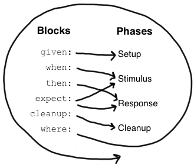


The picture on the right shows how blocks map to the conceptual phases of a feature method. The `where` block has a
special role, which will be revealed shortly. But first, let’s have a closer look at the other blocks.


##### Given Blocks

```groovy
given:
def stack = new Stack()
def elem = "push me"
```


The `given` block is where you do any setup work for the feature that you are describing. It may not be preceded by
other blocks, and may not be repeated. A `given` block doesn’t have any special semantics. The `given:` label is
optional and may be omitted, resulting in an *implicit* `given` block. Originally, the alias `setup:` was the preferred block name,
but using `given:` often leads to a more readable feature method description (see [Specifications as Documentation](#specifications-as-documentation)).


##### When and Then Blocks

```groovy
when:   // stimulus
then:   // response
```


The `when` and `then` blocks always occur together. They describe a stimulus and the expected response. Whereas `when`
blocks may contain arbitrary code, `then` blocks are restricted to *conditions*, *exception conditions*, *interactions*,
and variable definitions. A feature method may contain multiple pairs of `when-then` blocks.


###### Conditions

Conditions describe an expected state, much like JUnit’s assertions. However, conditions are written as plain boolean
expressions, eliminating the need for an assertion API. (More precisely, a condition may also produce a non-boolean
value, which will then be evaluated according to Groovy truth.) Let’s see some conditions in action:


```groovy
when:
stack.push(elem)

then:
!stack.empty
stack.size() == 1
stack.peek() == elem
```


> [!TIP]
> Try to keep the number of conditions per feature method small. One to five conditions is a good guideline. If you
> have more than that, ask yourself if you are specifying multiple unrelated features at once. If the answer is yes,
> break up the feature method in several smaller ones. If your conditions only differ in their values, consider using
> a [data table](#data-tables).


What kind of feedback does Spock provide if a condition is violated? Let’s try and change the second condition to
`stack.size() == 2`. Here is what we get:


```groovy
Condition not satisfied:

stack.size() == 2
|     |      |
|     1      false
[push me]
```


As you can see, Spock captures all values produced during the evaluation of a condition, and presents them in an easily
digestible form. Nice, isn’t it?


###### Implicit and explicit conditions

Conditions are an essential ingredient of `then` blocks and `expect` blocks. Except for calls to `void` methods and
expressions classified as interactions, all top-level expressions in these blocks are implicitly treated as conditions.
To use conditions in other places, you need to designate them with Groovy’s assert keyword:


```groovy
def setup() {
  stack = new Stack()
  assert stack.empty
}
```


If an explicit condition is violated, it will produce the same nice diagnostic message as an implicit condition.


###### Opt-out of condition handling

Sometimes, you may want to use a top-level expression that is not treated as a condition.


For example, you may want to loop over a list with `each` and do assertions on its items.


```groovy
expect:
aList.each { assert it > 0 }
```


However, this will fail if the list is empty, as `each` returns the list again and an empty list is falsy according to Groovy-truth.


To avoid this, you can use the `!!` operator to opt-out of condition handling:


```groovy
expect:
!!aList.each { assert it > 0 }
```


The `!!` operator can also be used to hide the contents of an expression in an explicit assertion statement.
This can be helpful, if the rendered expression is too long to be readable, or if you want to hide the data itself.


```groovy
def foo = 'very long foo'
def bar = 'very long bar'
assert !!(foo == bar) : "foobar"
```


will be rendered as


```
(foo == bar)

foobar
```


as opposed to


```
foo == bar
|   |  |
|   |  very long bar
|   false
|   3 differences (76% similarity)
|   very long (foo)
|   very long (bar)
very long foo

foobar
```


and you can even leave out the message, although it is not recommended, to get this:


```groovy
assert !!(foo == bar)
```


will be rendered as


```
(foo == bar)
```


> [!IMPORTANT]
> The `!!` must be the outermost expression, see [Groovy’s docs on Operator Precedence](https://groovy-lang.org/operators.html#_operator_precedence).
>            If in doubt use parentheses, `!!(expression)`.


###### Exception Conditions

Exception conditions are used to describe that a `when` block should throw an exception. They are defined using the
`thrown()` method, passing along the expected exception type. For example, to describe that popping from an empty stack
should throw an `EmptyStackException`, you could write the following:


```groovy
when:
stack.pop()

then:
thrown(EmptyStackException)
stack.empty
```


As you can see, exception conditions may be followed by other conditions (and even other blocks). This is particularly
useful for specifying the expected content of an exception. To access the exception, first bind it to a variable:


```groovy
when:
stack.pop()

then:
def e = thrown(EmptyStackException)
e.cause == null
```


Alternatively, you may use a slight variation of the above syntax:


```groovy
when:
stack.pop()

then:
EmptyStackException e = thrown()
e.cause == null
```


This syntax has two small advantages: First, the exception variable is strongly typed, making it easier for IDEs to
offer code completion. Second, the condition reads a bit more like a sentence ("then an EmptyStackException is thrown").
Note that if no exception type is passed to the `thrown()` method, it is inferred from the variable type on the left-hand
side.


Sometimes we need to convey that an exception should **not** be thrown. For example, let’s try to express that a `HashMap`
should accept a `null` key:


```groovy
def "HashMap accepts null key"() {
  setup:
  def map = new HashMap()
  map.put(null, "elem")
}
```


This works but doesn’t reveal the intention of the code. Did someone just leave the building before he had finished
implementing this method? After all, where are the conditions? Fortunately, we can do better:


```groovy
def "HashMap accepts null key"() {
  given:
  def map = new HashMap()

  when:
  map.put(null, "elem")

  then:
  notThrown(NullPointerException)
}
```


By using `notThrown()`, we make it clear that in particular a `NullPointerException` should not be thrown. (As per the
contract of `Map.put()`, this would be the right thing to do for a map that doesn’t support `null` keys.) However,
the method will also fail if any other exception is thrown.


###### Methods Accepting Implicit Conditions as Code Blocks

Methods annotated with `@ConditionBlock` will treat `Closure` arguments as code blocks containing
conditions allowing to leave off the `assert` keyword. As in `expect`-blocks and `then`-blocks, variable declarations
and void method invocations will not be considered conditions.


```groovy
AsyncConditions conds = new AsyncConditions()

when:
Thread.start {
  //The method AsyncConditions.evaluate() is annotated with @ConditionBlock
  conds.evaluate {
    //There is an implicit assert here
    false
  }
}

then:
conds.await()
```


> [!NOTE]
> The `@ConditionBlock` only works, if the types involved are known at compile time (no `def` keyword). See below for more details.


The `@ConditionBlock` annotation only takes effect if:


- the `Closures` are passed as literals,
and the Groovy compiler can (at compilation time) determine the target type of the method invocation
referencing the annotated method,
- the annotated method is called on object of type known at compilation time (no `def`).


If the annotated method is overloaded, the closure arguments of all overloads are considered code blocks.


###### Interactions

Whereas conditions describe an object’s state, interactions describe how objects communicate with each other.
Interactions and Interaction based testing are described in a separate [chapter](#interaction-based-testing), so we only give a quick example here.
Suppose we want to describe the flow of events from a publisher to its subscribers. Here is the code:


```groovy
def "events are published to all subscribers"() {
  given:
  def subscriber1 = Mock(Subscriber)
  def subscriber2 = Mock(Subscriber)
  def publisher = new Publisher()
  publisher.add(subscriber1)
  publisher.add(subscriber2)

  when:
  publisher.fire("event")

  then:
  1 * subscriber1.receive("event")
  1 * subscriber2.receive("event")
}
```


##### Expect Blocks

An `expect` block is more limited than a `then` block in that it may only contain conditions and variable definitions.
It is useful in situations where it is more natural to describe stimulus and expected response in a single expression.
For example, compare the following two attempts to describe the `Math.max()` method:


```groovy
when:
def x = Math.max(1, 2)

then:
x == 2
```


```groovy
expect:
Math.max(1, 2) == 2
```


Although both snippets are semantically equivalent, the second one is clearly preferable. As a guideline, use `when-then`
to describe methods with side effects, and `expect` to describe purely functional methods.


> [!TIP]
> Leverage [Groovy JDK](https://docs.groovy-lang.org/docs/latest/html/groovy-jdk/) methods like `any()` and `every()`
> to create more expressive and succinct conditions.


##### Cleanup Blocks

```groovy
given:
def file = new File("/some/path")
file.createNewFile()

// ...

cleanup:
file.delete()
```


A `cleanup` block may only be followed by a `where` block, and may not be repeated. Like a `cleanup` method, it is used
to free any resources used by a feature method, and is run even if (a previous part of) the feature method has produced
an exception. As a consequence, a `cleanup` block must be coded defensively; in the worst case, it must gracefully
handle the situation where the first statement in a feature method has thrown an exception, and all local variables
still have their default values.


> [!TIP]
> Groovy’s safe dereference operator (`foo?.bar()`) simplifies writing defensive code.


Object-level specifications usually don’t need a `cleanup` method, as the only resource they consume is memory, which
is automatically reclaimed by the garbage collector. More coarse-grained specifications, however, might use a `cleanup`
block to clean up the file system, close a database connection, or shut down a network service.


> [!TIP]
> If a specification is designed in such a way that all its feature methods require the same resources, use a
> `cleanup()` method; otherwise, prefer `cleanup` blocks. The same trade-off applies to `setup()` methods and `given` blocks.


##### Where Blocks

A `where` block may only be followed by a `filter` block, and may not be repeated. It is used to write data-driven feature methods.
To give you an idea how this is done, have a look at the following example:


```groovy
def "computing the maximum of two numbers"() {
  expect:
  Math.max(a, b) == c

  where:
  a << [5, 3]
  b << [1, 9]
  c << [5, 9]
}
```


This `where` block effectively creates two "versions" of the feature method: One where `a` is 5, `b` is 1, and `c` is 5,
and another one where `a` is 3, `b` is 9, and `c` is 9.


Although it is declared last, the `where` block is evaluated before the feature method containing it runs.


The `where` block is further explained in the [Data Driven Testing](#data-driven-testing) chapter.


##### Filter Blocks

A `filter` block always comes last in a method, and may not be repeated. It is used to filter iterations in data-driven feature methods.
To give you an idea how this is done, have a look at the following example:


```groovy
def "excluding iterations"() {
  expect:
  i in ((1..5) - 3)

  where:
  i << (1..5)

  filter:
  i != 3
}
```


The content of the `filter` block is treated like the content of an `expect` block. If any of the implicit or explicit
assertions in it fail for a given iteration, this iteration is skipped.


The `filter` block is further explained in the [Data Driven Testing](#data-driven-testing) chapter.


### Helper Methods

Sometimes feature methods grow large and/or contain lots of duplicated code. In such cases it can make sense to introduce
one or more helper methods. Two good candidates for helper methods are setup/cleanup logic and complex conditions.
Factoring out the former is straightforward, so let’s have a look at conditions:


```groovy
def "offered PC matches preferred configuration"() {
  when:
  def pc = shop.buyPc()

  then:
  pc.vendor == "Sunny"
  pc.clockRate >= 2333
  pc.ram >= 4096
  pc.os == "Linux"
}
```


If you happen to be a computer geek, your preferred PC configuration might be very detailed, or you might want to
compare offers from many different shops. Therefore, let’s factor out the conditions:


```groovy
def "offered PC matches preferred configuration"() {
  when:
  def pc = shop.buyPc()

  then:
  matchesPreferredConfiguration(pc)
}

def matchesPreferredConfiguration(pc) {
  pc.vendor == "Sunny"
  && pc.clockRate >= 2333
  && pc.ram >= 4096
  && pc.os == "Linux"
}
```


The new helper method `matchesPreferredConfiguration()` consists of a single boolean expression whose result is returned.
(The `return` keyword is optional in Groovy.) This is fine except for the way that an inadequate offer is now presented:


```groovy
Condition not satisfied:

matchesPreferredConfiguration(pc)
|                             |
false                         ...
```


Not very helpful. Fortunately, we can do better:


#### Using `@Verify` helper methods to assert expectations

```groovy
@Verify
void matchesPreferredConfiguration(PC pc) {
  pc.vendor == "Sunny"
  pc.clockRate >= 2333
  pc.ram >= 4096
  pc.os == "Linux"
}
```


When factoring out conditions into a `@Verify` annotated helper method, you need to ensure the method has a return type of `void`, or uses a dynamic return type (`def` or no declared type).
After compilation, it will be `void` in both cases, and any other return type causes a compilation error, as Spock might interpret the return value as a failing condition otherwise.
You can use `@Verify` for instance methods or static methods of a Specification class, or in separate utility classes.


As expected, the improved helper method tells us exactly what’s wrong:


```groovy
Condition not satisfied:

pc.clockRate >= 2333
|  |         |
|  1666      false
```


A final advice: Although code reuse is generally a good thing, don’t take it too far. Be aware that the use of fixture
and helper methods can increase the coupling between feature methods. If you reuse too much or the wrong code, you will
end up with specifications that are fragile and hard to evolve.


### Using `with` for expectations

As an alternative to the above helper methods, you can use a `with(target, closure)` method to interact on the object being verified.
This is especially useful in `then` and `expect` blocks.


```groovy
def "offered PC matches preferred configuration"() {
  when:
  def pc = shop.buyPc()

  then:
  with(pc) {
    vendor == "Sunny"
    clockRate >= 2333
    ram >= 406
    os == "Linux"
  }
}
```


Unlike when you use helper methods, there is no need for explicit assert statements for proper error reporting.


When verifying mocks, a `with` statement can also cut out verbose verification statements.


```groovy
def service = Mock(Service) // has start(), stop(), and doWork() methods
def app = new Application(service) // controls the lifecycle of the service

when:
app.run()

then:
with(service) {
  1 * start()
  1 * doWork()
  1 * stop()
}
```


Sometimes an IDE has trouble to determine the type of the target, in that case you can help out by manually specifying the
target type via `with(target, type, closure)`.


### Using `verifyAll` or `@VerifyAll` helper methods to assert multiple expectations together

Normal expectations fail the test on the first failed assertions. Sometimes it is helpful to collect these failures before
failing the test to have more information, this behavior is also known as soft assertions.


The `verifyAll` method can be used like `with`,


```groovy
def "offered PC matches preferred configuration"() {
  when:
  def pc = shop.buyPc()

  then:
  verifyAll(pc) {
    vendor == "Sunny"
    clockRate >= 2333
    ram >= 406
    os == "Linux"
  }
}
```


or it can be used without a target.


```groovy
  expect:
  verifyAll {
    2 == 2
    4 == 4
  }
```


Like `with` you can also optionally define a type hint for the IDE.


Alternatively, `verifyAll` conditions can be extracted into a helper method annotated with `@VerifyAll`


```groovy
@VerifyAll
def matchesPreferredConfiguration(PC pc) {
  pc.vendor == "Sunny"
  pc.clockRate >= 2333
  pc.ram >= 406
  pc.os == "Linux"
}
```


It has the same return type constraints as the [@Verify](#at-verify-helper-method) methods.


### Using `verifyEach` to assert on each element of an `Iterable`

There are several ways to do assertions on `Iterable` or `Collection`.


#### List Equality

List equality is useful when the expected values are few and can be easily constructed.


```groovy
def list = [1, 2, 3]
assert list == [1, 2, 4]
```


will be rendered as


```
list == [1, 2, 4]
|    |
|    false
[1, 2, 3]
```


#### Set Equality

As with list equality, set equality is useful when the expected values are few and can be easily constructed.


```groovy
def set = [2, 3, 1] as Set
assert set == [1, 2, 4] as Set
```


will be rendered as


```
set == [1, 2, 4] as Set
|   |
|   false
|   2 differences (66% similarity, 1 missing, 1 extra)
|   missing: [4]
|   extra: [3]
[2, 3, 1]
```


#### Every Method

You can also use the standard Groovy method `every` to do assertions.
The downside is, that you don’t get any insight into which element failed, or why.


```groovy
def list = [1, 2, 3]
assert list.every { it == 2 }
```


will be rendered as


```
list.every { it == 2 }
|    |
|    false
[1, 2, 3]
```


#### VerifyEach Method

Since 2.4, you can use the `verifyEach` method to perform assertions on every element of an iterable.
In contrast to `every`, it will not stop at the first failure and instead check every element and provide a comprehensive report at the end.
It won’t render the full list of items, which makes it useful in cases of a large number of items.
Like `with` the current item will be set as the delegate and passed as parameter to the closure.
The statements in the closure will also be treated as implicit assertions.


```groovy
def list = [1, 2, 3]
verifyEach(list) { it == 2 }
```


will be rendered as


```
Multiple Failures (2 failures)
	org.spockframework.runtime.SpockAssertionError: Assertions failed for item[0] 1:
Condition not satisfied:

it == 2
|  |
1  false

	org.spockframework.runtime.SpockAssertionError: Assertions failed for item[2] 3:
Condition not satisfied:

it == 2
|  |
3  false
```


By default, the item will be rendered with a simple `toString()`.
However, you can provide a custom "namer"-method to provide your own representation.
This is useful when the item either has no useful `toString()` method or if it is too verbose.


```groovy
def list = [1, 2, 3]
verifyEach(list, { "int($it)" }) { it == 2 }
```


will be rendered as


```
Multiple Failures (2 failures)
	org.spockframework.runtime.SpockAssertionError: Assertions failed for item[0] int(1):
Condition not satisfied:

it == 2
|  |
1  false

	org.spockframework.runtime.SpockAssertionError: Assertions failed for item[2] int(3):
Condition not satisfied:

it == 2
|  |
3  false
```


You can also use the optional index parameter to get the index of the current item.
This is useful when you want to do assertions based on the index.
For example, if you want to compare with a list of expected values.


```groovy
def list = [1, 2, 3]
def expected = [1, 3, 4]
verifyEach(list) { it, i -> it == expected[i] }
```


will be rendered as


```
Multiple Failures (2 failures)
	org.spockframework.runtime.SpockAssertionError: Assertions failed for item[1] 2:
Condition not satisfied:

it == expected[i]
|  |  |       ||
2  |  |       |1
   |  |       3
   |  [1, 3, 4]
   false

	org.spockframework.runtime.SpockAssertionError: Assertions failed for item[2] 3:
Condition not satisfied:

it == expected[i]
|  |  |       ||
3  |  |       |2
   |  |       4
   |  [1, 3, 4]
   false
```


### Specifications as Documentation

Well-written specifications are a valuable source of information. Especially for higher-level specifications targeting
a wider audience than just developers (architects, domain experts, customers, etc.), it makes sense to provide more
information in natural language than just the names of specifications and features. Therefore, Spock provides a way to
attach textual descriptions to blocks:


```groovy
given: "open a database connection"
// code goes here
```


Use the `and:` label to describe logically different parts of a block:


```groovy
given: "open a database connection"
// code goes here

and: "seed the customer table"
// code goes here

and: "seed the product table"
// code goes here
```


An `and:` label followed by a description can be inserted at any (top-level) position of a feature method, without
altering the method’s semantics.


In Behavior Driven Development, customer-facing features (called *stories*) are described in a given-when-then format.
Spock directly supports this style of specification with the `given:` label:


```groovy
given: "an empty bank account"
// ...

when: "the account is credited \$10"
// ...

then: "the account's balance is \$10"
// ...
```


Block descriptions are not only present in source code, but are also available to the Spock runtime. Planned usages of
block descriptions are enhanced diagnostic messages, and textual reports that are equally understood by all stakeholders.


### Extensions

As we have seen, Spock offers lots of functionality for writing specifications. However, there always comes a time
when something else is needed. Therefore, Spock provides an interception-based extension mechanism. Extensions are
activated by annotations called *directives*. Currently, Spock ships - among others - with the following directives:


**`@Timeout`**
: Sets a timeout for execution of a feature or fixture method.

**`@Ignore`**
: Ignores any feature method carrying this annotation.

**`@IgnoreRest`**
: Any feature method carrying this annotation will be executed, all others will be ignored. Useful for quickly running just a few features.

**`@FailsWith`**
: Expects a feature method to complete abruptly. `@FailsWith` has two use cases: First, to document known bugs that cannot
be resolved immediately. Second, to replace exception conditions in certain corner cases where the latter cannot be
used (like specifying the behavior of exception conditions). In all other cases, exception conditions are preferable.


Go to the [Extensions](#extensions) chapter to learn how to implement your own directives and extensions, to learn where to find some of the 3rd party extensions, and to learn about all built-in extensions and directives.


> [!NOTE]
> JUnit Jupiter is a separate test engine also running on JUnit Platform and thus is a sibling of the Spock engine.
> Extensions written for JUnit Jupiter do *not* work in Spock specifications out of the box.
> Often terms are mixed up and some extension says it is for JUnit 5+, actually meaning it is for JUnit Jupiter, as there are no generic JUnit Platform extensions.
> If you want to use an extension written for JUnit Jupiter, you can check whether the project also provides a Spock extension, if not ask them to also provide a Spock extension, search for an alternative extension that supports Spock, or port the Jupiter extension to being a Spock extension yourself.
> 
> 
> There is also at least one 3rd party extension that as of this writing provides a partly functioning integration of JUnit Jupiter extensions within Spock specifications.
> This extension though is neither maintained, nor recommended, nor discouraged by the Spock maintainers.
> It can eventually make some JUnit Jupiter extensions work within Spock specifications, but it is always preferable to instead use a native Spock extension.
> Often porting a JUnit Jupiter extension to also support Spock is not a big effort, so you might strongly consider to request a port by the extension maintainer or contribute a port to its project.
> 
> 


### Comparison to JUnit

Although Spock uses a different terminology, many of its concepts and features are inspired by JUnit. Here is a rough comparison:


| Spock | JUnit |
| --- | --- |
| Specification | Test class |
| `setup()` | `@Before` / `@BeforeEach` |
| `cleanup()` | `@After` / `@AfterEach` |
| `setupSpec()` | `@BeforeClass` / `@BeforeAll` |
| `cleanupSpec()` | `@AfterClass` / `@AfterAll` |
| Feature | Test |
| Feature method | Test method |
| Data-driven feature | Theory |
| Condition | Assertion |
| Exception condition | `@Test(expected=…)` |
| Interaction | Mock expectation (e.g. in Mockito) |


## Data Driven Testing

Oftentimes, it is useful to exercise the same test code multiple times, with varying inputs and expected results.
Spock’s data driven testing support makes this a first class feature.


### Introduction

Suppose we want to specify the behavior of the `Math.max` method:


```groovy
class MathSpec extends Specification {
  def "maximum of two numbers"() {
    expect:
    // exercise math method for a few different inputs
    Math.max(1, 3) == 3
    Math.max(7, 4) == 7
    Math.max(0, 0) == 0
  }
}
```


Although this approach is fine in simple cases like this one, it has some potential drawbacks:


- Code and data are mixed and cannot easily be changed independently
- Data cannot easily be auto-generated or fetched from external sources
- In order to exercise the same code multiple times, it either has to be duplicated or extracted into a separate method
- In case of a failure, it may not be immediately clear which inputs caused the failure
- Exercising the same code multiple times does not benefit from the same isolation as executing separate methods does


Spock’s data-driven testing support tries to address these concerns. To get started, let’s refactor above code into a
data-driven feature method. First, we introduce three method parameters (called *data variables*) that replace the
hard-coded integer values:


```groovy
class MathSpec extends Specification {
  def "maximum of two numbers"(int a, int b, int c) {
    expect:
    Math.max(a, b) == c
    ...
  }
}
```


We have finished the test logic, but still need to supply the data values to be used. This is done in a `where:` block,
which always comes at the end of the method. In the simplest (and most common) case, the `where:` block holds a *data table*.


### Data Tables

Data tables are a convenient way to exercise a feature method with a fixed set of data values:


```groovy
class MathSpec extends Specification {
  def "maximum of two numbers"(int a, int b, int c) {
    expect:
    Math.max(a, b) == c

    where:
    a | b | c
    1 | 3 | 3
    7 | 4 | 7
    0 | 0 | 0
  }
}
```


The first line of the table, called the *table header*, declares the data variables. The subsequent lines, called
*table rows*, hold the corresponding values. For each row, the feature method will get executed once; we call this an
*iteration* of the method. If an iteration fails, the remaining iterations will nevertheless be executed. All
failures will be reported.


Data tables must have at least two columns. A single-column table can be written as:


```groovy
where:
a | _
1 | _
7 | _
0 | _
```


A sequence of two or more underscores can be used to split one wide data table into multiple narrower ones.
Without this separator and without any other data variable assignment in between there
is no way to have multiple data tables in one `where` block, the second table would just
be further iterations of the first table, including the seemingly header row:


```groovy
where:
a | _
1 | _
7 | _
0 | _
__

b | c
1 | 2
3 | 4
5 | 6
```


This is semantically exactly the same, just as one wider joined data table:


```groovy
where:
a | b | c
1 | 1 | 2
7 | 3 | 4
0 | 5 | 6
```


The sequence of two or more underscores can be used anywhere in the `where` block.
It will be ignored everywhere, except for in between two data tables, where it is
used to separate the two data tables. This means that the separator can also be used
as styling element in different ways. It can be used as separator line like shown in
the last example or it can for example be used visually as top border of tables
additionally to its effect of separating them:


```groovy
where:
_____
a | _
1 | _
7 | _
0 | _
_____
b | c
1 | 2
3 | 4
5 | 6
```


### Isolated Execution of Iterations

Iterations are isolated from each other in the same way as separate feature methods. Each iteration gets its own instance
of the specification class, and the `setup` and `cleanup` methods will be called before and after each iteration,
respectively.


### Sharing of Objects between Iterations

In order to share an object between iterations, it has to be kept in a `@Shared` or static field.


> [!NOTE]
> Only `@Shared` and static variables can be accessed from within a `where:` block.


Note that such objects will also be shared with other methods. There is currently no good way to share an object
just between iterations of the same method. If you consider this a problem, consider putting each method into a separate
spec, all of which can be kept in the same file. This achieves better isolation at the cost of some boilerplate code.


### Syntactic Variations

The previous code can be tweaked in a few ways.


First, since the `where:` block already declares all data variables, the method parameters can be
omitted. (Note: The idea behind allowing method parameters is to enable better IDE support. However, recent versions of IntelliJ IDEA recognize data variables automatically, and even infer their types from the values contained in the data table.)


You can also omit some parameters and specify others, for example to have them typed.
The order also is not important, data variables are matched by name to the specified method parameters.


Second, inputs and expected outputs can be separated with a double pipe symbol (`||`) to visually set them apart.


With this, the code becomes:


```groovy
class MathSpec extends Specification {
  def "maximum of two numbers"() {
    expect:
    Math.max(a, b) == c

    where:
    a | b || c
    1 | 3 || 3
    7 | 4 || 7
    0 | 0 || 0
  }
}
```


Alternatively to using single or double pipes you can also use any amount of semicolons to separate data columns
from each other:


```groovy
class MathSpec extends Specification {
  def "maximum of two numbers"() {
    expect:
    Math.max(a, b) == c

    where:
    a ; b ;; c
    1 ; 3 ;; 3
    7 ; 4 ;; 7
    0 ; 0 ;; 0
  }
}
```


Pipes and semicolons as data column separator can not be mixed within one table.
If the column separator changes, this starts a new stand-alone data table:


```groovy
class MathSpec extends Specification {
  def "maximum of two numbers"() {
    expect:
    Math.max(a, b) == c
    Math.max(d, e) == f

    where:
    a | b || c
    1 | 3 || 3
    7 | 4 || 7
    0 | 0 || 0

    d ; e ;; f
    1 ; 3 ;; 3
    7 ; 4 ;; 7
    0 ; 0 ;; 0
  }
}
```


### Reporting of Failures

Let’s assume that our implementation of the `max` method has a flaw, and one of the iterations fails:


```
maximum of two numbers [a: 1, b: 3, c: 3, #0]   PASSED
maximum of two numbers [a: 7, b: 4, c: 7, #1]   FAILED

Condition not satisfied:

Math.max(a, b) == c
|    |   |  |  |  |
|    |   7  4  |  7
|    42        false
class java.lang.Math

maximum of two numbers [a: 0, b: 0, c: 0, #2]   PASSED
```


The obvious question is: Which iteration failed, and what are its data values? In our example, it isn’t hard to figure
out that it’s the second iteration (with index 1) that failed even from the rich condition rendering. At other times
this can be more difficult or even impossible. (Note: For example, a feature method could use data variables in its `given:` block, but not in any conditions.) In any case, Spock makes it loud and clear which iteration failed, rather
than just reporting the failure. Iterations of a feature method are by default unrolled with a rich naming pattern.
This pattern can also be configured as documented at [_unrolled_iteration_names](#_unrolled_iteration_names) or the unrolling can be disabled
like described in the following section.


### Method Uprolling and Unrolling

A method annotated with `@Rollup` will have its iterations not reported independently but only aggregated within the
feature. This can for example be used if you produce many test cases from calculations or if you use external data
like the contents of a database as test data and do not want the test count to vary:


```groovy
@Rollup
def "maximum of two numbers"() {
...
```


Note that up- and unrolling has no effect on how the method gets executed; it is only an alternation in reporting.
Depending on the execution environment, the output will look something like:


```
maximum of two numbers   FAILED

Condition not satisfied:

Math.max(a, b) == c
|    |   |  |  |  |
|    |   7  4  |  7
|    42        false
class java.lang.Math
```


The `@Rollup` annotation can also be placed on a spec.
This has the same effect as placing it on each data-driven feature method of the spec that does not have an
`@Unroll` annotation.


Alternatively the [configuration file](#spock-configuration-file) setting `unrollByDefault`
in the `unroll` section can be set to `false` to roll up all features automatically unless
they are annotated with `@Unroll` or are contained in an `@Unroll`ed spec and thus reinstate the pre Spock 2.0
behavior where this was the default.


**Disable Default Unrolling**

```groovy
unroll {
    unrollByDefault false
}
```


It is illegal to annotate a spec or a feature with both the `@Unroll` and the `@Rollup` annotation and if detected
this will cause an exception to be thrown.


---


To summarize:


A feature will be uprolled


- if the method is annotated with `@Rollup`
- if the method is not annotated with `@Unroll` and the spec is annotated with `@Rollup`
- if neither the method nor the spec is annotated with `@Unroll`
and the configuration option `unroll { unrollByDefault }` is set to `false`


A feature will be unrolled


- if the method is annotated with `@Unroll`
- if the method is not annotated with `@Rollup` and the spec is annotated with `@Unroll`
- if neither the method nor the spec is annotated with `@Rollup`
and the configuration option `unroll { unrollByDefault }` is set to its default value `true`


### Data Pipes

Data tables aren’t the only way to supply values to data variables. In fact, a data table is just syntactic sugar for
one or more *data pipes*:


```groovy
...
where:
a << [1, 7, 0]
b << [3, 4, 0]
c << [3, 7, 0]
```


A data pipe, indicated by the left-shift (`<<`) operator, connects a data variable to a *data provider*. The data
provider holds all values for the variable, one per iteration. Any object that Groovy knows how to iterate over can be
used as a data provider. This includes objects of type `Collection`, `String`, `Iterable`, and objects implementing the
`Iterable` contract. Data providers don’t necessarily have to *be* the data (as in the case of a `Collection`);
they can fetch data from external sources like text files, databases and spreadsheets, or generate data randomly.
Data providers are queried for their next value only when needed (before the next iteration).


> [!NOTE]
> Spock uses the `size()` method to calculate the amount of iterations,
>       except for data providers that implement `Iterator`,
>       so make sure `size()` is working efficient, or supply an `Iterator` if that is not possible.


### Multi-Variable Data Pipes

If a data provider returns multiple values per iteration (as an object that Groovy knows how to iterate over),
it can be connected to multiple data variables simultaneously. The syntax is somewhat similar to Groovy multi-assignment
but uses brackets instead of parentheses on the left-hand side:


```groovy
@Shared sql = Sql.newInstance("jdbc:h2:mem:", "org.h2.Driver")

def "maximum of two numbers"() {
  expect:
  Math.max(a, b) == c

  where:
  [a, b, c] << sql.rows("select a, b, c from maxdata")
}
```


Data values that aren’t of interest can be ignored with an underscore (`_`):


```groovy
...
where:
[a, b, _, c] << sql.rows("select * from maxdata")
```


The multi-assignments can even be nested. The following example will generate these iterations:


| a | b | c |
| --- | --- | --- |
| `['a1', 'a2']` | ’b1'` | ’c1'` |
| `['a2', 'a1']` | ’b1'` | ’c1'` |
| `['a1', 'a2']` | ’b2'` | ’c2'` |
| `['a2', 'a1']` | ’b2'` | ’c2'` |


```groovy
...
where:
[a, [b, _, c]] << [
  ['a1', 'a2'].permutations(),
  [
    ['b1', 'd1', 'c1'],
    ['b2', 'd2', 'c2']
  ]
].combinations()
```


#### Named deconstruction of data pipes

Since Spock 2.2, multi variable data pipes can also be deconstructed from maps.
This is useful when the data provider returns a map with named keys.
Or, if you have long values that don’t fit well into a data-table, then using the maps makes it easier to read.


```groovy
...
where:
[a, b, c] << [
  [
    a: 1,
    b: 3,
    c: 5
  ],
  [
    a: 2,
    b: 4,
    c: 6
  ]
]
```


You can use named deconstruction with nested data pipes, but only on the innermost nesting level.


```groovy
...
where:
[a, [b, c]] << [
  [1, [b: 3, c: 5]],
  [2, [c: 6, b: 4]]
]
```


### Cross-multiplying Data Providers

Two or more consecutive data providers, be it a data table or a data pipe, can also be combined
using a cartesian product using the `combined:` label between them. The following will result
in these executed tests:


- `feature [a: 1, b: 3, c: 5, d: 1, e: 4, #0]`
- `feature [a: 1, b: 4, c: 6, d: 1, e: 5, #1]`
- `feature [a: 2, b: 3, c: 5, d: 1, e: 5, #2]`
- `feature [a: 2, b: 4, c: 6, d: 1, e: 6, #3]`


```groovy
where:
a | _
1 | _
2 | _

combined:

b | c
3 | 5
4 | 6

combined:

d | _
1 | _

e = a + b
```


Exactly the same result can be achieved using


```groovy
where:
a << [1, 2]
combined:
b | c
3 | 5
4 | 6

d = 1
e = a + b
```


> [!NOTE]
> Combining with a derived data variable (`x = …`) makes no sense and thus is forbidden.


> [!NOTE]
> If a data table takes part in a cross-multiplication, accessing columns of previous
>       data tables would not behave in an intuitive way and thus is currently forbidden. Accessing
>       previous columns within one data table even works while taking part in a cross-multiplication.


> [!NOTE]
> Only the data provider right before the `combined:` label is
> combined with the data provider right after the `combined:` label.
> 
> 
> So if you execute
> 
> 
> ```groovy
> where:
> a << [1, 2, 3, 4, 5, 6]
> b << [5, 6]
> combined:
> c << [7, 8, 9]
> ```
> 
> 
> it will result in these executed tests:
> 
> 
> - `feature [a: 1, b: 5, c: 7, #0]`
> - `feature [a: 2, b: 5, c: 8, #1]`
> - `feature [a: 3, b: 5, c: 9, #2]`
> - `feature [a: 4, b: 6, c: 7, #3]`
> - `feature [a: 5, b: 6, c: 8, #4]`
> - `feature [a: 6, b: 6, c: 9, #5]`
> 
> 
> If you want to combine `a` and `b` with `c` to get this result:
> 
> 
> - `feature [a: 1, b: 3, c: 5, #0]`
> - `feature [a: 1, b: 3, c: 6, #1]`
> - `feature [a: 2, b: 4, c: 5, #2]`
> - `feature [a: 2, b: 4, c: 6, #3]`
> 
> 
> you have to for example use
> 
> 
> ```groovy
> where:
> [a, b] << [
>   [1, 2],
>   [3, 4]
> ].transpose()
> combined:
> c << [5, 6]
> ```
> 
> 
> or
> 
> 
> ```groovy
> where:
> a | b
> 1 | 3
> 2 | 4
> combined:
> c << [5, 6]
> ```
> 
> 


### Data Variable Assignment

A data variable can be directly assigned a value:


```groovy
...
where:
a = 3
b = Math.random() * 100
c = a > b ? a : b
```


Assignments are re-evaluated for every iteration. As already shown above, the right-hand side of an assignment may refer
to other data variables:


```groovy
...
where:
row << sql.rows("select * from maxdata")
// pick apart columns
a = row.a
b = row.b
c = row.c
```


### Accessing Other Data Variables

There are only two possibilities to access one data variable from the calculation
of another data variable.


The first possibility are derived data variables like shown in the last section.
Every data variable that is defined by a direct assignment can access all
previously defined data variables, including the ones defined through data
tables or data pipes:


```groovy
...
where:
a = 3
b = Math.random() * 100
c = a > b ? a : b
```


The second possibility is to access previous columns within data tables:


```groovy
...
where:
a | b
3 | a + 1
7 | a + 2
0 | a + 3
```


This also includes columns in previous data tables in the same `where` block:


```groovy
...
where:
a | b
3 | a + 1
7 | a + 2
0 | a + 3

and:
c = 1

and:
d     | e
a * 2 | b * 2
a * 3 | b * 3
a * 4 | b * 4
```


### Local Variables in the where-block

Sometimes you need a helper value to build your data, but it should be neither a data variable (and thus a method parameter) nor a field on the whole specification.
You can declare a `final` local variable at the **start** of the `where:` block:


```groovy
...
where:
final sep = "/"

input              | expected
"a${sep}b"         | "a/b"
"x${sep}y${sep}z"  | "x/y/z"
```


Such variables:


- must be declared `final` (a bare `x = …` declares a [derived data variable](#_data_variable_assignment) instead);
- must come **before** any data variable, data table or data pipe;
- require at least one data variable in the same `where:` block, otherwise they would never be evaluated;
- are evaluated **once per feature** and reused everywhere they are referenced in the `where:` block, so `final fixture = new Fixture()` is a single shared instance;
- are visible only inside the `where:` block (data tables, data pipes, derived data variables and the `filter:` block); they are **not** method parameters and are **not** visible in the rest of the feature method;
- follow the same access rules as data providers: they may read `@Shared` and `static` fields but not plain instance fields;
- are automatically closed after the feature has finished if they implement `AutoCloseable`, in reverse declaration order; any error thrown while closing is ignored.


> [!NOTE]
> In short, a where-block variable behaves like a feature-local `@Shared @AutoCleanup(quiet = true)` field: it is created once, shared across all iterations of the feature, and closed when the feature finishes.


The automatic close also covers a failed setup: if one initializer throws after earlier variables were already created, the already-created resources are closed in reverse declaration order, and any error thrown while closing them is attached to the original failure as a suppressed exception.
Only values that never made it into a variable are out of reach, for example a resource created inside the failing initializer expression itself.


The automatic close is best-effort and has one known limitation.
If a where-block variable is also consumed directly as a data provider (for example `x << resource` where `resource` is a where-block variable), it can be closed twice, so give such a value an idempotent `close()` if double-closing would be a problem.


The initializer may also use Groovy’s multiple-assignment syntax to declare several locals at once.
The same rules apply to every target, and each name becomes its own where-block variable:


```groovy
...
  where:
  final (lower, upper) = [0, 100]

  value << [lower, 50, upper]
```


> [!NOTE]
> The `final (a, b) = …` syntax is only supported on Groovy 3.0 or newer.
> On Groovy 2.5 declare one `final` local per line instead.


### Multi-Variable Assignment

Like with data pipes, you can also assign to multiple variables in one expression, if you have some object Groovy
can iterate over. Unlike with data pipes, the syntax here is identical to standard Groovy multi-assignment syntax:


```groovy
@Shared sql = Sql.newInstance("jdbc:h2:mem:", "org.h2.Driver")

def "maximum of two numbers multi-assignment"() {
  expect:
  Math.max(a, b) == c

  where:
  row << sql.rows("select a, b, c from maxdata")
  (a, b, c) = row
}
```


Data values that aren’t of interest can be ignored with an underscore (`_`):


```groovy
...
where:
row << sql.rows("select * from maxdata")
(a, b, _, c) = row
```


### Combining Data Tables, Data Pipes, and Variable Assignments

Data tables, data pipes, and variable assignments can be combined as needed:


```groovy
...
where:
a | b
1 | a + 1
7 | a + 2
0 | a + 3

c << [3, 4, 0]

d = a > c ? a : c
```


### Type Coercion for Data Variable Values

Data variable values are coerced to the declared parameter type using
[type coercion](https://groovy-lang.org/operators.html#_coercion_operator). Due to that custom type conversions can be
provided as [extension module](https://groovy-lang.org/metaprogramming.html#_extension_modules) or with the help of
the [`@Use`](#_use) extension on the specification (as it has no effect to the `where:` block if
applied to a feature).


```groovy
def "type coercion for data variable values"(Integer i) {
  expect:
  i instanceof Integer
  i == 10

  where:
  i = "10"
}
```


```groovy
@Use(CoerceBazToBar)
class Foo extends Specification {
  def foo(Bar bar) {
    expect:
    bar == Bar.FOO

    where:
    bar = Baz.FOO
  }
}
enum Bar { FOO, BAR }
enum Baz { FOO, BAR }
class CoerceBazToBar {
  static Bar asType(Baz self, Class<Bar> clazz) {
    return Bar.valueOf(self.name())
  }
}
```


### Number of Iterations

The number of iterations depends on how much data is available. Successive executions of the same method can
yield different numbers of iterations. If a data provider runs out of values sooner than its peers, an exception will occur.
Variable assignments don’t affect the number of iterations. A `where:` block that only contains assignments yields
exactly one iteration.


### Filtering iterations

If you want to filter out some iterations, you can use the `@IgnoreIf` annotation on the feature method.
This has one significant drawback though, the iteration would be reported as skipped in test reports.
Therefor you can have a `filter` block after the `where` block.
The content of this block is treated like the content of the `expect` block.
If any of the implicit or explicit assertions in the `filter` block fails, the iteration is treated like it would not exist.
This also means, that if all iterations are filtered out, the test will fail like when giving a data provider without content.


In the following example the test is executed with the values `1`, `2`, `4`, and `5` for the variable `i`,
the iteration where `i` would be `3` is filtered out by the `filter` block:


```groovy
def "excluding iterations"() {
  expect:
  i in ((1..5) - 3)

  where:
  i << (1..5)

  filter:
  i != 3
}
```


### Closing of Data Providers

After all iterations have completed, the zero-argument `close` method is called on all data providers that have
such a method.


### Unrolled Iteration Names

By default, the names of unrolled iterations are the name of the feature, plus the data variables and the iteration
index. This will always produce unique names and should enable you to identify easily the failing data variable
combination.


The example at [_reporting_of_failures](#_reporting_of_failures) for example shows with `maximum of two numbers [a: 7, b: 4, c: 7, #1]`,
that the second iteration (`#1`) where the data variables have the values `7`, `4` and `7` failed.


With a bit of effort, we can do even better:


```groovy
def "maximum of #a and #b is #c"() {
...
```


This method name uses placeholders, denoted by a leading hash sign (`#`), to refer to data variables `a`, `b`, and `c`.
In the output, the placeholders will be replaced with concrete values:


```
maximum of 1 and 3 is 3   PASSED
maximum of 7 and 4 is 7   FAILED

Math.max(a, b) == c
|    |   |  |  |  |
|    |   7  4  |  7
|    42        false
class java.lang.Math

maximum of 0 and 0 is 0   PASSED
```


Now we can tell at a glance that the `max` method failed for inputs `7` and `4`.


An unrolled method name is similar to a Groovy `GString`, except for the following differences:


- Expressions are denoted with `#` instead of `$`, and there is no equivalent for the `${…}` syntax.
- Expressions only support property access and zero-arg method calls.


Given a class `Person` with properties `name` and `age`, and a data variable `person` of type `Person`, the
following are valid method names:


```groovy
def "#person is #person.age years old"() { // property access
def "#person.name.toUpperCase()"() { // zero-arg method call
```


Non-string values (like `#person` above) are converted to Strings according to Groovy semantics.


The following are invalid method names:


```groovy
def "#person.name.split(' ')[1]" {  // cannot have method arguments
def "#person.age / 2" {  // cannot use operators
```


If necessary, additional data variables can be introduced to hold more complex expressions:


```groovy
def "#lastName"() {
  ...
  where:
  person << [new Person(age: 14, name: 'Phil Cole')]
  lastName = person.name.split(' ')[1]
}
```


Additionally, to the data variables the tokens `#featureName` and `#iterationIndex` are supported.
The former does not make much sense inside an actual feature name, but there are two other places
where an unroll-pattern can be defined, where it is more useful.


```groovy
def "#person is #person.age years old [#iterationIndex]"() {
```


will be reported as


```
╷
└─ Spock ✔
   └─ PersonSpec ✔
      └─ #person.name is #person.age years old [#iterationIndex] ✔
         ├─ Fred is 38 years old [0] ✔
         ├─ Wilma is 36 years old [1] ✔
         └─ Pebbles is 5 years old [2] ✔
```


Alternatively, to specifying the unroll-pattern as method name, it can be given as parameter
to the `@Unroll` annotation which takes precedence over the method name:


```groovy
@Unroll("#featureName[#iterationIndex] (#person.name is #person.age years old)")
def "person age should be calculated properly"() {
// ...
```


will be reported as


```
╷
└─ Spock ✔
   └─ PersonSpec ✔
      └─ person age should be calculated properly ✔
         ├─ person age should be calculated properly[0] (Fred is 38 years old) ✔
         ├─ person age should be calculated properly[1] (Wilma is 36 years old) ✔
         └─ person age should be calculated properly[2] (Pebbles is 5 years old) ✔
```


The advantage is, that you can have a descriptive method name for the whole feature, while having a separate template for each iteration.
Furthermore, the feature method name is not filled with placeholders and thus better readable.


If neither a parameter to the annotation is given, nor the method name contains a `#`,
the [configuration file](#spock-configuration-file) setting `defaultPattern`
in the `unroll` section is inspected. If it is set to a non-`null`
string, this value is used as unroll-pattern. This could for example be set to


- `#featureName` to have all iterations reported with the same name, or
- `#featureName[#iterationIndex]` to have a simply indexed iteration name, or
- `#iterationName` if you make sure that in each data-driven feature you also set
a data variable called `iterationName` that is then used for reporting


#### Special Tokens

This is the complete list of special tokens:


- `#featureName` is the name of the feature (mostly useful for the `defaultPattern` setting)
- `#iterationIndex` is the current iteration index
- `#dataVariables` lists all data variables for this iteration, e.g. `x: 1, y: 2, z: 3`
- `#dataVariablesWithIndex` the same as `#dataVariables` but with an index at the end, e.g. `x: 1, y: 2, z: 3, #0`


#### Configuration

**Set Default Unroll-Pattern**

```groovy
unroll {
    defaultPattern '#featureName[#iterationIndex]'
}
```


If none of the three described ways is used to set a custom unroll-pattern, by default
the feature name is used, suffixed with all data variable names and their values and
finally the iteration index, so the result will be for example
`my feature [x: 1, y: 2, z: 3, #0]`.


If there is an error in an unroll expression, for example typo in variable name, exception during
evaluation of a property or method in the expression and so on, the test will fail. This is not
true for the automatic fall back rendering of the data variables if there is no unroll-pattern
set in any way, this will never fail the test, no matter what happens.


The failing of test with errors in the unroll expression can be disabled by setting the
[configuration file](#spock-configuration-file) setting `validateExpressions`
in the `unroll` section to `false`. If this is done and an error happens, the erroneous expression
`#foo.bar` will be substituted by `#Error:foo.bar`.


**Disable Unroll-pattern Expression Asserting**

```groovy
unroll {
    validateExpressions false
}
```


Some reporting frameworks, or IDEs support proper tree based reporting.
For these cases it might be desirable to omit the feature name from the iteration reporting.


**Disable repetition of feature name in iterations**

```groovy
unroll {
    includeFeatureNameForIterations false
}
```


With `includeFeatureNameForIterations true`


```
╷
└─ Spock ✔
   └─ ASpec ✔
      └─ really long and informative test name that doesn't have to be repeated ✔
         ├─ really long and informative test name that doesn't have to be repeated [x: 1, y: a, #0] ✔
         ├─ really long and informative test name that doesn't have to be repeated [x: 2, y: b, #1] ✔
         └─ really long and informative test name that doesn't have to be repeated [x: 3, y: c, #2] ✔
```


**With `includeFeatureNameForIterations false`**

```
╷
└─ Spock ✔
   └─ ASpec ✔
      └─ really long and informative test name that doesn't have to be repeated ✔
         ├─ x: 1, y: a, #0 ✔
         ├─ x: 2, y: b, #1 ✔
         └─ x: 3, y: c, #2 ✔
```


> [!NOTE]
> The same can be achieved for individual features by using `@Unroll('#dataVariablesWithIndex')`.


## Interaction Based Testing

Interaction-based testing is a design and testing technique that emerged in the Extreme Programming
(XP) community in the early 2000’s. Focusing on the behavior of objects rather than their state, it explores how
the object(s) under specification interact, by way of method calls, with their collaborators.


For example, suppose we have a `Publisher` that sends messages to its `Subscriber`s:


```groovy
class Publisher {
  List<Subscriber> subscribers = []
  int messageCount = 0
  void send(String message){
    subscribers*.receive(message)
    messageCount++
  }
}

interface Subscriber {
  void receive(String message)
}

class PublisherSpec extends Specification {
  Publisher publisher = new Publisher()
}
```


How are we going to test `Publisher`? With state-based testing, we can verify that the publisher keeps track of its
subscribers. The more interesting question, though, is whether a message sent by the publisher
is received by the subscribers. To answer this question, we need a special implementation of
`Subscriber` that listens in on the conversation between the publisher and its subscribers. Such an
implementation is called a *mock object*.


While we could certainly create a mock implementation of `Subscriber` by hand, writing and maintaining this code
can get unpleasant as the number of methods and complexity of interactions increases. This is where mocking frameworks
come in: They provide a way to describe the expected interactions between an object under specification and its
collaborators, and can generate mock implementations of collaborators that verify these expectations.


**How Are Mock Implementations Generated?**

Like most Java mocking frameworks, Spock uses
[JDK dynamic proxies](https://docs.oracle.com/javase/7/docs/api/java/lang/reflect/Proxy.html) (when mocking interfaces)
and [Byte Buddy](https://bytebuddy.net/) or [CGLIB](https://github.com/cglib/cglib) proxies (when mocking classes) to generate mock implementations at runtime.
Compared to implementations based on Groovy meta-programming, this has the advantage that it also works for testing Java code.


The Java world has no shortage of popular and mature mocking frameworks: [JMock](https://www.jmock.org/),
[EasyMock](https://www.easymock.org), [Mockito](https://mockito.org/), to name just a few.
Although each of these tools can be used together with Spock, we decided to roll our own mocking framework,
tightly integrated with Spock’s specification language. This decision was driven by the desire to leverage all of
Groovy’s capabilities to make interaction-based tests easier to write, more readable, and ultimately more fun.
We hope that by the end of this chapter, you will agree that we have achieved these goals.


Except where indicated, all features of Spock’s mocking framework work both for testing Java and Groovy code.


### Creating Mock Objects

Mock objects are created with the `MockingApi.Mock()` method. (Note: For additional ways to create mock objects, see [OtherKindsOfMockObjects)(#OtherKindsOfMockObjects) and [ALaCarteMocks](#ALaCarteMocks).]
Let’s create two mock subscribers:


```groovy
def subscriber = Mock(Subscriber)
def subscriber2 = Mock(Subscriber)
```


Alternatively, the following Java-like syntax is supported, which may give better IDE support:


```groovy
Subscriber subscriber = Mock()
Subscriber subscriber2 = Mock()
```


Here, the mock’s type is inferred from the variable type on the left-hand side of the assignment.


> [!NOTE]
> If the mock’s type is given on the left-hand side of the assignment, it’s permissible
> (though not required) to omit it on the right-hand side.


Mock objects literally implement (or, in the case of a class, extend) the type they stand in for. In other
words, in our example `subscriber` *is-a* `Subscriber`. Hence it can be passed to statically typed (Java)
code that expects this type.


### Default Behavior of Mock Objects

**Lenient vs. Strict Mocking Frameworks**

Like Mockito, we firmly believe that a mocking framework should be lenient by default. This means that unexpected
method calls on mock objects (or, in other words, interactions that aren’t relevant for the test at hand) are allowed
and answered with a default response. Conversely, mocking frameworks like EasyMock and JMock are strict by default,
and throw an exception for every unexpected method call. While strictness enforces rigor, it can also lead
to over-specification, resulting in brittle tests that fail with every other internal code change. Spock’s mocking
framework makes it easy to describe only what’s relevant about an interaction, avoiding the over-specification trap.


Initially, mock objects have no behavior. Calling methods on them is allowed but has no effect other than returning
the default value for the method’s return type (`false`, `0`, or `null`). An exception are the `Object.equals`,
`Object.hashCode`, and `Object.toString` methods, which have the following default behavior: A mock object is only
equal to itself, has a unique hash code, and a string representation that includes the name of the type it represents.
This default behavior is overridable by stubbing the methods, which we will learn about in the [_stubbing](#_stubbing) section.


### Injecting Mock Objects into Code Under Specification

After creating the publisher and its subscribers, we need to make the latter known to the former:


```groovy
class PublisherSpec extends Specification {
  Publisher publisher = new Publisher()
  Subscriber subscriber = Mock()
  Subscriber subscriber2 = Mock()

  def setup() {
    publisher.subscribers << subscriber // << is a Groovy shorthand for List.add()
    publisher.subscribers << subscriber2
  }
```


We are now ready to describe the expected interactions between the two parties.


### Mocking

Mocking is the act of describing (mandatory) interactions between the object under specification and its collaborators.
Here is an example:


```groovy
def "should send messages to all subscribers"() {
  when:
  publisher.send("hello")

  then:
  1 * subscriber.receive("hello")
  1 * subscriber2.receive("hello")
}
```


Read out aloud: "When the publisher sends a 'hello' message, then both subscribers should receive that message exactly once."


When this feature method gets run, all invocations on mock objects that occur while executing the
`when` block will be matched against the interactions described in the `then:` block. If one of the interactions isn’t
satisfied, a (subclass of) `InteractionNotSatisfiedError` will be thrown. This verification happens automatically
and does not require any additional code.


#### Interactions

**Is an Interaction Just a Regular Method Invocation?**

Not quite. While an interaction looks similar to a regular method invocation, it is simply a way to express which
method invocations are expected to occur. A good way to think of an interaction is as a regular expression
that all incoming invocations on mock objects are matched against. Depending on the circumstances, the interaction
may match zero, one, or multiple invocations.


Let’s take a closer look at the `then:` block. It contains two *interactions*, each of which has four distinct
parts: a *cardinality*, a *target constraint*, a *method constraint*, and an *argument constraint*:


```
1 * subscriber.receive("hello")
|   |          |       |
|   |          |       argument constraint
|   |          method constraint
|   target constraint
cardinality
```


#### Cardinality

The cardinality of an interaction describes how often a method call is expected. It can either be a fixed number or
a range:


```groovy
1 * subscriber.receive("hello")      // exactly one call
0 * subscriber.receive("hello")      // zero calls
(1..3) * subscriber.receive("hello") // between one and three calls (inclusive)
(1.._) * subscriber.receive("hello") // at least one call
(_..3) * subscriber.receive("hello") // at most three calls
_ * subscriber.receive("hello")      // any number of calls, including zero
                                     // (rarely needed; see 'Strict Mocking')
```


#### Target Constraint

The target constraint of an interaction describes which mock object is expected to receive the method call:


```groovy
1 * subscriber.receive("hello") // a call to 'subscriber'
1 * _.receive("hello")          // a call to any mock object
```


#### Method Constraint

The method constraint of an interaction describes which method is expected to be called:


```groovy
1 * subscriber.receive("hello") // a method named 'receive'
1 * subscriber./r.*e/("hello")  // a method whose name matches the given regular expression
                                // (here: method name starts with 'r' and ends in 'e')
```


When expecting a call to a getter method, Groovy property syntax *can* be used instead of method syntax:


```groovy
1 * subscriber.status // same as: 1 * subscriber.getStatus()
```


When expecting a call to a setter method, only method syntax can be used:


```groovy
1 * subscriber.setStatus("ok") // NOT: 1 * subscriber.status = "ok"
```


#### Argument Constraints

The argument constraints of an interaction describe which method arguments are expected:


```groovy
1 * subscriber.receive("hello")        // an argument that is equal to the String "hello"
1 * subscriber.receive(!"hello")       // an argument that is unequal to the String "hello"
1 * subscriber.receive()               // the empty argument list (would never match in our example)
1 * subscriber.receive(_)              // any single argument (including null)
1 * subscriber.receive(*_)             // any argument list (including the empty argument list)
1 * subscriber.receive(!null)          // any non-null argument
1 * subscriber.receive(_ as String)    // any non-null argument that is-a String
1 * subscriber.receive(endsWith("lo")) // an argument matching the given Hamcrest matcher
                                       // a String argument ending with "lo" in this case
1 * subscriber.receive({ it.size() > 3 && it.contains('a') })
// an argument that satisfies the given predicate, meaning that
// code argument constraints need to return true of false
// depending on whether they match or not
// (here: message length is greater than 3 and contains the character a)
```


Argument constraints work as expected for methods with multiple arguments:


```groovy
1 * process.invoke("ls", "-a", _, !null, { ["abcdefghiklmnopqrstuwx1"].contains(it) })
```


When dealing with vararg methods, vararg syntax can also be used in the corresponding interactions:


```groovy
interface VarArgSubscriber {
    void receive(String... messages)
}

...

subscriber.receive("hello", "goodbye")
```


**Spock Deep Dive: Groovy Varargs**

Groovy allows any method whose last parameter has an array type to be called in vararg style.
Consequently, vararg syntax can also be used in interactions matching such methods.


##### Equality Constraint

The equality constraint uses groovy equality to check the argument, i.e, `argument == constraint`. You can use


- any literal `1 * check('string')` / `1 * check(1)` / `1 * check(null)`,
- a variable `1 * check(var)`,
- a list or map literal `1 * check([1])` / `1 * check([foo: 'bar'])`,
- an object `1 * check(new Person('sam'))`,
- or the result of a method call `1 * check(person())`


as an equality constraint.


##### Hamcrest Constraint

A variation of the equality constraint, if the constraint object is a Hamcrest matcher, then it will use that matcher
to check the argument.


##### Wildcard Constraint

The wildcard constraint will match any argument `null` or otherwise. It is the `*`, i.e. `1 * subscriber.receive(*)`.
There is also the spread wildcard constraint `*_` which matches any number of arguments `1 * subscriber.receive(*_)` including none.


##### Code Constraint

The code constraint is the most versatile of all. It is a groovy closure that gets the argument as its parameter.
The closure is treated as an condition block, so it behaves like a `then` block, i.e., every line is treated as an implicit assertion.
It can emulate all but the spread wildcard constraint, however it is suggested to use the simpler constraints where possible.
You can do multiple assertions, call methods for assertions, or use `with`/`verifyAll`.


```groovy
1 * list.add({
  verifyAll(it, Person) {
    firstname == 'William'
    lastname == 'Kirk'
    age == 45
  }
})
```


##### Negating Constraint

The negating constraint `!` is a compound constraint, i.e. it needs to be combined with another constraint to work.
It inverts the result of the nested constraint, e.g, `1 * subscriber.receive(!null)` is the combination of
an equality constraint checking for null and then the negating constraint inverting the result, turning it into not null.


Although it can be combined with any other constraint it does not always make sense, e.g., `1 * subscriber.receive(!_)` will match nothing.
Also keep in mind that the diagnostics for a non matching negating constraint will just be that the inner
constraint did match, without any more information.


##### Type Constraint

The type constraint checks for the type/class of the argument, like the negating constraint it is also a compound constraint.
It usually written as `_ as Type`, which is a combination of the wildcard constraint and the type constraint.
You can combined it with other constraints as well, `1 * subscriber.receive({ it.contains('foo')} as String)` will assert that it is
a `String` before executing the code constraint to check if it contains `foo`.


#### Matching Any Method Call

Sometimes it can be useful to match "anything", in some sense of the word:


```groovy
1 * subscriber._(*_)     // any method on subscriber, with any argument list
1 * subscriber._         // shortcut for and preferred over the above

1 * _._                  // any method call on any mock object
1 * _                    // shortcut for and preferred over the above
```


> [!NOTE]
> Although `(_.._) * _._(*_) >> _` is a valid interaction declaration,
> it is neither good style nor particularly useful.


#### Strict Mocking

Now, when would matching any method call be useful? A good example is *strict mocking*,
a style of mocking where no interactions other than those explicitly declared are allowed:


```groovy
when:
publisher.publish("hello")

then:
1 * subscriber.receive("hello") // demand one 'receive' call on 'subscriber'
_ * auditing._                  // allow any interaction with 'auditing'
0 * _                           // don't allow any other interaction
```


`0 *` only makes sense as the last interaction of a `then:` block or method. Note the
use of `_ *` (any number of calls), which allows any interaction with the auditing component.


> [!NOTE]
> `_ *` is only meaningful in the context of strict mocking. In particular, it is never necessary
> when [_stubbing](#_stubbing) an invocation. For example, `_ * auditing.record(*) >> "ok"`
> can (and should!) be simplified to `auditing.record(*) >> "ok"`.


#### Where to Declare Interactions

So far, we declared all our interactions in a `then:` block. This often results in a spec that reads naturally.
However, it is also permissible to put interactions anywhere *before* the `when:` block that is supposed to satisfy
them. In particular, this means that interactions can be declared in a `setup` method. Interactions can also be
declared in any "helper" instance method of the same specification class.


When an invocation on a mock object occurs, it is matched against interactions in the interactions' declared order.
If an invocation matches multiple interactions, the earliest declared interaction that hasn’t reached its upper
invocation limit will win. There is one exception to this rule: Interactions declared in a `then:` block are
matched against before any other interactions. This allows to override interactions declared in, say, a `setup`
method with interactions declared in a `then:` block.


**Spock Deep Dive: How Are Interactions Recognized?**

In other words, what makes an expression an interaction declaration, rather than, say, a regular method call?
Spock uses a simple syntactic rule to recognize interactions: If an expression is in statement position
and is either a multiplication (`*`) or a right-shift (`>>`, `>>>`) operation, then it is considered
an interaction and will be parsed accordingly. Such an expression would have little to no value in statement
position, so changing its meaning works out fine. Note how the operations correspond to the syntax for declaring
a cardinality (when mocking) or a response generator (when stubbing). Either of them must always be present;
`foo.bar()` alone will never be considered an interaction.


#### Declaring Interactions at Mock Creation Time

If a mock has a set of "base" interactions that don’t vary, they can be declared right at mock creation time:


```groovy
Subscriber subscriber = Mock {
   1 * receive("hello")
   1 * receive("goodbye")
}
```


This feature is particularly attractive for [_stubbing](#_stubbing) and with dedicated [Stubs](#Stubs). Note that the
interactions don’t (and cannot  (Note: The `subscriber` variable cannot be referenced from the closure because it is being declared as part of the same statement.)) have a target constraint; it’s clear from the context which mock
object they belong to.


Interactions can also be declared when initializing an instance field with a mock:


```groovy
class MySpec extends Specification {
    Subscriber subscriber = Mock {
        1 * receive("hello")
        1 * receive("goodbye")
    }
}
```


#### Grouping Interactions with Same Target

Interactions sharing the same target can be grouped in a `Specification.with` block. Similar to
[Declaring Interactions at Mock Creation Time](#declaring-interactions-at-creation-time), this makes it unnecessary
to repeat the target constraint:


```groovy
with(subscriber) {
    1 * receive("hello")
    1 * receive("goodbye")
}
```


A `with` block can also be used for grouping conditions with the same target.


#### Mixing Interactions and Conditions

A `then:` block may contain both interactions and conditions. Although not strictly required, it is customary
to declare interactions before conditions:


```groovy
when:
publisher.send("hello")

then:
1 * subscriber.receive("hello")
publisher.messageCount == 1
```


Read out aloud: "When the publisher sends a 'hello' message, then the subscriber should receive the message exactly
once, and the publisher’s message count should be one."


#### Explicit Interaction Blocks

Internally, Spock must have full information about expected interactions *before* they take place.
So how is it possible for interactions to be declared in a `then:` block?
The answer is that under the hood, Spock moves interactions declared in a `then:` block to immediately
before the preceding `when:` block. In most cases this works out just fine, but sometimes it can lead to problems:


```groovy
when:
publisher.send("hello")

then:
def message = "hello"
1 * subscriber.receive(message)
```


Here we have introduced a variable for the expected argument. (Likewise, we could have introduced a variable
for the cardinality.) However, Spock isn’t smart enough (huh?) to tell that the interaction is intrinsically
linked to the variable declaration. Hence it will just move the interaction, which will cause a
`MissingPropertyException` at runtime.


One way to solve this problem is to move (at least) the variable declaration to before the `when:`
block. (Fans of [Data Driven Testing](#data-driven-testing) might move the variable into a `where:` block.)
In our example, this would have the added benefit that we could use the same variable for sending the message.


Another solution is to be explicit about the fact that variable declaration and interaction belong together:


```groovy
when:
publisher.send("hello")

then:
interaction {
  def message = "hello"
  1 * subscriber.receive(message)
}
```


Since an `MockingApi.interaction` block is always moved in its entirety, the code now works as intended.


#### Scope of Interactions

Interactions declared in a `then:` block are scoped to the preceding `when:` block:


```groovy
when:
publisher.send("message1")

then:
1 * subscriber.receive("message1")

when:
publisher.send("message2")

then:
1 * subscriber.receive("message2")
```


This makes sure that `subscriber` receives `"message1"` during execution of the first `when:` block,
and `"message2"` during execution of the second `when:` block.


Interactions declared outside a `then:` block are active from their declaration until the end of the
containing feature method.


Interactions are always scoped to a particular feature method. Hence they cannot be declared in a static method,
`setupSpec` method, or `cleanupSpec` method. Likewise, mock objects should not be stored in static or `@Shared`
fields.


#### Verification of Interactions

There are two main ways in which a mock-based test can fail: An interaction can match more invocations than
allowed, or it can match fewer invocations than required. The former case is detected right when the invocation
happens, and causes a `TooManyInvocationsError`:


```
Too many invocations for:

2 * subscriber.receive(_) (3 invocations)
```


To make it easier to diagnose why too many invocations matched, Spock will show all invocations matching
the interaction in question:


```
Matching invocations (ordered by last occurrence):

2 * subscriber.receive("hello")   <-- this triggered the error
1 * subscriber.receive("goodbye")
```


According to this output, one of the `receive("hello")` calls triggered the `TooManyInvocationsError`.
Note that because indistinguishable calls like the two invocations of `subscriber.receive("hello")` are aggregated
into a single line of output, the first `receive("hello")` may well have occurred before the `receive("goodbye")`.


The second case (fewer invocations than required) can only be detected once execution of the `when` block has completed.
(Until then, further invocations may still occur.) It causes a `TooFewInvocationsError`:


```
Too few invocations for:

1 * subscriber.receive("hello") (0 invocations)
```


Note that it doesn’t matter whether the method was not called at all, the same method was called with different arguments,
the same method was called on a different mock object, or a different method was called "instead" of this one;
in either case, a `TooFewInvocationsError` error will occur.


To make it easier to diagnose what happened "instead" of a missing invocation, Spock will show all
invocations that didn’t match any interaction, ordered by their similarity with the interaction in question.
In particular, invocations that match everything but the interaction’s arguments will be shown first:


```groovy
Unmatched invocations (ordered by similarity):

1 * subscriber.receive("goodbye")
1 * subscriber2.receive("hello")
```


#### Invocation Order

Often, the exact method invocation order isn’t relevant and may change over time. To avoid over-specification,
Spock defaults to allowing any invocation order, provided that the specified interactions are eventually satisfied:


```groovy
then:
2 * subscriber.receive("hello")
1 * subscriber.receive("goodbye")
```


Here, any of the invocation sequences `"hello"` `"hello"` `"goodbye"`, `"hello"` `"goodbye"` `"hello"`, and
`"goodbye"` `"hello"` `"hello"` will satisfy the specified interactions.


In those cases where invocation order matters, you can impose an order by splitting up interactions into
multiple `then:` blocks:


```groovy
then:
2 * subscriber.receive("hello")

then:
1 * subscriber.receive("goodbye")
```


Now Spock will verify that both `"hello"’s are received before the `"goodbye"`.
In other words, invocation order is enforced *between* but not *within* `then:` blocks.


> [!NOTE]
> Splitting up a `then:` block with `and:` does not impose any ordering, as `and:`
> is only meant for documentation purposes and doesn’t carry any semantics.


#### Mocking Classes

Besides interfaces, Spock also supports mocking of classes and interfaces with
different [mock makers](#mock-makers).
Mocking classes works just like mocking interfaces, but you may need to put
additional runtime dependencies on the class path, depending on the used mock maker.


#### Mock Instance Construction

When using for example


- normal `Mock`s or `Stub`s or
- `Spy`s that are configured with `useObjenesis: true` or
- `Spy`s that spy on a concrete instance like `Spy(myInstance)`


it is necessary to put `org.objenesis:objenesis` 3.0+ on the class path, except for classes with accessible
no-arg constructor or configured `constructorArgs` unless the constructor call should not be done,
for example to avoid unwanted side effects.


If the library is missing from the class path, Spock will gently let you know.


#### Selecting a Mock Maker

The different [mock makers](#mock-makers) have different capabilities and drawbacks.
You can manually select the used mock maker for the mocked object,
by specifying an `IMockMakerSettings` instance as the `mockMaker` mock option.


The class `spock.mock.MockMakers` provides constants and methods for the built-in mock makers.


```groovy
def subscriber = Mock(mockMaker: MockMakers.byteBuddy, Subscriber)
```


This will use the `byte-buddy` mock maker to create the `subscriber`.


### Stubbing

Stubbing is the act of making collaborators respond to method calls in a certain way. When stubbing
a method, you don’t care if and how many times the method is going to be called; you just want it to
return some value, or perform some side effect, *whenever* it gets called.


For the sake of the following examples, let’s modify the `Subscriber’s `receive` method
to return a status code that tells if the subscriber was able to process a message:


```groovy
interface Subscriber {
    String receive(String message)
}
```


Now, let’s make the `receive` method return `"ok"` on every invocation:


```groovy
subscriber.receive(_) >> "ok"
```


Read out aloud: "*Whenever* the subscriber receives a message, *make* it respond with 'ok'."


Compared to a mocked interaction, a stubbed interaction has no cardinality on the left end, but adds a
*response generator* on the right end:


```
subscriber.receive(_) >> "ok"
|          |       |     |
|          |       |     response generator
|          |       argument constraint
|          method constraint
target constraint
```


A stubbed interaction can be declared in the usual places: either inside a `then:` block, or anywhere before a
`when:` block. (See [_where_to_declare_interactions](#_where_to_declare_interactions) for the details.) If a mock object is only used for stubbing,
it’s common to declare interactions [at mock creation time](#declaring-interactions-at-creation-time) or in a
`given:` block.


#### Returning Fixed Values

We have already seen the use of the right-shift (`>>`) operator to return a fixed value:


```groovy
subscriber.receive(_) >> "ok"
```


To return different values for different invocations, use multiple interactions:


```groovy
subscriber.receive("message1") >> "ok"
subscriber.receive("message2") >> "fail"
```


This will return `"ok"` whenever `"message1"` is received, and `"fail"` whenever
`"message2"` is received. There is no limit as to which values can be returned, provided they are
compatible with the method’s declared return type.


#### Returning Sequences of Values

To return different values on successive invocations, use the triple-right-shift (`>>>`) operator:


```groovy
subscriber.receive(_) >>> ["ok", "error", "error", "ok"]
```


This will return `"ok"` for the first invocation, `"error"` for the second and third invocation,
and `"ok"` for all remaining invocations. The right-hand side must be a value that Groovy knows how to iterate over;
in this example, we’ve used a plain list.


#### Computing Return Values

To compute a return value based on the method’s argument, use the the right-shift (`>>`) operator together with a closure.
If the closure declares a single untyped parameter, it gets passed the method’s argument list:


```groovy
subscriber.receive(_) >> { args -> args[0].size() > 3 ? "ok" : "fail" }
```


Here `"ok"` gets returned if the message is more than three characters long, and `"fail"` otherwise.


In most cases it would be more convenient to have direct access to the method’s arguments. If the closure declares more
than one parameter or a single *typed* parameter, method arguments will be mapped one-by-one to closure
parameters: (Note: The destructuring semantics for closure arguments come straight from Groovy.)


```groovy
subscriber.receive(_) >> { String message -> message.size() > 3 ? "ok" : "fail" }
```


This response generator behaves the same as the previous one, but is arguably more readable.


If you find yourself in need of more information about a method invocation than its arguments, have a look at
`org.spockframework.mock.IMockInvocation`. All methods declared in this interface are available inside the closure,
without a need to prefix them. (In Groovy terminology, the closure *delegates* to an instance of `IMockInvocation`.)


#### Performing Side Effects

Sometimes you may want to do more than just computing a return value. A typical example is
throwing an exception. Again, closures come to the rescue:


```groovy
subscriber.receive(_) >> { throw new InternalError("ouch") }
```


Of course, the closure can contain more code, for example a `println` statement. It
will get executed every time an incoming invocation matches the interaction.


#### Chaining Method Responses

Method responses can be chained:


```groovy
subscriber.receive(_) >>> ["ok", "fail", "ok"] >> { throw new InternalError() } >> "ok"
```


This will return `"ok", "fail", "ok"` for the first three invocations, throw `InternalError`
for the fourth invocations, and return `ok` for any further invocation.


#### Returning a default response

If you don’t really care what you return, but you must return a non-null value, you can use `_`.
This will use the same logic to compute a response as `Stub` (see [Stubs](#Stubs)), so it is only really useful for `Mock` and `Spy` instances.


```groovy
subscriber.receive(_) >> _
```


You can of course use this with chaining as well. Here it might be useful for `Stub` instances as well.


```groovy
subscriber.receive(_) >>> ["ok", "fail"] >> _ >> "ok"
```


An application of this is to let a `Mock` behave like a `Stub`, but still be able to do assertions.
The default response will return the mock itself, if the return type of the method is assignable from the mock type (excluding object).
This is useful when dealing with fluent APIs, like builders, which are otherwise really painful to mock.


```groovy

given:
ThingBuilder builder = Mock() {
  _ >> _
}

when:
Thing thing = builder
  .id("id-42")
  .name("spock")
  .weight(100)
  .build()

then:
1 * builder.build() >> new Thing(id: 'id-1337')
thing.id == 'id-1337'
```


The `_ >> _` instructs the mock to return the default response for all interactions.
However, interactions defined in the `then` block will have precedence over the interactions defined in the `given` block,
this lets us override and assert the interaction we actually care about.


### Combining Mocking and Stubbing

Mocking and stubbing go hand-in-hand:


```groovy
1 * subscriber.receive("message1") >> "ok"
1 * subscriber.receive("message2") >> "fail"
```


When mocking and stubbing the same method call, they have to happen in the same interaction.
In particular, the following Mockito-style splitting of stubbing and mocking into two separate
statements will *not* work:


```groovy
given:
subscriber.receive("message1") >> "ok"

when:
publisher.send("message1")

then:
1 * subscriber.receive("message1")
```


As explained in [_where_to_declare_interactions](#_where_to_declare_interactions), the `receive` call will first get matched against
the interaction in the `then:` block. Since that interaction doesn’t specify a response, the default
value for the method’s return type (`null` in this case) will be returned. (This is just another
facet of Spock’s lenient approach to mocking.). Hence, the interaction in the `given:` block will never
get a chance to match.


> [!NOTE]
> Mocking and stubbing of the same method call has to happen in the same interaction.


### Other Kinds of Mock Objects

So far, we have created mock objects with the `MockingApi.Mock` method. Aside from
this method, the `MockingApi` class provides a couple of other factory methods for creating
more specialized kinds of mock objects.


#### Stubs

A *stub* is created with the `MockingApi.Stub` factory method:


```groovy
Subscriber subscriber = Stub()
```


Whereas a mock can be used both for stubbing and mocking, a stub can only be used for stubbing.
Limiting a collaborator to a stub communicates its role to the readers of the specification.


> [!NOTE]
> If a stub invocation matches a *mandatory* interaction (like `1 * foo.bar()`), an `InvalidSpecException` is thrown.


Like a mock, a stub allows unexpected invocations. However, the values returned by a stub in such cases are more ambitious:


- For primitive types, the primitive type’s default value is returned.
- For non-primitive numerical values (such as `BigDecimal`), zero is returned.
- If the value is assignable from the stub instance, then the instance is returned (e.g. builder pattern)
- For non-numerical values, an "empty" or "dummy" object is returned. This could mean an empty String, an empty collection,
an object constructed from its default constructor, or another stub returning default values.
See class `org.spockframework.mock.EmptyOrDummyResponse` for the details.


> [!NOTE]
> If the response type of the method is a final class or if it requires a class-mocking library and cglib or ByteBuddy
>       are not available, then the "dummy" object creation will fail with a `CannotCreateMockException`.


A stub often has a fixed set of interactions, which makes
[declaring interactions at mock creation time](#declaring-interactions-at-creation-time) particularly attractive:


```groovy
Subscriber subscriber = Stub {
    receive("message1") >> "ok"
    receive("message2") >> "fail"
}
```


#### Spies

> [!NOTE]
> Think twice before using this feature.
> It might be better to change the design of the code under specification.


A *spy* is created with the `MockingApi.Spy` factory method:


```groovy
SubscriberImpl subscriber = Spy(constructorArgs: ["Fred"])
```


A spy is always based on a real object. Hence you must provide a class type rather
than an interface type, along with any constructor arguments for the type.
If no constructor arguments are provided, the type’s no-arg constructor will be used.


If the given constructor arguments lead to an ambiguity, you can cast the constructor
arguments as usual using `as` or Java-style cast. If the testee for example has
one constructor with a `String` parameter and one with a `Pattern` parameter
and you want `null` as `constructorArg`:


```groovy
SubscriberImpl subscriber = Spy(constructorArgs: [null as String])
SubscriberImpl subscriber2 = Spy(constructorArgs: [(Pattern) null])
```


You may also create a spy from an instantiated object. This may be useful in cases
where you do not have full control over the instantiation of types you are interested
in spying. (For example when testing within a Dependency Injection framework such as
Spring or Guice.)


Method calls on a spy are automatically delegated to the real object. Likewise, values
returned from the real object’s methods are passed back to the caller via the spy.


After creating a spy, you can listen in on the conversation between the caller and the real object underlying the spy:


```groovy
1 * subscriber.receive(_)
```


Apart from making sure that `receive` gets called exactly once,
the conversation between the publisher and the `SubscriberImpl` instance underlying the spy remains unaltered.


When stubbing a method on a spy, the real method no longer gets called:


```groovy
subscriber.receive(_) >> "ok"
```


Instead of calling `SubscriberImpl.receive`, the `receive` method will now simply return `"ok"`.


Sometimes, it is desirable to both execute some code *and* delegate to the real method:


```groovy
subscriber.receive(_) >> { String message -> callRealMethod(); message.size() > 3 ? "ok" : "fail" }
```


Here we use `callRealMethod()` to delegate the method invocation to the real object.
Note that we don’t have to pass the `message` argument along; this is taken care of automatically. `callRealMethod()`
returns the real invocation’s result, but in this example we opted to return our own result instead.
If we had wanted to pass a different message to the real method, we could have used `callRealMethodWithArgs("changed message")`.


Please note that while semantically both `callRealMethod()` and `callRealMethodWithArgs(…)` only make sense with spies,
technically you can also call these methods on mock or stub objects, kind of turning them into (pseudo) spy objects
"through the backdoor". The only precondition is that the mocked/stubbed object actually has a real method implementation,
i.e. for interface mocks there must be a default method, for class mocks there must be a (non-abstract) original method.


#### Partial Mocks

> [!NOTE]
> Think twice before using this feature.
> It might be better to change the design of the code under specification.


Spies can also be used as partial mocks:


```groovy
// this is now the object under specification, not a collaborator
MessagePersister persister = Spy {
  // stub a call on the same object
  isPersistable(_) >> true
}

when:
persister.receive("msg")

then:
// demand a call on the same object
1 * persister.persist("msg")
```


### Mocking Static Methods

> [!NOTE]
> Think twice before using this feature.
> It might be better to change the design of the code under specification.


Spock supports two ways of mocking static methods:


- `SpyStatic()` static mocks: Works with Java and Groovy, but requires a mock maker supporting this, e.g. [mockito](#mock-makers-mockito) Mock Maker.
- [Global Groovy mocks](#global-groovy-mock-static-methods): Work only for Groovy code not for Java.


#### Static Mocks

You can create static mocks with `SpyStatic()`.


`SpyStatic(<Type>)` mocks the static methods of the given type; by default, delegates all calls to the real static methods.
Supports both stubbing and mocking.


We are using the class `StaticClass` in the examples:


**Example static class used in the test examples**

```groovy
private static class StaticClass {
  static String staticMethod() {
    return "RealValue"
  }

  static String otherStaticMethod() {
    return "OtherValue"
  }
}
```


We want to mock the method `staticMethod()`, so we can create a static mock for the `StaticClass` type:


**Mock static method of a class with SpyStatic()**

```groovy
given:
SpyStatic(StaticClass)

expect: "By default SpyStatic() will return the real value"
StaticClass.staticMethod() == "RealValue"

when:
def result = StaticClass.staticMethod()

then:
1 * StaticClass.staticMethod() >> "MockValue"
result == "MockValue"
```


You can also specify the answers after construction by defining the interactions as for a normal mock:


**Mock static method of a class with interactions**

```groovy
given:
SpyStatic(StaticClass)
StaticClass.staticMethod() >> "MockValue"

expect:
StaticClass.staticMethod() == "MockValue"
```


It is also possible to stub all static methods of a class like a `Stub` would do:


**Stub all static methods of a class with default interaction**

```groovy
given:
SpyStatic(StaticClass)
StaticClass._ >> _

expect:
StaticClass.staticMethod() == ""
StaticClass.otherStaticMethod() == ""
```


> [!NOTE]
> The static mocks require a mock maker supporting static methods, e.g. [mockito](#mock-makers-mockito).
> See [mock makers](#mock-makers) table for mock makers supporting it.


#### Static Mocks and Threading

The static mocks are thread-local, so they do not interfere with concurrent test execution.
But this also means that a static mock will not be active, if your code under test will use other threads.


A static mock is activated on the thread, which created the mock, up until the feature execution ends.
You can activate all static mocks on a different thread by hand:


**Use static mocks in a different Thread**

```groovy
given:
SpyStatic(StaticClass)
StaticClass.staticMethod() >> "MockValue"

when:
def executor = Executors.newSingleThreadExecutor()
def wasCalled = false
def future = executor.submit {
  assert StaticClass.staticMethod() == "RealValue"

  withActiveThreadAwareMocks {
    //Now the static methods of StaticClass are mocked:
    assert StaticClass.staticMethod() == "MockValue"
    wasCalled = true
  }

  assert StaticClass.staticMethod() == "RealValue"
}
future.get()

then:
StaticClass.staticMethod() == "MockValue"
wasCalled

cleanup:
executor.shutdown()
```


The `spock.mock.MockingApi` provides methods to activate a static mock on other threads:


- `runWithThreadAwareMocks(Runnable)`
- `withActiveThreadAwareMocks(Callable)`


### Groovy Mocks

So far, all the mocking features we have seen work the same no matter if the calling code is written in Java or Groovy.
By leveraging Groovy’s dynamic capabilities, Groovy mocks offer some additional features specifically for testing Groovy code.
They are created with the `MockingApi.GroovyMock()`, `MockingApi.GroovyStub()`, and `MockingApi.GroovySpy()` factory methods.


> [!TIP]
> When Should Groovy Mocks be Favored over Regular Mocks?
> Groovy mocks should be used when the code under specification is written in Groovy *and* some of the unique Groovy
> mock features are needed. When called from Java code, Groovy mocks will behave like regular mocks. Note that it
> isn’t necessary to use a Groovy mock merely because the code under specification and/or mocked type is written
> in Groovy. Unless you have a concrete reason to use a Groovy mock, prefer a regular mock.


#### Mocking Dynamic Methods

All Groovy mocks implement the `GroovyObject` interface. They support the mocking and stubbing of
dynamic methods as if they were physically declared methods:


```groovy
Subscriber subscriber = GroovyMock()

1 * subscriber.someDynamicMethod("hello")
```


#### Mocking All Instances of a Type

> [!NOTE]
> Think twice before using this feature.
> It might be better to change the design of the code under specification.


Usually, Groovy mocks need to be injected into the code under specification just like regular mocks.
However, when a Groovy mock is created as *global*, it automagically replaces all real instances
of the mocked type for the duration from mock creation up until the end of the feature method: (Note: You may know this behavior from Groovy’s [MockFor)(https://docs.groovy-lang.org/docs/groovy-4.0.13/html/gapi/groovy/mock/interceptor/MockFor.html) and
[StubFor](https://docs.groovy-lang.org/docs/groovy-4.0.13/html/gapi/groovy/mock/interceptor/StubFor.html) facilities.]


```groovy
given:
def publisher = new Publisher()
def anySubscriber = GroovySpy(global: true, RealSubscriber)
publisher.subscribers.add(new RealSubscriber())
publisher.subscribers.add(new RealSubscriber())

when:
publisher.send("message")

then:
2 * anySubscriber.receive("message")
```


Here, we set up the publisher with two instances of a real subscriber implementation.
Then we create a global mock of the *same* type. This reroutes all method calls on the
real subscribers to the mock object. The mock object’s instance isn’t ever passed to the publisher;
it is only used to describe the interaction.


> [!NOTE]
> A global mock can only be created for a class type. It effectively replaces
> all instances of that type for the duration from mock creation up until the end of the feature method.


> [!CAUTION]
> Using global mocks for standard types from the JDK, for example `ArrayList`, is a bad idea and can lead to unforeseen and widespread consequences.


> [!CAUTION]
> The declaration order of global mocks is relevant.
>          The `GroovySpy(global:true, <type>)` must come before all creations of new mocked/spied objects of `<type>`.
>          The global spies will only take effect on objects of that type, if the `GroovySpy(global:true, <type>)` was
>          executed before the `new <type>`.


Since global mocks have a somewhat, well, global effect, it’s often convenient
to use them together with `GroovySpy`. This leads to the real code getting
executed *unless* an interaction matches, allowing you to selectively listen
in on objects and change their behavior just where needed.


> [!CAUTION]
> When using `GroovyMock(global:true)` it will also replace constructor calls, which will return `null` by default.
>          If you want working real constructors, please use `GroovySpy` instead.


**GroovyMock(global) will also replace constructors**

```groovy
given:
GroovyMock(global: true, RealSubscriber)
when:
def sub = new RealSubscriber()
then: "The GroovyMock(global: true) will also mock the constructor"
sub == null
```


If you want, that the real constructors are called:


**GroovyMock(global), but using the real constructors**

```groovy
given:
GroovyMock(global: true, RealSubscriber) {
  //Allow that the real constructor is called
  new RealSubscriber(*_) >> { callRealMethod() }
}
when:
def sub = new RealSubscriber()
then:
sub instanceof RealSubscriber
```


When `Specifications` or `Features` are executed concurrently you have to make sure that the `Features` which create
global mocks on the same types are properly guarded against each other, because a global mock changes the global state
for the mocked `Class` during execution.


##### Global mocks and parallel execution

Creating a global `GroovyMock`/`GroovyStub`/`GroovySpy` when [parallel execution](#parallel-execution) is enabled,
requires that the spec is annotated with [@Isolated](#isolated-execution) or `@ResourceLock(org.spockframework.runtime.model.parallel.Resources.META_CLASS_REGISTRY)`.
If it is only used for a feature, then it suffices that the feature is annotated with `@ResourceLock(org.spockframework.runtime.model.parallel.Resources.META_CLASS_REGISTRY)`.
The rule of thumb to choose between `@ResourceLock` and `@Isolated`, is to look at how widespread the mocked type is used.
If it is widely used, then `@Isolated` is the safe choice, otherwise `@ResourceLock` may be sufficient.


**How Are Global Groovy Mocks Implemented?**

Global Groovy mocks get their super powers from Groovy meta-programming. To be more precise,
every globally mocked type is assigned a custom `MetaClass` for the duration of the feature method.
Since a global Groovy mock is still based on a proxy class, it will retain its general mocking capabilities
(but not its super powers) when called from Java code.


#### Mocking Constructors

> [!NOTE]
> Think twice before using this feature.
> It might be better to change the design of the code under specification.


Global mocks support mocking of constructors:


```groovy
RealSubscriber anySubscriber = GroovySpy(global: true)

1 * new RealSubscriber("Fred")
```


Since we are using a spy, the object returned from the constructor call remains unchanged.
To change which object gets constructed, we can stub the constructor:


```groovy
new RealSubscriber("Fred") >> new RealSubscriber("Barney")
```


Now, whenever some code tries to construct a subscriber named Fred, we’ll construct
a subscriber named Barney instead.


#### Global Groovy Mocks for Static Methods

> [!NOTE]
> Think twice before using this feature.
> It might be better to change the design of the code under specification.


Global mocks support mocking and stubbing of static methods in Groovy code.
If you want to mock static methods for Java code please use [Static Mocks](#static-mocks).


```groovy
RealSubscriber anySubscriber = GroovySpy(global: true)

1 * RealSubscriber.someStaticMethod("hello") >> 42
```


The same works for dynamic static methods.


When a global mock is used solely for mocking constructors and static methods,
the mock’s instance isn’t really needed. In such a case one can just write:


```groovy
GroovySpy(RealSubscriber, global: true)
```


> [!NOTE]
> Global mocks will only work for Groovy code under test not for Java code.


### Advanced Features

Most of the time you shouldn’t need these features. But if you do, you’ll be glad to have them.


#### A la Carte Mocks

At the end of the day, the `Mock()`, `Stub()`, and `Spy()` factory methods are just canned ways to
create mock objects with a certain configuration. If you want more fine-grained control over a mock’s configuration,
have a look at the `org.spockframework.mock.IMockConfiguration` interface. All properties of this interface
 (Note: Because mock configurations are immutable, the interface contains just the properties' getters.)
can be passed as named arguments to the `Mock()` method. For example:


```groovy
def person = Mock(name: "Fred", type: Person, defaultResponse: ZeroOrNullResponse.INSTANCE, verified: false)
```


Here, we create a mock whose default return values match those of a `Mock()`, but whose invocations aren’t
verified (as for a `Stub()`). Instead of passing `ZeroOrNullResponse`, we could have supplied our own custom
`org.spockframework.mock.IDefaultResponse` for responding to unexpected method invocations.


#### Detecting Mock Objects

To find out whether a particular object is a Spock mock object, use a `org.spockframework.mock.MockUtil`:


```groovy
MockUtil mockUtil = new MockUtil()
List list1 = []
List list2 = Mock()

expect:
!mockUtil.isMock(list1)
mockUtil.isMock(list2)
```


An util can also be used to get more information about a mock object:


```groovy
IMockObject mock = mockUtil.asMock(list2)

expect:
mock.name == "list2"
mock.type == List
mock.nature == MockNature.MOCK
```


#### Create Mocks Outside Specifications

Sometimes, it can be helpful to create and possibly preconfigure mock, stub or spy objects outside specifications, especially if you want to factor out duplicate or similar code from there.
Use `DetachedMockFactory` to create such mock objects.


> [!NOTE]
> Detached mocks, as the name implies, must be attached to a specification to make them functional.
>       This either happens manually by calling `MockUtil.attachMock(Object, Specification)` or automatically by declaring the mock as an instance field with an `@AutoAttach` annotation, see [AutoAttach](#_autoattach).
>       While auto-attached mocks will also be auto-detached during specification clean-up, you need to take care of manually attached mocks by yourself, calling `MockUtil.detachMock(Object)` when they are no longer in use.
>       Spring and Guice dependency injection will also automatically attach mocks, when the `SpringExtension` or `GuiceExtension` is used.


Assuming that we have an application class `Car` and each car has an `Engine`:


```groovy
class Engine {
  private boolean started

  boolean isStarted() { return started }

  void start() { started = true }

  void stop() { started = false }
}

class Car {
  private Engine engine

  void drive() { engine.start() }

  void park() { engine.stop() }
}
```


In our specification, we declare a detached mock factory and a mock util, either inside a feature method or, if we need them for multiple features, as (preferably) shared or (suboptimally) static instances:


```groovy
@Shared
def mockFactory = new DetachedMockFactory()

@Shared
def mockUtil = new MockUtil()
```


##### Manually attach / detach

Now in our feature, we create a detached `Engine` mock, attach the mock to the specification manually, stub its `isStarted()` method, inject the mock into a `Car` subject under specification, use the subject and finally detach the mock again after use:


```groovy
def "Manually attach detached mock"() {
  given:
  def manuallyAttachedEngine = mockFactory.Mock(Engine)
  mockUtil.attachMock(manuallyAttachedEngine, this)
  manuallyAttachedEngine.isStarted() >> true
  def car = new Car(engine: manuallyAttachedEngine)

  when:
  car.drive()

  then:
  1 * manuallyAttachedEngine.start()
  manuallyAttachedEngine.isStarted()

  when:
  car.park()

  then:
  1 * manuallyAttachedEngine.stop()
  manuallyAttachedEngine.isStarted()

  cleanup:
  mockUtil.detachMock(manuallyAttachedEngine)
}
```


##### Use @AutoAttach

Same situation, different approach:
We let Spock take care of automatically attaching the detached mock when starting the feature method and detaching it again after running the feature.


```groovy
@AutoAttach
def autoAttachedEngine = mockFactory.Mock(Engine)

def "Auto-attach detached mock"() {
  given:
  autoAttachedEngine.isStarted() >> true
  def car = new Car(engine: autoAttachedEngine)

  when:
  car.drive()

  then:
  1 * autoAttachedEngine.start()
  autoAttachedEngine.isStarted()

  when:
  car.park()

  then:
  1 * autoAttachedEngine.stop()
  autoAttachedEngine.isStarted()
}
```


##### Pre-configure detached mock with default response

This advanced use case might only be of interest to a minority of users, you may skip it for now if you just want to learn Spock basics.


Usually, you would simply create your detached mock outside of Spock, but then define interactions (stubbed method results, method call verifications) inside the feature method itself.
Sometimes however, you might want to define some (user-overridable) default behaviour right in the detached mock definition itself and even make it somewhat configurable.


A valid use case could be a detached mock used in a dependency injection framework like Spring or Guice.
The framework might wire the mock and rely on some default behaviour, before Spock even gets a chance to stub any methods.
Defining default behaviour is possible using a combination of Spock’s mocking API and custom `IDefaultResponse` implementations.


A custom detached mock creator could look like this (please figure out by yourself what it does and how it works):


```groovy
class EngineMockCreator {
  enum StartMode {
    ALWAYS_STARTED, ALWAYS_STOPPED, RANDOMLY_STARTED, REAL_RESPONSE
  }

  static DetachedMockFactory mockFactory = new DetachedMockFactory()

  static class EngineStateResponse implements IDefaultResponse {
    StartMode startMode

    @Override
    Object respond(IMockInvocation invocation) {
      if (invocation.method.name != 'isStarted')
        return ZeroOrNullResponse.INSTANCE.respond(invocation)
      startMode == RANDOMLY_STARTED
        ? ThreadLocalRandom.current().nextBoolean()
        : startMode == ALWAYS_STARTED
    }
  }

  static Engine getMock(StartMode startMode) {
    startMode == REAL_RESPONSE
      ? mockFactory.Spy(new Engine())
      : mockFactory.Mock(Engine, defaultResponse: new EngineStateResponse(startMode: startMode)) as Engine
  }
}
```


The first parametrized feature uses the mock without attach:


```groovy
@Unroll("Engine state #engineStateResponseType")
def "Mock usage without manually attach detach with preconfigured engine state"() {
  given:
  def car = new Car(engine: preconfiguredEngine)
  // The preconfigured mock with default behaviour behaves as defined,
  // even *without* attaching it to the spec.

  when:
  car.drive()

  then:
  possibleResponsesAfterStart.contains(preconfiguredEngine.isStarted())

  when:
  car.park()

  then:
  possibleResponsesAfterStop.contains(preconfiguredEngine.isStarted())

  where:
  engineStateResponseType | possibleResponsesAfterStart | possibleResponsesAfterStop
  ALWAYS_STARTED          | [true]                      | [true]
  ALWAYS_STOPPED          | [false]                     | [false]
  RANDOMLY_STARTED        | [true, false]               | [true, false]
  REAL_RESPONSE           | [true]                      | [false]
  preconfiguredEngine = EngineMockCreator.getMock(engineStateResponseType)
}
```


The next parametrized feature method showcasing a set of usage scenarios when a detached mock
is attached to a spec before usage:


```groovy
@Unroll("Engine state #engineStateResponseType")
def "Manually attach detached mock with preconfigured engine state"() {
  given:
  def car = new Car(engine: preconfiguredEngine)
  //Now, let's attach the mock to the spec and override its default behaviour.
  mockUtil.attachMock(preconfiguredEngine, this)
  preconfiguredEngine.isStarted() >> true

  expect:
  preconfiguredEngine.isStarted()
  // The attached mock now behaves differently. Because it has been attached to the
  // spec, we can also verify interactions using '1 * ...' or similar, which
  // would not be possible without attaching it.

  when:
  car.drive()

  then:
  1 * preconfiguredEngine.start()
  preconfiguredEngine.isStarted()

  when:
  car.park()

  then:
  1 * preconfiguredEngine.stop()
  preconfiguredEngine.isStarted()

  cleanup:
  mockUtil.detachMock(preconfiguredEngine)

  where:
  engineStateResponseType | possibleResponsesAfterStart | possibleResponsesAfterStop
  ALWAYS_STARTED          | [true]                      | [true]
  ALWAYS_STOPPED          | [false]                     | [false]
  RANDOMLY_STARTED        | [true, false]               | [true, false]
  REAL_RESPONSE           | [true]                      | [false]
  preconfiguredEngine = EngineMockCreator.getMock(engineStateResponseType)
}
```


### Further Reading

If you would like to dive deeper into interaction-based testing, we recommend the following resources:


**[Endo-Testing: Unit Testing with Mock Objects](https://www.ccs.neu.edu/research/demeter/related-work/extreme-programming/MockObjectsFinal.PDF)**
: Paper from the XP2000 conference that introduces the concept of mock objects.

**[Mock Roles, not Objects](https://www.jmock.org/oopsla2004.pdf)**
: Paper from the OOPSLA2004 conference that explains how to do mocking *right*.

**[Mocks Aren’t Stubs](https://martinfowler.com/articles/mocksArentStubs.html)**
: Martin Fowler’s take on mocking.

**[Growing Object-Oriented Software Guided by Tests](https://www.growing-object-oriented-software.com)**
: TDD pioneers Steve Freeman and Nat Pryce explain in detail how test-driven development and mocking work in the real world.


## Extensions

Spock comes with a powerful extension mechanism, which allows to hook into a spec’s lifecycle to enrich or alter its
behavior. In this chapter, we will first learn about Spock’s built-in extensions, and then dive into writing custom
extensions.


### Spock Configuration File

Some extensions can be configured with options in a Spock configuration file. The description for each extension will
mention how it can be configured. All those configurations are in a Groovy file that usually is called
`SpockConfig.groovy`. Spock first searches for a custom location given in a system property called `spock.configuration`
which is then used either as classpath location or if not found as file system location if it can be found there,
otherwise the default locations are investigated for a configuration file. Next it searches for the `SpockConfig.groovy`
in the root of the test execution classpath. If there is also no such file, you can at last have a `SpockConfig.groovy`
in your Spock user home. This by default is the directory `.spock` within your home directory, but can be changed using
the system property `spock.user.home` or if not set the environment property `SPOCK_USER_HOME`.


#### Stack Trace Filtering

You can configure Spock whether it should filter stack traces or not by using the configuration file. The default value
is `true`.


**Stack Trace Filtering Configuration**

```groovy
runner {
  filterStackTrace false
}
```


#### Parallel Execution Configuration

```groovy
runner {
  parallel {
    //...
  }
}
```


See the [Parallel Execution](#parallel-execution) section for a detailed description.


### Built-In Extensions

Most of Spock’s built-in extensions are *annotation-driven*. In other words, they are triggered by annotating a
spec class or method with a certain annotation. You can tell such an annotation by its `@ExtensionAnnotation`
meta-annotation.


#### Ignore

To temporarily prevent a feature method from getting executed, annotate it with `spock.lang.Ignore`:


```groovy
@Ignore
def "my feature"() { ... }
```


For documentation purposes, a reason can be provided:


```groovy
@Ignore("TODO")
def "my feature"() { ... }
```


To ignore a whole specification, annotate its class:


```groovy
@Ignore
class MySpec extends Specification { ... }
```


In most execution environments, ignored feature methods and specs will be reported as "skipped".


By default, `@Ignore` will only affect the annotated specification, by setting `inherited` to `true` you can configure it to apply to sub-specifications as well:


```groovy
@Ignore(inherited = true)
class MySpec extends Specification { ... }
class MySubSpec extends MySpec { ... }
```


Care should be taken when ignoring feature methods in a spec class annotated with `spock.lang.Stepwise` since
later feature methods may depend on earlier feature methods having executed.


#### IgnoreRest

To ignore all but a (typically) small subset of methods, annotate the latter with `spock.lang.IgnoreRest`:


```groovy
def "I'll be ignored"() { ... }

@IgnoreRest
def "I'll run"() { ... }

def "I'll also be ignored"() { ... }
```


`@IgnoreRest` is especially handy in execution environments that don’t provide an (easy) way to run a subset of methods.


Care should be taken when ignoring feature methods in a spec class annotated with `spock.lang.Stepwise` since
later feature methods may depend on earlier feature methods having executed.


#### IgnoreIf

To ignore a feature method or specification under certain conditions, annotate it with `spock.lang.IgnoreIf`,
followed by a predicate and an optional reason:


```groovy
@IgnoreIf({ System.getProperty("os.name").toLowerCase().contains("windows") })
def "I'll run everywhere but on Windows"() {
```


##### Precondition Context

To make predicates easier to read and write, the following properties are available inside the closure:


**`sys`**
: A map of all system properties

**`env`**
: A map of all environment variables

**`os`**
: Information about the operating system (see `spock.util.environment.OperatingSystem`)

**`jvm`**
: Information about the JVM (see `spock.util.environment.Jvm`)

**`shared`**
: The shared specification instance, only shared fields will have been initialized.
If this property is used, then the whole annotated element cannot be skipped up-front without initializing the shared instance.

**`instance`**
: The specification instance, if instance fields, shared fields, or instance methods are needed.
If this property is used, the whole annotated element cannot be skipped up-front without executing fixtures,
data providers and similar. Instead, the whole workflow is followed up to the feature method invocation,
where then the closure is checked, and it is decided whether to abort the specific iteration or not.

**`data`**
: A map of all the data variables for the current iteration.
Similar to `instance` this will run the whole workflow and only skip individual iterations.


Using the `os` property, the previous example can be rewritten as:


```groovy
@IgnoreIf({ os.windows })
def "I will run everywhere but on Windows"() {
```


You can also give an optional `reason` why the given feature or specification is to be ignored:


```groovy
@IgnoreIf(value = { os.macOs }, reason = "No platform driver available")
def "For the given reason, I will not run on MacOS"() {
```


By default, `@IgnoreIf` will only affect the annotated specification, by setting `inherited` to `true` you can configure it to apply to sub-specifications as well:


```groovy
@IgnoreIf(value = { jvm.java8Compatible }, inherited = true)
abstract class Foo extends Specification {
}

class Bar extends Foo {
  def "I won't run on Java 8 and above"() {
    expect: true
  }
}
```


If multiple `@IgnoreIf` annotations are present, they are effectively combined with a logical "or".
The annotated element is skipped if any of the conditions evaluates to `true`:


```groovy
@IgnoreIf({ os.windows })
@IgnoreIf({ jvm.java8 })
def "I'll run everywhere but on Windows or anywhere on Java 8"() {
```


Care should be taken when ignoring feature methods in a spec class annotated with `spock.lang.Stepwise` since
later feature methods may depend on earlier feature methods having executed.


To use IDE support like code completion, you can also use the argument to the closure and have it typed as
`org.spockframework.runtime.extension.builtin.PreconditionContext`. This enables the IDE with type information
which is not available otherwise:


```groovy
@IgnoreIf({ PreconditionContext it -> it.os.windows })
def "I will run everywhere but not on Windows"() {
```


Using `data.*` to filter out iterations is especially helpful when using `.combinations()` to generate iterations.


```groovy
@IgnoreIf({ os.windows })
@IgnoreIf({ data.a == 5 && data.b >= 6 })
def "I'll run everywhere but on Windows and only if a != 5 and b < 6"(int a, int b) {
  // ...
  where:
  [a, b] << [(1..10), (1..8)].combinations()
}
```


Also note that the condition is split into separate `@IgnoreIf` annotations so that they can be evaluated independently.
It is good practice ordering them based on their specificity, so that the least specific one is evaluated first, that is from static to shared to instance.
If you need to combine the conditions in a single `@IgnoreIf` annotation, you should order them from least specific to most specific inside as well.


#### Requires

To execute a feature method under certain conditions, annotate it with `spock.lang.Requires`,
followed by a predicate:


```groovy
@Requires({ os.windows })
def "I'll only run on Windows"() {
```


`Requires` works exactly like `IgnoreIf`, except that the predicate is inverted. In general, it is preferable
to state the conditions under which a method gets executed, rather than the conditions under which it gets ignored.


If multiple `@Requires` annotations are present, they are effectively combined with a logical "and".
The annotated element is skipped if any of the conditions evaluates to `false`:


```groovy
@Requires({ os.windows })
@Requires({ jvm.java8 })
def "I'll run only on Windows with Java 8"() {
```


#### PendingFeature

To indicate that the feature is not fully implemented yet and should not be reported as error, annotate it with `spock.lang.PendingFeature`.


The use case is to annotate tests that can not yet run but should already be committed.
The main difference to `Ignore` is that the test are executed, but test failures are ignored.
If the test passes without an error, then it will be reported as failure since the `PendingFeature` annotation should be removed.
This way the tests will become part of the normal tests instead of being ignored forever.


Groovy has the `groovy.transform.NotYetImplemented` annotation which is similar but behaves a differently.


- it will mark failing tests as passed
- if at least one iteration of a data-driven test passes it will be reported as error


`PendingFeature`:


- it will mark failing tests as skipped
- if at least one iteration of a data-driven test fails it will be reported as skipped
- if every iteration of a data-driven test passes it will be reported as error


```groovy
@PendingFeature
def "not implemented yet"() { ... }
```


#### PendingFeatureIf

To conditionally indicate that a feature is not fully implemented, and should not be reported as an error you can annotate
it as `spock.lang.PendingFeatureIf` and include a precondition similar to `IgnoreIf` or `Requires`


If the conditional expression *passes* it behaves the same way as `PendingFeature`, otherwise it does nothing.


For instance, annotating a feature as `@PendingFeatureIf({ false })` effectively does nothing, but annotating it as
`@PendingFeatureIf({ true })` behaves the same was as if it was marked as `@PendingFeature`


If applied to a data driven feature, the closure can also access the data variables.
If the closure does not reference any actual data variables, the whole feature is deemed pending
and only if all iterations become successful will be marked as failing. But if the closure actually
does reference valid data variables, the individual iterations where the condition holds are
deemed pending and each will individually fail as soon as it would be successful without this annotation.


```groovy
@PendingFeatureIf({ os.windows })
def "I'm not yet implemented on windows, but I am on other operating systems"() {

@PendingFeatureIf({ sys.targetEnvironment == "prod" })
def "This feature isn't deployed out to production yet, and isn't expected to pass"() {
```


It is also supported to have multiple `@PendingFeatureIf` annotations or a mixture of `@PendingFeatureIf` and
`@PendingFeature`, for example to ignore certain exceptions only under certain conditions.


```groovy
@PendingFeature(exceptions = UnsupportedOperationException)
@PendingFeatureIf(
  exceptions = IllegalArgumentException,
  value = { os.windows },
  reason = 'Does not yet work on Windows')
@PendingFeatureIf(
  exceptions = IllegalAccessException,
  value = { jvm.java8 },
  reason = 'Does not yet work on Java 8')
def "I have various problems in certain situations"() {
```


#### Stepwise

To execute features in the order that they are declared, annotate a spec class with `spock.lang.Stepwise`:


```groovy
@Stepwise
class RunInOrderSpec extends Specification {
  def "I run first"()  { expect: true }
  def "I run second"() { expect: false }
  def "I will be skipped"() { expect: true }
}
```


`Stepwise` only affects the class carrying the annotation; not sub or super classes.  Features after the first
failure are skipped.


`Stepwise` does not override the behaviour of annotations such as `Ignore`, `IgnoreRest`, and `IgnoreIf`, so care
should be taken when ignoring feature methods in spec classes annotated with `Stepwise`.


> [!NOTE]
> This will also set the execution mode to `SAME_THREAD`, see [Parallel Execution](#parallel-execution) for more information.


Since Spock 2.2, `Stepwise` can be applied to data-driven feature methods, having the effect of executing them sequentially (even if concurrent test mode is active) and to skip subsequent iterations if one iteration fails:


```groovy
class SkipAfterFailingIterationSpec extends Specification {
  @Stepwise
  def "iteration #count"()  {
    expect:
    count != 3

    where:
    count << (1..5)
  }
}
```


This will pass for the first two iterations, fail on the third and skip the remaining two. Without `Stepwise` on feature method level, the third iteration would fail and the remaining 4 iterations would pass.


> [!NOTE]
> For backward compatibility with Spock versions prior to 2.2, applying the annotation on spec level will *not* automatically skip subsequent feature method iterations upon failure in a previous iteration. If you want that in addition to (or instead of) step-wise spec mode, you do have to annotate each individual feature method you wish to have that capability. This also conforms to the principle that if you want to skip tests under whatever conditions, you ought to document your intent explicitly.


#### Timeout

To fail a feature method, fixture, or class that exceeds a given execution duration, use `spock.lang.Timeout`,
followed by a duration, and optionally a time unit. The default time unit is seconds.


When applied to a feature method, the timeout is per execution of one iteration, excluding time spent in fixture methods:


```groovy
@Timeout(5)
def "I fail if I run for more than five seconds"() { ... }

@Timeout(value = 100, unit = TimeUnit.MILLISECONDS)
def "I better be quick" { ... }
```


Applying `@Timeout` to a spec class has the same effect as applying it to each feature and fixture method that is not already annotated with `@Timeout`:


```groovy
@Timeout(10)
class TimedSpec extends Specification {
  def "I fail after ten seconds"() { ... }
  def "Me too"() { ... }

  @Timeout(value = 250, unit = MILLISECONDS)
  def "I fail much faster"() { ... }

  def setup() { /* I have 10 seconds */}

  @Timeout(value = 25, unit = SECONDS)
  def cleanup() { /* I have 25 seconds */ }
}
```


When applied to a fixture method, the timeout is per execution of the fixture method.


When a timeout is reported to the user, the stack trace shown reflects the execution stack of the test framework when
the timeout was exceeded. Additionally, thread dumps can be captured and logged on unsuccessful interrupt attempts if configured using the [Spock Configuration File](#spock-configuration-file).


**Timeout Configuration**

```groovy
timeout {
  // java.time.Duration, default null: If set applies global timeout for all features, unless overridden
  globalTimeout java.time.Duration.ofMinutes(1);
  // boolean, default false: Determines whether the global timeout will be applied to fixtures
  applyGlobalTimeoutToFixtures false
  // boolean, default false
  printThreadDumpsOnInterruptAttempts true
  // integer, default 3
  maxInterruptAttemptsWithThreadDumps 1
  // org.spockframework.runtime.extension.builtin.ThreadDumpUtilityType, default JCMD
  threadDumpUtilityType ThreadDumpUtilityType.JSTACK
  // list of java.lang.Runnable, default []
  interruptAttemptListeners.add({ println('Unsuccessful interrupt occurred!') })
}
```


Since Spock 2.4, you can also configure a global timeout via the configuration file.
This will apply to all features that are not already annotated with `@Timeout`.
Setting the global to non-null will have the same effect as applying `@Timeout` it to all features.
With the flag `applyGlobalTimeoutToFixtures` you can control if the global timeout should also be applied to fixture methods.


#### Retry

The `@Retry` extensions can be used for flaky integration tests, where remote systems can fail sometimes.
By default it retries an iteration `3` times with `0` delay if either an `Exception` or `AssertionError` has been thrown, all this is configurable.
In addition, an optional `condition` closure can be used to determine if a feature should be retried.
In its standard mode it only retries the feature method execution, but this can be changed using `mode` to
also run setup and cleanup on retries. Even in this mode, the retry is only triggered if the feature method is failing
in the expected way. If the setup or cleanup is failing, the test fails immediately.


```groovy
class FlakyIntegrationSpec extends Specification {
  @Retry
  def "retry 3 times"() {
    expect: true
  }

  @Retry(count = 5)
  def "retry 5 times"() {
    expect: true
  }

  @Retry(exceptions = [IOException])
  def "only retry on IOException"() {
    expect: true
  }

  @Retry(condition = { failure.message.contains('foo') })
  def "only retry if condition on failure holds"() {
    expect: true
  }

  @Retry(condition = { instance.field != null })
  def "only retry if condition on instance holds"() {
    expect: true
  }

  @Retry
  def "retry failing feature methods"() {
    expect: true

    where:
    data << sql.execute('')
  }

  @Retry(mode = Retry.Mode.SETUP_FEATURE_CLEANUP)
  def "retry with setup and cleanup"() {
    expect: true

    where:
    data << sql.execute('')
  }

  @Retry(delay = 1000)
  def "retry after 1000 ms delay"() {
    expect: true
  }
}
```


Retries can also be applied to spec classes which has the same effect as applying it to each feature method that isn’t
already annotated with `@Retry`.


```groovy
@Retry
class FlakyIntegrationSpec extends Specification {
  def "will be retried with config from class"() {
    expect: true
  }

  @Retry(count = 5)
  def "will be retried using its own config"() {
    expect: true
  }
}
```


A `@Retry` annotation that is declared on a spec class is applied to all features in all subclasses as well,
unless a subclass declares its own annotation. If so, the retries defined in the subclass are applied to all feature
methods declared in the subclass as well as inherited ones.


Given the following example, running `FooIntegrationSpec` will execute both `inherited` and `foo` with one retry.
Running `BarIntegrationSpec` will execute `inherited` and `bar` with two retries.


```groovy
@Retry(count = 1)
abstract class AbstractIntegrationSpec extends Specification {
  def inherited() {
    expect: true
  }
}

class FooIntegrationSpec extends AbstractIntegrationSpec {
  def foo() {
    expect: true
  }
}

@Retry(count = 2)
class BarIntegrationSpec extends AbstractIntegrationSpec {
  def bar() {
    expect: true
  }
}
```


Check [RetryFeatureExtensionSpec](https://github.com/spockframework/spock/blob/master/spock-specs/src/test/groovy/org/spockframework/smoke/extension/RetryFeatureExtensionSpec.groovy) for more examples.


#### Use

To activate one or more Groovy categories within the scope of a feature method or spec, use `spock.util.mop.Use`:


```groovy
class ListExtensions {
  static avg(List list) { list.sum() / list.size() }
}

class UseDocSpec extends Specification {
  @Use(ListExtensions)
  def "can use avg() method"() {
    expect:
    [1, 2, 3].avg() == 2
  }
}
```


This can be useful for stubbing of dynamic methods, which are usually provided by the runtime environment (e.g. Grails).
It has no effect when applied to a helper method. However, when applied to a spec class, it will also affect its helper
methods.


To use multiple categories, you can either give multiple categories to the `value` attribute
of the annotation or you can apply the annotation multiple times to the same target.


> [!NOTE]
> This will also set the execution mode to `SAME_THREAD` if applied on a `Specification`, see [Parallel Execution](#parallel-execution) for more information.


#### ConfineMetaClassChanges

To confine meta class changes to the scope of a feature method or spec class, use `spock.util.mop.ConfineMetaClassChanges`:


```groovy
@Stepwise
class ConfineMetaClassChangesDocSpec extends Specification {
  @ConfineMetaClassChanges(String)
  def "I run first"() {
    when:
    String.metaClass.someMethod = { delegate }

    then:
    String.metaClass.hasMetaMethod('someMethod')
  }

  def "I run second"() {
    when:
    "Foo".someMethod()

    then:
    thrown(MissingMethodException)
  }
}
```


When applied to a spec class, the meta classes are restored to the state that they were in before `setupSpec` was executed,
after `cleanupSpec` is executed.


When applied to a feature method, the meta classes are restored to as they were after `setup` was executed,
before `cleanup` is executed.


To confine meta class changes for multiple classes, you can either give multiple classes to the `value` attribute
of the annotation or you can apply the annotation multiple times to the same target.


> [!CAUTION]
> Temporarily changing the meta classes is only safe when specs are
> run in a single thread per JVM. Even though many execution environments do limit themselves to one thread
> per JVM, keep in mind that Spock cannot enforce this.


> [!NOTE]
> This will acquire a `READ_WRITE` lock for `Resources.META_CLASS_REGISTRY`, see [Parallel Execution](#parallel-execution) for more information.


#### RestoreSystemProperties

Saves system properties before the annotated feature method (including any setup and cleanup methods) gets run,
and restores them afterwards.


Applying this annotation to a spec class has the same effect as applying it to all its feature methods.


```groovy
@RestoreSystemProperties
def "determines family based on os.name system property"() {
  given:
  System.setProperty('os.name', 'Windows 7')

  expect:
  OperatingSystem.current.family == OperatingSystem.Family.WINDOWS
}
```


> [!CAUTION]
> Temporarily changing the values of system properties is only safe when specs are
> run in a single thread per JVM. Even though many execution environments do limit themselves to one thread
> per JVM, keep in mind that Spock cannot enforce this.


> [!NOTE]
> This will acquire a `READ_WRITE` lock for `Resources.SYSTEM_PROPERTIES`, see [Parallel Execution](#parallel-execution) for more information.


#### AutoAttach

Automatically attaches a detached mock to the current specification.
`@AutoAttach` can only be used regular instance fields, not on shared or static ones.
Use this, if there is no direct framework support available.
To create detached mocks, see [Create Mocks Outside Specifications](#DetachedMockFactory)


Spring and Guice dependency injection is automatically handled by the
[Spring Module](#spring-module) and [Guice Module](#_guice_module), respectively.


#### AutoCleanup

Automatically clean up a field or property at the end of its lifetime by using `spock.lang.AutoCleanup`.


By default, an object is cleaned up by invoking its parameterless `close()` method. If some other
method should be called instead, override the annotation’s `value` attribute:


```groovy
// invoke foo.dispose()
@AutoCleanup("dispose")
def foo
```


If multiple fields or properties are annotated with `AutoCleanup`, their objects are cleaned up sequentially, in reverse
field/property declaration order, starting from the most derived class class and walking up the inheritance chain.


If a cleanup operation fails with an exception, the exception is reported by default, and cleanup proceeds with the next
annotated object. To prevent cleanup exceptions from being reported, override the annotation’s `quiet` attribute:


```groovy
@AutoCleanup(quiet = true)
def ignoreMyExceptions
```


#### TempDir

In order to generate a temporary directory for test and delete it after test, annotate a member field of type
`java.io.File`, `java.nio.file.Path` or untyped using `def` in a spec class (`def` will inject a `Path`).
Alternatively, you can annotate a field with a custom type that has a public constructor accepting either `java.io.File` or `java.nio.file.Path` as its single parameter (see [FileSystemFixture](#file-stystem-fixture) for an example).
If the annotated field is `@Shared`, the temporary directory will be shared in the corresponding specification, otherwise every feature method and every iteration per parametrized feature method will have their own temporary directories.


Since Spock 2.4, you can also use parameter injection with `@TempDir`.
The types follow the same rules as for field injection.
Valid methods are `setup()`, `setupSpec()`, or any feature methods.


```groovy
// all features will share the same temp directory path1
@TempDir
@Shared
Path path1

// all features and iterations will have their own path2
@TempDir
File path2

// will be injected using java.nio.file.Path
@TempDir
def path3

// use a custom class that accepts java.nio.file.Path as sole constructor parameter
@TempDir
FileSystemFixture path4

// Use for parameter injection of a setupSpec method
def setupSpec(@TempDir Path sharedPath) {
  assert sharedPath instanceof Path
}

// Use for parameter injection of a setup method
def setup(@TempDir Path setupPath) {
  assert setupPath instanceof Path
}

// Use for parameter injection of a feature
def demo(@TempDir Path path5) {
  expect:
  path1 instanceof Path
  path2 instanceof File
  path3 instanceof Path
  path4 instanceof FileSystemFixture
  path5 instanceof Path
}
```


##### Cleanup

You can configure the cleanup behavior via `@TempDir(cleanup = <mode>)`.


- `DEFAULT` will use the global value
- `ALWAYS` Spock will delete temporary directories after tests
- `NEVER` Spock will not delete temporary directories after tests.
- `ON_SUCCESS` Spock will not delete temporary directories if a test failed.


The global value for `DEFAULT` is taken from system property `spock.tempdir.cleanup`, or the configuration file.
If nothing is configured, it will default to `ALWAYS`.


##### Configuration

If you want to customize the parent directory for temporary directories, you can use the [Spock Configuration File](#spock-configuration-file).


**Temporary Directory Configuration**

```groovy
tempdir {
  // java.nio.Path object, default null,
  // which means system property "java.io.tmpdir"
  baseDir Paths.get("/tmp")
  // boolean, default is system property "spock.tempDir.keep"
  keep true
  // spock.lang.TempDir.CleanupMode, default ALWAYS
  // allows to set the default cleanup mode to use
  cleanup spock.lang.TempDir.CleanupMode.ON_SUCCESS
}
```


#### Title and Narrative

To attach a natural-language name to a spec, use `spock.lang.Title`:


```groovy
@Title("This is easy to read")
class ThisIsHarderToReadSpec extends Specification {
  ...
}
```


Similarly, to attach a natural-language description to a spec, use `spock.lang.Narrative`:


```groovy
@Narrative("""
As a user
I want foo
So that bar
""")
class GiveTheUserFooSpec() { ... }
```


#### See

To link to one or more references to external information related to a specification or feature, use `spock.lang.See`:


```groovy
@See("https://spockframework.org/spec")
class SeeDocSpec extends Specification {
  @See(["https://en.wikipedia.org/wiki/Levenshtein_distance", "https://www.levenshtein.net/"])
  def "Even more information is available on the feature"() {
    expect: true
  }

  @See("https://www.levenshtein.de/")
  @See(["https://en.wikipedia.org/wiki/Levenshtein_distance", "https://www.levenshtein.net/"])
  def "And even more information is available on the feature"() {
    expect: true
  }
}
```


#### Issue

To indicate that a feature or spec relates to one or more issues in an external tracking system, use `spock.lang.Issue`:


```groovy
@Issue("https://my.issues.org/FOO-1")
class IssueDocSpec extends Specification {
  @Issue("https://my.issues.org/FOO-2")
  def "Foo should do bar"() {
    expect: true
  }

  @Issue(["https://my.issues.org/FOO-3", "https://my.issues.org/FOO-4"])
  def "I have two related issues"() {
    expect: true
  }

  @Issue(["https://my.issues.org/FOO-5", "https://my.issues.org/FOO-6"])
  @Issue("https://my.issues.org/FOO-7")
  def "I have three related issues"() {
    expect: true
  }
}
```


If you have a common prefix URL for all issues in a project, you can use the [Spock Configuration File](#spock-configuration-file) to set it up
for all at once. If it is set, it is prepended to the value of the `@Issue` annotation when building the URL.


If the `issueNamePrefix` is set, it is prepended to the value of the `@Issue` annotation when building the name for the
issue.


**Issue Configuration**

```groovy
report {
    issueNamePrefix 'Bug '
    issueUrlPrefix 'https://my.issues.org/'
}
```


#### Subject

To indicate one or more subjects of a spec, use `spock.lang.Subject`:


```groovy
@Subject([Foo, Bar])
class SubjectDocSpec extends Specification {
```


You can also use multiple `@Subject` annotations:


```groovy
@Subject(Foo)
@Subject(Bar)
class SubjectDocSpec extends Specification {
```


Additionally, `Subject` can be applied to fields and local variables:


```groovy
@Subject
Foo myFoo
```


`Subject` currently has only informational purposes.


#### Rule

Spock understands `@org.junit.Rule` annotations on non-`@Shared` instance fields when the [JUnit 4 module](#junit-4) is included. The according rules are run at the
iteration interception point in the Spock lifecycle. This means that the rules before-actions are done before the
execution of `setup` methods and the after-actions are done after the execution of `cleanup` methods.


#### ClassRule

Spock understands `@org.junit.ClassRule` annotations on `@Shared` fields when the [JUnit 4 module](#junit-4) is included. The according rules are run at the
specification interception point in the Spock lifecycle. This means that the rules before-actions are done before the
execution of `setupSpec` methods and the after-actions are done after the execution of `cleanupSpec` methods.


#### Include and Exclude

Spock is capable of including and excluding specifications according to their classes, super-classes and interfaces and
according to annotations that are applied to the specification.Spock is also capable of including and excluding
individual features according to annotations that are applied to the feature method.The configuration for what to
include or exclude is done according to the [Spock Configuration File](#spock-configuration-file) section.


**Include / Exclude Configuration**

```groovy
import some.pkg.Fast
import some.pkg.IntegrationSpec

runner {
  include Fast // could be either an annotation or a (base) class
  exclude {
    annotation some.pkg.Slow
    baseClass IntegrationSpec
  }
}
```


#### Tags

Since version 2.2 Spock supports [JUnit Platform tags](https://junit.org/junit5/docs/current/user-guide/#running-tests-tags).
See the platform documentation for more information regarding valid tag values and how to configure your test execution to use them.


The `@Tag` annotation can be used to tag a spec or feature with one or more tags.
If applied on a spec, the tags are applied to all features in the spec.
Tags are inherited from parent specs.
If applied on a feature, the tags are applied to the feature.


**Tag Extension**

```groovy
@Tag("docs")
class TagDocSpec extends Specification {
  def "has one tag"() {
    expect: true
  }

  @Tag("other")
  def "has two tags"() {
    expect: true
  }
}
```


> [!NOTE]
> JUnit Jupiter also has a `@Tag` annotation, but it will have no effect when used on a `Specification`.


#### Repeat until failure

Since version 2.3 the `@RepeatUntilFailure` annotation can be used to repeat a single feature until it fails or until it reaches the `maxAttempts` value.
This is intended to aid in manual debugging of flaky tests and should not be committed to source control.


#### Optimize Run Order

Spock can remember which features last failed and how often successively and also how long a feature needed to be
tested. For successive runs Spock will then first run features that failed at last run and first features that failed
more often successively. Within the previously failed or non-failed features Spock will run the fastest tests first.
This behaviour can be enabled according to the [Spock Configuration File](#spock-configuration-file) section. The default value is `false`.


**Optimize Run Order Configuration**

```groovy
runner {
  optimizeRunOrder true
}
```


#### Snapshot testing

Since version 2.4, the `@Snapshot` extension has been added for snapshot testing.
This type of testing compares the current output of your code with a saved version (a snapshot) to check for any changes.
It’s especially useful for checking if your code still produces the right text outputs after changes.
The `@Snapshot` extension also makes it easy to create and update these snapshots.


You use the `@Snapshot` extension along with the `Snapshotter` class.
The `Snapshotter` class provides the entrypoint for the tests.
You can use `@Snapshot` in two ways: you can add it to a field in your code, or you can use it as a parameter in a method.
The examples below will show you how to do both.


**Snapshot Extension as field**

```groovy
  @Snapshot
  Snapshotter snapshotter

  def "using field based snapshot"() {
    expect:
    snapshotter.assertThat("from field").matchesSnapshot()
  }
```


**Snapshot Extension as parameter**

```groovy
  def "using parameter based snapshot"(@Snapshot Snapshotter snapshotter) {
    expect:
    snapshotter.assertThat("from parameter").matchesSnapshot()
  }
```


You can store and assert over multiple snapshots by providing an optional snapshotId as identifier.


**Multiple snapshots**

```groovy
  def "multi snapshot"() {
    expect:
    snapshotter.assertThat("from parameter").matchesSnapshot()
    snapshotter.assertThat("other parameter").matchesSnapshot("otherId")
  }
```


By default, snapshots are stored and compared as plain text.
However, you can plug your own matching logic.
For example, you could compare two json structures with a third-party library.


**Custom matching**

```groovy
  def "custom matching"() {
    expect:
    snapshotter.assertThat("data").matchesSnapshot { snapshot, actual ->
      /* Hamcrest matchers */
      assertThat(actual, equalTo(snapshot))
    }
  }
```


You can also extend from the `Snapshotter` class to provide your own convenience methods.
Check `org.spockframework.specs.extension.SpockSnapshotter` in the spock codebase for an example.


##### Configuration

The snapshots are stored in the `rootPath` directory, which can be configured either in the  [Spock Configuration File](#spock-configuration-file), or via the `spock.snapshots.rootPath` system property.
The `rootPath` directory is required and the `@Snapshot` extension will throw an exception if it is not configured when the extension is used.


Snapshots can be updated when setting the `spock.snapshots.updateSnapshots` system property to `true`, or via the config file.


You can configure the extension to store the actual value in case of a mismatch by setting the `spock.snapshots.writeActual` system property to `true`, or via the config file.
If enabled the extension will store the result in a file next to the original one with an additional `.actual` extension.
The `.actual` file will automatically be deleted on the next successful run, as long as the feature is still enabled.
This option is useful, when the snapshot is too large or complex to analyze with the built-in reporting.


**Example snapshot config**

```groovy
snapshots {
  rootPath = Paths.get("src/test/resources")
  updateSnapshots = System.getenv("UPDATE_SNAPSHOTS") == "true"
  writeActualSnapshotOnMismatch = !System.getenv("CI")
  defaultExtension = 'snap.groovy'
}
```


The `@Snapshot` extension will also set the `snapshot` [tag](#test-tag-extension) on the affected features.
This can be utilized to only run the features that produce snapshots when updating them.


**Example Gradle config for snapshot testing**

```groovy
tasks.named("test", Test) {
  useJUnitPlatform()
  // set the snapshot directory, as resources are already an input we don't need to track them separately
  systemProperty("spock.snapshots.rootPath", "src/test/resources")
  // allow updating the snapshots with running `gradlew test -PupdateSnapshots`
  if (project.hasProperty("updateSnapshots")) {
    systemProperty("spock.snapshots.updateSnapshots", "true")
    // not strictly necessary but speeds up the process by only executing snapshot tests
    useJUnitPlatform {
      includeTags("snapshot")
    }
  }
}
```


### Third-Party Extensions

You can find a list with some third-party extensions in the [Spock Wiki](https://github.com/spockframework/spock/wiki/Third-Party-Extensions).
This list is neither maintained nor curated by the Spock maintainers.
It is also not necessarily complete, so you might find further Spock extensions through web searches or other means.
It is a community-driven page where anyone can list Spock extensions they wrote or found.


> [!NOTE]
> JUnit Jupiter is a separate test engine also running on JUnit Platform and thus is a sibling of the Spock engine.
> Extensions written for JUnit Jupiter do *not* work in Spock specifications out of the box.
> Often terms are mixed up and some extension says it is for JUnit 5+, actually meaning it is for JUnit Jupiter, as there are no generic JUnit Platform extensions.
> If you want to use an extension written for JUnit Jupiter, you can check whether the project also provides a Spock extension, if not ask them to also provide a Spock extension, search for an alternative extension that supports Spock, or port the Jupiter extension to being a Spock extension yourself.
> 
> 
> There is also at least one 3rd party extension that as of this writing provides a partly functioning integration of JUnit Jupiter extensions within Spock specifications.
> This extension though is neither maintained, nor recommended, nor discouraged by the Spock maintainers.
> It can eventually make some JUnit Jupiter extensions work within Spock specifications, but it is always preferable to instead use a native Spock extension.
> Often porting a JUnit Jupiter extension to also support Spock is not a big effort, so you might strongly consider to request a port by the extension maintainer or contribute a port to its project.
> 
> 


### Writing Custom Extensions

There are two types of extensions that can be created for usage with Spock. These are global extensions and annotation
driven local extensions. For both extension types you implement a specific interface which defines some callback
methods. In your implementation of those methods you can set up the magic of your extension, for example by adding
interceptors to various interception points that are described below.


It depends on your use case which type of annotation you create. If you want to do something once during the Spock run - at
the start or end - or want to apply something to all executed specifications without the user of the extension having to
do anything besides including your extension in the classpath, then you should opt for a global extension. If you
instead want to apply your magic only by choice of the user, then you should implement an annotation driven local
extension.


#### Global Extensions

To create a global extension you need to create a class that implements the interface `IGlobalExtension` and put its
fully-qualified class name in a file `META-INF/services/org.spockframework.runtime.extension.IGlobalExtension` in the
class path. As soon as these two conditions are satisfied, the extension is automatically loaded and used when Spock is
running.


`IGlobalExtension` has the following three methods:


**`start()`**
: This is called once at the very start of the Spock execution.

**`visitSpec(SpecInfo spec)`**
: This is called once for each specification. In this method you can prepare a specification with your extension magic,
like attaching interceptors to various interception points as described in the chapter [interceptors](#interceptors).

**`stop()`**
: This is called at least once at the very end of the Spock execution.


#### Annotation Driven Local Extensions

To create an annotation driven local extension you need to create a class implementing the interface
`IAnnotationDrivenExtension`. As type argument to the interface you need to supply an annotation class having
`@Retention` set to `RUNTIME`, `@Target` set to one or more of `FIELD`, `METHOD`, and `TYPE` - depending on where you
want your annotation to be applicable - and `@ExtensionAnnotation` applied, with the `IAnnotationDrivenExtension` class
as argument. Of course the annotation class can have some attributes with which the user can further configure the
behaviour of the extension for each annotation application.


Your annotation can be applied to a specification, a feature method, a fixture method or a field. On all other places
like helper methods or other places if the `@Target` is set accordingly, the annotation will be ignored and has no
effect other than being visible in the source code, except you check its existence in other places yourself.


Since Spock 2.0 your annotation can also be defined as `@Repeatable` and applied multiple times to the same target.
`IAnnotationDrivenExtension` has `visit…Annotations` methods that are called by Spock with all annotations of the
extension applied to the same target. Their default implementations will then call the respective singular
`visit…Annotation` method once for each annotation. If you want a repeatable annotation that is compatible with
Spock before 2.0 you need to make the container annotation an extension annotation itself and handle all cases
accordingly, but you need to make sure to only handle the container annotation if Spock version is before 2.0,
or your annotations might be handled twice. Be aware that the repeatable annotation can be attached to the target
directly, inside the container annotation or even both if the user added the container annotation manually
and also attached one annotation directly.


Repeatable annotations are not supported for parameter annotations,
as they are primarily intended to provide a value and only a singular value is allowed.


> [!NOTE]
> Since Spock 2.4 the new subtype `IStatelessAnnotationDrivenExtension` is available, which should be used if the extension does not need to store `Specification` specific state and is thread-safe.
> Otherwise, it behaves the same as `IAnnotationDrivenExtension`.


`IAnnotationDrivenExtension` has the following nine methods, where in each you can prepare a specification with your
extension magic, like attaching interceptors to various interception points as described in the chapter
[interceptors](#interceptors):


**`visitSpecAnnotations(List<T> annotations, SpecInfo spec)`**
: This is called once for each specification where the annotation is applied one or multiple times
with the annotation instances as first parameter, and the specification info object as second parameter.
The default implementation calls `visitSpecAnnotation` once for each given annotation.

**`visitSpecAnnotation(T annotation, SpecInfo spec)`**
: This is used as singular delegate for `visitSpecAnnotations` and is otherwise not called by Spock directly.
The default implementation throws an exception.

**`visitFieldAnnotations(List<T> annotations, FieldInfo field)`**
: This is called once for each field where the annotation is applied one or multiple times
with the annotation instances as first parameter, and the field info object as second parameter.
The default implementation calls `visitFieldAnnotation` once for each given annotation.

**`visitFieldAnnotation(T annotation, FieldInfo field)`**
: This is used as singular delegate for `visitFieldAnnotations` and is otherwise not called by Spock directly.
The default implementation throws an exception.

**`visitFixtureAnnotations(List<T> annotations, MethodInfo fixtureMethod)`**
: This is called once for each fixture method where the annotation is applied one or multiple times
with the annotation instances as first parameter, and the fixture method info object as second parameter.
The default implementation calls `visitFixtureAnnotation` once for each given annotation.

**`visitFixtureAnnotation(T annotation, MethodInfo fixtureMethod)`**
: This is used as singular delegate for `visitFixtureAnnotations` and is otherwise not called by Spock directly.
The default implementation throws an exception.

**`visitFeatureAnnotations(List<T> annotations, FeatureInfo feature)`**
: This is called once for each feature method where the annotation is applied one or multiple times
with the annotation instances as first parameter, and the feature info object as second parameter.
The default implementation calls `visitFeatureAnnotation` once for each given annotation.

**`visitFeatureAnnotation(T annotation, FeatureInfo feature)`**
: This is used as singular delegate for `visitFeatureAnnotations` and is otherwise not called by Spock directly.
The default implementation throws an exception.

**`visitParameterAnnotation(T annotation, ParameterInfo parameter)`**
: This is called once for each parameter of a feature or fixture method where the annotation is applied to.
It gets the annotation instance as first parameter and the `ParameterInfo` object as second parameter.

**`visitSpec(SpecInfo spec)`**
: This is called once for each specification within which the annotation is applied to at least one of the supported
places like defined above. It gets the specification info object as sole parameter. This method is called after all
other methods of this interface for each applied annotation are processed.


#### Configuration Objects

You can add own sections in the [Spock Configuration File](#spock-configuration-file) for your extension by creating POJOs or POGOs that are
annotated with `@ConfigurationObject` and have a default constructor (either implicitly or explicitly). The argument to
the annotation is the name of the top-level section that is added to the Spock configuration file syntax. The default
values for the configuration options are defined in the class by initializing the fields at declaration time or in the
constructor. In the Spock configuration file those values can then be edited by the user of your extension.


> [!NOTE]
> It is an error to have multiple configuration objects with the same name, so choose wisely if you pick one and
> probably prefix it with some package-like name to minimize the risk for name clashes with other extensions or the core
> Spock code.


To use the values of the configuration object in your extension, you can either use constructor injection or field injection.


- To use constructor injection just define a constructor with one or more configuration object parameters.
- To use field injection just define an uninitialized non-final instance field of that type.


Spock will then automatically create exactly one instance of the configuration object per Spock run, apply the
settings from the configuration file to it (before the `start()` methods of global extensions are called) and inject
that instance into the extension class instances.


> [!NOTE]
> Constructor injection has a higher priority than field injection and Spock won’t inject any fields if it finds a suitable constructor.
>       If you want to support both Spock 1.x and 2.x you can either use only field injection (Spock 1.x only supports field injection),
>       or you can have both a default constructor and an injectable constructor, this way Spock 2.x will use constructor injection and Spock 1.x will use field injection.


If a configuration object should be used exclusively in an annotation driven local extension you must register it in
`META-INF/services/spock.config.ConfigurationObject`.
This is similar to a global extension, put the fully-qualified class name of the annotated class on a new line in the file.
This will cause the configuration object to properly get initialized and populated with the settings from the configuration file.
However, if the configuration object is used in a global extension, you can also use it just fine in an annotation driven local
extension. If the configuration object is only used in an annotation driven local extension, you will get an exception
when then configuration object is to be injected into the extension, and you will also get an error when the
configuration file is evaluated, and it contains the section, as the configuration object is not properly registered yet.


#### Interceptors

For applying the magic of your extension, there are various interception points, where you can attach interceptors from
the extension methods described above to hook into the Spock lifecycle. For each interception point there can of course
be multiple interceptors added by arbitrary Spock extensions (shipped or 3rd party). Their order currently depends
on the order they are added, but there should not be made any order assumptions within one interception point.


**Spock Interceptors**

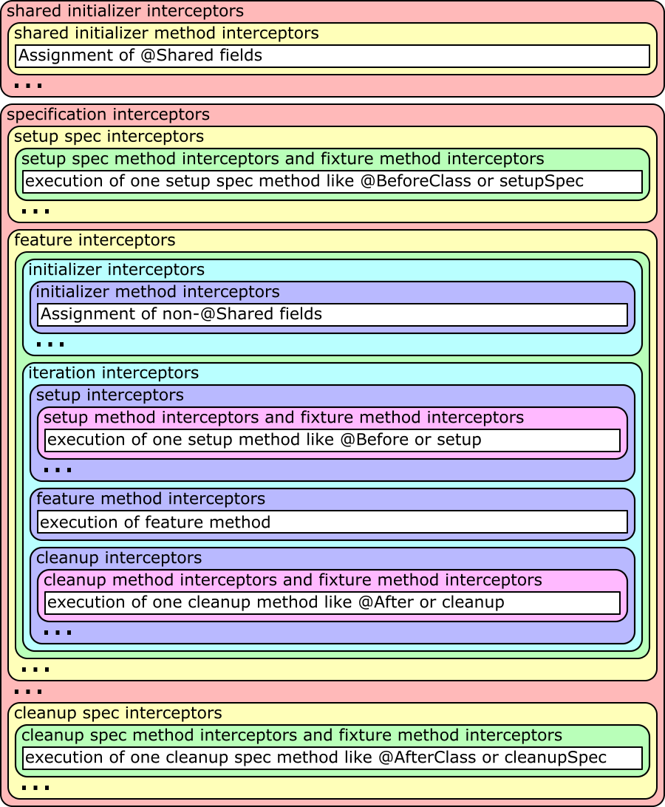


An ellipsis in the figure means that the block before it can be repeated an arbitrary amount of times.


The `… method interceptors` are of course only run if there are actual methods of this type to be executed (the white
boxes) and those can [inject parameters](#parameter-injection) to be given to the method that will be run.


The shared initializer method interceptor and initializer method interceptor are called around two methods that are
generated by the compiler if there are `@Shared`, respectively non-`@Shared`, fields that get values assigned at
declaration time. The compiler will put those initializations in a generated method and call it at the proper place in
the lifecycle. So if there are no such initializations, no method is generated and thus the method interceptor is never
called. The non-method interceptors are always called at the proper place in the lifecycle to do work that has to be
done at that time. There can also be multiple such methods, if you for example have a super specification that itself
has fields with initialization expressions.


To create an interceptor to be attached to an interception point, you need to create a class that implements the
interface `IMethodInterceptor`. This interface has the sole method `intercept(IMethodInvocation invocation)`. The
`invocation` parameter can be used to get and modify the current state of execution. Each interceptor **must** call the
method `invocation.proceed()`, which will go on in the lifecycle, except you really want to prevent further execution of
the nested elements like shown in the figure above. But this should be a very rare use case.


If you write an interceptor that can be used at different interception points and should do different work at different
interception points, there is also the convenience class `AbstractMethodInterceptor`, which you can extend and which
provides various methods for overriding that are called for the various interception points. Most of these methods have
a double meaning, like `interceptSetupMethod` which is called for the `setup interceptor` and the `setup method
interceptor`. If you attach your interceptor to both of them and need a differentiation, you can check for
`invocation.method.reflection`, which will be set in the method interceptor case and `null` otherwise, or you can check
`invocation.method.name` which behaves the same, or you can check for `invocation.target == invocation.instance`.
Alternatively, you can of course build two different interceptors or add a parameter to your interceptor and create
two instances, telling each at addition time whether it is attached to the method interceptor or the other one.


```groovy
class I extends AbstractMethodInterceptor {
  I(def s) {}
}
```


**Add All Interceptors**

```groovy
// DISCLAIMER: The following shows all possible injection points that you could use
//             depending on need and situation. You should normally not need to
//             register a listener to all these places.
//
//             Also, when building an annotation driven local extension, you should
//             consider where you want the effects to be present, for example only
//             for the features in the same class (specInfo.features), or for features
//             in the same and superclasses (specInfo.allFeatures), or also for
//             features in subclasses (specInfo.bottomSpec.allFeatures), and so on.

// on SpecInfo
specInfo.specsBottomToTop*.addSharedInitializerInterceptor new I('shared initializer')
specInfo.allSharedInitializerMethods*.addInterceptor new I('shared initializer method')
specInfo.addInterceptor new I('specification')
specInfo.specsBottomToTop*.addSetupSpecInterceptor new I('setup spec')
specInfo.allSetupSpecMethods*.addInterceptor new I('setup spec method')
specInfo.allFeatures*.addInterceptor new I('feature')
specInfo.specsBottomToTop*.addInitializerInterceptor new I('initializer')
specInfo.allInitializerMethods*.addInterceptor new I('initializer method')
specInfo.allFeatures*.addIterationInterceptor new I('iteration')
specInfo.specsBottomToTop*.addSetupInterceptor new I('setup')
specInfo.allSetupMethods*.addInterceptor new I('setup method')
specInfo.allFeatures*.featureMethod*.addInterceptor new I('feature method')
specInfo.specsBottomToTop*.addCleanupInterceptor new I('cleanup')
specInfo.allCleanupMethods*.addInterceptor new I('cleanup method')
specInfo.specsBottomToTop*.addCleanupSpecInterceptor new I('cleanup spec')
specInfo.allCleanupSpecMethods*.addInterceptor new I('cleanup spec method')
specInfo.allFixtureMethods*.addInterceptor new I('fixture method')

// on FeatureInfo (already included above, handling all features)
featureInfo.addInterceptor new I('feature')
featureInfo.addIterationInterceptor new I('iteration')
featureInfo.featureMethod.addInterceptor new I('feature method')

// since Spock 2.4 there are also feature-scoped interceptors that only apply for a single feature
// they will execute before the spec interceptors
featureInfo.addInitializerInterceptor new I('feature scoped initializer')
featureInfo.addSetupInterceptor new I('feature scoped setup')
featureInfo.addCleanupInterceptor new I('feature scoped cleanup')
// you can also perform a feature-scoped interception of spec methods
featureInfo.parent.allInitializerMethods.each { method ->
  featureInfo.addScopedMethodInterceptor(method, new I('feature scoped initializer method'))
}
featureInfo.parent.allSetupMethods.each { method ->
  featureInfo.addScopedMethodInterceptor(method, new I('feature scoped setup method'))
}
featureInfo.parent.allCleanupMethods.each { method ->
  featureInfo.addScopedMethodInterceptor(method, new I('feature scoped cleanup method'))
}
```


##### Injecting Method Parameters

Starting with Spock 2.4, it is possible to create `IAnnotationDrivenExtension` that target method parameters directly.
The extension annotation must use the `@Target({ElementType.PARAMETER})` and the extension must implement `IAnnotationDrivenExtension.visitParameterAnnotation(T annotation, ParameterInfo parameter)`.
In the `visitParameterAnnotation` you can then register a custom interceptor, or use the convenience `ParameterResolver.Interceptor` to handle the parameter injection.
Parameter injection is supported for fixture methods, such as `setup` and `cleanup`, as well as for feature methods.


**Example `ParameterIndex` extension**

```groovy
@Retention(RetentionPolicy.RUNTIME)
@Target(ElementType.PARAMETER)
@ExtensionAnnotation(ParameterIndexExtension)
@interface ParameterIndex {}

class ParameterIndexExtension implements IAnnotationDrivenExtension<ParameterIndex> {
  @Override
  void visitParameterAnnotation(ParameterIndex annotation, ParameterInfo parameter) {
    Class<?> type = parameter.reflection.type
    if (!(type in [int, Integer])) {
      throw new SpockExecutionException("Parameter must be a int/Integer but was ${type}")
    }
    parameter.parent.addInterceptor(       // <1>
      new ParameterResolver.Interceptor(   // <2>
        parameter,                         // <3>
        { parameter.index }                // <4>
      ))
  }
}
```


1. Add the interceptor to the method, which is the `parent` of the `ParameterInfo`.
2. The built-in `ParameterResolver.Interceptor` will handle the boilerplate part of parameter injection.
3. Pass the `ParameterInfo` to the interceptor, so the interceptor knows which parameter it is handling.
4. This is a `Function<IMethodInvocation, Object>`, which is called by the `ParameterResolver.Interceptor` to resolve the parameter value. Here we just return the value of the `ParameterInfo’s `index` property, but you could also do some more complex logic here.


**Example usage of `ParameterIndex` extension**

```groovy
  def setup(@ParameterIndex int param1) {
    assert param1 == 0
  }

  def "test"(@ParameterIndex int param1, @ParameterIndex Integer param2, @ParameterIndex int param3) {
    expect:
    param1 == 0
    param2 == 1
    param3 == 2
  }
```


###### For Spock versions prior to 2.4 or for advanced use cases

If your interceptor should support custom method parameters for wrapped methods, this can be done by modifying
`invocation.arguments`. Two use cases for this would be a mocking framework that can inject method parameters that are
annotated with a special annotation, or some test helper that injects objects of a specific type that are created and
prepared for usage automatically.


When called from at least Spock 2.0, the `arguments` array will always have the size of the method parameter count,
so you can directly set the arguments you want to set. You cannot change the size of the `arguments` array either.
All parameters that did not yet get any value injected, either from data variables or some extension, will have the
value `MethodInfo.MISSING_ARGUMENT` and if any of those remain, after all interceptors were run, an exception will be
thrown.


> [!NOTE]
> When your extension might be used with a version before Spock 2.0, the `arguments` array may be an empty array
> or an array of arbitrary length, depending on what interceptors were run before that maybe also have manipulated
> this array for parameter injection. If you for example investigated the method parameters with
> `invocation.method.reflection.parameters` and found that you want to inject the fifth parameter,
> you should first check whether the `arguments` array is at least five elements long. If not, you should assign it a new
> array that is at least five elements long and copy the contents of the old array into the new one. Then you can assign
> your objects to be injected.
> 
> 
> **Inject Method Parameters**
> 
> ```groovy
> // create a map of all MyInjectable parameters with their parameter index
> Map<Parameter, Integer> parameters = [:]
> invocation.method.reflection.parameters.eachWithIndex { parameter, i ->
>   parameters << [(parameter): i]
> }
> parameters = parameters.findAll { MyInjectable.equals it.key.type }
> 
> // enlarge arguments array if necessary
> def lastMyInjectableParameterIndex = parameters*.value.max()
> lastMyInjectableParameterIndex = lastMyInjectableParameterIndex == null ?
>                                  0 :
>                                  lastMyInjectableParameterIndex + 1
> if(invocation.arguments.length < lastMyInjectableParameterIndex) {
>   def newArguments = new Object[lastMyInjectableParameterIndex]
>   System.arraycopy invocation.arguments, 0, newArguments, 0, invocation.arguments.length
>   invocation.arguments = newArguments
> }
> 
> parameters.each { parameter, i ->
>   invocation.arguments[i] = new MyInjectable(parameter)
> }
> ```
> 
> 


> [!NOTE]
> **Pre Spock 2.0 only:** When using data driven features (methods with a `where:` block), the user of your extension has to follow some
> restrictions, if parameters should be injected by your extension:
> 
> 
> - all data variables and all to-be-injected parameters have to be defined as method parameters
> - all method parameters have to be assigned a value in the `where:` block, for example `null`
> - the order of the method parameters has to be identical to the order of the data variables in the `where:` block
> 
> 
> Of course, you can also make your extension only inject a value if none is set already, as the `where:` block
> assignments happen before the method interceptor is called
> 
> 
> for this simply check whether `invocation.arguments[i]` is `null` or not
> 
> 
> **Data Driven Feature with Injected Parameter pre Spock 2.0**
> 
> ```groovy
> def 'test parameter injection'(a, b, MyInjectable myInjectable) {
>   expect: myInjectable
> 
>   where:
>   a    | b
>   'a1' | 'b1'
>   'a2' | 'b2'
> 
>   and:
>   myInjectable = null
> }
> ```
> 
> 
> **Data Driven Feature with Injected Parameter post Spock 2.0**
> 
> ```groovy
> def 'test parameter injection'(MyInjectable myInjectable) {
>   expect: myInjectable
> 
>   where:
>   a    | b
>   'a1' | 'b1'
>   'a2' | 'b2'
> }
> ```
> 
> 


#### Mock Maker Extensions

Spock creates mock objects via the `IMockMaker` interface.
When Spock is creating a mock, it will ask the available mock makers in order of priority,
if it can mock the requested type. Spock will use the first mock maker which is capable to mock the requested type.


The following mock makers are built-in, and are selected in this order:


- `java-proxy`: Uses the `java.lang.reflect.Proxy` API to create mocks of interfaces.
- `byte-buddy`: Uses [Byte Buddy](https://bytebuddy.net/) to create mock objects.
  - Requires `net.bytebuddy:byte-buddy` 1.9.7+ on the class path.
- `cglib`: Deprecated: Uses [CGLIB](https://github.com/cglib/cglib) to create mock objects.
  - Requires `cglib:cglib-nodep` 3.2.0+ on the class path.
- `mockito`: Uses [Mockito](https://site.mockito.org/) to create mock objects.
  - Can be configured to use additional Mockito feature like mock `Serializable`
  - Requires `org.mockito:mockito-core` 4.11+ on the class path.


**Capabilities of the different built-in mock makers**

| Capability | `java-proxy` | `byte-buddy` | `cglib` | `mockito` |
| --- | --- | --- | --- | --- |
| Interface | ✔ | ✔ | ✔ | ✔ |
| Class | ✘ | ✔ | ✔ | ✔ |
| Additional Interfaces | ✔ | ✔ | ✔ | ✔ |
| Explicit Constructor Arguments | ✘ | ✔ | ✔ | ✔ |
| Final Class | ✘ | ✘ | ✘ | ✔ |
| Final Method | ✘ | ✘ | ✘ | ✔ |
| Static Method | ✘ | ✘ | ✘ | ✔ |


The class `spock.mock.MockMakers` provides constants and methods for the built-in mock makers.


You can select your preferred mock maker, by defining the `preferredMockMaker` property
in the [Spock Configuration File](#spock-configuration-file).
The preferred mock maker will be used globally, if no mock maker is explicitly specified for a given mock.


**Mock Maker settings in the Spock Configuration file**

```groovy
mockMaker {
  preferredMockMaker spock.mock.MockMakers.byteBuddy
}
```


##### Mockito Mock Maker

The `mockito` Mock Maker provides the ability to mock final types, enums and final methods.
The mocking of final classes is automatically enabled, if `org.mockito:mockito-core` 4.11+ is on the class path.


For mocking of final methods, you need to select the `mockito` mock maker during mock construction,
like:


```groovy
Subscriber subscriber = Mock(mockMaker: MockMakers.mockito)
```


If you want to make final methods mockable by default, you can select this mock maker as the preferred mock maker.
It can’t mock native methods, see [the Mockito documentation](https://javadoc.io/doc/org.mockito/mockito-core/5.6.0/org/mockito/Mockito.html#Mocking_Final) for details.


> [!CAUTION]
> If you try to mock a final method without a Mock Maker supporting it,
>          it will silently fail, without honoring your specified interactions.


You can configure the created mock objects using the interface `org.mockito.MockSettings` during the construction to use features provided by Mockito:


```groovy
Subscriber subscriber = Mock(mockMaker: MockMakers.mockito {
  serializable()
})
```


The `mockito` mock maker uses `org.mockito.MockMakers.INLINE` under the hood,
please see the Mockito manual "Mocking final types, enums and final methods" for all pros and cons,
when using `org.mockito.MockMakers.INLINE`.
It also supports mocking of static methods of classes and interfaces with `SpyStatic`.
See [static mocks](#static-mocks) section for more details.


##### Custom Mock Maker

Spock provides an extension point to plug in your own mock maker for creating mock objects.
To create a mock maker you need to create a class that implements the interface `IMockMaker` and put its
fully-qualified class name in a file `META-INF/services/org.spockframework.mock.runtime.IMockMaker` in the
class path. As soon as these two conditions are satisfied, your mock maker is automatically loaded and used when Spock is
running.


You should provide a constant class containing the mock maker ID or a method for creating `IMockMakerSettings` to your users,
that your mock maker can be easily selected.


The `IMockMakerSettings` can be used by a custom `IMockMaker` to provide mock maker specific API settings in a type-safe way.
The custom mock maker may subclass `IMockMakerSettings` to transport custom data from the declaration site to the mock
creation. The custom mock maker then provides a static method to create an instance of that subclass and the parameters
are then used during mock creation.


**Custom Mock Maker Example**

```java
public final class FancyMockMaker implements IMockMaker {
  static final MockMakerId ID = new MockMakerId("fancy");

  private static final Set<MockMakerCapability> CAPABILITIES = EnumSet.of(
    MockMakerCapability.CLASS,
    MockMakerCapability.EXPLICIT_CONSTRUCTOR_ARGUMENTS);

  public FancyMockMaker() {
  }

  @Override
  public MockMakerId getId() {
    return ID;
  }

  @Override
  public Set<MockMakerCapability> getCapabilities() {
    return CAPABILITIES;
  }

  @Override
  public int getPriority() {
    return 5000;
  }

  @Override
  public Object makeMock(IMockCreationSettings settings) {
    FancyMockMakerSettings fancySettings = settings.getMockMakerSettings();
    return makeMockInternal(fancySettings);
  }

  @Override
  public IMockabilityResult getMockability(IMockCreationSettings settings) {
    FancyMockMakerSettings fancySettings = settings.getMockMakerSettings();
    if (fancySettings != null &&
      fancySettings.isSerialization() &&
      !fancySettings.getFancyTypes().isEmpty()) {
      return () -> "Mock with serialization and fancy types is not supported.";
    }
    return IMockabilityResult.MOCKABLE;
  }

  Object makeMockInternal(FancyMockMakerSettings settings) {
    //Implementation omitted ...
    return null;
  }
}

final class FancyMockMakerSettings implements IMockMakerSettings {
  private boolean serialization;
  private final List<Type> specialTypes = new ArrayList<>();

  FancyMockMakerSettings() {
  }

  boolean isSerialization() {
    return serialization;
  }

  List<Type> getFancyTypes() {
    return specialTypes;
  }

  @Override
  public MockMakerId getMockMakerId() {
    return FancyMockMaker.ID;
  }

  public void withSerialization() {
    serialization = true;
  }

  public void fancyTypes(Type... types) {
    this.specialTypes.addAll(Arrays.asList(types));
  }
}

final class FancyMockMakers {
  /**
   * Public static entry point for the User.
   */
  public static IMockMakerSettings fancyMock(
    @DelegatesTo(FancyMockMakerSettings.class)
    Closure<?> code) {
    FancyMockMakerSettings settings = new FancyMockMakerSettings();
    code.setDelegate(settings);
    code.call();
    return settings;
  }
}
```


**Custom Mock Maker Usage Example**

```groovy
when:
Mock(ArrayList, mockMaker: FancyMockMakers.fancyMock {
  fancyTypes(List.class, String.class)
  withSerialization()
})
then:
CannotCreateMockException ex = thrown()
ex.message == "Cannot create mock for class java.util.ArrayList. fancy: Mock with serialization and fancy types is not supported."
```


#### Keeping State in Extensions

Prior to Spock 2.4, extensions could only store state either in their own instances or their interceptor instances.
Often, the state can be kept locally in the `intercept(IMethodInvocation)` method around the `IMethodInvocation.proceed()` call. However, there are cases where this is not possible, for example when using initializer interceptors.


Spock 2.4 adds a new `org.spockframework.runtime.extension.IStore` interface that allows extensions to store and retrieve data during the execution of a specification.


The store is available from the `org.spockframework.runtime.extension.IMethodInvocation` interface via the `getStore(IStore.Namespace namespace)` method. Currently, it is not possible to access the store directly from an extension, only via registering an [interceptor](#interceptors).


The stores are hierarchical and follow roughly the same hierarchy as shown in the [spock-interceptors](#spock-interceptors) figure. The hierarchy is as follows:


```
Root
┗ Specification
  ┗ Feature
    ┗ Iteration
```


**Store hierarchy**

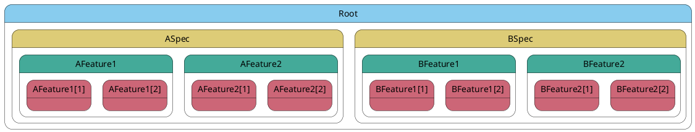


If an item is not found in the current store, its parent store is searched, and so on until the root store is reached. For more information see the JavaDoc of `org.spockframework.runtime.extension.IStore`.


If an interceptor adds a `Macguffin` to the store via a `sharedInitializerInterceptor`  for `ASpec` it will be available to all features (`AFeature1` and `AFeature2`) and iterations (`AFeature1[1]`, `AFeature1[2]`, `AFeature2[1]`, `AFeature2[2]`) of that specification, but not to `BSpec` or its features. Conversely, if a feature interceptor adds a `Thingmajig` to the store for `AFeature1` it will be available to all its iterations (`AFeature1[1]`, `AFeature1[2]`), but not to sibling features (`AFeature2`) or to the specification (`ASpec`).


> [!NOTE]
> When the store is closed, it will call the `close()` method for all stored values that implement `java.lang.AutoCloseable`.
>       Stored values will be closed in reverse insertion order.
>       This does not happen, if the value was added and subsequently removed from the store, before the store was closed.


##### Example of a global extension using the Store

**Global Extension implementation**

```groovy
class ExceptionCounterGlobalExtension implements IGlobalExtension {
  private static final Namespace EXAMPLE_NS =                             // <1>
    Namespace.create(ExceptionCounterGlobalExtension)
  private static final String ACCUMULATOR = "accumulator"
  private static final IMethodInterceptor INTERCEPTOR =  {
    try {
      it.proceed()
    } catch (Exception e) {
      it.getStore(EXAMPLE_NS)                                             // <6>
        .get(ACCUMULATOR, ConcurrentHashMap)                              // <7>
        .computeIfAbsent(e.class.name, { __ -> new AtomicInteger() })     // <8>
        .incrementAndGet()
      throw e
    }
  }

  @Override
  void visitSpec(SpecInfo spec) {
    spec.allFeatures.featureMethod*.addInterceptor(INTERCEPTOR)           // <2>
  }

  @Override
  void executionStart(ISpockExecution spockExecution) {                   // <3>
    spockExecution.getStore(EXAMPLE_NS)                                   // <4>
      .put(ACCUMULATOR, new ConcurrentHashMap())                          // <5>
  }

  @Override
  void executionStop(ISpockExecution spockExecution) {                    // <9>
    def results = spockExecution.getStore(EXAMPLE_NS)
      .get(ACCUMULATOR, ConcurrentHashMap)

    if (!results.isEmpty()) {
      println "========================"
      println "==Exception statistics=="
      println "========================"
      results.toSorted().each { exceptionName, counter ->
        println "${counter}x $exceptionName"
      }
      println "========================"
    }
  }
}
```


1. The `Namespace` for the extension is created, here we use the extension’s class as key
2. The extension registers the `INTERCEPTOR` for each feature method
3. `executionStart` is called right before the specifications are executed, it also gives access to the root-level `IStore`
4. The extensions uses its `Namespace` to retrieve the `IStore`
5. It then puts a `ConcurrentHashMap` into the store to serve as collector for the data
6. During the feature method execution the `INTERCEPTOR` retrieves the `IStore` via the shared `Namespace`
7. It then retrieves the `ConcurrentHashMap` via the key, retrieval request will propagate through the hierarchy until it finds the value at the root-level
8. It then increments the counter for the occurred exception type, creating the counter if it was not yet present.
9. `executionStop` is called after all tests have been executed and also give access to the root-level `IStore`.
The extension uses this to print a report of the collected exception statistics.


**Example Specs**

```groovy
class ASpec extends Specification {
  def "a failing test"() {
    expect: false
  }

  def "a test failing with an exception"() {
    given:
    if(1==1) throw new IllegalStateException()

    expect: true
  }
}

class BSpec extends Specification {

  def "illegal parameter for List"() {
    given:
    def value = new ArrayList<>(-1)

    expect:
    value.empty
  }

  def "illegal parameter for Map"() {
    given:
    def value = new HashMap(-1)

    expect:
    value.empty
  }
}
```


The extension generates the following output for the example code above.


**Output**

```
========================
==Exception statistics==
========================
1x java.lang.IllegalStateException
2x java.lang.IllegalArgumentException
========================
```


#### Default Value Provider Extensions

Stubs use the `EmptyOrDummyResponse` to return a default value for a method call.
If the `EmptyOrDummyResponse` doesn’t have specific instructions for a type it will return a new `Stub` for that type.
This works for most cases, but can lead to unexpected behavior if the type does have a behavioral contract that is not fulfilled by the `Stub`.
Another problematic case is when the type is `final` or `sealed` as those are not mockable by default.


To address these issues, Spock 2.4 introduces the `org.spockframework.runtime.extension.IDefaultValueProviderExtension` that is loaded via Java’s `ServiceLoader` mechanism.
This extension allows you to provide a default value if the `EmptyOrDummyResponse` doesn’t have specific instructions for a type.


**Example Implementation**

```groovy
public class MaybeDefaultValueProvider implements IDefaultValueProviderExtension {
  @Override
  public @Nullable Object provideDefaultValue(Class<?> type, Type exactType) {
    if (type == IMaybe.class) {
      return IMaybe.none();
    }
    return null;
  }
}
```


It is primarily for framework developers who want to provide a default value for their framework types.
Or users of a framework that doesn’t provide default values for their special types.


If you want to change the default response behavior for `Stub` have a look at [A la Carte Mocks](#ALaCarteMocks) and how to use your own `org.spockframework.mock.IDefaultResponse`.


#### Listeners

Extensions can register listeners to receive notifications about the progress of the test run.
These listeners are intended to be used for reporting, logging, or other monitoring purposes.
They are not intended to modify the test run in any way.
You can register the same listener instance on multiple specifications or features.
Please consult the JavaDoc of the respective listener interfaces for more information.


##### `IRunListener`

The `org.spockframework.runtime.IRunListener` can be registered via `SpecInfo.addListener(IRunListener)` and will receive notifications about the progress of the test run of a single specification.


##### `IBlockListener`

The `org.spockframework.runtime.extension.IBlockListener` can be registered on a feature via, `FeatureInfo.addBlockListener(IBlockListener)` and will receive notifications about the progress of the feature.


It will be called once when entering a block (`blockEntered`) and once when exiting a block (`blockExited`).
Both methods receive the `BlockInfo` of the block that is entered or exited.
They also receive the current `Specification` instance which gives access to the `ISpecificationContext` to get the current `IterationInfo` or retrieve an `IStore`.
While this gives extensive access to the current state of the test run, it should be used responsibly as it can lead to surprising results if abused.


When an exception is thrown in a block, the `blockExited` will not be called for that block.
The failed block will be part of the `ErrorContext` in `ErrorInfo` that is passed to `IRunListener.error(ErrorInfo)`.
If a `cleanup` block is present the cleanup block listener methods will still be called.


## Utilities

### Testing Time with `MutableClock`

When working with dates or time we often have the problem of writing stable tests.
Java only provides a `FixedClock` for testing.
However, often time related code has to deal with the change of time,
so a fixed clock is not enough or makes the test harder to follow.


The prerequisite for using both `FixedClock` and Spocks `MutableClock` is that the production code,
actually uses a configurable `Clock` and not just the parameterless `Instant.now()`
or the corresponding methods in the other `java.time.*` classes.


#### Example

**Class under Test**

```groovy
public class AgeFilter implements Predicate<LocalDate> {
  private final Clock clock;
  private final int age;

  public AgeFilter(Clock clock, int age) {                                       // <1>
    this.clock = clock;
    this.age = age;
  }

  @Override
  public boolean test(LocalDate date) {
    return Period.between(date, LocalDate.now(clock)).getYears() >= age;         // <2>
  }
}
```


1. `Clock` is injected via constructor
2. `Clock` is used to get the current date


**Test**

```groovy
def "AgeFilter reacts to time"() {
  given:
  ZonedDateTime defaultTime = ZonedDateTime.of(2018, 6, 5, 0, 0, 0, 0, ZoneId.of('UTC'))
  MutableClock clock = new MutableClock(defaultTime)                                       // <1>
  AgeFilter ageFilter = new AgeFilter(clock,18)                                            // <2>

  LocalDate birthday = defaultTime.minusYears(18).plusDays(1).toLocalDate()

  expect:
  !ageFilter.test(birthday)                                                                // <3>

  when:
  clock + Duration.ofDays(1)                                                               // <4>

  then:
  ageFilter.test(birthday)                                                                 // <5>
}
```


1. `MutableClock` created with a well known time
2. `Clock` is injected via constructor
3. `age` is less than `18` so the result is `false`
4. the clock is advanced by one day
5. `age` is equal to `18` so the result is `true`


There are many more ways to modify `MutableClock` just have a look at the JavaDocs, or the test code `spock.util.time.MutableClockSpec`.


### Collection Conditions

Sometimes, you want to assert the elements of a collection regardless of their order.
The Groovy way to do this is to cast both to `Set`, i.e. `x as Set == [1, 2, 3] as Set`.
While this works, it is very noisy.


Since Spock 2.1 you can use two new conditions:


- `x =~ [1, 2, 3]` is a lenient match, i.e., checking that x contains at least one instance of every item in the list (same semantics as casting both to `Set` before comparing).
- `x ==~ [1, 2, 3, 3]` is a strict match, i.e., checking that x contains exactly the items in the list regardless of their order (using Hamcrest’s `containsInAnyOrder` under the hood).


> [!NOTE]
> This is a Spock feature, not a Groovy feature. So it only works where Spock treats an expression as a [condition](#implicit-and-explicit-conditions).


#### Lenient Match

```groovy
def x = [2, 2, 1, 3, 3]
assert x =~ [4, 1, 2]
```


```
x =~ [4, 1, 2]
| |
| false
| 2 differences (66% similarity, 1 missing, 1 extra)
| missing: [4]
| extra: [3]
[2, 1, 3]
```


#### Strict Match

```groovy
def x = [2, 2, 1, 3, 3]
assert x ==~ [4, 1, 2]
```


```
x ==~ [4, 1, 2]
| |
| false
[2, 2, 1, 3, 3]

Expected: iterable with items [<4>, <1>, <2>] in any order
     but: not matched: <2>
```


> [!NOTE]
> Both operands must either be `Iterable` or an array for this to work.
> Otherwise, it will be treated like the standard groovy [find operator](https://groovy-lang.org/operators.html#_find_operator) or [match operators](https://groovy-lang.org/operators.html#_match_operator).


### Interact with the file system using `FileSystemFixture`

In integration tests you often have to prepare the file system for a test.
For trivial cases like creating a single temp directory, you can use the [@TempDir](#temp-dir) extension directly.
However, for more complex cases like creating a directory tree `FileSystemFixture` offers convenience and better readability.


#### Examples

**Creating a directory tree**

```groovy
@TempDir
FileSystemFixture fsFixture

def "FileSystemFixture can create a directory structure"() {
  when:
  fsFixture.create {
    dir('src') {
      dir('main') {
        dir('groovy') {
          file('HelloWorld.java') << 'println "Hello World"'
        }
      }
      dir('test/resources') {
        file('META-INF/MANIFEST.MF') << 'bogus entry'
        copyFromClasspath('/org/spockframework/smoke/extension/SampleFile.txt')
      }
    }
  }

  then:
  Files.isDirectory(fsFixture.resolve('src/main/groovy'))
  Files.isDirectory(fsFixture.resolve('src/test/resources/META-INF'))
  fsFixture.resolve('src/main/groovy/HelloWorld.java').text == 'println "Hello World"'
  fsFixture.resolve('src/test/resources/META-INF/MANIFEST.MF').text == 'bogus entry'
  fsFixture.resolve('src/test/resources/SampleFile.txt').text == 'HelloWorld\n'
}
```


> [!TIP]
> To get the nice Groovy methods for `Path`, you need to add a dependency on `groovy-nio`.


### Capture Values for Assertions with `old()`

It can be helpful to know the old value of an expression before the `when:` was executed.
This allows you to compare the changes made by a `when:` block.


You can capture the old value of an expression with `old(<expr>)` in a `then:` block,
which will return the value of the `<expr>` before the previous `when:` block is executed.


The usage of the `old()` method makes a test less fragile, because you can assert the difference,
which was made by the `when:` block.


#### Example

**Using `old()` to capture the old value of `x`**

```groovy
def "Usage of the old() method"() {
  given:
  def x = 0

  when:
  x++

  then:
  x == old(x) + 1
}
```


## Parallel Execution

> [!WARNING]
> This is an experimental feature for Spock, which is based on the experimental implementation of parallel execution in the JUnit Platform.


Parallel execution has the potential to reduce the overall test execution time.
The actual achievable reduction will heavily depend on the respective codebase and can vary wildly.


By default, Spock runs tests sequentially with a single thread.
As of version 2.0, Spock supports parallel execution based on the JUnit Platform.
To enable parallel execution set the `runner.parallel.enabled` configuration to `true`.
See [Spock Configuration File](#spock-configuration-file) for general information about this file.


**SpockConfig.groovy**

```groovy
runner {
  parallel {
    enabled true
  }
}
```


> [!NOTE]
> JUnit Jupiter also supports [parallel execution](https://junit.org/junit5/docs/5.7.0/user-guide/#writing-tests-parallel-execution), both rely on the JUnit Platform implementation, but function independently of each other.
>       If you enable parallel execution in Spock it won’t affect Jupiter and vice versa.
>       The JUnit Platform executes the test engines (Spock, Jupiter) sequentially, so there should not be any interference between engines.


### Execution modes

Spock supports two execution modes `SAME_THREAD` and `CONCURRENT`.
You can define the execution mode explicitly for a specification or feature via the `@Execution` annotation.
Otherwise, Spock will use the value of `defaultSpecificationExecutionMode` and `defaultExecutionMode` respectively, both have `CONCURRENT` as default value.
Certain [extensions](#extensions) also set execution modes when they are applied.


- `defaultSpecificationExecutionMode` controls what execution mode a specification will use by default.
- `defaultExecutionMode` controls what execution mode a feature and its iterations (if data driven) will use by default.


**Sequential Execution, either `runner.parallel.enabled=false` or `SAME_THREAD` Specifications, `SAME_THREAD` Features**

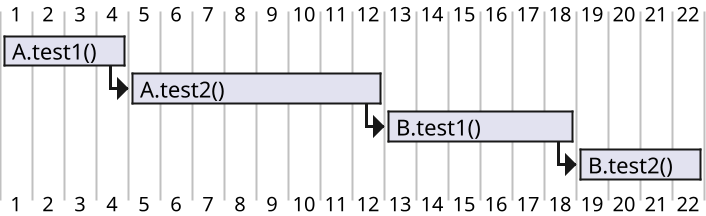


**`CONCURRENT` Specifications, `CONCURRENT` Features**

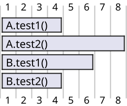


**`CONCURRENT` Specifications, `SAME_THREAD` Features**

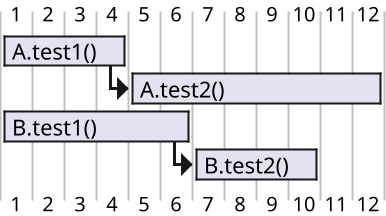


**`SAME_THREAD` Specifications, `CONCURRENT` Features**

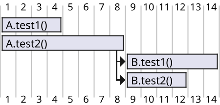


#### Execution Hierarchy

**Legend for the following figures**

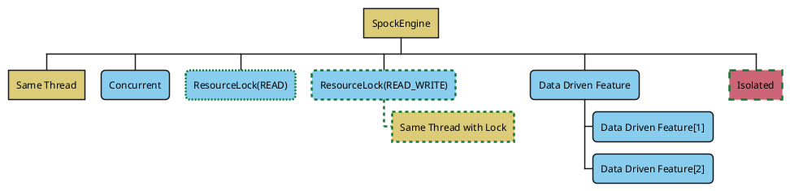


- The node `Same Thread` will run in the same thread as its parent.
- The node `Concurrent` will be executed in another thread, all concurrent nodes can execute in different threads from each other.
- The node `ResourceLock(READ)` will be executed in another thread, but will also acquire a `READ`-lock for a resource.
- The node `ResourceLock(READ_WRITE)` will be executed in another thread, but will also acquire a `READ_WRITE`-lock for a resource.
- The node `Same Thread with Lock` will run in the same thread as its parent thus inheriting the lock.
- The node `Data Driven Feature` represents a data driven feature with `Data Driven Feature[1]` and `Data Driven Feature[2]` being the iterations.
- The node `Isolated` will run exclusively, no other specifications or features will run at the same time.


**Single threaded execution**

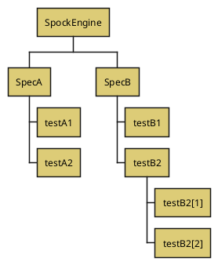


[figure-execution-hierarchy-same-thread](#figure-execution-hierarchy-same-thread) shows the default case when parallel execution is disabled (`runner.parallel.enabled=false`) or when both specifications (`defaultSpecificationExecutionMode`) and features (`defaultExecutionMode`) are set to `SAME_THREAD`.


**Execution with `CONCURRENT` Specifications, `SAME_THREAD`**

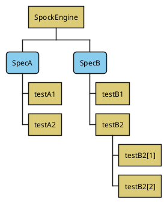


[figure-execution-hierarchy-concurrent-sequential-execution](#figure-execution-hierarchy-concurrent-sequential-execution) shows the result of setting `defaultSpecificationExecutionMode=CONCURRENT` and `defaultExecutionMode=SAME_THREAD`, the specifications will run concurrently but all features will run in the same thread as their specification.


**Execution with `SAME_THREAD` Specifications, `CONCURRENT` Features**

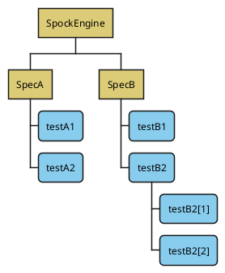


[figure-execution-hierarchy-sequential-concurrent-execution](#figure-execution-hierarchy-sequential-concurrent-execution) shows the result of setting `defaultSpecificationExecutionMode=SAME_THREAD` and `defaultExecutionMode=CONCURRENT`, the specifications will run in the same thread, causing them to run one after the other.
The features inside a specification will run concurrently.


**Execution with `CONCURRENT` Specifications, `CONCURRENT` Features**

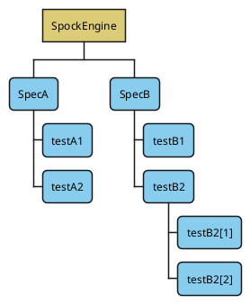


[figure-execution-hierarchy-concurrent-concurrent-execution](#figure-execution-hierarchy-concurrent-concurrent-execution) shows the result of setting `defaultSpecificationExecutionMode=CONCURRENT` and `defaultExecutionMode=CONCURRENT`, both specifications and features will run concurrently.


##### Execution Mode Inheritance

If nothing else is explicit configured, specifications will use `defaultSpecificationExecutionMode` and features use `defaultExecutionMode`.
However, this changes when you set the execution mode explicitly via `@Execution`.
Each node (specification, feature) checks first if it has an explicit execution mode set,
otherwise it will check its parents for an explicit setting and fall back to the respective defaults otherwise.


The following examples have `defaultSpecificationExecutionMode=SAME_THREAD` and `defaultExecutionMode=SAME_THREAD`.
If you invert the values `SAME_THREAD` and `CONCURRENT` in these examples you will get the inverse result.


**Execution with `SAME_THREAD` Specifications, `SAME_THREAD` Features and explicit `@Execution` on Features**

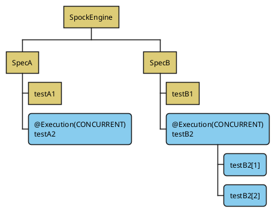


In [figure-execution-hierarchy-inheritance-feature-execution](#figure-execution-hierarchy-inheritance-feature-execution) `@Execution` is applied on the features and those features and iterations will execute concurrently while the rest will execute in the same thread.


**Execution with `SAME_THREAD` Specifications, `SAME_THREAD` Features and explicit `@Execution` on a Specification**

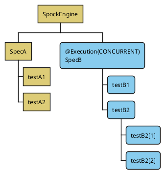


In [figure-execution-hierarchy-inheritance-spec-execution](#figure-execution-hierarchy-inheritance-spec-execution) `@Execution` is applied on one specification causing the specification and all its features to run concurrently.
The features execute concurrently since they inherit the explicit execution mode from the specification.


**Execution with `SAME_THREAD` Specifications, `SAME_THREAD` Features and explicit `@Execution` on Features and Specifications**

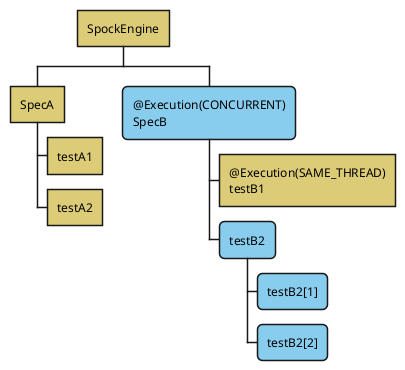


[figure-execution-hierarchy-inheritance-spec-feature-execution](#figure-execution-hierarchy-inheritance-spec-feature-execution) showcases the combined application of `@Execution` on a specification and some of its features.
As in the previous example the specification and its features will execute concurrently except `testB1` since it has its own explicit execution mode set.


### Resource Locks

With parallel execution comes a new set of challenges for testing, as shared state can be modified and consumed by multiple tests at the same time.


A simple example would be two features that test the use a system property, both setting it to a specific value in the respective `given` block and then executing the code to test the expected behavior.
If they run sequentially then both complete without issue. However, if the run at the same time both `given` blocks will run before the `when` blocks and one feature will fail since the system property did not contain the expected value.


The above example could simply be fixed if both features are part of the same specification by setting them to run in the same thread with `@Execution(SAME_THREAD)`.
However, this is not really practicable when the features are in separate specifications.
To solve this issue Spock has support to coordinate access to shared resources via `@ResourceLock`.


With `@ResourceLock` you can define both a `key` and a `mode`. By default, `@ResourceLock` assumes `ResourceAccessMode.READ_WRITE`, but you can weaken it to `ResourceAccessMode.READ`.


- `ResourceAccessMode.READ_WRITE` will enforce exclusive access to the resource.
- `ResourceAccessMode.READ` will prevent any `READ_WRITE` locks, but will allow other `READ` locks.


`READ`-only locks will isolate tests from others that modify the shared resource, while at the same time allowing tests that also only read the resource to execute.
You should not modify the shared resource when you only hold a `READ` lock, otherwise the assurances don’t hold.


Certain [extensions](#extensions) also set implicit locks when they are applied.


**Two features with `@ResourceLock`**

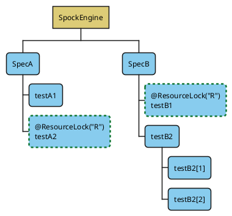


#### Lock inheritance

If a parent node has a `READ_WRITE` lock, it forces its children to run in the same thread.
As `READ_WRITE` locks cause serialized execution anyway, this is effectively not different from what would happen if the lock would be applied to every child directly.
However, if the parent node has only `READ` locks, then it allows parallel execution of its children.


**Locks on data driven features**

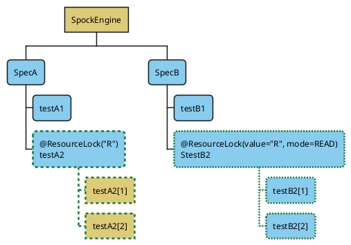


**Locks on spec inherited by features**

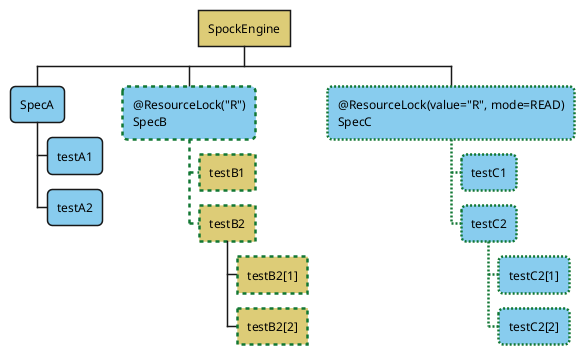


#### Lock coarsening

To avoid deadlocks, Spock pulls up locks to the specification, when locks are defined on both the specification and features.
The Specification will then contain all defined locks.
If the features both had `READ_WRITE` and `READ` locks for the same resource, then the `READ` will be merged into the `READ_WRITE`.


**Lock coarsening - before**

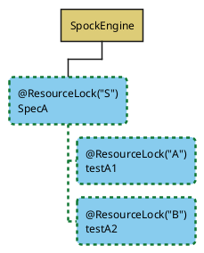


**Lock coarsening - after**

```plantuml
@startwbs
<style>
wbsDiagram {
  node {
    BackgroundColor #88CCEE
    RoundCorner 10
    :depth(0) {
      BackgroundColor #DDCC77
      RoundCorner 0
    }
  }

  .samethread * {
      BackgroundColor #DDCC77
      RoundCorner 0
  }

  .write_lock * {
      LineStyle 4
      LineThickness 2.5
      LineColor #117733
  }
}
</style>
skinparam shadowing false
* SpockEngine
** @ResourceLock("A")\n@ResourceLock("B")\n@ResourceLock("S")\nSpecA <<write_lock>>
*** testA1 <<samethread>>
*** testA2 <<samethread>>
@endwbs
```


#### Isolated Execution

Sometimes, you want to modify and test something that affects every other feature, you could put a `READ` `@ResourceLock` on *every* feature, but that is impractical.
The `@Isolated` extension enforces, that only this feature runs without any other features running at the same time.
You can think of this as an implicit global lock.


As with other locks, the features in an `@Isolated` specification will run in `SAME_THREAD` mode.
`@Isolated` can only be applied at the specification level so if you have a large specification and only need it for a few features,
you might want to consider splitting the spec into `@Isolated` and non isolated.


**`@Isolated` execution**

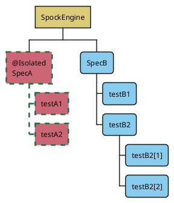


### Parallel Thread Pool

With parallel execution enabled, specifications and features can execute concurrently.
You can control the size of the thread pool that executes the features.
Spock uses `Runtime.getRuntime().availableProcessors()` to determine the available processors.


- `dynamic(BigDecimal factor)` - Computes the desired parallelism based on the number of available processors multiplied by the `factor` and rounded down to the nearest integer.
For example a factor of `0.5` will use half your processors.
- `dynamicWithReservedProcessors(BigDecimal factor, int reservedProcessors)` - Same as `dynamic` but ensures that the given amount of `reservedProcessors` is not used.
The `reservedProcessors` are counted against the available cores not the result of the factor.
- `fixed(int parallelism)` - Uses the given amount of threads.
- `custom(int parallelism, int minimumRunnable, int maxPoolSize, int corePoolSize, int keepAliveSeconds)` - Allows complete control over the threadpool.
However, it should only be used when the other options are insufficient, and you need that extra bit of control.
Check the Javadoc of `spock.config.ParallelConfiguration` for a detailed description the parameters.


By default, Spock uses `dynamicWithReservedProcessors(1.0, 2)` that is all your logical processors minus `2`.


If the calculated parallelism is less than `2`, then Spock will execute single threaded, basically the same as `runner.parallel.enabled=false`.


**Example SpockConfig.groovy with `fixed` setting**

```groovy
runner {
  parallel {
    enabled true
    fixed(4)
  }
}
```


## Modules

### JUnit 4 Module

Integration with JUnit 4 features for Spock 2+ (which internally uses JUnit Platform - part of JUnit 5). Please add dependency [`org.spockframework:spock-junit4`](https://search.maven.org/artifact/org.spockframework/spock-junit4) to your project.


The module is required for:


- running JUnit 4 rules and class ruless (`@Rule`/`@ClassRule`)
- using JUnit 4’s test fixture annotations (`@BeforeClass`, `@Before`, `@After`, `@AfterClass`)


> [!NOTE]
> This module does its best to support old features from JUnit 4, however, users are encouraged to migrate to the native Spock counterparts.


### Guice Module

Integration with the [Guice](https://github.com/google/guice) IoC container. Please add dependency [`org.spockframework:spock-guice`](https://search.maven.org/artifact/org.spockframework/spock-guice) to your project. For examples see the specs in the
[codebase](https://github.com/spockframework/spock/tree/master/spock-guice/src/test/groovy/org/spockframework/guice).


With Spock 1.2+ detached mocks are automatically attached to the `Specification` if they are injected via `@Inject`.


### Spring Module

The Spring module enables integration with [Spring TestContext Framework](https://docs.spring.io/spring/docs/4.1.5.RELEASE/spring-framework-reference/html/testing.html#testcontext-framework).
It supports the following spring annotations `@ContextConfiguration` and `@ContextHierarchy`. Furthermore, it supports the meta-annotation `@BootstrapWith` and so any annotation that is annotated with `@BootstrapWith` will also work, such as `@SpringBootTest`, `@WebMvcTest`. Please add dependency [`org.spockframework:spock-spring`](https://search.maven.org/artifact/org.spockframework/spock-spring) to your project.


#### Mocks

Spock 1.1 introduced the `DetachedMockFactory` and the `SpockMockFactoryBean` which allow the creation of Spock mocks outside of a specification.


> [!NOTE]
> Although the mocks can be created outside of a specification, they only work properly inside the scope of a specification.
>       All interactions with them until they are attached to one, are handled by the default behavior and not recorded.
>      
> 
>       Furthermore, mocks can only be attached to one `Specification` instance at a time so keep that in mind when using multi-threaded executions


##### Java Config

```groovy
class DetachedJavaConfig {
  def mockFactory = new DetachedMockFactory()

  @Bean
  GreeterService serviceMock() {
    return mockFactory.Mock(GreeterService)
  }

  @Bean
  GreeterService serviceStub() {
    return mockFactory.Stub(GreeterService)
  }

  @Bean
  GreeterService serviceSpy() {
    return mockFactory.Spy(GreeterServiceImpl)
  }

  @Bean
  FactoryBean<GreeterService> alternativeMock() {
    return new SpockMockFactoryBean(GreeterService)
  }
}
```


##### XML

Spock has spring namespace support, so if you declare the spock namespace with `xmlns:spock="https://www.spockframework.org/spring"` you get access to the convenience functions for creating mocks.


```xml
<?xml version="1.0" encoding="UTF-8"?>
<beans xmlns="http://www.springframework.org/schema/beans"
       xmlns:xsi="http://www.w3.org/2001/XMLSchema-instance"
       xmlns:spock="http://www.spockframework.org/spring"
       xsi:schemaLocation="http://www.springframework.org/schema/beans
           http://www.springframework.org/schema/beans/spring-beans.xsd
           http://www.spockframework.org/spring https://www.spockframework.org/spring/spock.xsd">

  <spock:mock id="serviceMock" class="org.spockframework.spring.docs.GreeterService"/>   <!--1-->
  <spock:stub id="serviceStub" class="org.spockframework.spring.docs.GreeterService"/>   <!--2-->
  <spock:spy id="serviceSpy" class="org.spockframework.spring.docs.GreeterServiceImpl"/> <!--3-->

  <bean id="someExistingBean" class="java.util.ArrayList"/>                              <!--4-->
  <spock:wrapWithSpy ref="someExistingBean"/>                                            <!--4-->

  <bean id="alternativeMock" class="org.spockframework.spring.xml.SpockMockFactoryBean"> <!--5-->
    <constructor-arg value="org.spockframework.spring.docs.GreeterService"/>
    <property name="mockNature" value="MOCK"/>                                           <!--6-->
  </bean>


</beans>
```


1. Creates a `Mock`
2. Creates a `Stub`
3. Creates a `Spy`
4. Wraps an existing bean with a `Spy`. Fails fast if referenced bean is not found.
5. If you don’t want to use the special namespace support you can create the beans via the `SpockMockFactoryBean`
6. The `mockNature` can be `MOCK`, `STUB`, or `SPY` and defaults to `MOCK` if not declared.


##### Usage

To use the mocks just inject them like any other bean and configure them as usual.


```groovy
@Autowired @Named('serviceMock')
GreeterService serviceMock

@Autowired @Named('serviceStub')
GreeterService serviceStub

@Autowired @Named('serviceSpy')
GreeterService serviceSpy

@Autowired @Named('alternativeMock')
GreeterService alternativeMock

def "mock service"() {
  when:
  def result = serviceMock.greeting

  then:
  result == 'mock me'
  1 * serviceMock.getGreeting() >> 'mock me'
}

def "sub service"() {
  given:
  serviceStub.getGreeting() >> 'stub me'

  expect:
  serviceStub.greeting == 'stub me'
}

def "spy service"() {
  when:
  def result = serviceSpy.greeting

  then:
  result == 'Hello World'
  1 * serviceSpy.getGreeting()
}

def "alternative mock service"() {
  when:
  def result = alternativeMock.greeting

  then:
  result == 'mock me'
  1 * alternativeMock.getGreeting() >> 'mock me'
}
```


##### Annotation driven

Spock 1.2 adds support for exporting mocks from a `Specification` into an `ApplicationContext`. This was inspired by
Spring Boot’s `@MockBean`(realised via Mockito) but adapted to fit into Spock style. It does not require any Spring Boot dependencies,
however it requires Spring Framework 4.3.5 or greater to work.


###### Using `@SpringBean`

Registers mock/stub/spy as a spring bean in the test context.


To use `@SpringBean` you have to use a strongly typed field `def` or `Object` won’t work. You also need to directly assign the
`Mock`/`Stub`/`Spy` to the field using the standard Spock syntax. You can even use the initializer blocks to define common behavior,
however they are only picked up once they are attached to the `Specification`.


`@SpringBean` definitions can replace existing Beans in your `ApplicationContext`.


> [!NOTE]
> Spock’s `@SpringBean` actually creates a proxy in the `ApplicationContext` which forwards everything to the current
>       mock instance. The type of the proxy is determined by the type of the annotated field.
>      
> 
>       The proxy attaches itself to the current mock in the setup phase, that is why the mock must be created when the field is initialized.


```groovy
@SpringBean
Service1 service1 = Mock()

@SpringBean
Service2 service2 = Stub() {
  generateQuickBrownFox() >> "blubb"
}

def "injection with stubbing works"() {
  expect:
  service2.generateQuickBrownFox() == "blubb"
}

def "mocking works was well"() {
  when:
  def result = service1.generateString()

  then:
  result == "Foo"
  1 * service1.generateString() >> "Foo"
}
```


> [!CAUTION]
> As with Spring’s own `@MockBean` this will modify your `ApplicationContext`, and will create an unique context for your
>          `Specification` preventing it from being reused by Spring’s
>          [Context Caching](https://docs.spring.io/spring/docs/current/spring-framework-reference/testing.html#testcontext-ctx-management-caching)
>          outside of the current `Specification`.
>         
> 
>          If you are using a small context this won’t matter much, but if it is a heavy context you might want to use
>          the other approaches, e.g., using the `DetachedMockFactory`.


###### Using `@SpringSpy`

If you want to spy on an existing bean, you can use the `@SpringSpy` annotation to wrap the bean in a spy.
As with `@SpringBean` the field must be of the type you want to spy on, however you cannot use an initializer.


```groovy
@SpringSpy
Service2 service2

@Autowired
Service1 service1

def "default implementation is used"() {
  expect:
  service1.generateString() == "The quick brown fox jumps over the lazy dog."
}

def "mocking works was well"() {
  when:
  def result = service1.generateString()

  then:
  result == "Foo"
  1 * service2.generateQuickBrownFox() >> "Foo"
}
```


###### Using `@StubBeans`

`@StubBeans` registers plain `Stub` instances in an `ApplicationContext`.
Use this if you just need to satisfy some dependencies without actually doing anything with these stubs.
If you need to control the stubs, e.g., configure return values then use `@SpringBean` instead.
Like `@SpringBean` `@StubBeans` also replaced existing BeanDefinitions,so you can use it to remove real beans from an ApplicationContext.
`@StubBeans` can be replaced by `@SpringBean`, this can be useful if you need to replace some `@StubBeans` defined in a parent class.


```groovy
@StubBeans(Service2)
@ContextConfiguration(classes = DemoMockContext)
class StubBeansExamples extends Specification {
```


##### Spring Boot

The recommended way to use Spock mocks in `@WebMvcTest` or other `@SpringBootTest`-style tests,
is to use the `@SpringBean` and `@SpringSpy` annotations as shown above.


Alternatively you can use an embedded config annotated with `@TestConfiguration` and to create the mocks using the `DetachedMockFactory`.


```groovy
@WebMvcTest
class WebMvcTestIntegrationSpec extends Specification {

  @Autowired
  MockMvc mvc

  @Autowired
  HelloWorldService helloWorldService

  def "spring context loads for web mvc slice"() {
    given:
    helloWorldService.getHelloMessage() >> 'hello world'

    expect: "controller is available"
    mvc.perform(MockMvcRequestBuilders.get("/"))
      .andExpect(status().isOk())
      .andExpect(content().string("hello world"))
  }

  @TestConfiguration
  static class MockConfig {
    def detachedMockFactory = new DetachedMockFactory()

    @Bean
    HelloWorldService helloWorldService() {
      return detachedMockFactory.Stub(HelloWorldService)
    }
  }
}
```


For more examples see the specs in the [codebase](https://github.com/spockframework/spock/tree/master/spock-spring/src/test/groovy/org/spockframework/spring) and [boot examples](https://github.com/spockframework/spock/tree/master/spock-spring/boot-test/src/test/groovy/org/spockframework/boot).


#### Scopes

Spock ignores bean that is not a `singleton` (in the `singleton` scope) by default. To enable mocks to work for scoped beans
you need to add `@ScanScopedBeans` to the spec and make sure that the scope allows access to the bean during the setup phase.


> [!NOTE]
> The `request` and `session` scope will throw exceptions by default, if there is no active request/session.


You can limit the scanning to certain scopes by using the `value` property of `@ScanScopedBeans`.


#### Shared fields injection

Due to certain limitations, injection into shared fields is not enabled by default but can be opted-in to.
Refer to javadoc of `org.spockframework.spring.EnableSharedInjection` for further information.


### Tapestry Module

Integration with the [Tapestry5](https://tapestry.apache.org/tapestry5/) IoC container. Please add dependency [`org.spockframework:spock-tapestry`](https://search.maven.org/artifact/org.spockframework/spock-tapestry) to your project. For examples see the specs in the
[codebase](https://github.com/spockframework/spock/tree/master/spock-tapestry/src/test/groovy/org/spockframework/tapestry).


### Unitils Module

Integration with the [Unitils](https://www.unitils.org/) library. Please add dependency [`org.spockframework:spock-unitils`](https://search.maven.org/artifact/org.spockframework/spock-unitils) to your project. For examples see the specs in the
[codebase](https://github.com/spockframework/spock/tree/master/spock-unitils/src/test/groovy/org/spockframework/unitils).


### Grails Module

The Grails plugin has moved to its own [GitHub project](https://github.com/spockframework/spock-grails). It has legacy status and was last released for [Spock 0.7 and Groovy versions 1.8 and 2.0](https://search.maven.org/artifact/org.spockframework/spock-grails), because it is no longer necessary.


> [!NOTE]
> Grails 2.3 and higher have built-in Spock support and do not require a plugin.


## Release Notes

### 2.5 (tbd)

#### Enhancements

- Add support for `final` local variables in `where:` blocks, declared at their beginning and evaluated once per feature, scoped to the where-block [#138](https://github.com/spockframework/spock/issues/138)
- Improve `TooManyInvocationsError` now reports unsatisfied interactions with argument mismatch details, making it easier to diagnose why invocations didn’t match expected interactions [#2315](https://github.com/spockframework/spock/pull/2315)


#### Misc

- Fix argument mismatch descriptions for varargs methods by expanding varargs instead of reporting `<too few arguments>` [#2315](https://github.com/spockframework/spock/pull/2315)
- Fix Pattern flags being dropped when `java.util.regex.Pattern` instances are used in Spock regex conditions [#2298](https://github.com/spockframework/spock/issues/2298)
- Fix `MockitoMockMaker` throws NPE on null object [#2337](https://github.com/spockframework/spock/issues/2337)


#### Breaking Changes

- Mock/Stub checks on `Comparable<T>` with `T` being something other than `Object` now compare using the java identity hash code instead of always being equal [#2352](https://github.com/spockframework/spock/issues/2352)


### 2.4 (2025-12-11)

*This is a summary of the highlights of the milestone releases*


#### Highlights

- Add support for Groovy 5.0 [#2196](https://github.com/spockframework/spock/issues/2196)
- Add support for combining two or more data providers using Cartesian product [#1062](https://github.com/spockframework/spock/issues/1062)
- Add support for a `filter` block after a `where` block to filter out unwanted iterations [#1927](https://github.com/spockframework/spock/pull/1927)
- Add [`IBlockListener`](#block-listener) extension point to listen to block execution events within feature methods [#1575](https://github.com/spockframework/spock/pull/1575)
- Add support for defining condition blocks with implicit assertions in helper methods annotated with `@Verify` or `@VerifyAll` [#2112](https://github.com/spockframework/spock/pull/2112)
- Add support for pluggable [mock makers](#mock-makers) loaded via ServiceLoader [#1746](https://github.com/spockframework/spock/pull/1746)
  - This allows external libraries to contribute mocking logic to Spock and use the same API for the users
  - You can select the used mock maker during mock creation: `Mock(mockMaker:MockMakers.byteBuddy)`
- Add [mockito](#mock-makers-mockito) mock maker [#1753](https://github.com/spockframework/spock/pull/1753) which supports:
  - Mocking of final classes and final methods
  - Mocking of static methods
  - Mocking of classes and interface from different classloaders [#1878](https://github.com/spockframework/spock/pull/1878)
  - Requires `org.mockito:mockito-core` >= 4.11 in the test class path
- Add support for mocking of static methods also for Java code with the new API `SpyStatic()` [#1756](https://github.com/spockframework/spock/pull/1756)
  - The [static mock methods](#static-mocks) will delegate the creation to the mock makers
- Add [verifyEach](#verify-each) method to perform assertions on each element of an `Iterable` [#1887](https://github.com/spockframework/spock/pull/1887), [#2043](https://github.com/spockframework/spock/pull/2043)
- Add [annotation extensions for parameters](#parameter-injection) [#1599](https://github.com/spockframework/spock/pull/1599)
- Add support for [keeping state in extensions](#extension-store) [#1692](https://github.com/spockframework/spock/pull/1692)
- Add [feature-scoped interceptors](#spock-interceptors) [#1844](https://github.com/spockframework/spock/pull/1844)
- Add `@Snapshot` extension for [snapshot testing](#snapshot-testing) [#1873](https://github.com/spockframework/spock/pull/1873)
- Add `!!` as [opt-out operator for assertions](#opt-out-of-condition-handling) [#1532](https://github.com/spockframework/spock/pull/1532)


#### Breaking Changes

- *This affects users of the `@Snapshot` extension, only if you were using the snapshotter in parent specification classes.*
`@Snapshot` used to look up snapshots in directories named after the class containing feature methods. Now, the snapshots will be loaded from directories named after the bottom class in the specification hierarchy. The motivation of the change is to allow users to define features in base specification classes, but overwrite expected snapshots per child specification.
[#2112](https://github.com/spockframework/spock/pull/2112)
- *Most users will probably be unaffected by this change as it only becomes relevant in a multithreaded situation where multiple threads do interaction invocations that care about shared state.*
Calculated responses for interactions (`>> { … }`) previously were all executed synchronized on the respective mock controller instance, so could safely mutate shared state to a certain degree, even if the invocations were happening
on different threads.
This also caused that one response calculation could not wait on something happening in another response calculation, as they were all executed sequentially due to the synchronization.
Starting with this release, the response calculations are no longer happening synchronized.
If you depend on shared state in such calculations, you now have to make sure yourself, that this is done in a thread-safe manner.
[#1910](https://github.com/spockframework/spock/pull/1910)
- *This should not affect most users, only if you were subclassing `SingleResponseGenerator` and doing unusual things.*
`SingleResponseGenerator#isAtEndOfCycle` is now `final` and `SingleResponseGenerator#doRespond` is now `protected`.
When subclassing `SingleResponseGenerator` it does not make sense to override the first method, and it does not make sense to call the second method from somewhere else.
[#1910](https://github.com/spockframework/spock/pull/1910)
- The default Groovy method `.with {}` no longer has the Spock special behavior of treating it as a condition block.
This will break tests using `.with {}` in assertions.
Use the Spock `with(yourObject) {}` instead of `yourObject.with {}` or prefix it `!!` to fix your test.
- Calling `old(…)` with multiple arguments is now a compilation error. Previously the additional arguments were simply ignored.
- Creating `GroovyMock`/`GroovyStub`/`GroovySpy` for an already mocked type will now fail.
- Creating a global `GroovyMock`/`GroovyStub`/`GroovySpy` when [parallel execution](#parallel-execution) is enabled,
will now require that the spec is annotated with [@Isolated](#isolated-execution) or `@ResourceLock(org.spockframework.runtime.model.parallel.Resources.META_CLASS_REGISTRY)`. See [Global mocks and parallel execution](#global-mocks-parallel-execution) [#1848](https://github.com/spockframework/spock/pull/1848)
- `@TempDir` `spock.tempDir.keep` has been replaced by `spock.tempdir.cleanup`. See [TempDir Cleanup](#temp-dir-cleanup) [#1525](https://github.com/spockframework/spock/pull/1525)


#### Misc

- Fix handling of condition method calls and Groovy `.with {}` method [#2162](https://github.com/spockframework/spock/pull/2162)
  - This will break tests using `.with {}` in assertions which relied on the bug in the past [#2269](https://github.com/spockframework/spock/issues/2269)
  - Use the Spock `with(yourObject) {}` instead of `yourObject.with {}` or prefix it `!!` to fix your test
- Fix module testing not working due to call to JUnit internal API [#2187](https://github.com/spockframework/spock/pull/2187)
  - This also fixes the usage of Spock with JUnit 6 in OSGi environments


Thanks to all the contributors to this release: Andreas Turban, Björn Kautler, Choosechee, Christoph Loy, Leonard Brünings, Thanos Tsiamis, Marcin Zajączkowski, Pavlo Shevchenko, Goooler, Jérôme Prinet, jochenberger, Michał Wiśniewski, Nelson Osacky, OhioDschungel6, RahulGautamSingh, Said Boudjelda, soosue, Tasuku Nakagawa


### 2.4-M7 (2025-11-23)

#### Highlights

- Add support for Groovy 5.0 [#2196](https://github.com/spockframework/spock/issues/2196)


#### Misc

- Improve Spock is also tested to run correctly on Java 25 LTS [#2212](https://github.com/spockframework/spock/pull/2212)
- Fix handling of `@Verify` and `@VerifyAll` [#2150](https://github.com/spockframework/spock/issues/2150)
- Fix handling of condition method calls [#2162](https://github.com/spockframework/spock/pull/2162)
- Fix vararg handling in `SpyStatic` [#2161](https://github.com/spockframework/spock/issues/2161)
- Fix incompatibility with JUnit 6 in OSGi environment [#2231](https://github.com/spockframework/spock/issues/2231)
- Fix OSGi metadata by pinning the `Require-Capability:osgi.ee=JavaSE` to Java `8` [#2233](https://github.com/spockframework/spock/pull/2233)
- Fix NPE in `SpecRunHistory.sortFeatures` when duration is missing [#2234](https://github.com/spockframework/spock/issues/2234)
- Fix `Retry` extension does not mesh with `TestAbortedException` and `PendingFeature` [#1863](https://github.com/spockframework/spock/issues/1863)
- Fix display of caught exceptions within `verifyEach` blocks [#2163](https://github.com/spockframework/spock/pull/2163)
- Fix extensions that call `invocation.proceed()` multiple times like `@Retry` does [#1862](https://github.com/spockframework/spock/issues/1862)
- Fix setting the whole argument array of an invocation [#2240](https://github.com/spockframework/spock/pull/2240)
- Fix `SpyStatic()` with an interaction closure throws NullPointerException [#2254](https://github.com/spockframework/spock/pull/2254)


Thanks to all the contributors to this release: Andreas Turban, Björn Kautler, Christoph Loy, Leonard Brünings, Thanos Tsiamis


### 2.4-M6 (2025-04-15)

#### Highlights

- Add support for defining condition blocks with implicit assertions in helper methods annotated with `@Verify` or `@VerifyAll` [#2112](https://github.com/spockframework/spock/pull/2112)


#### Breaking Changes

- *This affects users of the `@Snapshot` extension, only if you were using the snapshotter in parent specification classes.*
`@Snapshot` used to look up snapshots in directories named after the class containing feature methods. Now, the snapshots will be loaded from directories named after the bottom class in the specification hierarchy. The motivation of the change is to allow users to define features in base specification classes, but overwrite expected snapshots per child specification.
[#2112](https://github.com/spockframework/spock/pull/2112)


#### Misc

- Improve publish module-alignment metadata [#2082](https://github.com/spockframework/spock/pull/2082)
- Improve render multidimensional arrays in comparisons and invocation matchers [#2107](https://github.com/spockframework/spock/pull/2107)
- Improve replace unnecessary reflection [#2115](https://github.com/spockframework/spock/pull/2115)
- Fix ExtensionException in OSGi environment for global extension [#2076](https://github.com/spockframework/spock/issues/2076)
  - This issue was introduced with [#1995](https://github.com/spockframework/spock/pull/1995)
- Fix `@RestoreSystemProperties` not restoring state between iterations of a data-driven feature [#2104](https://github.com/spockframework/spock/issues/2104)
- Fix `VerifyError: Stack map does not match the one at exception handler` introduced in 2.4-M5 [#2080](https://github.com/spockframework/spock/issues/2080)
- Fix throw `SpockMultipleFailuresError` instead of a generic `MultipleFailuresError` in case of multiple failed assertions [#2112](https://github.com/spockframework/spock/pull/2112)
- Fix cross-multiplication of multi-assignment data providers [#2078](https://github.com/spockframework/spock/pull/2078)
- Fix using the same previous data table column multiple times in the same cell [#2084](https://github.com/spockframework/spock/pull/2084)
- Fix unintuitive behavior by removing the optimization which data provider is remembered in a multiplication [#2119](https://github.com/spockframework/spock/pull/2119)
- Fix several bugs in cross-multiplication implementation [#2123](https://github.com/spockframework/spock/pull/2123)
- Fix filter blocks with shared fields and derived data variables [#2088](https://github.com/spockframework/spock/pull/2088)
- Fix combined labels with comments being ignored [#2121](https://github.com/spockframework/spock/pull/2121)
- Fix boxed Boolean `is` getter methods not properly mocked in Groovy ⇐ 3 [#2131](https://github.com/spockframework/spock/issues/2131)


Thanks to all the contributors to this release: Andreas Turban, Björn Kautler, Christoph Loy, Marcin Zajączkowski, Pavlo Shevchenko


### 2.4-M5 (2025-01-07)

#### Highlights

- Add support for combining two or more data providers using Cartesian product [#1062](https://github.com/spockframework/spock/issues/1062)
- Add support for a `filter` block after a `where` block to filter out unwanted iterations [#1927](https://github.com/spockframework/spock/pull/1927)
- Add [`IBlockListener`](#block-listener) extension point to listen to block execution events within feature methods [#1575](https://github.com/spockframework/spock/pull/1575)


#### Misc

- Add `globalTimeout` to the  `@Timeout` extension to apply a timeout to all features in a specification, configurable via the Spock configuration file [#1986](https://github.com/spockframework/spock/pull/1986)
- Add new [`IDefaultValueProviderExtension`](#default-value-provider) extension point to add support for special classes in the Stub’s default `EmptyOrDummyResponse` [#1994](https://github.com/spockframework/spock/pull/1994)
- Add support for Groovy-4-style range expressions [#1956](https://github.com/spockframework/spock/issues/1956)
- Add `IStatelessAnnotationDrivenExtension` to allow a single extension instance to be reused across all specifications [#2055](https://github.com/spockframework/spock/pull/2055)
  - Built-in extensions have been updated to use this new interface where applicable
- Add new well-known versions to `Jvm` helper to support versions up to `29` [#2057](https://github.com/spockframework/spock/pull/2057)
- Add best-effort error reporting for interactions on final methods when using the `byte-buddy` mock maker [#2039](https://github.com/spockframework/spock/issues/2039)
- Add support for `@FailsWith` to assert an exception message [#2039](https://github.com/spockframework/spock/issues/2039)
- Add support for accessing the `IStore` via `ISpecificationContext` [#2064](https://github.com/spockframework/spock/pull/2064)
- Add support for ContextClassLoader when loading optional classes via `ReflectionUtil` [#1995](https://github.com/spockframework/spock/pull/1995)
  - This enables the loading of optional classes in, e.g., OSGi environments
- Improve `@Timeout` extension will now use virtual threads if available [#1986](https://github.com/spockframework/spock/pull/1986)
- Improve mock argument matching; types constraints or arguments in interactions can now handle primitive types like `_ as int` [#1974](https://github.com/spockframework/spock/issues/1974)
- Improve `verifyEach` to accept an optional second index parameter for the assertion block closure [#2043](https://github.com/spockframework/spock/pull/2043)
- Improve size of data providers is no longer calculated multiple times but only once [#2032](https://github.com/spockframework/spock/pull/2032)
- Improve documentation about data providers and `size()` calls [#2022](https://github.com/spockframework/spock/issues/2022)
- Improve `EmbeddedSpecRunner` and `EmbeddedSpecCompiler` now support the construction with a custom `ClassLoader` [#1988](https://github.com/spockframework/spock/pull/1988)
  - This allows the use of these classes in an OSGi environment, where the class imports in the embedded spec are not visible to the Spock OSGi bundle ClassLoader
- Fix a mocking issue with the ByteBuddy MockMaker when using multiple classloaders in Java 21 [#2017](https://github.com/spockframework/spock/issues/2017)
- Fix the mocking of final classes via `@SpringBean` and `@SpringSpy` [#1960](https://github.com/spockframework/spock/issues/1960)
- Fix exception when using `@RepeatUntilFailure` with a data provider with unknown iteration amount [#2031](https://github.com/spockframework/spock/pull/2031)
- Fix compile error with single explicit assert in switch expression branch [#1845](https://github.com/spockframework/spock/issues/1845)


Thanks to all the contributors to this release: Andreas Turban, Björn Kautler, Christoph Loy, Marcin Zajączkowski


### 2.4-M4 (2024-03-21)

- Fix nested regex finding in conditions [#1931](https://github.com/spockframework/spock/pull/1931)
  - Fixes [#1930](https://github.com/spockframework/spock/issues/1930) a regression introduced in M2 by [#1921](https://github.com/spockframework/spock/pull/1921)


Thanks to all the contributors to this release: Björn Kautler,


### 2.4-M3 (2024-03-21)

#### Breaking Changes

- *Most users will probably be unaffected by this change as it only becomes relevant in a multithreaded situation where multiple threads do interaction invocations that care about shared state.*
Calculated responses for interactions (`>> { … }`) previously were all executed synchronized on the respective mock controller instance, so could safely mutate shared state to a certain degree, even if the invocations were happening
on different threads.
This also caused that one response calculation could not wait on something happening in another response calculation, as they were all executed sequentially due to the synchronization.
Starting with this release, the response calculations are no longer happening synchronized.
If you depend on shared state in such calculations, you now have to make sure yourself, that this is done in a thread-safe manner.
[#1910](https://github.com/spockframework/spock/pull/1910)
- *This should not affect most users, only if you were subclassing `SingleResponseGenerator` and doing unusual things.*
`SingleResponseGenerator#isAtEndOfCycle` is now `final` and `SingleResponseGenerator#doRespond` is now `protected`.
When subclassing `SingleResponseGenerator` it does not make sense to override the first method, and it does not make sense to call the second method from somewhere else.
[#1910](https://github.com/spockframework/spock/pull/1910)


#### Misc

- Add option to create Groovy spies with existing instances [#1825](https://github.com/spockframework/spock/pull/1825)
- Improve Spock’s documentation by automatically linking source snippets in the docs to the code [#1904](https://github.com/spockframework/spock/pull/1904)
- Improve `@Retry` extension parallel-safeness [#1701](https://github.com/spockframework/spock/pull/1701)
- Improve `@RepeatUntilFailure` by allowing multiple annotations in the same specification [#1912](https://github.com/spockframework/spock/pull/1912)
- Improve collection matchers by supporting them in nested complex assertions [#1921](https://github.com/spockframework/spock/pull/1921)
- Improve stacktrace filtering by also handling suppressed exceptions [#1923](https://github.com/spockframework/spock/pull/1923)
- Fix possible deadlock when blocking in mock response generators [#1910](https://github.com/spockframework/spock/pull/1910)
  - Fix fallout of [#1885](https://github.com/spockframework/spock/pull/1885) introduced in M2
  - This actually fixes the issues: [#583](https://github.com/spockframework/spock/issues/583), [#1882](https://github.com/spockframework/spock/issues/1882), [#1899](https://github.com/spockframework/spock/issues/1899)
- Fix possible `StackOverflowError` when filtering exception cause loops [#1922](https://github.com/spockframework/spock/pull/1922)
- Fix NullPointerException after exception in data provider [#1925](https://github.com/spockframework/spock/pull/1925)


Thanks to all the contributors to this release: Andreas Turban, Björn Kautler, Marcin Zajączkowski


### 2.4-M2 (2024-02-26)

#### Highlights

- Add support for pluggable [mock makers](#mock-makers) loaded via ServiceLoader [#1746](https://github.com/spockframework/spock/pull/1746)
  - This allows external libraries to contribute mocking logic to Spock and use the same API for the users
  - You can select the used mock maker during mock creation: `Mock(mockMaker:MockMakers.byteBuddy)`
- Add [mockito](#mock-makers-mockito) mock maker [#1753](https://github.com/spockframework/spock/pull/1753) which supports:
  - Mocking of final classes and final methods
  - Mocking of static methods
  - Mocking of classes and interface from different classloaders [#1878](https://github.com/spockframework/spock/pull/1878)
  - Requires `org.mockito:mockito-core` >= 4.11 in the test class path
- Add support for mocking of static methods also for Java code with the new API `SpyStatic()` [#1756](https://github.com/spockframework/spock/pull/1756)
  - The [static mock methods](#static-mocks) will delegate the creation to the mock makers
- Add [verifyEach](#verify-each) method to perform assertions on each element of an `Iterable` [#1887](https://github.com/spockframework/spock/pull/1887)
- Add [annotation extensions for parameters](#parameter-injection) [#1599](https://github.com/spockframework/spock/pull/1599)
- Add support for [keeping state in extensions](#extension-store) [#1692](https://github.com/spockframework/spock/pull/1692)
- Add [feature-scoped interceptors](#spock-interceptors) [#1844](https://github.com/spockframework/spock/pull/1844)
- Add `@Snapshot` extension for [snapshot testing](#snapshot-testing) [#1873](https://github.com/spockframework/spock/pull/1873)
- Add `!!` as [opt-out operator for assertions](#opt-out-of-condition-handling) [#1532](https://github.com/spockframework/spock/pull/1532)


#### Breaking Changes

- Calling `old(…)` with multiple arguments is now a compilation error. Previously the additional arguments were simply ignored.
- Creating `GroovyMock`/`GroovyStub`/`GroovySpy` for an already mocked type will now fail.
- Creating a global `GroovyMock`/`GroovyStub`/`GroovySpy` when [parallel execution](#parallel-execution) is enabled,
will now require that the spec is annotated with [@Isolated](#isolated-execution) or `@ResourceLock(org.spockframework.runtime.model.parallel.Resources.META_CLASS_REGISTRY)`. See [Global mocks and parallel execution](#global-mocks-parallel-execution) [#1848](https://github.com/spockframework/spock/pull/1848)
- `@TempDir` `spock.tempDir.keep` has been replaced by `spock.tempdir.cleanup`. See [TempDir Cleanup](#temp-dir-cleanup) [#1525](https://github.com/spockframework/spock/pull/1525)


#### Misc

- Add support for parameter injection of `@TempDir`
- Add cleanup switch for `@TempDir` [#1525](https://github.com/spockframework/spock/pull/1525)
- Add support for creation of global Groovy mocks for abstract classes [#1754](https://github.com/spockframework/spock/pull/1754)
- Add optional reason to `@ResourceLock` [#1890](https://github.com/spockframework/spock/pull/1890)
- Add optional reason to `@Execution` [#1576](https://github.com/spockframework/spock/pull/1576)
- Add `onTimeout` support for `PollingConditions` [#1853](https://github.com/spockframework/spock/pull/1853)
- Add `SpecInfo#getAll…Methods()` methods [#1770](https://github.com/spockframework/spock/pull/1770)
- Add array support to collection conditions [#1734](https://github.com/spockframework/spock/pull/1734)
- Add support for logging thread dumps when [@Timeout interrupts](#timeout-extension) are ignored [#1658](https://github.com/spockframework/spock/pull/1658)
- Add implied features to force execution of features even when removed by a build tool [#1598](https://github.com/spockframework/spock/pull/1598)
- Improve StackTraceFilter by ignoring `java.lang.invoke.*` [#1892](https://github.com/spockframework/spock/pull/1892)
- Improve `@TempDir` field injection, now it happens before field initialization, so it can be used by other field initializers.
- Improve Spock-Compiler does not use wrapper types anymore [#1765](https://github.com/spockframework/spock/pull/1765)
- Improve reduce lock contention of the `byte-buddy` mock maker, when multiple mocks are created concurrently [#1778](https://github.com/spockframework/spock/pull/1778)
- Improve `@Use` on feature and fixture method for parallel execution [#1691](https://github.com/spockframework/spock/pull/1691)
- Improve IDE support
  - by adding a closure signature hint that derives closure argument type from variable type [#1785](https://github.com/spockframework/spock/pull/1785)
  - by adding missing closure hints for Spy(T, Closure) [#1786](https://github.com/spockframework/spock/pull/1786)
  - by adding GDSL/DSLD for ConditionalExtension’s annotations [#1808](https://github.com/spockframework/spock/pull/1808)
  - by making `spock.gdsl` fail-safe and cover some more cases [#1783](https://github.com/spockframework/spock/pull/1783)
- Improve RunContexts behavior in multithreaded executions [#1758](https://github.com/spockframework/spock/pull/1758), [#1846](https://github.com/spockframework/spock/pull/1846)
- Improve generic handling by replacing `gentyref` code with [geantyref](https://github.com/leangen/geantyref) library [#1743](https://github.com/spockframework/spock/pull/1743)
  - This is now a required dependency used by spock: `io.leangen.geantyref:geantyref:1.3.14`
- Improve handling of passing `null` to `thrown()` to be consistent with mock object creation [#1799](https://github.com/spockframework/spock/pull/1799)
- Improve `old(…)` calls by validating their argument count [#1810](https://github.com/spockframework/spock/pull/1810)
- Improve robustness of the AST transformation against missing classes in the compile classpath [#1704](https://github.com/spockframework/spock/pull/1704)
- Improve handling of `shared.` conditions in `@IgnoreIf`/`@Requires`, the condition is now checked before creating data providers [#1711](https://github.com/spockframework/spock/pull/1711)
- Fix issue with mocks of Groovy classes, where the Groovy MOP for `@Internal` methods was not honored by the `byte-buddy` mock maker [#1729](https://github.com/spockframework/spock/pull/1729)
  - This fixes multiple issues with Groovy MOP: [#1501](https://github.com/spockframework/spock/issues/1501), [#1452](https://github.com/spockframework/spock/issues/1452), [#1608](https://github.com/spockframework/spock/issues/1608) and [#1145](https://github.com/spockframework/spock/issues/1145)
- Improve support for generic return types for mocks [#1731](https://github.com/spockframework/spock/pull/1731)
  - This fixes the issues: [#520](https://github.com/spockframework/spock/issues/520), [#1163](https://github.com/spockframework/spock/issues/1163)
- Fix the lifecycle of simple features [#1675](https://github.com/spockframework/spock/pull/1675)
- Fix exception when configured `baseDir` was not existing, now `@TempDir` will create the baseDir directory if it is missing.
- Fix bad error message for collection conditions, when one of the operands is `null`
- Fix docs about initializer method interceptors [#1666](https://github.com/spockframework/spock/pull/1666)
- Fix possible deadlock, when blocking in mock response generators [#1885](https://github.com/spockframework/spock/pull/1885)
  - This fixes the issues: [#583](https://github.com/spockframework/spock/issues/583), [#1882](https://github.com/spockframework/spock/issues/1882)
- Fix SpringSpy not working with `DirtiesContext.ClassMode.BEFORE_EACH_TEST_METHOD` [#1869](https://github.com/spockframework/spock/pull/1869)
- Fix null handling for collection conditions [#1858](https://github.com/spockframework/spock/pull/1858)
- Fix interceptor contexts [#1676](https://github.com/spockframework/spock/pull/1676)
- Fix properly call `IRunListener.specSkipped` and `.featureSkipped` [#1811](https://github.com/spockframework/spock/pull/1811)
- Fix defining responses for additionalInterfaces [#1730](https://github.com/spockframework/spock/pull/1730)
- Fix lost execution mode for iteration nodes of implied data-driven features [#1615](https://github.com/spockframework/spock/pull/1615)
- Fix docs how to register all possible interceptors [#1667](https://github.com/spockframework/spock/pull/1667), [#1824](https://github.com/spockframework/spock/pull/1824)
- Document `@ConditionBlock` Annotation [#1709](https://github.com/spockframework/spock/pull/1709)
- Document `old`-Method [#1708](https://github.com/spockframework/spock/pull/1708)
- Document for DetachedMockFactory [#1728](https://github.com/spockframework/spock/pull/1728)
- Clarify documentation for global Mocks [#1755](https://github.com/spockframework/spock/pull/1755)


Thanks to all the contributors to this release:  Andreas Turban, Björn Kautler, Goooler, Jérôme Prinet, Marcin Zajączkowski, Michał Wiśniewski, Nelson Osacky, Pavlo Shevchenko, RahulGautamSingh, Said Boudjelda, Tasuku Nakagawa, jochenberger, soosue


### 2.4-M1 (2022-11-30)

- Fix issues with Spring 6/Spring Boot 3 [#1541](https://github.com/spockframework/spock/pull/1541)


### 2.3 (2022-09-29)

- Add RepeatUntilFailure extension [#1522](https://github.com/spockframework/spock/pull/1522)
- Fix problem with TempDir failing when using a custom class that extends from `File` or `Path` [#1519](https://github.com/spockframework/spock/pull/1519)
- Fix issue with `Object` methods on interface spies [#1529](https://github.com/spockframework/spock/pull/1529)
- Fix equality checking of Mocks that implement `Comparable` [#1323](https://github.com/spockframework/spock/pull/1323)
- Validate uniqueness of fixture methods per specification class [#1521](https://github.com/spockframework/spock/pull/1521)


> [!NOTE]
> The changes to equality checking for `Comparable` mocks can lead to different behavior when no explicit `compareTo` interactions was defined.
> For example, Groovy will use `compareTo` to check equality when classes implement `Compareable`.
> Until now, the mock would return `0` for default invocations, which would lead to the objects being considered equal.


Thanks to all the contributors to this release: Jackson Popkin


### 2.2 (2022-08-31)

- Support for `@SpringBean` and `@SpringSpy` marked with `@Primary` [#1503](https://github.com/spockframework/spock/pull/1503)
- Fix issue that `displayName` values for the `Specification`, which were changed by extensions such as [@Title](#title-and-narrative-extension), not being picked up. [#1509](https://github.com/spockframework/spock/pull/1509)
- Update to JUnit 5.9.0


Thanks to all the contributors to this release: Alexander Kriegisch, Marcin Zajączkowski, Jonny Carter, alopukhov, Jerome Prinet, Matthew Moss, BJ Hargrave, konradczajka


### 2.2-M3 (2022-07-15)

- Add support for `IterationSelector` to run individual iterations
- Update to JUnit 5.9.0-RC1


Thanks to all the contributors to this release: Marc Philipp


### 2.2-M2 (2022-07-15)

- Add junit-platform `TestTag` support with the [@Tag](#test-tag-extension) extension [#1467](https://github.com/spockframework/spock/pull/1467)
- Add `IDataDriver` extension point and refactor data provider handling [#1479](https://github.com/spockframework/spock/pull/1479)
- Add [named deconstruction](#multi-data-pipe-named) for multi variable datapipes.
This might lead to changed behavior results if the data object implements `Map` but supports both positional `getAt(int)` and named `getAt(String)` access. In earlier versions, the positional access was used, but now the named access will be used. [#1463](https://github.com/spockframework/spock/pull/1463)
- Add custom class support to `@TempDir`, you can use any class that has a single `java.io.File` or `java.nio.file.Path` as constructor parameter [#1430](https://github.com/spockframework/spock/pull/1430)
- Improve `@Stepwise` can be applied to data-driven feature methods, having the effect of executing them sequentially (even if concurrent test mode is active) and to skip subsequent iterations is one iteration fails. [#1442](https://github.com/spockframework/spock/pull/1442)
- Improve `EmbeddedSpecCompiler` by making package declaration configurable in `EmbeddedSpecCompiler`
- Improve do not evaluate feature-skipping conditions for skipped specs [#1459](https://github.com/spockframework/spock/pull/1459)
- Improve behavior when trying to run Spock with unsupported Groovy version in IDEA [#1421](https://github.com/spockframework/spock/issues/1421)
- Improve Java 17 compatibility by using new `invokeDefault` instead of reflection
- Fix compatibility with certain locales, for example `tr_TR` [#1414](https://github.com/spockframework/spock/issues/1414)
- Fix Spring 6 incompatibility [#1428](https://github.com/spockframework/spock/issues/1428)
- Fix test reporting issue with Maven, where an error on the Specification level was not visible [#1444](https://github.com/spockframework/spock/issues/1444)
- Fix context pollution in `IterationNode.around()` [#1441](https://github.com/spockframework/spock/issues/1441)
- Fix Discard unnecessary state in `ConfineMetaClassChangesInterceptor` [#1460](https://github.com/spockframework/spock/pull/1460)
- Fix make `EnableSharedInjection` public [#1472](https://github.com/spockframework/spock/pull/1472)
- Fix gradle module metadata dependencies [#1490](https://github.com/spockframework/spock/pull/1490)
- Remove runtime dependency on Jetbrains Annotations [#1468](https://github.com/spockframework/spock/pull/1468)


Thanks to all the contributors to this release: Alexander Kriegisch, Marcin Zajączkowski, Jonny Carter, alopukhov, Jerome Prinet, Matthew Moss, BJ Hargrave


### 2.2-M1 (2022-02-16)

- Add Groovy 4 support [#1382](https://github.com/spockframework/spock/pull/1382)


No other changes to the 2.1 release.


Thanks to all the contributors to this release: Marcin Zajączkowski


### 2.1 (2022-02-15)

No functional changes to 2.1-M2.


### Official Spock Logo


The Spock Framework Project has an official logo.
Many thanks to Ayşe Altınsoy (@AltinsoyAyse) for creating the logo through many iterations.


### Misc

- Documentation fixes
- Build maintenance


Thanks to all the contributors to this release: Marc Philipp, Miles Thomason, BJ Hargrave, Marcin Zajączkowski, Lőrinc Pap, Felipe Pedrosa, Marcin Świerczyński, Benedikt Ritter, Alexander Kriegisch, Jérôme Prinet, Pin Zhang


### 2.1-M2 (2021-11-12)

- Fix issue with generated gradle module metadata that caused issues with consumers.
- Update JUnit, ASM, ByteBuddy dependencies.


### 2.1-M1 (2021-11-12)

#### Highlights

- Add [collection conditions](#collection-conditions) [#1372](https://github.com/spockframework/spock/issues/1372)
- Add support for selecting individual iterations via their unique ID (IDE support required). [#1376](https://github.com/spockframework/spock/pull/1376)


#### Breaking Changes

- Add `data.` support to conditional extensions [#1360](https://github.com/spockframework/spock/issues/1360).
This replaces the  current behavior of accessing data variables without any prefix.
See [Precondition Context](#precondition-context) for more details.


#### Misc

- Add exception translation to JUnit4 Rules [#1342](https://github.com/spockframework/spock/pull/1342)
- Add option to omit feature name from iterations [#1386](https://github.com/spockframework/spock/pull/1386)
and add additional [Special Tokens](#unroll-tokens) to unroll patterns.
- Add optional reason to `@Requires` and `@IgnoreIf` [#1362](https://github.com/spockframework/spock/pull/1362)
- Add `shared.` support to conditional extensions [#1359](https://github.com/spockframework/spock/pull/1359).
See [Precondition Context](#precondition-context) for more details.
- Set the owner for condition closures on spec annotations [#1357](https://github.com/spockframework/spock/pull/1357)
  This allows access to static methods when `@IgnoreIf`, `@Requires` and `@PendingFeatureIf` is used on a Specification.
  
  
- Update bnd Gradle plugin to 6.0.0 (OSGI) [#1377](https://github.com/spockframework/spock/pull/1377)
- Fix selector ordering issue [#1375](https://github.com/spockframework/spock/pull/1375)
- Fix `@TempDir` not working for `@Shared` inherited fields [#1373](https://github.com/spockframework/spock/pull/1373)
- Fix JUnit rule run order [#1363](https://github.com/spockframework/spock/pull/1363)
- Prevent removal of ErrorSpecNode from execution hierarchy [#1358](https://github.com/spockframework/spock/pull/1358)
  As the ErrorSpecNode does not have children it would get removed
  when trying to select specific tests methods
  For example, gradle will report that no test were found,
  and not report the actual error.
  
  
- Fix double invocation of IRunListener.beforeSpec and IRunListener.afterSpec [#1344](https://github.com/spockframework/spock/pull/1344)
- Fix regression with multi-assignment of method call result [#1333](https://github.com/spockframework/spock/pull/1333)
- Fix Build MethodSource with the correct spec class name [#1345](https://github.com/spockframework/spock/pull/1345)
  Prior to this fix, all `SpockNode` that use a `MethodSource`
  did not use the actual test class of the discovered method, and
  instead used the declaring class. This was problematic for inherited test
  methods, since they appeared to come from the declaring class instead of
  the current test class. In addition, the Maven Surefire provider failed
  to match such methods when executing tests matching a mask (e.g., via
  `-Dtest=*MaskTest`).
  
  
- Automatically test on CI with JDK 17 (only `-groovy-3.0` variant)


Thanks to all the contributors to this release: Marc Philipp, Miles Thomason, BJ Hargrave, Marcin Zajączkowski, Lőrinc Pap, Felipe Pedrosa, Marcin Świerczyński, Benedikt Ritter


### 2.0 (2021-05-17)

#### Highlights

- Spock is now a test engine based on the JUnit Platform
- Spock now supports [Parallel Execution](#parallel-execution) on the spec and feature level, with powerful tools for shared resource access.
- Support for Groovy 3
- Data driven tests are now unrolled by default with a more informative naming scheme
- Data driven tests can now declare a subset of parameters, which are injected by name instead of position.


... and many more, read the full release notes for every detail.


#### Migrating from 1.x

The [Migration Guide 1.x - 2.0](#migration-guide-2-0) covers the major breaking changes between 1.3 and 2.0


#### Breaking Changes (from 2.0-M5)

- Remove `@ResourceLockChildren` again, as JUnit Platform 5.7.2 makes it obsolete.
With the update a `READ` lock on a parent node, does not force same thread execution on its children.
If you are one of the few that have already used `@ResourceLockChildren`, just replace it with `@ResourceLock`.


#### Misc

- Fix NPE if variable is initialized using a method with the same in features with cleanup blocks or using thrown condition [#1266](https://github.com/spockframework/spock/issues/1266) [#1313](https://github.com/spockframework/spock/issues/1313)
- Fix implicit this conversion after bugfix in Groovy 3.0.8 [#1318](https://github.com/spockframework/spock/issues/1318)
- Fix extension-provided method arguments in fixture methods [#1305](https://github.com/spockframework/spock/issues/1305)
- Update `Jvm` helper to support versions up to 23 (next LTS release)


Thanks to all the contributors (all 2.0 Milestones): Björn Kautler, Marcin Zajączkowski, DQYuan, Marcin Erdmann, Alexander Kriegisch, Jasper Vandemalle, Tom Wieczorek, Josh Soref, Vaidotas Valuckas, Raymond Augé, Roman Tretiak, Camilo Jorquera, Shil Sinha, Ryan Gardner, k3v1n0x90


Special thanks goes to Marc Philipp who helped a lot with the integration of the JUnit Platform.


### 2.0-M5 (2021-03-23)

#### Breaking Changes

- The `ReportLogExtension` vestiges were removed. As this extension was mostly used for an unreleased Spock module, this won’t affect many users.
If you are using a [Spock Configuration File](#spock-configuration-file) with a `report` section,
then you must delete everything from this section except for `issueNamePrefix` and `issueUrlPrefix`.
These two properties are still supported and used by the `@Issue` extension.


#### Misc

- Add support for injection into `@Shared` fields in `spock-spring` module which users can opt-in for by adding
`@EnableSharedInjection` to the specification. [#76](https://github.com/spockframework/spock/issues/76)


- Add new `displayName` via `INameable` for `SpecInfo`, `FeatureInfo`, and `IterationInfo`.
This field can be set via extensions to change the reported name.
The existing iteration `NameProvider` now also sets the `displayName` instead of the `name`.
Modifying the `name` instead of `displayName` is now considered `deprecated` for extensions.
[#1236](https://github.com/spockframework/spock/issues/1236)
- Add support for constructor injection for extensions
- Improve final field handling.
Final fields are now transformed similar to shared fields, so that we can still delay the initialization but keep them
unmodifiable to user code. [#1011](https://github.com/spockframework/spock/issues/1011)
- Improve parallel extensions to support inheritance [#1245](https://github.com/spockframework/spock/issues/1245)
- Improve PollingConditions
- Improve some AST transformation code regarding error handling
- Deprecate `AbstractGlobalExtension` and replace with `IGlobalExtension`
- Remove unnecessary try-finally construct for assertions
- Fix ErrorSpecNode throw Exception in `prepare` instead of `execute`
this fixes an issue that interceptors for `prepare`, `before`, and `around`
were still executed and any Exception they throw would hide the actual cause.
- Fix [#1294](https://github.com/spockframework/spock/issues/1294) swallowing of unrecoverable Errors
- Fix [#1260](https://github.com/spockframework/spock/issues/1260) Change InteractionRewriter to keep casting of ListExpressions intact
- Fix [#1282](https://github.com/spockframework/spock/issues/1282) Make TempDirInterceptor safe for parallel invocation of iterations
- Fix [#1267](https://github.com/spockframework/spock/issues/1267) Retry extension behavior for unrolled tests
- Fix [#1267](https://github.com/spockframework/spock/issues/1267) Retry extension behavior for unrolled tests
- Fix [#1229](https://github.com/spockframework/spock/issues/1229) `@TempDir` not working for inherited fields
- Fix [#1232](https://github.com/spockframework/spock/issues/1232) compile error for nested conditions without top-level condition
- Fix [#1256](https://github.com/spockframework/spock/issues/1256) handling of `is` as getter for boolean properties on Mocks
- Fix [#1270](https://github.com/spockframework/spock/issues/1270) handling of `is` as getter for boolean properties on GroovyMocks
- Fix `ErrorSpecNode` to re-throw `Exception` in `prepare` instead of `execute`,
this fixes an issue that interceptors for `prepare`, `before`, and `around`
were still executed and any Exception they throw would hide the actual cause.
- Fix [#1263](https://github.com/spockframework/spock/issues/1263) ExceptionAdapterExtension to also handle inherited fixture methods
- Fix [#1279](https://github.com/spockframework/spock/issues/1279) Cast data variables with type coercion to the declared parameter type


Thanks to all the contributors to this release: Marcin Erdmann, Björn Kautler, Alexander Kriegisch, Josh Soref, Vaidotas Valuckas


### 2.0-M4 (2020-11-01)

- **Added <<parallel_execution.adoc#parallel-execution,Parallel Execution>> support**
- Add a way to register `ConfigurationObject` globally without the need for a global extension.
- Annotations for local extensions can now be defined as `@Repeatable` and applied multiple times to the same target.
Spock will handle this appropriately and call the extensions `visitSpecAnnotations` method with all annotations.
If these methods are not overwritten, they forward to the usual `visitSpecAnnotation` methods once for each annotation.
- `@ConfineMetaClassChanges`, `@Issue`, `@IgnoreIf`, `@PendingFeatureIf`, `@Requires`, `@See`, `@Subject`, `@Use`, and `@UseModules` are now repeatable annotations
- `@Requires`, `@IgnoreIf` and `@PendingFeatureIf` can now access instance fields, shared fields and instance methods
by using the `instance.` qualifier inside the condition closure.
- `AbstractAnnotationDrivenExtension` is now deprecated and its logic was moved to `default` methods of
`IAnnotationDrivenExtension` which should be implemented directly now instead of extending the abstract class.
- Add `@TempDir` built-in extension
- `@PendingFeature` and `@PendingFeatureIf` can now be used together
- Fix [#1158](https://github.com/spockframework/spock/issues/1158) Fix strange bug with setter/getter handling of mocks in groovy
- Fix [#1216](https://github.com/spockframework/spock/issues/1216) perform argument coercion for `GroovyMock` method arguments
- Fix [#1169](https://github.com/spockframework/spock/issues/1169) check skipped state in Node.prepare and do nothing if already skipped
- Fix [#1200](https://github.com/spockframework/spock/issues/1200) name clashes where variables that are named like method calls destroy the method call
- Fix [#1202](https://github.com/spockframework/spock/issues/1202) NullPointerException with array initializers
- Fix [#994](https://github.com/spockframework/spock/issues/994) don’t treat nested closures in argument constraints as implicit assertions anymore
- Replace `hamcrest-core` dependency by `hamcrest`


Thanks to all the contributors to this release: Björn Kautler, Marcin Zajączkowski, DQYuan, Tom Wieczorek, Alexander Kriegisch, Jasper Vandemalle


### 2.0-M3 (2020-06-11)

#### Breaking Changes

##### Sputnik Runner removed (an alternative)

In 2.0-M1 the Sputnik runner was removed and the 2.0-M2 release notes explicitly mentioned that enhancements
that extend `Sputnik` or use it as a delegate like for example the `PowerMockRunnerDelegate` will not work anymore.


This is not the full truth though, but be aware that the information in this section is just for informational purpose.
This is not a solution the Spock maintainers explicitly support or maintain. It is just mentioned as hint for those
that have no other choice right now. It is strongly recommended to instead use native solutions or integrations. If
those are not available, you might consider asking about proper integration with Spock for a proper long-term solution.
As long as this is not available, the work-around described here is at least usable as fallback and mid-term solution
as long as the JUnit team decides to maintain this legacy support module.


There is a JUnit 4 runner provided by JUnit 5 called `JUnitPlatform` that can
run any JUnit platform based tests - like Spock 2+ based tests - in a JUnit 4 environment. This is intended
for situations where an IDE, build tool, CI server, or similar does not yet natively support JUnit platform.
It is provided in the artifact `org.junit.platform:junit-platform-runner`.


This means, if you make sure your tests are launched with JUnit 4 and you use `JUnitPlatform` where you before used
`Sputnik`, all should work out properly. In case of PowerMock this means you annotate your specification with
`@RunWith(PowerMockRunner)` and `@PowerMockRunnerDelegate(JUnitPlatform)` and make sure your tests are launched
using JUnit 4.


##### Removal of JUnit 4 dependency from spock-core

Spock 2.0 from the beginning has leveraged JUnit Platform to execute tests. However, starting with 2.0-M3 `junit4.jar` is no longer a transitive dependency of `spock-core`. This might affect people using `@Before/@After/…` instead of Spock-native `setup/cleanup/…` fixture methods. To keep it work the `spock-junit4` dependency has to be added.


As a side effect of the removal, the order of the fixture methods execution has changed from:


```
beforeClass, setupSpec, before, setup, cleanup, after, setup, before, cleanup, after, cleanupSpec, afterClass
```


to:


```
setupSpec, beforeClass, setup, before, cleanup, after, setup, before, cleanup, after, cleanupSpec, afterClass
```


which should not be a problem in the majority of cases.


At the same time, using JUnit 4’s annotations is discouraged (and considered `deprecated`), the same using the other elements of JUnit 4 (as `(Class)Rule`s).


##### Reduce spock-core direct groovy dependencies

`spock-core` now only depends on `groovy.jar`. All other Groovy dependencies have been removed,
this should make dependency management a bit easier.
If you relied on other groovy dependencies transitively, you will need to add them directly.


##### Upgrade to JUnit 5.6 (and JUnit Platform 1.6)

JUnit Platform 1.6 [deprecated](https://junit.org/junit5/docs/5.6.0/release-notes/index.html#deprecations-and-breaking-changes) methods (from experimental API)  in `EngineExecutionResults` that Spock was using. To keep runtime compatibility with JUnit 5.6 and incoming 5.7 the implementation has been switched to the new methods. As a result, Spock 2.0-M3 cannot work with JUnit 5.5 and lower. The problem might only occur if a project overrides default JUnit Platform version provided by Spock.


##### New meaning of `>> _`

The meaning of `>> _` has changed from "use the default response" to "return a stubbed value" ([Docs](#_returning_a_default_response)).
The original behavior was only ever documented in the Javadocs and was basically the same to just omitting it.
The only use-case was chained responses `>> "a" >> _ >> "b"`,
but even here it is clearer to just use `null` or `{ callRealMethod() }` explicitly.
With the new behavior, you can have a `Mock` or `Spy` return the same value as a `Stub` would.


```groovy
subscriber.receive(_) >> _
```


##### Renamed iterationCount token

The token `#iterationCount` in unroll patterns was renamed to `#iterationIndex`.
If you use it somewhere, you have to manually change it to the new name
or the test will fail unless you disabled expression asserting,
then you will get an `#Error:iterationCount` rendering instead.


##### No access to data variables in data pipes anymore

It is not possible anymore to access any data variable from a data pipe or anything else but a previous data table
column in a data table cell. This access was partly possible, but could easily prematurely drain iterators, access
data providers sooner as expected, behaved differently depending on the concrete code construct used. All these
points are more confusing than necessary. If you want to calculate a data variable from others, you can always use
a derived data variable that has full access to all previous data variables and can also call helper methods for
more complex logic.


If you switch your tests that are fully green to use Spock 2.0 and get any `MissingPropertyException`s, you are probably hitting this change, you should then change to a derived data variable there instead of a data pipe.


If you for example had:


```groovy
where:
a << [1, 2]
b << a
```


what you want instead is:


```groovy
where:
a << [1, 2]
b = a
```


##### Assert unroll expressions by default

The system property `spock.assertUnrollExpressions` is not supported anymore.
Instead the new default behavior is equal to having this property set to `true`.
This means tests that were successful but had an `#Error:` name rendering will now fail.
It can be set back to the old pre Spock 2.0 behaviour by setting
`unroll { validateExpressions false }` in the Spock configuration file.


##### For extension developers

- `FeatureInfo#getDataVariables()` and `FeatureInfo#getParameterNames()` used to return the
same value, the parameter names, in the order of the method parameters. This can disturb some calculations like method
argument determination and so on and is plainly wrong, as some parameters could be injected by extensions like
injecting mock objects or test proxies or similar. `FeatureInfo#getDataVariables()` now only returns the actual data
variables and in the order how they are defined in the `where` block.
- Method arguments in `MethodInfo` now have a value of `MethodInfo.MISSING_ARGUMENT` if no value was set so far,
for example by some extensions or from data variables. If any of these is not replaced by some value, an exception
will be thrown at runtime.


##### Ant custom selector removed

The class `SpecClassFileSelector` that could be used to only select actual Spock specification classes when testing
and creating a test report was removed. It was the only class that required `ant` and was basically just a one-line
forward to the `SpecClassFileFinder` which is still available.


If you are still using Spock with `ant`, then you can just copy [the class from the spock source code](https://github.com/spockframework/spock/blob/03818ed010f4b4ca1136a292e214f79d518c4abe/spock-core/src/main/java/org/spockframework/buildsupport/ant/SpecClassFileSelector.java)
into your build, or you simply use a [`<scriptselector>`](https://github.com/spockframework/spock-example/blob/963fd34d1609b7025ba92502483ce31b2c6d9d0a/build.xml#L167-L176) that does this forwarding as shown in the
[Spock Example Project](https://github.com/spockframework/spock-example).


Alternatively, you can also use a naming convention to find the classes that are actual specifications and not helper
or base classes, or you live with a bit of wasted time and some meaningless entries in the test reports.


#### Misc

- A new `MutableClock` utility class to support time related testing, see [docs](#mutable-clock).
- Defining interactions on property getters within Mock instantiation closures or `with` closures works now without
the need to explicitly qualify the property access with `it.`:
  ```groovy
  Foo foo = Stub {
      bar >> 'my stubbed property'
  }
  ```
  
  
- A sequence of two or more underscores can be used to separate multiple data tables in one `where` block.
- Type casts in conditions are now properly carried over to properly disambiguate method calls.
For more information see issue [#1022](https://github.com/spockframework/spock/issues/1022).
- Data tables now support any amount of semicolons to separate data table columns as alternative
to pipes and double pipes, but cannot be mixed with them in one table:
  ```groovy
  where:
  a ; b ;; c
  1 ; 2 ;; 3
  ```
  
  


- The default unroll pattern changed from the rather generic `#featureName[#iterationIndex]` to a more fancy
version that lists all data variables and their values additionally to the feature name and iteration index.
If you prefer to retain the old behaviour, you can set the setting
`unroll { defaultPattern '#featureName[#iterationIndex]' }` in the Spock configuration file
and you will get the same result as previously.
- If neither a parameter to the `@Unroll` annotation is given, nor the method name contains a `#`,
now the configuration file setting `unroll { defaultPattern }` is inspected. If it is set to a non-`null` string,
this value is used as unroll pattern.
- `IterationInfo` now has a property for the `iterationIndex` and one for a map of data variable names to values.
This is typically not interesting for the average user, but might be helpful for authors of Spock extensions.
- `constructorArgs` now properly transport type cast information to the constructor selection,
for example to disambiguate multiple candidate constructors:
  ```groovy
  Spy(constructorArgs: [null as String, (Pattern) null])
  ```
  
  
- Accessing previous data table columns was broken in some cases, now it should work properly,
even cross-table and without being disturbed by previous derived data variables.
- The order of parameters in a data-driven feature does no longer have to be identical to
the declaration order in the `where` block. Data variables are now injected by name.
- Data driven features do no longer have the requirement that either none or all data variables are declared as
parameters and that all parameters are also data variables. Now you can either declare none, some, or all data
variables as parameters and also have additional method parameters that are no data variables.
Those additional parameters must be provided by some Spock extension though. If they are not set at execution time,
an exception will be thrown.
- Condition closures used in `@Requires`, `@IgnoreIf` and `@PendingFeatureIf` now also get the context passed
as argument, so you can use this, typed as `org.spockframework.runtime.extension.builtin.PreconditionContext` to
enable IDE support like code completion:
  ```groovy
  @IgnoreIf({ PreconditionContext it -> it.os.windows })
  def "I'll run everywhere but on Windows"() { ... }
  ```
  
  
- Execution with an unsupported Groovy version can be allowed with `-Dspock.iKnowWhatImDoing.disableGroovyVersionCheck=true` [#1164](https://github.com/spockframework/spock/pull/1164)
- Relax maximum allowed Groovy version in snapshot builds [#1108](https://github.com/spockframework/spock/pull/1108)
- Upgrade Groovy to 2.5.12 (improved Java 14+ support) and 3.0.4 (fixes [#1127](https://github.com/spockframework/spock/issues/1127))
- Upgrade JUnit 4 to 4.13 (in `spock-junit4`)
- Upgrade Hamcrest to 2.2 (from 1.3 provided previously by `junit4.jar`)
- Derived data variables (assignments in `where` blocks) now also support multi-assignment syntax, including ignoring
some values with the wildcard expression.
  ```groovy
  (a, b, _, c) = row
  ```
  
  
- Multi-variable data pipes now also support nesting.
  ```groovy
  [a, [_, b]] << [
    [1, [5, 1]],
    [2, [5, 2]]
  ]
  ```
  
  
- The condition closures for `@IgnoreIf`, `@Requires` and `@PendingFeatureIf` can now access data variables
if applied to a data driven feature. This has further implications that are documented in the respective
documentation parts and JavaDocs.


- Data driven features are now unrolled by default. `@Unroll` can still be used to specify a custom naming pattern.
A simple `@Unroll` without argument is not needed anymore except when undoing a spec-level `@Rollup` annotation
or if unrolling by default is disabled, so any simple `@Unroll` annotations can be removed from existing code. You
can verify this by looking at the test count which should not have been changed after you removed the simple
`@Unroll` annotations.
- `@Rollup` can now be used on feature and spec level to explicitly roll up any feature where the reporting of single
iterations is not wanted.
- The setting `unroll { unrollByDefault false }` in the Spock configuration file can be set to roll up all
features by default if not overwritten by explicit `@Unroll` annotations and thus reinstate the pre
Spock 2.0 behaviour.
- Updated OSGI support with using `bnd` ([#1154](https://github.com/spockframework/spock/pull/1154), [#1175](https://github.com/spockframework/spock/pull/1175))
- Fix `@PendingFeature` logic [#1103](https://github.com/spockframework/spock/pull/1103)
- Do not strip type information from arguments [#1134](https://github.com/spockframework/spock/pull/1134)
- Simplify work-around to get the reference to the current closure [#1131](https://github.com/spockframework/spock/pull/1131)
- Set source position for return statement in data provider method [#1116](https://github.com/spockframework/spock/pull/1116)
- Add `Spy(T obj, Closure interactions)` [#1115](https://github.com/spockframework/spock/pull/1115)
- Reduce number of Groovy dependencies to just groovy.jar [#1109](https://github.com/spockframework/spock/pull/1109)
- Improve `ExceptionUtil.sneakyThrow` declaration [#1077](https://github.com/spockframework/spock/pull/1077)
- Print up to 5 last mock invocations for a wrong order error [#1093](https://github.com/spockframework/spock/pull/1093)
- Fix `EmptyOrDummyResponse` returning mock instance for `Object` [#1092](https://github.com/spockframework/spock/pull/1092)
- Remove unnecessary reflection for Java 8 types in `EmptyOrDummyResponse` [#1091](https://github.com/spockframework/spock/pull/1091)
- Update old Issue annotations to point to migrated github issues [#1003](https://github.com/spockframework/spock/pull/1003)
- Test Spock with Java 14 [#1155](https://github.com/spockframework/spock/pull/1155)


Thanks to all the contributors to this release: Björn Kautler, Marcin Zajączkowski, Raymond Augé, Roman Tretiak, Camilo Jorquera, Shil Sinha


### 2.0-M2 (2020-02-10)

#### Groovy-3.0 Support

The main feature of this milestone is support for Groovy 3.
To use Spock in your Groovy 3 project just select the `spock-\*-2.0-M2` artifact(s) ending with `-groovy-3.0`.


> [!NOTE]
> As Groovy 3 is not backward compatible with Groovy 2, there is a layer of abstraction in Spock to allow to build (and use) the project with both Groovy 2 and 3.
>       As a result, an extra artifact `spock-groovy2-compat` is (automatically) used in projects with Groovy 2.
>       It is **very important** to **do not mix** the `spock-*-2.x-groovy-2.5` artifacts with the `groovy-*-3.x` artifacts on a classpath.
>       This may result in weird runtime errors.


#### Breaking Changes

##### Sputnik Runner removed

Although already in 2.0-M1 it wasn’t explicitly mentioned: All enhancements that either extended `Sputnik`
or used it as a delegate runner will not work anymore, e.g, `PowerMockRunnerDelegate`.


#### Misc

- Add `@PendingFeatureIf` annotation ([Docs](#_pendingfeatureif))
- Fail-fast for invalid `Stub` interactions, added new validation that catches more invalid usage of `Stub`
- Forbid spying on `Spy` instances, as this doesn’t work anyway and leads to wrong expectations ([#1029](https://github.com/spockframework/spock/issues/1029))
- Update `Jvm` helper utility to include new Java versions, removed pre 8 versions
- Update docs regarding ByteBuddy, cglib, objenesis
- Provide compatibility to both JUnit 5.5.2 and 5.6.0


Thanks to all the contributors to this release: Marcin Zajączkowski (Groovy 3 support), Björn Kautler, Ryan Gardner


### 2.0-M1 (2019-12-31)

This is the first milestone release to version 2.0. This means that we have migrated to the new
JUnit Platform and all internal tests pass. We have tried to keep the API as compatible as possible
and if you’ve only used the public spock API then there is a high possibility that all you have to
do is to update the spock version and configure gradle/maven to use the JUnit Platform.


However, this doesn’t mean that the API is finalized yet, the goal for the first milestone was just
to get it running on the new platform. The next milestones will focus on improvements like the much
requested parallel execution support.


Please try it out and report any new bugs so that we can fix them for the final 2.0 release.


#### Breaking Changes

##### New JUnit Platform

Switch from JUnit 4 to the JUnit Platform.
See https://junit.org/junit5/docs/current/user-guide/#running-tests-build on how to configure
maven and gradle to use the JUnit Platform.


JUnit 4 Rules are not supported by `spock-core` anymore, however, there is a new  `spock-junit4`
module that provides best effort support to ease migration.


##### Misc

- Spock now requires at least Java 8
- All data-driven test iterations are always reported (unrolled), while `@Unroll` is not necessary anymore
it can still be used to define the name template
- `@Retry.Mode.FEATURE` didn’t work anymore and has been removed
- `spock-report` module has been removed, it was never officially released
- The `SpockReportingExtension` has been disabled until we can integrate it with JUnitPlatform
- Removed testing for `spring-2.x` as it is incompatible
- Fix some Javadocs


Special thanks goes to Marc Philipp who helped a lot with the integration of the JUnit Platform.


Thanks to all the contributors to this release: Marcin Zajączkowski, k3v1n0x90


### 1.3 (2019-03-05)

No functional changes


### 1.3-RC1 (2019-01-22)

The theme for this release is to increase the information that is provided when an assertion failed.


#### Potential breaking changes

##### code argument constraints are treated as implicit assertions

Before this release the code argument constrains worked by returning a boolean result.
This was fine if you just wanted to do a simple comparison, but it breaks down if you
need to do 5 comparisons. Users also often assumed that it worked like the assertions in
`then` blocks and didn’t add `&&` to chain multiple assertions together, so their constraint
ignored all before the next line.


```groovy
1 * mock.foo( { it.size() > 1
                it[0].length == 2 })
```


This would only use the length comparison, to make it work you had to add `&&`.
Another problem arises by having more than one comparison inside the constraints,
you don’t know which of the 5 comparisons failed. If you just expected one method
call you could use an explicit `assert` as a workaround, but since it immediately
breaks, you can’t use it if you want to have multiple different calls to the same
mock.


With 1.3 the above code will actually work as intended, and even more important it
will give actual feedback what didn’t match.


So what can break?


If you used the code argument constraint as a way of capturing
the argument value, then this will most likely not work anymore, since assignments
to already declared variables are forbidden in implicit assertion block.
If you still need access to the argument, you can use the response generator closure
instead.


```groovy
def extern = null

1 * mock.foo( { extern = it; it.size() > 0 })  // old
1 * mock.foo( { it.size() > 0 }) >> { extern = it[0] } // new
```


The added benefit of this changes is, that it clearly differentiates the condition from
the capture.


Another consequence of the change is, that the empty `{}` assertion block will now pass
instead of fail, since no assertion error is being treated as passing, while it required
a `true` result beforehand.


It is advised, that if you have multiple conditions joined by `&&`, that you remove
it to get individual assertions reports instead of a large joined block.


##### assertions with explicit messages now include power assertions output.

**Given**

```groovy
def a = 1
def b = 2
assert a == b : "Additional message"
```


**Before**

```
a == b

Additional message
```


**Now**

```
a == b
| |  |
1 |  2
  false

Additional message
```


If you relied on this behavior to hide some output, or to prevent a stack overflow due to a self referencing
data structure, then you need to move the condition into a separate method that just returns the boolean result.


#### What’s New In This release

- Add implicit assertions for CodeArgument constraints [#956](https://github.com/spockframework/spock/pull/956)
- Add power assertion output to asserts with explicit message [#928](https://github.com/spockframework/spock/pull/928)
- Add support for mixed named and positional arguments in mocks [#919](https://github.com/spockframework/spock/pull/919)
- Add NamedParam support for groovy-2.5 with backport to 2.4 [#921](https://github.com/spockframework/spock/pull/921)
- Add special rendering for Set comparisons [#925](https://github.com/spockframework/spock/pull/925)
- Add identity hash code to type hints in comparison failures if they are identical
- Fix erroneous regex where an optional colon was defined instead of a non-capturing group [#931](https://github.com/spockframework/spock/pull/931)
- Improve CodeArgumentConstraint by supporting assertions [#918](https://github.com/spockframework/spock/pull/918)
- Improve IDE type inference in MockingApi [#920](https://github.com/spockframework/spock/pull/920)
- Improve reporting of TooFewInvocationsError [#912](https://github.com/spockframework/spock/pull/912)
- Improve render class loader for classes in comparison failures [#932](https://github.com/spockframework/spock/pull/932)
- Improve record class literal values to display FQCN in comparison failures [#935](https://github.com/spockframework/spock/pull/935)
- Improve filter Java 9+ reflection stack frames
- Improve show stacktrace of throwables in comparison failure result
- Improve use canonical class name in comparison failure results if present
- Improve render otherwise irrelevant expressions if they get a type hint in comparison failure [#936](https://github.com/spockframework/spock/pull/936)
- Fix do not convert implicit "this" expression like when calling the constructor of a non-static inner class [#930](https://github.com/spockframework/spock/pull/930)
- Fix class expression recording when there are comments with dots in the same line [#937](https://github.com/spockframework/spock/pull/937)


Thanks to all the contributors to this release: Björn Kautler, Marc Philipp, Marcin Zajączkowski, Martin Vseticka, Michael Kutz, Kacper Bublik


### 1.2 (2018-09-23)

Breaking Changes: Spock 1.2 drops support for Java 6, Groovy 2.0 and Groovy 2.3


#### What’s New In This release

- Add support for Java 11+ ([#895](https://github.com/spockframework/spock/issues/895), [#902](https://github.com/spockframework/spock/issues/902), [#903](https://github.com/spockframework/spock/issues/903))
- Add Groovy 2.5.0 Variant for better Java 10+ Support
- Add `@SpringBean` and `@SpringSpy` inspired by `@MockBean`, Also add `@StubBeans` ([Docs](#_annotation_driven))
- Add `@UnwrapAopProxy` to make automatically unwrap SpringAopProxies
- Add `@AutoAttach` extension  ([Docs](#_autoattach))
- Add `@Retry` extension ([Docs](#_retry))
- Add flag to UnrollNameProvider to assert unroll expressions (set the system property `spock.assertUnrollExpressions` to `true`) ([#767](https://github.com/spockframework/spock/issues/767))
- Add automatic module name descriptors for Java 9
- Add configurable `condition` to `@Retry` extension to allow for customizing when retries should be attempted ([Docs](#_retry))
- Improve `@PendingFeature` to now have an optional `reason` attribute ([#907](https://github.com/spockframework/spock/issues/907))
- Improve `@Retry` to be declarable on a spec class which will apply it to all feature methods in that class and subclasses ([Docs](#_retry))
- Improve StepwiseExtension mark only subsequent features as skipped in case of failure ([#893](https://github.com/spockframework/spock/issues/893))
- Improve in assertions Spock now uses `DefaultGroovyMethods.dump` instead of `toString` if a class doesn’t override the default `Object.toString`.
- Improve `verifyAll` can now also have a target same as `with`
- Improve static type hints for `verifyAll` and `with`
- Improve reporting of exceptions during cleanup, they are now properly reported as suppressed exceptions instead of hiding the real exception
- Improve default responses for stubs, Java 8 types like `Optional` and `Streams` now return empty, `CompletableFuture` completes with `null` result
- Improve support for builder pattern, stubs now return themselves if the return type matches the type of the stub
- Improve tapestry support with by supporting `@ImportModule`
- Improve `constructorArgs` for spies can now accept a map directly without the need to wrap it in a list
- Improve [Guice Module](#_guice_module) now automatically attaches detached mocks
- Improve unmatched mock messages by using `dump` instead of `inspect` for classes which don’t provide a custom `toString`
- Improve spying on concrete instances to enable partial mocking
- Fix use String renderer for Class instances ([#909](https://github.com/spockframework/spock/issues/909))
- Fix mark new Spring extensions as @Beta ([#890](https://github.com/spockframework/spock/issues/890))
- Fix exclude groovy-groovysh from compile dependencies ([#882](https://github.com/spockframework/spock/issues/882))
- Fix `Retry.Mode.FEATURE` and `Retry.Mode.SETUP_FEATURE_CLEANUP` to make a test pass if a retry was successful.
- Fix issue with `@SpringBean` mocks throwing `InvocationTargetException` instead of actual declared exceptions ([#878](https://github.com/spockframework/spock/issues/878), [#887](https://github.com/spockframework/spock/issues/887))
- Fix void methods with implicit targets failing in `with` and `verifyAll` ([#886](https://github.com/spockframework/spock/issues/886))
- Fix SpockAssertionErrors and its subclasses now are properly `Serializable`
- Fix Spring injection of JUnit Rules, due to the changes in 1.1 the rules where initialized before Spring could inject them,
this has been fixed by performing the injection earlier in the process
- Fix SpringMockTestExecutionListener initializes lazy beans
- Fix OSGi Import-Package header
- Fix re-declare recorder variables ([#783](https://github.com/spockframework/spock/issues/783)), this caused annotations such as `@Slf4j` to break Specifications
- Fix MissingFieldException in DiffedObjectAsBeanRenderer
- Fix problems with nested `with` and `verifyAll` method calls
- Fix assertion of mock invocation order with nested invocations ([#475](https://github.com/spockframework/spock/issues/475))
- Fix ignore inferred type for Spies on existing instance
- General dependency update


Thanks to all the contributors to this release: Marc Philipp, Rob Elliot, jochenberger, Jan Papenbrock, Paul King, Marcin Zajączkowski, mrb-twx,
Alexander Kazakov, Serban Iordache, Xavier Fournet, timothy-long, John Osberg, AlexElin, Benjamin Muschko, Andreas Neumann, geoand,
Burk Hufnagel, signalw, Martin Vseticka, Tilman Ginzel


### 1.2-RC3 (2018-09-16)

#### What’s New In This release

- Add support for Java 11+ ([#895](https://github.com/spockframework/spock/pull/895), [#902](https://github.com/spockframework/spock/pull/902), [#903](https://github.com/spockframework/spock/pull/903))
- Improve `@PendingFeature` to now have an optional `reason` attribute [#907](https://github.com/spockframework/spock/pull/907)
- Fix use String renderer for Class instances [#909](https://github.com/spockframework/spock/pull/909)
- Fix mark new Spring extensions as @Beta [#890](https://github.com/spockframework/spock/pull/890)
- Fix exclude groovy-groovysh from compile dependencies [#882](https://github.com/spockframework/spock/pull/882)


Thanks to all the contributors to this release: Marc Philipp, Marcin Zajączkowski, signalw


### 1.2-RC2 (2018-09-04)

#### What’s New In This release

- Add configurable `condition` to `@Retry` extension to allow for customizing when retries should be attempted ([Docs](#_retry))
- Fix `Retry.Mode.FEATURE` and `Retry.Mode.SETUP_FEATURE_CLEANUP` to make a test pass if a retry was successful.
- Improve `@Retry` to be declarable on a spec class which will apply it to all feature methods in that class and subclasses ([Docs](#_retry))
- Improve StepwiseExtension mark only subsequent features as skipped in case of failure [#893](https://github.com/spockframework/spock/pull/893)
- Fix issue with `@SpringBean` mocks throwing `InvocationTargetException` instead of actual declared exceptions ([#878](https://github.com/spockframework/spock/pull/878), [#887](https://github.com/spockframework/spock/pull/887))
- Fix void methods with implicit targets failing in `with` and `verifyAll` [#886](https://github.com/spockframework/spock/pull/886)


Thanks to all the contributors to this release: Marc Philipp, Tilman Ginzel, Marcin Zajączkowski, Martin Vseticka


### 1.2-RC1 (2018-08-14)

Breaking Changes: Spock 1.2 drops support for Java 6, Groovy 2.0 and Groovy 2.3


#### What’s New In This release

- Add Groovy 2.5.0 Variant for better Java 10 Support
- Add @SpringBean and @SpringSpy inspired by @MockBean, Also add @StubBeans
- Add @UnwrapAopProxy to make automatically unwrap SpringAopProxies
- Add flag to UnrollNameProvider to assert unroll expressions (set the system property `spock.assertUnrollExpressions` to `true`) [#767](https://github.com/spockframework/spock/issues/767)
- Add automatic module name descriptors for Java 9
- Add `@AutoAttach` extension ([Docs](#_autoattach))
- Add `@Retry` extension ([Docs](#_retry))
- Fix SpockAssertionErrors and its subclasses now are properly `Serializable`
- Fix Spring injection of JUnit Rules, due to the changes in 1.1 the rules where initialized before Spring could inject them,
this has been fixed by performing the injection earlier in the process
- Fix SpringMockTestExecutionListener initializes lazy beans
- Fix OSGi Import-Package header
- Fix re-declare recorder variables [#783](https://github.com/spockframework/spock/pull/783), this caused annotations such as `@Slf4j` to break Specifications
- Fix MissingFieldException in DiffedObjectAsBeanRenderer
- Fix problems with nested `with` and `verifyAll` method calls
- Fix assertion of mock invocation order with nested invocations [#475](https://github.com/spockframework/spock/pull/475)
- Fix ignore inferred type for Spies on existing instance
- Improve in assertions Spock now uses `DefaultGroovyMethods.dump` instead of `toString` if a class doesn’t override the default `Object.toString`.
- Improve `verifyAll` can now also have a target same as `with`
- Improve static type hints for `verifyAll` and `with`
- Improve reporting of exceptions during cleanup, they are now properly reported as suppressed exceptions instead of hiding the real exception
- Improve default responses for stubs, Java 8 types like `Optional` and `Streams` now return empty, `CompletableFuture` completes with `null` result
- Improve support for builder pattern, stubs now return themselves if the return type matches the type of the stub
- Improve tapestry support with by supporting `@ImportModule`
- Improve `constructorArgs` for spies can now accept a map directly without the need to wrap it in a list
- Improve [Guice Module](#_guice_module) now automatically attaches detached mocks
- Improve unmatched mock messages by using `dump` instead of `inspect` for classes which don’t provide a custom `toString`
- Improve spying on concrete instances to enable partial mocking
- General dependency update


Thanks to all the contributors to this release: Rob Elliot, jochenberger, Jan Papenbrock, Paul King, Marcin Zajączkowski, mrb-twx,
Alexander Kazakov, Serban Iordache, Xavier Fournet, timothy-long, John Osberg, AlexElin, Benjamin Muschko, Andreas Neumann, geoand,
Burk Hufnagel


#### Known Issues

- Groovy 2.4.10 introduced a bug that interfered with the way `verifyAll` works, it has been fixed in 2.4.12


### 1.1 (2017-05-01)

#### What’s New In This release

- Update docs to include info/examples for Spying instantiated objects
- Fix integer overflow that could occur when the OutOfMemoryError protection while comparing huge strings kicked in
- Improve rendering for OutOfMemoryError protection


### 1.1-rc-4 (2017-03-28)

This should be the last rc for 1.1


#### What’s New In This release

- 15 merged pull requests
- Spies can now be created with an already existing target
- Fix for scoped Spring Beans
- Fix incompatibility with Spring 2/3 that was introduced in 1.1-rc-1
- Fix groovy compatibility
- Fix ByteBuddy compatibility
- Fix OutOfMemoryError when comparing huge strings
- Improve default response for `java.util.Optional<T>`, will now return empty optional
- Improve detection of Spring Boot tests
- Improve documentation for global extensions


Thanks to all the contributors to this release: Taylor Wicksell, Rafael Winterhalter, Marcin Zajączkowski, Eduardo Grajeda, Paul King, Andrii, Björn Kautler, Libor Rysavy


Known issues with groovy 2.4.10 which breaks a smoke test, but should have little impact on normal use [#709](https://github.com/spockframework/spock/pull/709).


### 1.1-rc-3 (released 2016-10-17)

Adds compatibility with ByteBuddy as an alternative to cglib for generating mocks and stubs for classes.


### 1.1-rc-2 (released 2016-08-22)

1.1 should be here soon but in the meantime there’s a new release candidate.


#### What’s New In This release

- Support for the new test annotations in Spring Boot 1.4.
- Fixed the integration of JUnit method rules which now correctly happen "outside" the `setup` / `cleanup` methods.


Thanks to all the contributors to this release: Jochen Berger, Leonard Brünings, Mariusz Gilewicz, Tomasz Juchniewicz, Gamal Mateo, Tobias Schulte, Florian Wilhelm, Kevin Wittek


### 1.1-rc-1 (released 2016-06-30)

A number of excellent pull requests have been integrated into the 1.1 stream.
Currently some features are incubating.
We encourage users to try out these new features and provide feedback so we can finalize the content for a 1.1 release.


#### What’s New In This release

- 44 merged pull requests
- The `verifyAll` method can be used to assert multiple boolean expressions *without* short-circuiting those after a failure.
For example:


```
then:
verifyAll {
  a == b
  b == c
}
```


- Detached mocks via the `DetachedMockFactory` and `SpockMockFactoryBean` classes see the [Spring Module Docs](#spring-module).
- Cells in a data table can refer to the current value for a column to the left.
- `Spy` can be used to create partial mocks for Java 8 interfaces with `default` methods just as it can for abstract classes.
- Improved power assert output when an exception occurs evaluating an assertion.
- A new `@PendingFeature` annotation to distinguish incomplete functionality from features with `@Ignore`.


Special thanks to all the contributors to this release: Dmitry Andreychuk, Aseem Bansal, Daniel Bechler, Fedor Bobin, Leonard Brünings, Leonard Daume, Marcin Erdmann, Jarl Friis, Søren Berg Glasius, Serban Iordache, Michal Kordas, Pap Lőrinc, Vlad Muresan, Etienne Neveu, Glyn Normington, David Norton, Magnus Palmér, Gus Power, Oliver Reissig, Kevin Wittek and Marcin Zajączkowski


### 1.0 (released 2015-03-02)

1.0 has arrived! Finally (and some years late) the version number communicates what
[Spock users](https://code.google.com/p/spock/wiki/WhoIsUsingSpock) have known for ages - that Spock isn’t only useful
and fun, but also reliable, mature, and here to stay. So please, go out and tell everyone who hasn’t been assimilated
that now is the time to join the party!


A special thanks goes to all our tireless speakers and supporters, only a few of which are listed here: Andres Almiray,
Cédric Champeau, David Dawson, Rob Fletcher, Sean Gilligan, Ken Kousen, Guillaume Laforge,
[NFJS Tour](https://www.nofluffjuststuff.com/home/main), Graeme Rocher, Baruch Sadogursky, Odin Hole Standal,
Howard M. Lewis Ship, Ken Sipe, Venkat Subramaniam, Russel Winder.


#### What’s New In This Release

- [17 contributors](#_contributors), [21 resolved issues](#_resolved_issues), [18 merged pull requests](#_merged_pull_requests),
[some ongoing work](#_ongoing_work). No ground-breaking new features, but significant improvements and fixes across the board.
- Minimum runtime requirements raised to JRE 1.6 and Groovy 2.0.
- Improved and restyled reference documentation at https://docs.spockframework.org. Generated with
[Asciidoctor](https://asciidoctor.org/) (what else?).
- Maven plugin removed. Just let Maven Surefire run your Spock specs like your JUnit tests
(see [spock-example](https://github.com/spockframework/spock-example) project).
- Official support for Java 1.8, Groovy 2.3 and Groovy 2.4. Make sure to pick the `groovy-2.0` binaries for Groovy
2.0/2.1/2.2, `groovy-2.3` binaries for Groovy 2.3, and `groovy-2.4` binaries for Groovy 2.4 and higher.
- Improved infrastructure to allow for easier community involvement: Switch to
[GitHub issue tracker](https://issues.spockframework.org), [Windows](https://winbuilds.spockframework.org) and
[Linux](https://builds.spockframework.org) CI builds, pull requests automatically tested, all development on `master`
branch (bye-bye `groovy-x.y` branches!).


#### Other News

- Follow our new [Twitter account](https://twitter.spockframework.org)
- Try these [new third-party extensions](#_new_third_party_extensions)
- Check out the upcoming [Java Testing with Spock](https://manning.com/kapelonis/) book from Manning


#### What’s Up Next?

With a revamped build/release process and a reforming core team, we hope to release much more frequently from now on.
Another big focus will be to better involve the community and their valuable contributions. Last but not least, we are
finally shooting for a professional logo and website. Stay tuned for announcements!


Test Long And Prosper,


The Spock Team


---


#### Contributors

17 awesome people contributed to this release:


- [Jordan Black](https://github.com/jblack10101)
- [Fedor Bobin](https://github.com/Fuud)
- [Leonard Brünings](https://github.com/leonard84)
- [cetnar](https://github.com/cetnar)
- [Luke Daley](https://github.com/ldaley)
- [David Dawson](https://github.com/daviddawson)
- [Scott G](https://github.com/selenium34)
- [Sean Gilligan](https://github.com/msgilligan)
- [Taha Hafeez](https://github.com/tawus)
- [Lari Hotari](https://github.com/lhotari)
- [Nicklas Lindgren](https://github.com/niligulmohar)
- [David W Millar](https://github.com/david-w-millar)
- [Peter Niederwieser](https://github.com/pniederw)
- [Jean-Baptiste Nallet](https://github.com/palmplam)
- [Opalo](https://github.com/Opalo)
- [Magda Stożek](https://github.com/magdzikk)
- [Ramazan VARLIKLI](https://github.com/rvarlikli)


#### Resolved Issues

21 burning issues were fixed:


- [Create a example which uses ConfineMetaClassChanges](https://code.google.com/p/spock/issues/detail?id=221)
- [Mistakes in PollingConditions sphinx docs](https://code.google.com/p/spock/issues/detail?id=273)
- [Closure used as data value in where-block can’t be called with method syntax](https://code.google.com/p/spock/issues/detail?id=274)
- [old() expression blows up when part of failing condition](https://code.google.com/p/spock/issues/detail?id=276)
- [Reflect subsequent filtering/sorting in a spec’s JUnit description](https://code.google.com/p/spock/issues/detail?id=278)
- [After/AfterClass/Before/BeforeClass methods from superclass should not be called if they have been overrided in the derived class](https://code.google.com/p/spock/issues/detail?id=282)
- [Data values in where-block are not resolved in nested closures](https://code.google.com/p/spock/issues/detail?id=286)
- [spock-maven:0.7-groovy-2.0 has an invalid descriptor (and a workaround for this)](https://code.google.com/p/spock/issues/detail?id=290)
- [PollingConditions doesn’t report failed assertion](https://code.google.com/p/spock/issues/detail?id=291)
- [Provide a Specification.with() overload that states the expected target type](https://code.google.com/p/spock/issues/detail?id=292)
- [Problem with array arguments to mock methods](https://code.google.com/p/spock/issues/detail?id=294)
- [spock-tapestry should support @javax.inject.Inject and @InjectService](https://code.google.com/p/spock/issues/detail?id=296)
- [Compilation error when using multi assignment](https://code.google.com/p/spock/issues/detail?id=297)
- [Groovy mocks should allow to mock final classes/methods](https://code.google.com/p/spock/issues/detail?id=302)
- [Better generics support for mocks and stubs](https://code.google.com/p/spock/issues/detail?id=307)
- [GC calls to finalize() on mocks cause strict interaction specifications (0 * _) to fail intermittently](https://code.google.com/p/spock/issues/detail?id=338)
- [Multiple Assignment in when: and anything in cleanup:](https://code.google.com/p/spock/issues/detail?id=371)
- [Move OptimizeRunOrderSuite from spock-core to spock-maven to solve a problem with Android’s test runner](https://code.google.com/p/spock/issues/detail?id=385)
- [Support running on JDK 8](https://code.google.com/p/spock/issues/detail?id=391)
- [Release binary variants for Groovy 2.3 and Groovy 2.4](https://code.google.com/p/spock/issues/detail?id=392)
- [Port reference documentation to Asciidoc](https://code.google.com/p/spock/issues/detail?id=393)


#### Merged Pull Requests

18 hand-crafted pull requests were merged or cherry-picked:


- [Update extensions.rst](https://github.com/spockframework/spock/pull/51)
- [allow one column data-table to be passed as parameter](https://github.com/spockframework/spock/pull/48)
- [Use https:// link to Maven Central](https://github.com/spockframework/spock/pull/45)
- [Change Snapshot Repository to use https:// URL](https://github.com/spockframework/spock/pull/44)
- [Fix incorrect code listing in docs](https://github.com/spockframework/spock/pull/43)
- [Minor documentation corrections: spelling, code examples. README.md corr…](https://github.com/spockframework/spock/pull/41)
- [added manifest to core.gradle to allow spock core to work in OSGi land](https://github.com/spockframework/spock/pull/40)
- [Allow Build on Windows](https://github.com/spockframework/spock/pull/38)
- [Small typo fixed](https://github.com/spockframework/spock/pull/33)
- [Update interaction_based_testing.rst](https://github.com/spockframework/spock/pull/32)
- [Closure used as data value in where-block can’t be called with method syntax](https://github.com/spockframework/spock/pull/31)
- [Added docs for Stepwise, Timeout, Use, ConfineMetaClassChanges, AutoClea…](https://github.com/spockframework/spock/pull/30)
- [Spring @ContextHierarchy support](https://github.com/spockframework/spock/pull/16)
- [Add groovy console support for the specs project, to ease debugging of the AST.](https://github.com/spockframework/spock/pull/14)
- [Update spock-report/src/test/groovy/org/spockframework/report/sample/Fig…](https://github.com/spockframework/spock/pull/13)
- [spock-tapestry: added support for @InjectService, @javax.inject.Inject](https://github.com/spockframework/spock/pull/12)
- [missing code](https://github.com/spockframework/spock/pull/11)
- [Support overriding Junit After*/Before* methods in the derived class](https://github.com/spockframework/spock/pull/10)(


#### New Third Party Extensions

These awesome extensions have been published or updated:


- [Spock Subjects-Collaborators Extension](https://github.com/marcingrzejszczak/spock-subjects-collaborators-extension)
- [Spock Reports Extension](https://github.com/renatoathaydes/spock-reports)


#### Ongoing Work

These great features didn’t make it into this release (but hopefully the next!):


- [Spock reports](https://spockframework.github.io/spock/sampleReports/Ninja%20Commander.html)
- [Render exceptions in conditions as condition failure](https://github.com/spockframework/spock/pull/49)
- [Soft asserts: check all then throw all failures](https://github.com/spockframework/spock/pull/50)
- [Detached mocks](https://github.com/spockframework/spock/pull/17)


### 0.7 (released 2012-10-08)

#### Snapshot Repository Moved

Spock snapshots are now available from https://oss.sonatype.org/content/repositories/snapshots/org/spockframework/.


#### New Reference Documentation

The new Spock reference documentation is available at https://docs.spockframework.org.
It will gradually replace the documentation at https://wiki.spockframework.org.
Each Spock version is documented separately (e.g. https://docs.spockframework.org/en/spock-0.7-groovy-1.8).
Documentation for the latest Spock snapshot is at https://docs.spockframework.org/en/latest.
As of Spock 0.7, the chapters on [Data Driven Testing](#data-driven-testing) and
[Interaction Based Testing](#interaction-based-testing) are complete.


#### Improved Mocking Failure Message for `TooManyInvocationsError`

The diagnostic message accompanying a `TooManyInvocationsError` has been greatly improved.
Here is an example:


```
Too many invocations for:

3 * person.sing(_)   (4 invocations)

Matching invocations (ordered by last occurrence):

2 * person.sing("do")   <-- this triggered the error
1 * person.sing("re")
1 * person.sing("mi")
```


[Reference Documentation](#_verification_of_interactions)


#### Improved Mocking Failure Message for `TooFewInvocationsError`

The diagnostic message accompanying a `TooFewInvocationsError` has been greatly improved.
Here is an example:


```
Too few invocations for:

1 * person.sing("fa")   (0 invocations)

Unmatched invocations (ordered by similarity):

1 * person.sing("re")
1 * person.say("fa")
1 * person2.shout("mi")
```


[Reference Documentation](#_verification_of_interactions)


#### Stubs

Besides mocks, Spock now has explicit support for stubs:


```groovy
def person = Stub(Person)
```


A stub is a restricted form of mock object that responds to invocations without ever demanding them.
Other than not having a cardinality, a stub’s interactions look just like a mock’s interactions.
Using a stub over a mock is an effective way to communicate its role to readers of the specification.


[Reference Documentation](#Stubs)


#### Spies

Besides mocks, Spock now has support for spies:


```groovy
def person = Spy(Person, constructorArgs: ["Fred"])
```


A spy sits atop a real object, in this example an instance of class `Person`. All invocations on the spy
that don’t match an interaction are delegated to that object. This allows to listen in on and selectively
change the behavior of the real object. Furthermore, spies can be used as partial mocks.


[Reference Documentation](#Spies)


#### Declaring Interactions at Mock Creation Time

Interactions can now be declared at mock creation time:


```groovy
def person = Mock(Person) {
    sing() >> "tra-la-la"
    3 * eat()
}
```


This feature is particularly attractive for [Stubs](#Stubs).


[Reference Documentation](#Stubs)


#### Groovy Mocks

Spock now offers specialized mock objects for spec’ing Groovy code:


```groovy
def mock = GroovyMock(Person)
def stub = GroovyStub(Person)
def spy = GroovySpy(Person)
```


A Groovy mock automatically implements `groovy.lang.GroovyObject`. It allows stubbing and mocking
of dynamic methods just like for statically declared methods. When a Groovy mock is called from Java
rather than Groovy code, it behaves like a regular mock.


[Reference Documentation](#GroovyMocks)


#### Global Mocks

A Groovy mock can be made *global*:


```groovy
GroovySpy(Person, global: true)
```


A global mock can only be created for a class type. It effectively replaces all instances of that type and makes them
amenable to stubbing and mocking. (You may know this behavior from Groovy’s `MockFor` and `StubFor` facilities.)
Furthermore, a global mock allows mocking of the type’s constructors and static methods.


[Reference Documentation](#MockingAllInstancesOfAType)


#### Grouping Conditions with Same Target Object

Inspired from Groovy’s `Object.with` method, the `Specification.with` method allows to group conditions
involving the same target object:


```groovy
def person = new Person(name: "Fred", age: 33, sex: "male")

expect:
with(person) {
    name == "Fred"
    age == 33
    sex == "male"
}
```


#### Grouping Interactions with Same Target Object

The `with` method can also be used for grouping interactions:


```groovy
def service = Mock(Service)
app.service = service

when:
app.run()

then:
with(service) {
    1 * start()
    1 * act()
    1 * stop()
}
```


[Reference Documentation](#_grouping_interactions_with_same_target)


#### Polling Conditions

`spock.util.concurrent.PollingConditions` joins `AsyncConditions` and `BlockingVariable(s)` as another utility for
testing asynchronous code:


```groovy
def person = new Person(name: "Fred", age: 22)
def conditions = new PollingConditions(timeout: 10)

when:
Thread.start {
    sleep(1000)
    person.age = 42
    sleep(5000)
    person.name = "Barney"
}

then:
conditions.within(2) {
    assert person.age == 42
}

conditions.eventually {
    assert person.name == "Barney"
}
```


#### Experimental DSL Support for Eclipse

Spock now ships with a DSL descriptor that lets Groovy Eclipse better
understand certain parts of Spock’s DSL. The descriptor is automatically
detected and activated by the IDE. Here is an example:


```groovy
// currently need to type variable for the following to work
Person person = new Person(name: "Fred", age: 42)

expect:
with(person) {
    name == "Fred" // editor understands and auto-completes 'name'
    age == 42      // editor understands and auto-completes 'age'
}
```


Another example:


```groovy
def person = Stub(Person) {
    getName() >> "Fred" // editor understands and auto-completes 'getName()'
    getAge() >> 42      // editor understands and auto-completes 'getAge()'
}
```


DSL support is activated for Groovy Eclipse 2.7.1 and higher. If necessary,
it can be deactivated in the Groovy Eclipse preferences.


#### Experimental DSL Support for IntelliJ IDEA

Spock now ships with a DSL descriptor that lets Intellij IDEA better
understand certain parts of Spock’s DSL. The descriptor is automatically
detected and activated by the IDE. Here is an example:


```groovy
def person = new Person(name: "Fred", age: 42)

expect:
with(person) {
    name == "Fred" // editor understands and auto-completes 'name'
    age == 42      // editor understands and auto-completes 'age'
}
```


Another example:


```groovy
def person = Stub(Person) {
    getName() >> "Fred" // editor understands and auto-completes 'getName()'
    getAge() >> 42      // editor understands and auto-completes 'getAge()'
}
```


DSL support is activated for IntelliJ IDEA 11.1 and higher.


#### Splitting up Class Specification

Parts of class `spock.lang.Specification` were pulled up into two new super classes: `spock.lang.MockingApi`
now contains all mocking-related methods, and `org.spockframework.lang.SpecInternals` contains internal methods
which aren’t meant to be used directly.


#### Improved Failure Messages for `notThrown` and `noExceptionThrown`

Instead of just passing through exceptions, `Specification.notThrown` and `Specification.noExceptionThrown`
now fail with messages like:


```
Expected no exception to be thrown, but got 'java.io.FileNotFoundException'

Caused by: java.io.FileNotFoundException: ...
```


#### `HamcrestSupport.expect`

Class `spock.util.matcher.HamcrestSupport` has a new `expect` method that makes
[Hamcrest](https://hamcrest.org/JavaHamcrest/) assertions read better in then-blocks:


```groovy
when:
def x = computeValue()

then:
expect x, closeTo(42, 0.01)
```


#### @Beta

Recently introduced classes and methods may be annotated with `@Beta`, as a sign that they may still undergo incompatible
changes. This gives us a chance to incorporate valuable feedback from our users. (Yes, we need your feedback!) Typically,
a `@Beta` annotation is removed within one or two releases.


#### Fixed Issues

See the [issue tracker](https://code.google.com/p/spock/issues/list?can=1&q=label%3AMilestone-0.7) for a list of fixed issues.


### 0.6 (released 2012-05-02)

#### Mocking Improvements

The mocking framework now provides better diagnostic messages in some cases.


Multiple result declarations can be chained. The following causes method bar to throw an `IOException` when first called,
return the numbers one, two, and three on the next calls, and throw a `RuntimeException` for all subsequent calls:


```groovy
foo.bar() >> { throw new IOException() } >>> [1, 2, 3] >> { throw new RuntimeException() }
```


It’s now possible to match any argument list (including the empty list) with `foo.bar(*_)`.


Method arguments can now be constrained with [Hamcrest](https://hamcrest.org/JavaHamcrest/) matchers:


```groovy
import static spock.util.matcher.HamcrestMatchers.closeTo

...

1 * foo.bar(closeTo(42, 0.001))
```


#### Extended JUnit Rules Support

In addition to rules implementing `org.junit.rules.MethodRule` (which has been deprecated in JUnit 4.9), Spock now also
supports rules implementing the new `org.junit.rules.TestRule` interface. Also supported is the new `@ClassRule`
annotation. Rule declarations are now verified and can leave off the initialization part. I that case Spock will
automatically initialize the rule by calling the default constructor. The `@TestName` rule, and rules in general, now
honor the `@Unroll` annotation and any defined naming pattern.


See [Issue 240](https://code.google.com/p/spock/issues/detail?id=240) for a known limitation with Spock’s TestRule support.


#### Condition Rendering Improvements

When two objects are compared with the `==` operator, they are unequal, but their string representations are the same,
Spock will now print the objects' types:


```
enteredNumber == 42
|             |
|             false
42 (java.lang.String)
```


#### JUnit Fixture Annotations

Fixture methods can now be declared with JUnit’s `@Before`, `@After`, `@BeforeClass`, and `@AfterClass` annotations,
as an addition or alternative to Spock’s own fixture methods. This was particularly needed for Grails 2.0 support.


#### Tapestry 5.3 Support

Thanks to a contribution from [Howard Lewis Ship](https://howardlewisship.com/), the Tapestry module is now compatible
with Tapestry 5.3. Older 5.x versions are still supported.


#### IBM JDK Support

Spock now runs fine on IBM JDKs, working around a bug in the IBM JDK’s verifier.


#### Improved JUnit Compatibility

`org.junit.internal.AssumptionViolatedException` is now recognized and handled as known from JUnit. `@Unrolled` methods
no longer cause "yellow" nodes in IDEs.


#### Improved `@Unroll`

The `@Unroll` naming pattern can now be provided in the method name, instead of as an argument to the annotation:


```groovy
@Unroll
def "maximum of #a and #b is #c"() {
    expect:
    Math.max(a, b) == c

    where:
    a | b | c
    1 | 2 | 2
}
```


The naming pattern now supports property access and zero-arg method calls:


```groovy
@Unroll
def "#person.name.toUpperCase() is #person.age years old"() { ... }
```


The `@Unroll` annotation can now be applied to a spec class. In this case, all data-driven feature methods in the class
will be unrolled.


#### Improved `@Timeout`

The `@Timeout` annotation can now be applied to a spec class. In this case, the timeout applies to all feature methods
(individually) that aren’t already annotated with `@Timeout`. Timed methods are now executed on the regular test
framework thread. This can be important for tests that rely on thread-local state (like Grails integration tests).
Also the interruption behavior has been improved, to increase the chance that a timeout can be enforced.


The failure exception that is thrown when a timeout occurs now contains the stacktrace of test execution, allowing you
to see where the test was “stuck” or how far it got in the allocated time.


#### Improved Data Table Syntax

Table cells can now be separated with double pipes. This can be used to visually set apart expected outputs from
provided inputs:


```groovy
...
where:
a | b || sum
1 | 2 || 3
3 | 1 || 4
```


#### Groovy 1.8/2.0 Support

Spock 0.6 ships in three variants for Groovy 1.7, 1.8, and 2.0. Make sure to pick the right version - for example,
for Groovy 1.8 you need to use spock-core-0.6-groovy-1.8 (likewise for all other modules). The Groovy 2.0 variant
is based on Groovy 2.0-beta-3-SNAPSHOT and only available from https://m2repo.spockframework.org. The Groovy 1.7 and
1.8 variants are also available from Maven Central. The next version of Spock will no longer support Groovy 1.7.


#### Grails 2.0 Support

Spock’s Grails plugin was split off into a separate project and now lives at https://github.spockframework.org/spock-grails.
The plugin supports both Grails 1.3 and 2.0.


The Spock Grails plugin supports all of the new Grails 2.0 test mixins, effectively deprecating the existing unit
testing classes (e.g. UnitSpec). For integration testing, IntegrationSpec must still be used.


#### IntelliJ IDEA Integration

The folks from [JetBrains](https://www.jetbrains.com) have added a few handy features around data tables. Data tables
will now be layed out automatically when reformatting code. Data variables are no longer shown as "unknown" and have
their types inferred from the values in the table (!).


#### GitHub Repository

All source code has moved to https://github.spockframework.org/. The [Grails Spock plugin](https://github.spockframework.org/spock-grails),
[Spock Example](https://github.com/spockframework/spock-example) project, and
[Spock Web Console](https://github.spockframework.org/spockwebconsole) now have their own GitHub projects.
Also available are slides and code for various Spock presentations (such as
[this one](https://github.spockframework.org/smarter-testing-with-spock)).


#### Gradle Build

Spock is now exclusively built with Gradle. Building Spock yourself is as easy as cloning the
[Github repo](https://github.spockframework.org/spock) and executing `gradlew build`. No build tool installation is
required; the only prerequisite for building Spock is a JDK installation (1.5 or higher).


#### Fixed Issues

See the [issue tracker](https://code.google.com/p/spock/issues/list?can=1&q=label%3AMilestone-0.6) for a list of fixed issues.


## Migration Guide

This page explains incompatible changes between successive versions and provides suggestions on how to deal with them.


### 2.0

> [!NOTE]
> This section only touches on the breaking changes, see the [Release Notes](#release-notes) for a full list of changes and new features.


Spock 2.0 aims to be as compatible as possible for existing code bases, while making the necessary changes to stay a modern test framework.


The biggest change is the switch from being a JUnit 4 Runner to a full-fledged JUnit Platform `TestEngine`.
That means, that you’ll have to configure your build to use the JUnit Platform to execute tests.


See the [JUnit Platform Guide](https://junit.org/junit5/docs/current/user-guide/#running-tests-build) on how to configure your build to use the JUnit Platform.


#### JUnit 4 support

Support for JUnit 4 has been removed from `spock-core`, you can use the new `spock-junit4` module if you still need JUnit 4 features, such as `@Rule`.


You can replace the `TemporaryFolder` rule with the new built-in `@TempDir` [extension](#temp-dir).


Spock 2.0 also removed the `Sputnik` runner, so if you have used `PowerMockRunnerDelegate` or other things that relied on the runner, you’ll have to find other solutions.
Take a look at [Third-Party-Extensions](https://github.com/spockframework/spock/wiki/Third-Party-Extensions) for solutions.


#### Reduce spock-core direct groovy dependencies

`spock-core` now only depends on `groovy.jar`. All other Groovy dependencies have been removed,
this should make dependency management a bit easier.
If you relied on other groovy dependencies transitively, you will need to add them directly.


#### Unroll changes

- Data driven features are now unrolled by default. `@Unroll` can still be used to specify a custom naming pattern.
A simple `@Unroll` without argument is not needed anymore except when undoing a spec-level `@Rollup` annotation
or if unrolling by default is disabled, so any simple `@Unroll` annotations can be removed from existing code. You
can verify this by looking at the test count which should not have been changed after you removed the simple
`@Unroll` annotations.
- `@Rollup` can now be used on feature and spec level to explicitly roll up any feature where the reporting of single
iterations is not wanted.
- The setting `unroll { unrollByDefault false }` in the Spock configuration file can be set to roll up all
features by default if not overwritten by explicit `@Unroll` annotations and thus reinstate the pre
Spock 2.0 behaviour.


- The default unroll pattern changed from the rather generic `#featureName[#iterationIndex]` to a more fancy
version that lists all data variables and their values additionally to the feature name and iteration index.
If you prefer to retain the old behaviour, you can set the setting
`unroll { defaultPattern '#featureName[#iterationIndex]' }` in the Spock configuration file
and you will get the same result as previously.


#### Assert unroll expressions by default

The system property `spock.assertUnrollExpressions` is not supported anymore.
Instead the new default behavior is equal to having this property set to `true`.
This means tests that were successful but had an `#Error:` name rendering will now fail.
It can be set back to the old pre Spock 2.0 behaviour by setting
`unroll { validateExpressions false }` in the Spock configuration file.


#### Renamed iterationCount token

The token `#iterationCount` in unroll patterns was renamed to `#iterationIndex`.
If you use it somewhere, you have to manually change it to the new name
or the test will fail unless you disabled expression asserting,
then you will get an `#Error:iterationCount` rendering instead.


#### New meaning of `>> _`

The meaning of `>> _` has changed from "use the default response" to "return a stubbed value" ([Docs](#_returning_a_default_response)).
The original behavior was only ever documented in the Javadocs and was basically the same to just omitting it.
The only use-case was chained responses `>> "a" >> _ >> "b"`,
but even here it is clearer to just use `null` or `{ callRealMethod() }` explicitly.
With the new behavior, you can have a `Mock` or `Spy` return the same value as a `Stub` would.


#### No access to data variables in data pipes anymore

It is not possible anymore to access any data variable from a data pipe or anything else but a previous data table
column in a data table cell. This access was partly possible, but could easily prematurely drain iterators, access
data providers sooner as expected, behaved differently depending on the concrete code construct used. All these
points are more confusing than necessary. If you want to calculate a data variable from others, you can always use
a derived data variable that has full access to all previous data variables and can also call helper methods for
more complex logic.


If you switch your tests that are fully green to use Spock 2.0 and get any `MissingPropertyException`s, you are probably hitting this change, you should then change to a derived data variable there instead of a data pipe.


If you for example had:


```groovy
where:
a << [1, 2]
b << a
```


what you want instead is:


```groovy
where:
a << [1, 2]
b = a
```


#### Ant custom selector removed

The class `SpecClassFileSelector` that could be used to only select actual Spock specification classes when testing
and creating a test report was removed. It was the only class that required `ant` and was basically just a one-line
forward to the `SpecClassFileFinder` which is still available.


If you are still using Spock with `ant`, then you can just copy [the class from the spock source code](https://github.com/spockframework/spock/blob/03818ed010f4b4ca1136a292e214f79d518c4abe/spock-core/src/main/java/org/spockframework/buildsupport/ant/SpecClassFileSelector.java)
into your build, or you simply use a [`<scriptselector>`](https://github.com/spockframework/spock-example/blob/963fd34d1609b7025ba92502483ce31b2c6d9d0a/build.xml#L167-L176) that does this forwarding as shown in the
[Spock Example Project](https://github.com/spockframework/spock-example).


Alternatively, you can also use a naming convention to find the classes that are actual specifications and not helper
or base classes, or you live with a bit of wasted time and some meaningless entries in the test reports.


#### Other Breaking changes

- Add new `displayName` via `INameable` for `SpecInfo`, `FeatureInfo`, and `IterationInfo`.
This field can be set via extensions to change the reported name.
The existing iteration `NameProvider` now also sets the `displayName` instead of the `name`.
Modifying the `name` instead of `displayName` is now considered `deprecated` for extensions.
[#1236](https://github.com/spockframework/spock/issues/1236)
- Spock now requires at least Java 8
- `@Retry.Mode.FEATURE` didn’t work anymore and has been removed
- `spock-report` module has been removed, it was never officially released
:leveloffset: -1
- The `ReportLogExtension` vestiges were removed. As this extension was mostly used for an unreleased Spock module, this won’t affect many users.
If you are using a [Spock Configuration File](#spock-configuration-file) with a `report` section,
then you must delete everything from this section except for `issueNamePrefix` and `issueUrlPrefix`.
These two properties are still supported and used by the `@Issue` extension.


### 1.0

Specs, Spec base classes and third-party extensions may have be recompiled in order to work with Spock 1.0.


JRE 1.5 and Groovy versions below 2.0 are no longer supported.


Make sure to pick the right binaries for your Groovy version of choice: `groovy-2.0` for Groovy 2.0/2.1/2.2,
`groovy-2.3` for Groovy 2.3, and `groovy-2.4` for Groovy 2.4 and higher. Spock won’t let you run with a "wrong" version.


No known source incompatible changes.


### 0.7

Client code must be recompiled in order to work with Spock 0.7. This includes third-party Spock extensions and base classes.


No known source incompatible changes.


### 0.6

#### Class initialization order

> [!NOTE]
> This only affects cases where one specification class inherits from another one.


Given these specifications:


```groovy
class Base extends Specification {
    def base1 = "base1"
    def base2

    def setup() { base2 = "base2" }
}

class Derived extends Base {
    def derived1 = "derived1"
    def derived2

    def setup() { derived2 = "derived2" }
}
```


In 0.5, above assignments happened in the order `base1`, `base2`, `derived1`, `derived2`. In other words, field
initializers were executed right before the setup method in the same class. In 0.6, assignments happen in the order
`base1`, `derived1`, `base2`, `derived2`. This is a more conventional order that solves a few problems that users
faced with the previous behavior, and also allows us to support JUnit’s new `TestRule`. As a result of this change,
the following will no longer work:


```groovy
class Base extends Specification {
    def base

    def setup() { base = "base" }
}

class Derived extends Base {
    def derived = base + "derived" // base is not yet set
}
```


To overcome this problem, you can either use a field initializer for `base`, or move the assignment of `derived` into
a setup method.


#### `@Unroll` naming pattern syntax

> [!NOTE]
> This is not a change from 0.5, but a change compared to 0.6-SNAPSHOT.


> [!NOTE]
> This only affects the Groovy 1.8 and 2.0 variants.


In 0.5, the naming pattern was string based:


```groovy
@Unroll("maximum of #a and #b is #c")
def "maximum of two numbers"() {
    expect:
    Math.max(a, b) == c

    where:
    a | b | c
    1 | 2 | 2
}
```


In 0.6-SNAPSHOT, this was changed to a closure returning a `GString`:


```groovy
@Unroll({"maximum of $a and $b is $c"})
def "maximum of two numbers"() { ... }
```


For various reasons, the new syntax didn’t work out as we had hoped, and eventually we decided to go back to the string
based syntax. See [Improved `@Unroll`](#improved-unroll-0.6) for recent improvements to that syntax.


#### Hamcrest matcher syntax

> [!NOTE]
> This only affects users moving from the Groovy 1.7 to the 1.8 or 2.0 variant.


Spock offers a very neat syntax for using [Hamcrest](https://hamcrest.org/JavaHamcrest/) matchers:


```groovy
import static spock.util.matcher.HamcrestMatchers.closeTo

...

expect:
answer closeTo(42, 0.001)
```


Due to changes made between Groovy 1.7 and 1.8, this syntax no longer works in as many cases as it did before.
For example, the following will no longer work:


```groovy
expect:
object.getAnswer() closeTo(42, 0.001)
```


To avoid such problems, use `HamcrestSupport.that`:


```groovy
import static spock.util.matcher.HamcrestSupport.that

...

expect:
that answer, closeTo(42, 0.001)
```


A future version of Spock will likely remove the former syntax and strengthen the latter one.


## Frequently Asked Questions (FAQ)

### What are Spock’s optional dependencies used for?

Spock runs fine without optional dependencies, hence the term *optional*. So what are they used for?


- Objenesis (artifact `org.objenesis:objenesis`) is required for mocking classes without default constructors.
- Either ByteBuddy (artifact `net.bytebuddy:byte-buddy`) or CGLIB (artifact `cglib:cglib-nodep`) are required for mocking classes and not just interfaces.


See also [Mocking Classes](#_mocking_classes).


### Why are there two options (ByteBuddy vs CGLIB) for mocking classes?

The main reason is backwards compatibility.
CGLIB came first historically, ByteBuddy was added later.
Both libraries basically provide identical features from a Spock user’s perspective.


If you are starting with Spock now, we recommend ByteBuddy as our preferred choice.


CGLIB is in legacy support mode, we will support it as long as the maintenance effort is relatively low.
So you may continue to use CGLIB for now if e.g. your tests use it in another context already.
If you have no compelling reasons to avoid ByteBuddy, you can just switch from CGLIB to ByteBuddy in an existing project.
Your tests should continue to run like before.


### Can Spock tests be compiled and run with GraalVM native-image?

Spock tests require dynamic Groovy language (and JVM) features and are not compatible with GraalVM `native-image`.
For details see [Issue #2169](https://github.com/spockframework/spock/issues/2169).


## Known Issues

### Constructing a Spy from an existing instance on Java 17+

Java continues to tighten up on reflection usage,
and it is no longer possible to make fields accessible in every case.


As spying on an existing instance involves creating a spy instance,
and then copying the fields from the original instance to the spy instance,
this can run into issues on Java 17+ when the code does not have access to the module of the class being spied upon, or any of its parent classes.


A workaround is to use the appropriate `--add-opens` parameter to the jvm.
For example, if you are spying on a class in the `java.util`, `--add-opens java.base/java.util=ALL-UNNAMED`.


> [!WARNING]
> Be aware that this will affect all code in the test JVM, so it can hide issues in the code under test.


In general, it is recommended to use `Mock`/`Stub` instead of `Spy` when possible.


### Usage of `final` in a feature method with `cleanup` [#1017](https://github.com/spockframework/spock/issues/1017)

You might run into issues if you use `final` in your Specification.
Groovy 2.5 introduced a final checker which broke previously compiling code.


**tl;dr**: Do not use `final` inside of features if you get compile errors.


> Users combining `final` and `@CompileStatic` or `final` and Spock may see errors from the `final` variable analyzer.
> Work is underway to resolve those error messages.
> You may need to temporarily remove the final modifier in the meantime.
> 
> 
>
> — [Groovy 2.5 Release Notes](https://groovy-lang.org/releasenotes/groovy-2.5.html#Groovy2.5releasenotes-Knownissues)


```groovy
class Broken extends Specification {
    def "test"() {
        final value = 'hello'

        expect:
        value.size() > 3

        cleanup:
        clean value
    }

    def clean(v) {}
}
```


Will fail with something like.


```
> Task :compileTestGroovy FAILED
startup failed:
/Users/acme/projects/spock-tests/src/test/groovy/Broken.groovy: 11: The variable [value] may be uninitialized
. At [11:15]  @ line 11, column 15.
           clean value
```


This is due to how Spock implements `cleanup`, by wrapping the whole body in a `try-finally` block during the AST transformation.
If you look at the compiled code you can see how it was transformed


```groovy
try {
    java.lang.Object value                                       // <1>
    java.lang.Throwable $spock_feature_throwable
    try {
        value = 'hello'                                          // <2>
        try {
            org.spockframework.runtime.SpockRuntime.verifyCondition($spock_errorCollector, $spock_valueRecorder.reset(), 'value.size() > 3', 8, 9, null, $spock_valueRecorder.record($spock_valueRecorder.startRecordingValue(5), $spock_valueRecorder.record($spock_valueRecorder.startRecordingValue(3), $spock_valueRecorder.record($spock_valueRecorder.startRecordingValue(0), value).$spock_valueRecorder.record($spock_valueRecorder.startRecordingValue(1), 'size')()) > $spock_valueRecorder.record($spock_valueRecorder.startRecordingValue(4), 3)))
        }
        catch (java.lang.Throwable throwable) {
            org.spockframework.runtime.SpockRuntime.conditionFailedWithException($spock_errorCollector, $spock_valueRecorder, 'value.size() > 3', 8, 9, null, throwable)}
        finally {
        }
    }
    catch (java.lang.Throwable $spock_tmp_throwable) {
        $spock_feature_throwable = $spock_tmp_throwable
        throw $spock_tmp_throwable
    }
    finally {
        try {
            this.clean(value)                                   // <3>
        }
        catch (java.lang.Throwable $spock_tmp_throwable) {
            if ( $spock_feature_throwable != null) {
                $spock_feature_throwable.addSuppressed($spock_tmp_throwable)
            } else {
                throw $spock_tmp_throwable
            }
        }
        finally {
        }
    }
    this.getSpecificationContext().getMockController().leaveScope()
}
finally {
    $spock_errorCollector.validateCollectedErrors()
}
```


1. Here it moved the variable declaration outside of the `try-finally` block
2. Here it tries to initialize the field
3. Here it is passed to cleanup


The catch-22 is that the variable must be declared outside of the `try-finally` block, to be available in the finally,
but for the variable initialization to be covered by the cleanup it must be initialized inside the `try` block.
This works fine for normal variables, but final variable can only be initialized when they are declared.


### Using Traits with Specifications

Traits on Specifications are not supported by Spock, some use-cases might work while others don’t.
This is due to how groovy implements traits and AST transformations.


> Traits are not officially compatible with AST transformations. Some of them, like @CompileStatic will be applied on the trait itself (not on implementing classes), while others will apply on both the implementing class and the trait. There is absolutely no guarantee that an AST transformation will run on a trait as it does on a regular class, so use it at your own risk!
> 
> 
>
> — [Groovy Docs](https://docs.groovy-lang.org/next/html/documentation/core-traits.html#_compatibility_with_ast_transformations)


### Groovy version compatibility

By default, Spock can only be used with the Groovy version it was compiled with. It means that Spock `2.0-groovy-2.5` can only executed with Groovy 2.5.x, `2.0-groovy-3.0` with 3.0.x, etc. That restriction was introduced to help users find an appropriate Groovy variant and limit number of reported invalid issues caused by the incompatibilities between the major Groovy versions.


However, occasionally it might be useful to be able to play with the next (officially unsupported) Groovy version, especially that usually, in the majority of cases, it should just work fine. Starting with Groovy 2.0 that restriction has been relaxed in the Spock SNAPSHOT versions. In addition, the early adopters can implicitly disable that check - also in the production versions - providing the system property `-Dspock.iKnowWhatImDoing.disableGroovyVersionCheck=true`. ***Please bear in mind, however, that it is completely unsupported and might lead to some unexpected errors***.

