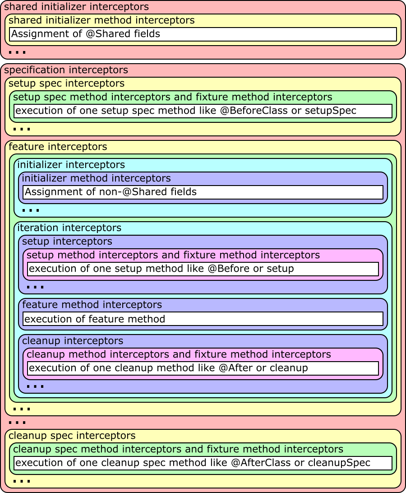

= Extensions
include::include.adoc[]

Spock comes with a powerful extension mechanism, which allows to hook into a spec's lifecycle to enrich or alter its
behavior. In this chapter, we will first learn about Spock's built-in extensions, and then dive into writing custom
extensions.

== Spock Configuration File

Some extensions can be configured with options in a Spock configuration file. The description for each extension will
mention how it can be configured. All those configurations are in a Groovy file that usually is called
`SpockConfig.groovy`. Spock first searches for a custom location given in a system property called `spock.configuration`
which is then used either as classpath location or if not found as file system location if it can be found there,
otherwise the default locations are investigated for a configuration file. Next it searches for the `SpockConfig.groovy`
in the root of the test execution classpath. If there is also no such file, you can at last have a `SpockConfig.groovy`
in your Spock user home. This by default is the directory `.spock` within your home directory, but can be changed using
the system property `spock.user.home` or if not set the environment property `SPOCK_USER_HOME`.

=== Stack Trace Filtering

You can configure Spock whether it should filter stack traces or not by using the configuration file. The default value
is `true`.

.Stack Trace Filtering Configuration
[source,groovy]
----
runner {
  filterStackTrace false
}
----

== Built-In Extensions

Most of Spock's built-in extensions are _annotation-driven_. In other words, they are triggered by annotating a
spec class or method with a certain annotation. You can tell such an annotation by its `@ExtensionAnnotation`
meta-annotation.

=== Ignore

To temporarily prevent a feature method from getting executed, annotate it with `spock.lang.Ignore`:

[source,groovy]
----
@Ignore
def "my feature"() { ... }
----

For documentation purposes, a reason can be provided:

[source,groovy]
----
@Ignore("TODO")
def "my feature"() { ... }
----

To ignore a whole specification, annotate its class:

[source,groovy]
----
@Ignore
class MySpec extends Specification { ... }
----

In most execution environments, ignored feature methods and specs will be reported as "skipped".

Care should be taken when ignoring feature methods in a spec class annotated with `spock.lang.Stepwise` since
later feature methods may depend on earlier feature methods having executed.

=== IgnoreRest

To ignore all but a (typically) small subset of methods, annotate the latter with `spock.lang.IgnoreRest`:

[source,groovy]
----
def "I'll be ignored"() { ... }

@IgnoreRest
def "I'll run"() { ... }

def "I'll also be ignored"() { ... }
----

`@IgnoreRest` is especially handy in execution environments that don't provide an (easy) way to run a subset of methods.

Care should be taken when ignoring feature methods in a spec class annotated with `spock.lang.Stepwise` since
later feature methods may depend on earlier feature methods having executed.

=== IgnoreIf

To ignore a feature method under certain conditions, annotate it with `spock.lang.IgnoreIf`,
followed by a predicate:

[source,groovy]
----
@IgnoreIf({ System.getProperty("os.name").contains("windows") })
def "I'll run everywhere but on Windows"() { ... }
----

To make predicates easier to read and write, the following properties are available inside the closure:

* `sys` A map of all system properties
* `env` A map of all environment variables
* `os` Information about the operating system (see `spock.util.environment.OperatingSystem`)
* `jvm` Information about the JVM (see `spock.util.environment.Jvm`)

Using the `os` property, the previous example can be rewritten as:

[source,groovy]
----
@IgnoreIf({ os.windows })
def "I'll run everywhere but on Windows"() { ... }
----

Care should be taken when ignoring feature methods in a spec class annotated with `spock.lang.Stepwise` since
later feature methods may depend on earlier feature methods having executed.

=== Requires

To execute a feature method under certain conditions, annotate it with `spock.lang.Requires`,
followed by a predicate:

[source,groovy]
----
@Requires({ os.windows })
def "I'll only run on Windows"() { ... }
----

`Requires` works exactly like `IgnoreIf`, except that the predicate is inverted. In general, it is preferable
to state the conditions under which a method gets executed, rather than the conditions under which it gets ignored.

=== PendingFeature

To indicate that the feature is not fully implemented yet and should not be reported as error, annotate it with `spock.lang.PendingFeature`.

The use case is to annotate tests that can not yet run but should already be committed.
The main difference to `Ignore` is that the test are executed, but test failures are ignored.
If the test passes without an error, then it will be reported as failure since the `PendingFeature` annotation should be removed.
This way the tests will become part of the normal tests instead of being ignored forever.

Groovy has the `groovy.transform.NotYetImplemented` annotation which is similar but behaves a differently.

* it will mark failing tests as passed
* if at least one iteration of a data-driven test passes it will be reported as error

`PendingFeature`:

* it will mark failing tests as skipped
* if at least one iteration of a data-driven test fails it will be reported as skipped
* if every iteration of a data-driven test passes it will be reported as error

[source,groovy]
----
@PendingFeature
def "not implemented yet"() { ... }
----

=== Stepwise

To execute features in the order that they are declared, annotate a spec class with `spock.lang.Stepwise`:

[source,groovy]
----
@Stepwise
class RunInOrderSpec extends Specification {
  def "I run first"()  { ... }
  def "I run second"() { ... }
}
----

`Stepwise` only affects the class carrying the annotation; not sub or super classes.  Features after the first
failure are skipped.

`Stepwise` does not override the behaviour of annotations such as `Ignore`, `IgnoreRest`, and `IgnoreIf`, so care
should be taken when ignoring feature methods in spec classes annotated with `Stepwise`.

=== Timeout

To fail a feature method, fixture, or class that exceeds a given execution duration, use `spock.lang.Timeout`,
followed by a duration, and optionally a time unit. The default time unit is seconds.

When applied to a feature method, the timeout is per execution of one iteration, excluding time spent in fixture methods:

[source,groovy]
----
@Timeout(5)
def "I fail if I run for more than five seconds"() { ... }

@Timeout(value = 100, unit = TimeUnit.MILLISECONDS)
def "I better be quick" { ... }
----

Applying `Timeout` to a spec class has the same effect as applying it to each feature that is not already annotated
with `Timeout`, excluding time spent in fixtures:

[source,groovy]
----
@Timeout(10)
class TimedSpec extends Specification {
  def "I fail after ten seconds"() { ... }
  def "Me too"() { ... }

  @Timeout(value = 250, unit = MILLISECONDS)
  def "I fail much faster"() { ... }
}
----

When applied to a fixture method, the timeout is per execution of the fixture method.

When a timeout is reported to the user, the stack trace shown reflects the execution stack of the test framework when
the timeout was exceeded.

=== Use

To activate one or more Groovy categories within the scope of a feature method or spec, use `spock.util.mop.Use`:

[source,groovy]
----
class ListExtensions {
  static avg(List list) { list.sum() / list.size() }
}

class MySpec extends Specification {
  @Use(listExtensions)
  def "can use avg() method"() {
    expect:
    [1, 2, 3].avg() == 2
  }
}
----

This can be useful for stubbing of dynamic methods, which are usually provided by the runtime environment (e.g. Grails).
It has no effect when applied to a helper method. However, when applied to a spec class, it will also affect its helper
methods.

=== ConfineMetaClassChanges

To confine meta class changes to the scope of a feature method or spec class, use `spock.util.mop.ConfineMetaClassChanges`:

[source,groovy]
----
@Stepwise
class FooSpec extends Specification {
  @ConfineMetaClassChanges([String])
  def "I run first"() {
    when:
    String.metaClass.someMethod = { delegate }

    then:
    String.metaClass.hasMetaMethod('someMethod')
  }

  def "I run second"() {
    when:
    "Foo".someMethod()

    then:
    thrown(MissingMethodException)
  }
}
----

When applied to a spec class, the meta classes are restored to the state that they were in before `setupSpec` was executed,
after `cleanupSpec` is executed.

When applied to a feature method, the meta classes are restored to as they were after `setup` was executed,
before `cleanup` is executed.

CAUTION: Temporarily changing the meta classes is only safe when specs are
run in a single thread per JVM. Even though many execution environments do limit themselves to one thread
per JVM, keep in mind that Spock cannot enforce this.

=== RestoreSystemProperties
Saves system properties before the annotated feature method (including any setup and cleanup methods) gets run,
and restores them afterwards.

Applying this annotation to a spec class has the same effect as applying it to all its feature methods.

[source,groovy]
----
@RestoreSystemProperties
def "determines family based on os.name system property"() {
  given:
  System.setProperty('os.name', 'Windows 7')

  expect:
  OperatingSystem.current.family == OperatingSystem.Family.WINDOWS
}
----

CAUTION: Temporarily changing the values of system properties is only safe when specs are
run in a single thread per JVM. Even though many execution environments do limit themselves to one thread
per JVM, keep in mind that Spock cannot enforce this.

=== AutoCleanup

Automatically clean up a field or property at the end of its lifetime by using `spock.lang.AutoCleanup`.

By default, an object is cleaned up by invoking its parameterless `close()` method. If some other
method should be called instead, override the annotation's `value` attribute:

[source,groovy]
----
// invoke foo.dispose()
@AutoCleanup("dispose")
def foo
----

If multiple fields or properties are annotated with `AutoCleanup`, their objects are cleaned up sequentially, in reverse
field/property declaration order, starting from the most derived class class and walking up the inheritance chain.

If a cleanup operation fails with an exception, the exception is reported by default, and cleanup proceeds with the next
annotated object. To prevent cleanup exceptions from being reported, override the annotation's `quiet` attribute:

[source,groovy]
----
@AutoCleanup(quiet = true)
def ignoreMyExceptions
----

=== Title and Narrative

To attach a natural-language name to a spec, use `spock.lang.Title`:

[source,groovy]
----
@Title("This is easy to read")
class ThisIsHarderToReadSpec extends Specification {
  ...
}
----

Similarly, to attach a natural-language description to a spec, use `spock.lang.Narrative`:

[source,groovy]
----
@Narrative("""
As a user
I want foo
So that bar
""")
class GiveTheUserFooSpec() { ... }
----

=== See

To link to one or more references to external information related to a specification or feature, use `spock.lang.See`:

[source,groovy]
----
@See("http://spockframework.org/spec")
class MoreInformationAvailableSpec extends Specification {
  @See(["http://en.wikipedia.org/wiki/Levenshtein_distance", "http://www.levenshtein.net/"])
  def "Even more information is available on the feature"() { ... }
}
----

=== Issue

To indicate that a feature or spec relates to one or more issues in an external tracking system, use `spock.lang.Issue`:

[source,groovy]
----
@Issue("http://my.issues.org/FOO-1")
class MySpec {
  @Issue("http://my.issues.org/FOO-2")
  def "Foo should do bar"() { ... }

  @Issue(["http://my.issues.org/FOO-3", "http://my.issues.org/FOO-4"])
  def "I have two related issues"() { ... }
}
----

If you have a common prefix URL for all issues in a project, you can use the <<Spock Configuration File>> to set it up
for all at once. If it is set, it is prepended to the value of the `@Issue` annotation when building the URL.

If the `issueNamePrefix` is set, it is prepended to the value of the `@Issue` annotation when building the name for the
issue.

.Issue Configuration
[source,groovy]
----
report {
    issueNamePrefix 'Bug '
    issueUrlPrefix 'http://my.issues.org/'
}
----

=== Subject

To indicate one or more subjects of a spec, use `spock.lang.Subject`:

[source,groovy]
----
@Subject([Foo, Bar]) { ... }
----

Additionally, `Subject` can be applied to fields and local variables:

[source,groovy]
----
@Subject
Foo myFoo
----

`Subject` currently has only informational purposes.

=== Rule

Spock understands `@org.junit.Rule` annotations on non-`@Shared` instance fields. The according rules are run at the
iteration interception point in the Spock lifecycle. This means that the rules before-actions are done before the
execution of `setup` methods and the after-actions are done after the execution of `cleanup` methods.

=== ClassRule

Spock understands `@org.junit.ClassRule` annotations on `@Shared` fields. The according rules are run at the
specification interception point in the Spock lifecycle. This means that the rules before-actions are done before the
execution of `setupSpec` methods and the after-actions are done after the execution of `cleanupSpec` methods.

=== Include and Exclude

Spock is capable of including and excluding specifications according to their classes, super-classes and interfaces and
according to annotations that are applied to the specification. Spock is also capable of including and excluding
individual features according to annotations that are applied to the feature method. The configuration for what to
include or exclude is done according to the <<Spock Configuration File>> section.

.Include / Exclude Configuration
[source,groovy]
----
import some.pkg.Fast
import some.pkg.IntegrationSpec

runner {
  include Fast // could be either an annotation or a (base) class
  exclude {
    annotation some.pkg.Slow
    baseClass IntegrationSpec
  }
}
----

=== Optimize Run Order

Spock can remember which features last failed and how often successively and also how long a feature needed to be
tested. For successive runs Spock will then first run features that failed at last run and first features that failed
more often successively. Within the previously failed or non-failed features Spock will run the fastest tests first.
This behaviour can be enabled according to the <<Spock Configuration File>> section. The default value is `false`.

.Optimize Run Order Configuration
[source,groovy]
----
runner {
  optimizeRunOrder true
}
----

=== Report Log

Spock can create a report log of the executed tests in JSON format. This report contains also things like
<<Title and Narrative,`@Title`>>, <<Title and Narrative,`@Narrative`>>, <<See,`@See`>> and <<Issue,`@Issue`>> values or
<<specs-as-doc,block descriptors>>.
This report can be enabled according to the <<Spock Configuration File>> section. The default is to not generate this
report.

For the report to be generated, you have to enable it and set at least the `logFileDir` and `logFileName`. `enabled` can
also be set via the system property `spock.logEnabled`, `logFileDir` can also be set via the system property
`spock.logFileDir` and `logFileName` can also be set via the system property `spock.logFileName`.

If a `logFileSuffix` is set (or the system property `spock.logFileSuffix`), it is appended to the base filename,
separated by a dash. If the suffix contains the string `#timestamp`, this is replaced by the current date and time in
`UTC` automatically. If you instead want to have your local date and time, you can use the setting from the example
below.

.Report Log Configuration
[source,groovy]
----
report {
    enabled true
    logFileDir '.'
    logFileName 'spock-report.json'
    logFileSuffix new Date().format('yyyy-MM-dd_HH_mm_ss')
}
----

== Writing Custom Extensions

There are two types of extensions that can be created for usage with Spock. These are global extensions and annotation
driven local extensions. For both extension types you implement a specific interface which defines some callback
methods. In your implementation of those methods you can set up the magic of your extension, for example by adding
interceptors to various interception points that are described below.

Which type of annotation you create depends on your use case. If you want to do something once during the Spock run - at
the start or end - or want to apply something to all executed specifications without the user of the extension having to
do anything besides including your extension in the classpath, then you should opt for a global extension. If you
instead want to apply your magic only by choice of the user, then you should implement an annotation driven local
extension.

=== Global Extensions

To create a global extension you need to create a class that implements the interface `IGlobalExtension` and put its
fully-qualified class name in a file `META-INF/services/org.spockframework.runtime.extension.IGlobalExtension` in the
class path. As soon as these two conditions are satisfied, the extension is automatically loaded and used when Spock is
running. For convenience there is also the class `AbstractGlobalExtension`, which provides empty implementations for all
methods in the interface, so that only the needed ones need to be overridden.

`IGlobalExtension` has the following three methods:

`start()`::
  This is called once at the very start of the Spock execution.

`visitSpec(SpecInfo spec)`::
  This is called once for each specification. In this method you can prepare a specification with your extension magic,
  like attaching interceptors to various interception points as described in the chapter <<Interceptors>>.

`stop()`::
  This is called once at the very end of the Spock execution.

=== Annotation Driven Local Extensions

To create an annotation driven local extension you need to create a class that implements the interface
`IAnnotationDrivenExtension`. As type argument to the interface you need to supply an annotation class that has
`@Retention` set to `RUNTIME`, `@Target` set to one or more of `FIELD`, `METHOD` and `TYPE` - depending on where you
want your annotation to be applicable - and `@ExtensionAnnotation` applied, with the `IAnnotationDrivenExtension` class
as argument. Of course the annotation class can have some attributes with which the user can further configure the
behaviour of the extension for each annotation application. For convenience there is also the class
`AbstractAnnotationDrivenExtension`, which provides empty implementations for all methods in the interface, so that only
the needed ones need to be overridden.

Your annotation can be applied to a specification, a feature method, a fixture method or a field. On all other places
like helper methods or other places if the `@Target` is set accordingly, the annotation will be ignored and has no
effect other than being visible in the source code.

`IAnnotationDrivenExtension` has the following five methods, where in each you can prepare a specification with your
extension magic, like attaching interceptors to various interception points as described in the chapter
<<Interceptors>>:

`visitSpecAnnotation(T annotation, SpecInfo spec)`::
  This is called once for each specification where the annotation is applied with the annotation instance as first
  parameter and the specification info object as second parameter.

`visitFeatureAnnotation(T annotation, FeatureInfo feature)`::
  This is called once for each feature method where the annotation is applied with the annotation instance as first
  parameter and the feature info object as second parameter.

`visitFixtureAnnotation(T annotation, MethodInfo fixtureMethod)`::
  This is called once for each fixture method where the annotation is applied with the annotation instance as first
  parameter and the fixture method info object as second parameter.

`visitFieldAnnotation(T annotation, FieldInfo field)`::
  This is called once for each field where the annotation is applied with the annotation instance as first parameter and
  the field info object as second parameter.

`visitSpec(SpecInfo spec)`::
  This is called once for each specification within which the annotation is applied to at least one of the supported
  places like defined above. It gets the specification info object as sole parameter. This method is called after all
  other methods of this interface for each applied annotation are processed.

=== Configuration Objects

You can add own sections in the <<Spock Configuration File>> for your extension by creating POJOs or POGOs that are
annotated with `@ConfigurationObject` and have a default constructor (either implicitly or explicitly). The argument to
the annotation is the name of the top-level section that is added to the Spock configuration file syntax. The default
values for the configuration options are defined in the class by initializing the fields at declaration time or in the
constructor. In the Spock configuration file those values can then be edited by the user of your extension.

NOTE: It is an error to have multiple configuration objects with the same name, so choose wisely if you pick one and
probably prefix it with some package-like name to minimize the risk for name clashes with other extensions or the core
Spock code.

To use the values of the configuration object in your extension, just define an uninitialized instance field of that
type. Spock will then automatically create exactly one instance of the configuration object per Spock run, apply the
settings from the configuration file to it (before the `start()` methods of global extensions are called) and inject
that instance into the extension class instances.

A configuration object cannot be used exclusively in an annotation driven local extension, but it has to be used in at
least one global extension to properly get initialized and populated with the settings from the configuration file. But
if the configuration object is used in a global extension, you can also use it just fine in an annotation driven local
extension. If the configuration object is only used in an annotation driven local extension, you will get an exception
when then configuration object is to be injected into the extension and you will also get an error when the
configuration file is evaluated and it contains the section, as the configuration object is not properly registered yet.

=== Interceptors

For applying the magic of your extension, there are various interception points, where you can attach interceptors from
the extension methods described above to hook into the Spock lifecycle. For each interception point there can of course
be multiple interceptors added by arbitrary Spock extensions (shipped or 3rd party). Their order is currently depending
on the order they are added, but there should not be made any order assumptions within one interception point.

.Spock Interceptors

An ellipsis in the figure means that the block before it can be repeated an arbitrary amount of times.

The `... method interceptors` are of course only run if there are actual methods of this type to be executed (the white
boxes) and those can <<Injecting Method Parameters, inject parameters>> to be given to the method that will be run.

The difference between shared initializer interceptor and shared initializer method interceptor and between initializer
interceptor and initializer method interceptor - as there can be at most one of those methods each - is, that there are
only the two methods if there are `@Shared`, respectively non-`@Shared`, fields that get values assigned at declaration
time. The compiler will put those initializations in a generated method and call it at the proper place in the
lifecycle. So if there are no such initializations, no method is generated and thus the method interceptor is never
called. The non-method interceptors are always called at the proper place in the lifecycle to do work that has to be
done at that time.

To create an interceptor to be attached to an interception point, you need to create a class that implements the
interface `IMethodInterceptor`. This interface has the sole method `intercept(IMethodInvocation invocation)`. The
`invocation` parameter can be used to get and modify the current state of execution. Each interceptor *must* call the
method `invocation.proceed()`, which will go on in the lifecycle, except you really want to prevent further execution of
the nested elements like shown in the figure above. But this should be a very rare use case.

If you write an interceptor that can be used at different interception points and should do different work at different
interception points, there is also the convenience class `AbstractMethodInterceptor`, which you can extend and which
provides various methods for overriding that are called for the various interception points. Most of these methods have
a double meaning, like `interceptSetupMethod` which is called for the `setup interceptor` and the `setup method
interceptor`. If you attach your interceptor to both of them and need a differentiation, you can check for
`invocation.method.reflection`, which will be set in the method interceptor case and `null` otherwise. Alternatively you
can of course build two different interceptors or add a parameter to your interceptor and create two instances, telling
each at addition time whether it is attached to the method interceptor or the other one.

.Add All Interceptors
[source,groovy]
----
class I extends AbstractMethodInterceptor { I(def s) {} }

specInfo.addSharedInitializerInterceptor new I('shared initializer')
specInfo.sharedInitializerMethod?.addInterceptor new I('shared initializer method')
specInfo.addInterceptor new I('specification')
specInfo.addSetupSpecInterceptor new I('setup spec')
specInfo.setupSpecMethods*.addInterceptor new I('setup spec method')
specInfo.allFeatures*.addInterceptor new I('feature')
specInfo.addInitializerInterceptor new I('initializer')
specInfo.initializerMethod?.addInterceptor new I('initializer method')
specInfo.allFeatures*.addIterationInterceptor new I('iteration')
specInfo.addSetupInterceptor new I('setup')
specInfo.setupMethods*.addInterceptor new I('setup method')
specInfo.allFeatures*.featureMethod*.addInterceptor new I('feature method')
specInfo.addCleanupInterceptor new I('cleanup')
specInfo.cleanupMethods*.addInterceptor new I('cleanup method')
specInfo.addCleanupSpecInterceptor new I('cleanup spec')
specInfo.cleanupSpecMethods*.addInterceptor new I('cleanup spec method')
specInfo.allFixtureMethods*.addInterceptor new I('fixture method')
----

==== Injecting Method Parameters

If your interceptor should support custom method parameters for wrapped methods, this can be done by modifying
`invocation.arguments`. Two use cases for this would be a mocking framework that can inject method parameters that are
annotated with a special annotation or some test helper that injects objects of a specific type that are created and
prepared for usage automatically.

`invocation.arguments` may be an empty array or an array of arbitrary length, depending on what interceptors were run
before that maybe also have manipulated this array for parameter injection. So if you for example investigated the
method parameters with `invocation.method.reflection.parameters` and found that you want to inject the fifth parameter,
you should first check whether the `arguments` array is at least five elements long. If not, you should assign it a new
array that is at least five elements long and copy the contents of the old array into the new one. Then you can assign
your objects to be injected.

.Inject Method Parameters
[source,groovy]
----
// create a map of all MyInjectable parameters with their parameter index
Map<Parameter, Integer> parameters = [:]
invocation.method.reflection.parameters.eachWithIndex { parameter, i ->
  parameters << [(parameter): i]
}
parameters = parameters.findAll { MyInjectable.equals it.key.type }

// enlarge arguments array if necessary
def lastMyInjectableParameterIndex = parameters*.value.max()
lastMyInjectableParameterIndex = lastMyInjectableParameterIndex == null ?
                                 0 :
                                 lastMyInjectableParameterIndex + 1
if(invocation.arguments.length < lastMyInjectableParameterIndex) {
  def newArguments = new Object[lastMyInjectableParameterIndex]
  System.arraycopy invocation.arguments, 0, newArguments, 0, invocation.arguments.length
  invocation.arguments = newArguments
}

parameters.each { parameter, i ->
  invocation.arguments[i] = new MyInjectable(parameter)
}
----

[NOTE]
--
When using data driven features (methods with a `where:` block), the user of your extension has to follow some
restrictions, if parameters should be injected by your extension:

* all data variables and all to-be-injected parameters have to be defined as method parameters
* all method parameters have to be assigned a value in the `where:` block
* the order of the method parameters has to be identical to the order of the data variables in the `where:` block
* the to-be-injected parameters have to be set to any value in the `where:` block, for example `null`
+
of course you can also make your extension only inject a value if none is set already, as the `where:` block
assignments happen before the method interceptor is called
+
for this simply check whether `invocation.arguments[i]` is `null` or not

.Data Driven Feature with Injected Parameter
[source, groovy]
----
def 'test parameter injection'(a, b, MyInjectable myInjectable) {
  expect: myInjectable

  where:
  a    | b
  'a1' | 'b1'
  'a2' | 'b2'

  and:
  myInjectable = null
}
----
--
