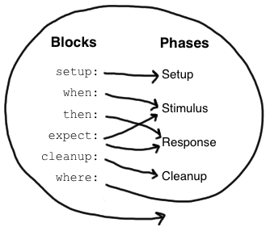

= Spock Primer
include::include.adoc[]

This chapter assumes that you have a basic knowledge of Groovy and unit testing. If you are a Java developer but haven't
heard about Groovy, don't worry - Groovy will feel very familiar to you! In fact, one of Groovy's main design goals is to
be _the_ scripting language alongside Java. So just follow along and consult the
http://groovy-lang.org/documentation.html[Groovy documentation] whenever you feel like it.

The goals of this chapter are to teach you enough Spock to write real-world Spock specifications, and to
whet your appetite for more.

To learn more about Groovy, go to http://groovy-lang.org/.

To learn more about unit testing, go to http://en.wikipedia.org/wiki/Unit_testing.

== Terminology

Let's start with a few definitions: Spock lets you write https://en.wikipedia.org/wiki/Specification_by_example[_specifications_]
that describe expected _features_ (properties, aspects) exhibited by a system of interest. The system of interest could be
anything between a single class and a whole application, and is also called the _system under specification or SUS_.
The description of a feature starts from a specific snapshot of the SUS and its collaborators; this snapshot is called the feature's _fixture_.

The following sections walk you through all building blocks of which a Spock specification may be composed. A typical
specification uses only a subset of them.

== Imports

[source,groovy]
----
import spock.lang.*
----

Package `spock.lang` contains the most important types for writing specifications.

== Specification

[source,groovy]
----
class MyFirstSpecification extends Specification {
  // fields
  // fixture methods
  // feature methods
  // helper methods
}
----

A specification is represented as a Groovy class that extends from `spock.lang.Specification`. The name of a specification
usually relates to the system or system operation described by the specification. For example, `CustomerSpec`,
`H264VideoPlayback`, and `ASpaceshipAttackedFromTwoSides` are all reasonable names for a specification.

Class `Specification` contains a number of useful methods for writing specifications. Furthermore it instructs JUnit to
run specification with `Sputnik`, Spock's JUnit runner. Thanks to Sputnik, Spock specifications can be run by most modern
Java IDEs and build tools.

== Fields

[source,groovy]
----
def obj = new ClassUnderSpecification()
def coll = new Collaborator()
----

Instance fields are a good place to store objects belonging to the specification's fixture. It is good practice to
initialize them right at the point of declaration. (Semantically, this is equivalent to initializing them at the very
beginning of the `setup()` method.) Objects stored into instance fields are _not_ shared between feature methods.
Instead, every feature method gets its own object. This helps to isolate feature methods from each other, which is often
a desirable goal.

[source,groovy]
----
@Shared res = new VeryExpensiveResource()
----

Sometimes you need to share an object between feature methods. For example, the object might be very expensive to create,
or you might want your feature methods to interact with each other. To achieve this, declare a `@Shared` field. Again
it's best to initialize the field right at the point of declaration. (Semantically, this is equivalent to initializing
the field at the very beginning of the `setupSpec()` method.)

[source,groovy]
----
static final PI = 3.141592654
----

Static fields should only be used for constants. Otherwise shared fields are preferable, because their semantics with
respect to sharing are more well-defined.

== Fixture Methods

[source,groovy]
----
def setupSpec() {}    // runs once -  before the first feature method
def setup() {}        // runs before every feature method
def cleanup() {}      // runs after every feature method
def cleanupSpec() {}  // runs once -  after the last feature method
----

Fixture methods are responsible for setting up and cleaning up the environment in which feature methods are run.
Usually it's a good idea to use a fresh fixture for every feature method, which is what the `setup()` and `cleanup()` methods are for.

All fixture methods are optional.

Occasionally it makes sense for feature methods to share a fixture, which is achieved by using shared
fields together with the `setupSpec()` and `cleanupSpec()` methods.
Note that `setupSpec()` and `cleanupSpec()` _may not_ reference instance fields unless they are annotated with `@Shared`.

=== Invocation Order

If fixture methods are overridden in a specification subclass then `setup()` of the superclass will run before `setup()` of the subclass.
`cleanup()` works in reverse order, that is `cleanup()` of the subclass will execute before `cleanup()` of the superclass.
`setupSpec()` and `cleanupSpec()` behave in the same way.
There is no need to explicitly call `super.setup()` or `super.cleanup()` as Spock will automatically find and execute fixture methods at all levels in an inheritance hierarchy.

1. `super.setupSpec`
2. `sub.setupSpec`
3. `super.setup`
4. `sub.setup`
5. feature method
6. `sub.cleanup`
7. `super.cleanup`
8. `sub.cleanupSpec`
9. `super.cleanupSpec`

== Feature Methods

[source,groovy]
----
def "pushing an element on the stack"() {
  // blocks go here
}
----

Feature methods are the heart of a specification. They describe the features (properties, aspects) that you expect to
find in the system under specification. By convention, feature methods are named with String literals. Try to choose
good names for your feature methods, and feel free to use any characters you like!

Conceptually, a feature method consists of four phases:

. Set up the feature's fixture
. Provide a _stimulus_ to the system under specification
. Describe the _response_ expected from the system
. Clean up the feature's fixture

Whereas the first and last phases are optional, the stimulus and response phases are always present (except in
interacting feature methods), and may occur more than once.

=== Blocks

Spock has built-in support for implementing each of the conceptual phases of a feature method. To this end, feature
methods are structured into so-called _blocks_. Blocks start with a label, and extend to the beginning of the next block,
or the end of the method. There are six kinds of blocks: `given`, `when`, `then`, `expect`, `cleanup`, and `where` blocks.
Any statements between the beginning of the method and the first explicit block belong to an implicit `given` block.

A feature method must have at least one explicit (i.e. labelled) block - in fact, the presence of an explicit block is
what makes a method a feature method. Blocks divide a method into distinct sections, and cannot be nested.

[.float-group]
--
[.right.text-left]

The picture on the right shows how blocks map to the conceptual phases of a feature method. The `where` block has a
special role, which will be revealed shortly. But first, let's have a closer look at the other blocks.
--

==== Given Blocks

[source,groovy]
----
given:
def stack = new Stack()
def elem = "push me"
----

The `given` block is where you do any setup work for the feature that you are describing. It may not be preceded by
other blocks, and may not be repeated. A `given` block doesn't have any special semantics. The `given:` label is
optional and may be omitted, resulting in an _implicit_ `given` block. Originally, the alias `setup:` was the preferred block name,
but using `given:` often leads to a more readable feature method description (see <<specifications_as_documentation,Specifications as Documentation>>).

==== When and Then Blocks

[source,groovy]
----
when:   // stimulus
then:   // response
----

The `when` and `then` blocks always occur together. They describe a stimulus and the expected response. Whereas `when`
blocks may contain arbitrary code, `then` blocks are restricted to _conditions_, _exception conditions_, _interactions_,
and variable definitions. A feature method may contain multiple pairs of `when-then` blocks.

===== Conditions

Conditions describe an expected state, much like JUnit's assertions. However, conditions are written as plain boolean
expressions, eliminating the need for an assertion API. (More precisely, a condition may also produce a non-boolean
value, which will then be evaluated according to Groovy truth.) Let's see some conditions in action:

[source,groovy]
----
when:
stack.push(elem)

then:
!stack.empty
stack.size() == 1
stack.peek() == elem
----

TIP: Try to keep the number of conditions per feature method small. One to five conditions is a good guideline. If you
have more than that, ask yourself if you are specifying multiple unrelated features at once. If the answer is yes,
break up the feature method in several smaller ones. If your conditions only differ in their values, consider using
a <<data_driven_testing.adoc#data-tables,data table>>.

What kind of feedback does Spock provide if a condition is violated? Let's try and change the second condition to
`stack.size() == 2`. Here is what we get:

[source,groovy]
----
Condition not satisfied:

stack.size() == 2
|     |      |
|     1      false
[push me]
----

As you can see, Spock captures all values produced during the evaluation of a condition, and presents them in an easily
digestible form. Nice, isn't it?

===== Implicit and explicit conditions

Conditions are an essential ingredient of `then` blocks and `expect` blocks. Except for calls to `void` methods and
expressions classified as interactions, all top-level expressions in these blocks are implicitly treated as conditions.
To use conditions in other places, you need to designate them with Groovy's assert keyword:

[source,groovy]
----
def setup() {
  stack = new Stack()
  assert stack.empty
}
----

If an explicit condition is violated, it will produce the same nice diagnostic message as an implicit condition.

===== Exception Conditions

Exception conditions are used to describe that a `when` block should throw an exception. They are defined using the
`thrown()` method, passing along the expected exception type. For example, to describe that popping from an empty stack
should throw an `EmptyStackException`, you could write the following:

[source,groovy]
----
when:
stack.pop()

then:
thrown(EmptyStackException)
stack.empty
----

As you can see, exception conditions may be followed by other conditions (and even other blocks). This is particularly
useful for specifying the expected content of an exception. To access the exception, first bind it to a variable:

[source,groovy]
----
when:
stack.pop()

then:
def e = thrown(EmptyStackException)
e.cause == null
----

Alternatively, you may use a slight variation of the above syntax:

[source,groovy]
----
when:
stack.pop()

then:
EmptyStackException e = thrown()
e.cause == null
----

This syntax has two small advantages: First, the exception variable is strongly typed, making it easier for IDEs to
offer code completion. Second, the condition reads a bit more like a sentence ("then an EmptyStackException is thrown").
Note that if no exception type is passed to the `thrown()` method, it is inferred from the variable type on the left-hand
side.

Sometimes we need to convey that an exception should *not* be thrown. For example, let's try to express that a `HashMap`
should accept a `null` key:

[source,groovy]
----
def "HashMap accepts null key"() {
  setup:
  def map = new HashMap()
  map.put(null, "elem")
}
----

This works but doesn't reveal the intention of the code. Did someone just leave the building before he had finished
implementing this method? After all, where are the conditions? Fortunately, we can do better:

[source,groovy]
----
def "HashMap accepts null key"() {
  given:
  def map = new HashMap()

  when:
  map.put(null, "elem")

  then:
  notThrown(NullPointerException)
}
----

By using `notThrown()`, we make it clear that in particular a `NullPointerException` should not be thrown. (As per the
contract of `Map.put()`, this would be the right thing to do for a map that doesn't support `null` keys.) However,
the method will also fail if any other exception is thrown.

===== Interactions

Whereas conditions describe an object's state, interactions describe how objects communicate with each other.
Interactions and Interaction based testing are described in a separate <<interaction_based_testing.adoc#interaction-based-testing,chapter>>, so we only give a quick example here.
Suppose we want to describe the flow of events from a publisher to its subscribers. Here is the code:

[source,groovy]
----
def "events are published to all subscribers"() {
  given:
  def subscriber1 = Mock(Subscriber)
  def subscriber2 = Mock(Subscriber)
  def publisher = new Publisher()
  publisher.add(subscriber1)
  publisher.add(subscriber2)

  when:
  publisher.fire("event")

  then:
  1 * subscriber1.receive("event")
  1 * subscriber2.receive("event")
}
----

==== Expect Blocks

An `expect` block is more limited than a `then` block in that it may only contain conditions and variable definitions.
It is useful in situations where it is more natural to describe stimulus and expected response in a single expression.
For example, compare the following two attempts to describe the `Math.max()` method:

[source,groovy]
----
when:
def x = Math.max(1, 2)

then:
x == 2
----

[source,groovy]
----
expect:
Math.max(1, 2) == 2
----

Although both snippets are semantically equivalent, the second one is clearly preferable. As a guideline, use `when-then`
to describe methods with side effects, and `expect` to describe purely functional methods.

TIP: Leverage http://docs.groovy-lang.org/docs/latest/html/groovy-jdk/[Groovy JDK] methods like `any()` and `every()`
to create more expressive and succinct conditions.

==== Cleanup Blocks

[source,groovy]
----
given:
def file = new File("/some/path")
file.createNewFile()

// ...

cleanup:
file.delete()
----

A `cleanup` block may only be followed by a `where` block, and may not be repeated. Like a `cleanup` method, it is used
to free any resources used by a feature method, and is run even if (a previous part of) the feature method has produced
an exception. As a consequence, a `cleanup` block must be coded defensively; in the worst case, it must gracefully
handle the situation where the first statement in a feature method has thrown an exception, and all local variables
still have their default values.

TIP: Groovy's safe dereference operator (`foo?.bar()`) simplifies writing defensive code.

Object-level specifications usually don't need a `cleanup` method, as the only resource they consume is memory, which
is automatically reclaimed by the garbage collector. More coarse-grained specifications, however, might use a `cleanup`
block to clean up the file system, close a database connection, or shut down a network service.

TIP: If a specification is designed in such a way that all its feature methods require the same resources, use a
`cleanup()` method; otherwise, prefer `cleanup` blocks. The same trade-off applies to `setup()` methods and `given` blocks.

==== Where Blocks

A `where` block always comes last in a method, and may not be repeated. It is used to write data-driven feature methods.
To give you an idea how this is done, have a look at the following example:

[source,groovy]
----
def "computing the maximum of two numbers"() {
  expect:
  Math.max(a, b) == c

  where:
  a << [5, 3]
  b << [1, 9]
  c << [5, 9]
}
----

This `where` block effectively creates two "versions" of the feature method: One where `a` is 5, `b` is 1, and `c` is 5,
and another one where `a` is 3, `b` is 9, and `c` is 9.

Although it is declared last, the `where` block is evaluated before the feature method containing it runs.

The `where` block is further explained in the <<data_driven_testing.adoc#data-driven-testing,Data Driven Testing>> chapter.

== Helper Methods

Sometimes feature methods grow large and/or contain lots of duplicated code. In such cases it can make sense to introduce
one or more helper methods. Two good candidates for helper methods are setup/cleanup logic and complex conditions.
Factoring out the former is straightforward, so let's have a look at conditions:

[source,groovy]
----
def "offered PC matches preferred configuration"() {
  when:
  def pc = shop.buyPc()

  then:
  pc.vendor == "Sunny"
  pc.clockRate >= 2333
  pc.ram >= 4096
  pc.os == "Linux"
}
----

If you happen to be a computer geek, your preferred PC configuration might be very detailed, or you might want to
compare offers from many different shops. Therefore, let's factor out the conditions:

[source,groovy]
----
def "offered PC matches preferred configuration"() {
  when:
  def pc = shop.buyPc()

  then:
  matchesPreferredConfiguration(pc)
}

def matchesPreferredConfiguration(pc) {
  pc.vendor == "Sunny"
  && pc.clockRate >= 2333
  && pc.ram >= 4096
  && pc.os == "Linux"
}
----

The new helper method `matchesPreferredConfiguration()` consists of a single boolean expression whose result is returned.
(The `return` keyword is optional in Groovy.) This is fine except for the way that an inadequate offer is now presented:

[source,groovy]
----
Condition not satisfied:

matchesPreferredConfiguration(pc)
|                             |
false                         ...
----

Not very helpful. Fortunately, we can do better:

[source,groovy]
----
void matchesPreferredConfiguration(pc) {
  assert pc.vendor == "Sunny"
  assert pc.clockRate >= 2333
  assert pc.ram >= 4096
  assert pc.os == "Linux"
}
----

When factoring out conditions into a helper method, two points need to be considered: First, implicit conditions must
be turned into explicit conditions with the `assert` keyword. Second, the helper method must have return type `void`.
Otherwise, Spock might interpret the return value as a failing condition, which is not what we want.

As expected, the improved helper method tells us exactly what's wrong:

[source,groovy]
----
Condition not satisfied:

assert pc.clockRate >= 2333
       |  |         |
       |  1666      false
       ...
----

A final advice: Although code reuse is generally a good thing, don't take it too far. Be aware that the use of fixture
and helper methods can increase the coupling between feature methods. If you reuse too much or the wrong code, you will
end up with specifications that are fragile and hard to evolve.

== Using `with` for expectations

As an alternative to the above helper methods, you can use a `with(target, closure)` method to interact on the object being verified.
This is especially useful in `then` and `expect` blocks.

[source,groovy]
----
def "offered PC matches preferred configuration"() {
  when:
  def pc = shop.buyPc()

  then:
  with(pc) {
    vendor == "Sunny"
    clockRate >= 2333
    ram >= 406
    os == "Linux"
  }
}
----

Unlike when you use helper methods, there is no need for explicit assert statements for proper error reporting.

When verifying mocks, a `with` statement can also cut out verbose verification statements.

[source,groovy]
----
def service = Mock(Service) // has start(), stop(), and doWork() methods
def app = new Application(service) // controls the lifecycle of the service

when:
app.run()

then:
with(service) {
  1 * start()
  1 * doWork()
  1 * stop()
}
----

Sometimes an IDE has trouble to determine the type of the target, in that case you can help out by manually specifying the
target type via `with(target, type, closure)`.

== Using `verifyAll` to assert multiple expectations together

Normal expectations fail the test on the first failed assertions. Sometimes it is helpful to collect these failures before
failing the test to have more information, this behavior is also known as soft assertions.

The `verifyAll` method can be used like `with`,

[source,groovy]
----
def "offered PC matches preferred configuration"() {
  when:
  def pc = shop.buyPc()

  then:
  verifyAll(pc) {
    vendor == "Sunny"
    clockRate >= 2333
    ram >= 406
    os == "Linux"
  }
}
----

or it can be used without a target.

[source,groovy]
----
  expect:
  verifyAll {
    2 == 2
    4 == 4
  }
----

Like `with` you can also optionally define a type hint for the IDE.

[[specifications_as_documentation]]
== Specifications as Documentation

Well-written specifications are a valuable source of information. Especially for higher-level specifications targeting
a wider audience than just developers (architects, domain experts, customers, etc.), it makes sense to provide more
information in natural language than just the names of specifications and features. Therefore, Spock provides a way to
attach textual descriptions to blocks:

[source,groovy]
----
given: "open a database connection"
// code goes here
----

Use the `and:` label to describe logically different parts of a block:

[source,groovy]
----
given: "open a database connection"
// code goes here

and: "seed the customer table"
// code goes here

and: "seed the product table"
// code goes here
----

An `and:` label followed by a description can be inserted at any (top-level) position of a feature method, without
altering the method's semantics.

In Behavior Driven Development, customer-facing features (called _stories_) are described in a given-when-then format.
Spock directly supports this style of specification with the `given:` label:

[source,groovy]
----
given: "an empty bank account"
// ...

when: "the account is credited \$10"
// ...

then: "the account's balance is \$10"
// ...
----

Block descriptions are not only present in source code, but are also available to the Spock runtime. Planned usages of
block descriptions are enhanced diagnostic messages, and textual reports that are equally understood by all stakeholders.

== Extensions

As we have seen, Spock offers lots of functionality for writing specifications. However, there always comes a time
when something else is needed. Therefore, Spock provides an interception-based extension mechanism. Extensions are
activated by annotations called _directives_. Currently, Spock ships with the following directives:

[horizontal]
`@Timeout`:: Sets a timeout for execution of a feature or fixture method.

`@Ignore`:: Ignores any feature method carrying this annotation.

`@IgnoreRest`:: Any feature method carrying this annotation will be executed, all others will be ignored. Useful for quickly running just a single method.

`@FailsWith`:: Expects a feature method to complete abruptly. `@FailsWith` has two use cases: First, to document known bugs that cannot
be resolved immediately. Second, to replace exception conditions in certain corner cases where the latter cannot be
used (like specifying the behavior of exception conditions). In all other cases, exception conditions are preferable.

Go to the <<extensions.adoc#extensions,Extensions>> chapter to learn how to implement your own directives and extensions.

== Comparison to JUnit

Although Spock uses a different terminology, many of its concepts and features are inspired by JUnit. Here is a rough comparison:

|===
|Spock                 |JUnit

|Specification         |Test class
|`setup()`             |`@Before`
|`cleanup()`           |`@After`
|`setupSpec()`         |`@BeforeClass`
|`cleanupSpec()`       |`@AfterClass`
|Feature               |Test
|Feature method        |Test method
|Data-driven feature   |Theory
|Condition             |Assertion
|Exception condition   |`@Test(expected=...)`
|Interaction           | Mock expectation (e.g. in Mockito)
|===
